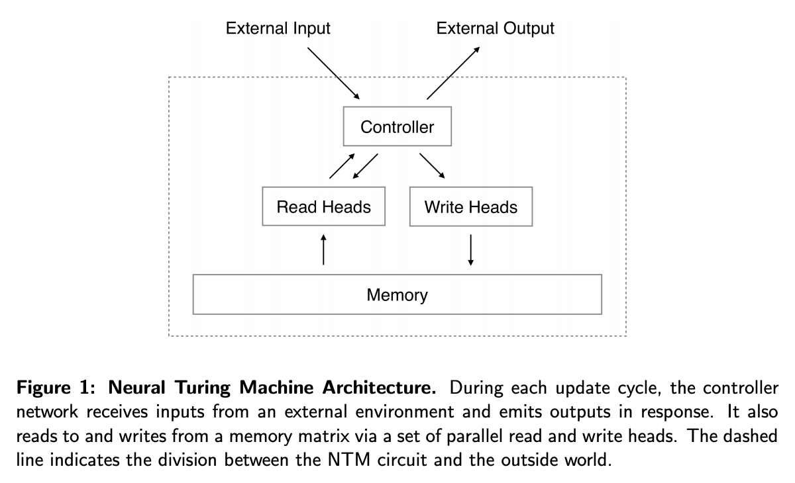

<!-- TOC -->

- [Neural Turing Machine](#neural-turing-machine)
    - [主要架构](#主要架构)
- [Memory Networks](#memory-networks)

<!-- /TOC -->

区分neural turing machine与memory networks：[https://blog.csdn.net/u012436149/article/details/52959593](https://blog.csdn.net/seahailang/article/details/78146350)

+ NTM与MN同样都使用了一个**外部记忆单元**。在NTM中，其最精彩的部分是**基于内容和地址**的**soft addressing**，soft addressing**选择性**的**读取和写入**记忆单元的**某些位置**，同时soft addressing 的引入也使得**原来不可微分的寻址过程**变成了**可微分的过程**，使得整个模型可以使用基于梯度的方法来进行训练 
+ MN相对来说实现比较简单，它比较**类似于attention model**。**读和写**的过程都比较**直接**。

ntm以及对应的tf源码解析：[https://blog.csdn.net/u012436149/article/details/52959593](https://blog.csdn.net/u012436149/article/details/52959593)

mn以及对应的代码：[https://blog.csdn.net/u011274209/article/details/53384232](https://blog.csdn.net/u011274209/article/details/53384232)

facebook的官方memNN的代码(有lua的torch7，也有tf的实现)：[https://github.com/facebook/MemNN](https://github.com/facebook/MemNN)

## Neural Turing Machine

[Neural Turing Machines](https://arxiv.org/abs/1410.5401)

NTM的主要思想是，当一个样本输入后，由一个**控制器**决定从**memory中寻址**，找到需要读取的内容后将内容返回给控制器，控制器再**结合样本**和**读取的内容**去**更新memory**，并且向外产生一个输出。 

### 主要架构

<html>
 

 
</html>

## Memory Networks

[Memory Networks](https://arxiv.org/abs/1410.3916)

