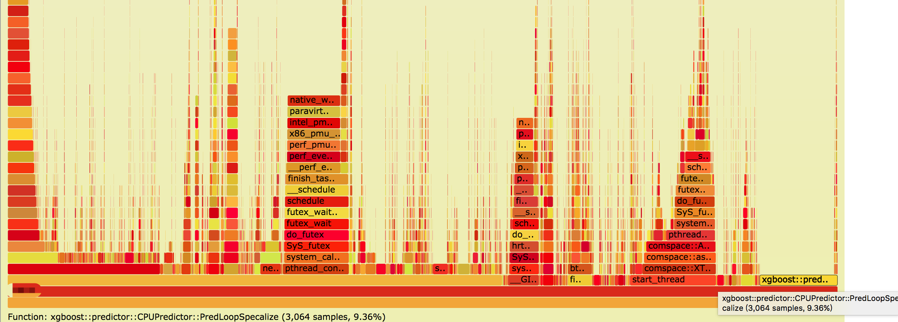

目录

<!-- TOC -->

- [内存泄漏](#%e5%86%85%e5%ad%98%e6%b3%84%e6%bc%8f)
- [常用工具](#%e5%b8%b8%e7%94%a8%e5%b7%a5%e5%85%b7)
  - [gperftools的功能支持](#gperftools%e7%9a%84%e5%8a%9f%e8%83%bd%e6%94%af%e6%8c%81)
  - [gperf安装](#gperf%e5%ae%89%e8%a3%85)
  - [gperf示例（c++）](#gperf%e7%a4%ba%e4%be%8bc)
  - [gperf示例（python）](#gperf%e7%a4%ba%e4%be%8bpython)
  - [valgrind示例](#valgrind%e7%a4%ba%e4%be%8b)
  - [perf+火焰图](#perf%e7%81%ab%e7%84%b0%e5%9b%be)
    - [火焰图工具](#%e7%81%ab%e7%84%b0%e5%9b%be%e5%b7%a5%e5%85%b7)
    - [perf](#perf)
- [sanitizers](#sanitizers)

<!-- /TOC -->

参考[高阶干货\|如何用gperftools分析深度学习框架的内存泄漏问题](https://mp.weixin.qq.com/s?__biz=MzIxNTgyMDMwMw==&mid=2247484403&idx=1&sn=5b260e7d681a4550811ee5611a1dd4ce&chksm=97933293a0e4bb85104066213606f5c89002fe78fa0518d95c71918a5a6ae656c62beac0f1ae&mpshare=1&scene=1&srcid=0608zWg71wg9411XBaYQ7o1V&pass_ticket=xLsJxSJh9Kgj4HKrq0S6VH1cKTCnSBShWGuwGJy9Gfpbp1CgoA6crqJiPhq9JjnM#rd)

## 内存泄漏

内存泄漏一般是由于程序**在堆(heap)上**分配了内存而没有释放，随着程序的运行占用的内存越来越大，一方面会影响程序的稳定性，可能让运行速度越来越慢，或者造成oom，甚至会影响程序所运行的机器的稳定性，造成宕机。

## 常用工具

+ valgrind直接分析非常困难，需要自己编译debug版本的、带valgrind支持的专用Python版本，而且输出的信息中大部分是Python自己的符号和调用信息，很难看出有用的信息，另外**使用valgrind会让程序运行速度变得非常慢**，所以不建议使用。
+ gperftools使用简单，无需重新编译代码即可运行，对运行速度的影响也比较小。

### gperftools的功能支持

gperftool主要支持以下四个功能：

+ thread-caching malloc
+ heap-checking using tcmalloc
+ heap-profiling using tcmalloc
+ CPU profiler

首先的首先，需要定义如下环境变量：

```shell
export PPROF_PATH=/root/gopath/bin/pprof
export PPROF_BINARY_PATH=/root/gopath/bin/pprof
export LD_PRELOAD=/usr/lib/libtcmalloc.so.4
```

然后运行程序前还要加上如下参数：

+ HEAPPROFILE：设置生成的堆分析文件的目录和文件前缀
+ HEAP_PROFILE_ALLOCATION_INTERVAL：设置**每分配多少存储dump一次**，默认1GB

### gperf安装

```shell
mkdir /home/work/xxx
git clone https://github.com/gperftools/gperftools.git
./autogen.sh
./configure --prefix=/home/work/xxx
make
make install
```

参考[https://blog.csdn.net/u011217649/article/details/77683126](https://blog.csdn.net/u011217649/article/details/77683126)

安装tcmalloc相关的lib

[http://download.savannah.gnu.org/releases/libunwind/libunwind-1.1.tar.gz](http://download.savannah.gnu.org/releases/libunwind/libunwind-1.1.tar.gz)

### gperf示例（c++）

```c++
#include <stdlib.h>

void* create(unsigned int size) {
    return malloc(size);
}

void create_destory(unsigned int size) {
    void *p = create(size);
    free(p);
}

int main(void) {
    const int loop = 4;
    char* a[loop];
    unsigned int mega = 1024 * 1024;

    for (int i = 0; i < loop; i++) {
        const unsigned int create_size = 1024 * mega;
        create(create_size);

        const unsigned int malloc_size = 1024 * mega;
        a[i] = (char*)malloc(malloc_size);

        const unsigned int create_destory_size = mega;
        create_destory(create_destory_size);
    }

    for (int i = 0; i < loop; i++) {
        free(a[i]);
    }

    return 0;
}
```

然后：

```shell
g++ ./test_heap.cpp -ltcmalloc -g -lprofiler -o heap_profiler
HEAPPROFILE=/tmp/profile ./heap_profiler
pprof ./heap_profiler --pdf /tmp/profile.0009.heap  > x.pdf
```

当然，也可以通过text来看：

```shell
pprof ./heap_profiler --text /tmp/profile.0009.heap
```

显示

```shell
Using local file ./heap_profiler.
Using local file /tmp/profile.0009.heap.
Total: 4096.0 MB
  4096.0 100.0% 100.0%   4096.0 100.0% create
     0.0   0.0% 100.0%      0.0   0.0% std::basic_string::_Rep::_S_create
     0.0   0.0% 100.0%      0.0   0.0% 00007fcca097dde1
     0.0   0.0% 100.0%      0.0   0.0% 00007fcca097ddc0
     0.0   0.0% 100.0%      0.0   0.0% 00007fcca098c405
     0.0   0.0% 100.0%      0.0   0.0% 0x0072656c69666f71
     0.0   0.0% 100.0%   4096.0 100.0% __libc_start_main
     0.0   0.0% 100.0%      0.0   0.0% _init
     0.0   0.0% 100.0%      0.0   0.0% _init (inline)
     0.0   0.0% 100.0%   4096.0 100.0% _start
     0.0   0.0% 100.0%   4096.0 100.0% main
     0.0   0.0% 100.0%      0.0   0.0% std::basic_string::basic_string
     0.0   0.0% 100.0%      0.0   0.0% std::basic_string::copy
```

上面的方式是完整模式，我们还可以通过diff模式，对两个时刻的heap做diff，把一些内存分配没有发生变化的模块去掉，而把增量部分显示出来。

例如：

```shell
pprof --pdf --base test.log.0010.heap ./heap_profiler test.log.1045.heap
```

### gperf示例（python）

和c++几乎一样，区别如下(把可执行文件换成python)：

```shel
env HEAPPROFILE=/tmp/profile HEAP_PROFILE_ALLOCATION_INTERVAL=209715200 python train.py
pprof --pdf python test.log.0012.heap
pprof --pdf --base test.log.0010.heap python test.log.1045.heap
```

### valgrind示例

不能开tcmalloc。。

```c++
#include <stdlib.h>

int main() {
    //const int array_count = 40000;
    const int array_count = 1;
    int* p1 = new int[array_count];
    double* p2 = new double[array_count];
    double p3[10][3000];
    return 0;
}
```

然后：

```shell
g++ a.cpp
valgrind --leak-check=full -v --tool=memcheck --show-reachable=yes --track-origins=yes --log-file=./x.log ./a.out
```

然后看看x.log文件，可见泄漏了两次，int那次4byte，double那次8byte：

```shell
==2220== Memcheck, a memory error detector
==2220== Copyright (C) 2002-2010, and GNU GPL'd, by Julian Seward et al.
==2220== Using Valgrind-3.6.0 and LibVEX; rerun with -h for copyright info
==2220== Command: ./a.out
==2220== Parent PID: 11791
==2220== 
--2220-- 
--2220-- Valgrind options:
--2220--    --leak-check=full
--2220--    -v
--2220--    --tool=memcheck
--2220--    --show-reachable=yes
--2220--    --track-origins=yes
--2220--    --log-file=x.log
--2220-- Contents of /proc/version:
--2220--   Linux version 3.10.0_1-0-0-8 (whistler@www.local) (gcc version 4.9.2 20150212 (Red Hat 4.9.2-6) (GCC) ) #1 SMP Thu Mar 24 15:26:50 CST 2016
--2220-- Arch and hwcaps: AMD64, amd64-sse3-cx16
--2220-- Page sizes: currently 4096, max supported 4096
--2220-- Valgrind library directory: /usr/lib64/valgrind
--2220-- Reading syms from /home/learn_tools/a.out (0x400000)
--2220-- Reading syms from /usr/lib64/valgrind/memcheck-amd64-linux (0x38000000)
--2220--    object doesn't have a dynamic symbol table
--2220-- Reading syms from /lib64/ld-2.12.so (0x318a600000)
--2220-- Reading suppressions file: /usr/lib64/valgrind/default.supp
--2220-- REDIR: 0x318a6174a0 (strlen) redirected to 0x38042ae7 (vgPlain_amd64_linux_REDIR_FOR_strlen)
--2220-- Reading syms from /usr/lib64/valgrind/vgpreload_core-amd64-linux.so (0x4801000)
--2220-- Reading syms from /usr/lib64/valgrind/vgpreload_memcheck-amd64-linux.so (0x4a02000)
==2220== WARNING: new redirection conflicts with existing -- ignoring it
--2220--     new: 0x318a6174a0 (strlen              ) R-> 0x04a07830 strlen
--2220-- REDIR: 0x318a617310 (index) redirected to 0x4a07470 (index)
--2220-- REDIR: 0x318a617390 (strcmp) redirected to 0x4a07df0 (strcmp)
--2220-- Reading syms from /usr/lib64/libstdc++.so.6.0.13 (0x318ea00000)
--2220--    object doesn't have a symbol table
--2220-- Reading syms from /lib64/libm-2.12.so (0x318b600000)
--2220-- Reading syms from /lib64/libgcc_s-4.4.6-20120305.so.1 (0x318da00000)
--2220--    object doesn't have a symbol table
--2220-- Reading syms from /lib64/libc-2.12.so (0x318ae00000)
--2220-- REDIR: 0x318ae84100 (strcasecmp) redirected to 0x4801560 (_vgnU_ifunc_wrapper)
--2220-- REDIR: 0x318ae863c0 (strncasecmp) redirected to 0x4801560 (_vgnU_ifunc_wrapper)
--2220-- REDIR: 0x318ae82070 (__GI_strrchr) redirected to 0x4a072f0 (__GI_strrchr)
--2220-- REDIR: 0x318eabd1b0 (operator new[](unsigned long)) redirected to 0x4a06680 (operator new[](unsigned long))
--2220-- REDIR: 0x318ae7a950 (free) redirected to 0x4a05890 (free)
==2220== 
==2220== HEAP SUMMARY:
==2220==     in use at exit: 12 bytes in 2 blocks
==2220==   total heap usage: 2 allocs, 0 frees, 12 bytes allocated
==2220== 
==2220== Searching for pointers to 2 not-freed blocks
==2220== Checked 179,384 bytes
==2220== 
==2220== 4 bytes in 1 blocks are definitely lost in loss record 1 of 2
==2220==    at 0x4A0674C: operator new[](unsigned long) (vg_replace_malloc.c:305)
==2220==    by 0x4005DF: main (in /home/learn_tools/a.out)
==2220== 
==2220== 8 bytes in 1 blocks are definitely lost in loss record 2 of 2
==2220==    at 0x4A0674C: operator new[](unsigned long) (vg_replace_malloc.c:305)
==2220==    by 0x4005ED: main (in /home/learn_tools/a.out)
==2220== 
==2220== LEAK SUMMARY:
==2220==    definitely lost: 12 bytes in 2 blocks
==2220==    indirectly lost: 0 bytes in 0 blocks
==2220==      possibly lost: 0 bytes in 0 blocks
==2220==    still reachable: 0 bytes in 0 blocks
==2220==         suppressed: 0 bytes in 0 blocks
==2220== 
==2220== ERROR SUMMARY: 2 errors from 2 contexts (suppressed: 6 from 6)
--2220-- 
--2220-- used_suppression:      6 dl-hack3-cond-1
==2220== 
==2220== ERROR SUMMARY: 2 errors from 2 contexts (suppressed: 6 from 6)
```


### perf+火焰图

#### 火焰图工具

[https://github.com/brendangregg/FlameGraph](https://github.com/brendangregg/FlameGraph)下载下来

然后解压并改个名：

```shell
unzip master.zip
mv ./FlameGraph-master/ ./FlameGraph
```

#### perf

如果内核版本2.6.32_1-23-0-0以上，系统有自带的(centos6u3以上的也自带)。否则需要安装：

```shell
wget https://cdn.kernel.org/pub/linux/kernel/v4.x/linux-4.12.9.tar.xz
xz -d linux-4.12.9.tar.xz
tar xf linux-4.12.9.tar
cd linux-4.12.9/tools/perf
export PATH=/opt/compiler/gcc-4.8.2/bin:/opt/stap/bin:$PATH
make && sudo make install
```

```shell
perf record -F 500 -p $task_id -o perf.data -g sleep $time &
wait
## 参数
##record - Run a command and record its profile into perf.data
##-F，--freq= ，Profile at this frequency.
##-p， --pid=，Record events on existing process ID
##-o，--output=，Output file name.
##-g，--call-graph，Do call-graph (stack chain/backtrace) recording.
##sleep，采集时长，单位s
```

然后

```shell
perf script -i perf.data > out.perf
./FlameGraph/stackcollapse-perf.pl out.perf > out.folded
./FlameGraph/flamegraph.pl out.folded > cpu.svg
```

例如，我们对某进程搞一下，可以看到以下火焰图，然后我们发现xgboost的预测```xgboost::predictor::CPUPredictor::PredLoopSpecalize```就占了总cpu利用的9.36%！。。：

<html>
<br/>

<br/>
</html>

## sanitizers

[https://github.com/google/sanitizers/wiki](https://github.com/google/sanitizers/wiki)

[使用AddressSanitizer进行内存访问越界检查](https://blog.csdn.net/C_lazy/article/details/80009627)

[https://github.com/google/sanitizers/wiki/AddressSanitizer](https://github.com/google/sanitizers/wiki/AddressSanitizer)

看看test_asan.cpp：

```c++
#include <stdlib.h>
int main() {
    char *x = (char*)malloc(10 * sizeof(char*));
    free(x);
    return x[5];
}
```

然后，参考[https://tsdgeos.blogspot.com/2014/03/asan-and-gcc-how-to-get-line-numbers-in.html](https://tsdgeos.blogspot.com/2014/03/asan-and-gcc-how-to-get-line-numbers-in.html)，gcc要下面这样才能看到行号。。而clang可以直接看到行号。。

```shell
export ASAN_OPTIONS=symbolize=1
/opt/compiler/gcc-4.8.2/bin/g++ -fsanitize=address -O1  -fno-omit-frame-pointer -g  ./test_asan.cpp 
./a.out
```

然后运行：

```
=================================================================
==202427== ERROR: AddressSanitizer: heap-use-after-free on address 0x600e0000dfb5 at pc 0x4008a3 bp 0x7fffb353a230 sp 0x7fffb353a228
READ of size 1 at 0x600e0000dfb5 thread T0
    #0 0x4008a2 in main /home/work/daiwenkai/workspaces/Useful_tools/./test_asan.cpp:5
    #1 0x7efc7d1b6bd4 in __libc_start_main (/opt/compiler/gcc-4.8.2/lib/libc.so.6+0x21bd4)
    #2 0x400748 in _start (/home/disk2/daiwenkai/workspaces/Useful_tools/a.out+0x400748)
0x600e0000dfb5 is located 5 bytes inside of 80-byte region [0x600e0000dfb0,0x600e0000e000)
freed by thread T0 here:
    #0 0x7efc7dd734ba in __interceptor_free /opt/compiler/gcc-4.8.3-build-tmp/gcc-4.8.3/build_gcc/x86_64-baidu-linux-gnu/libsanitizer/asan/../../../../libsanitizer/asan/asan_malloc_linux.cc:61
    #1 0x40087d in main /home/work/daiwenkai/workspaces/Useful_tools/./test_asan.cpp:4
    #2 0x7efc7d1b6bd4 in __libc_start_main (/opt/compiler/gcc-4.8.2/lib/libc.so.6+0x21bd4)
previously allocated by thread T0 here:
    #0 0x7efc7dd7359a in malloc /opt/compiler/gcc-4.8.3-build-tmp/gcc-4.8.3/build_gcc/x86_64-baidu-linux-gnu/libsanitizer/asan/../../../../libsanitizer/asan/asan_malloc_linux.cc:71
    #1 0x400872 in main /home/work/daiwenkai/workspaces/Useful_tools/./test_asan.cpp:3
    #2 0x7efc7d1b6bd4 in __libc_start_main (/opt/compiler/gcc-4.8.2/lib/libc.so.6+0x21bd4)
SUMMARY: AddressSanitizer: heap-use-after-free /home/work/daiwenkai/workspaces/Useful_tools/./test_asan.cpp:5 main
Shadow bytes around the buggy address:
  0x0c023fff9ba0: fa fa fa fa fa fa fa fa fa fa fa fa fa fa fa fa
  0x0c023fff9bb0: fa fa fa fa fa fa fa fa fa fa fa fa fa fa fa fa
  0x0c023fff9bc0: fa fa fa fa fa fa fa fa fa fa fa fa fa fa fa fa
  0x0c023fff9bd0: fa fa fa fa fa fa fa fa fa fa fa fa fa fa fa fa
  0x0c023fff9be0: fa fa fa fa fa fa fa fa fa fa fa fa fa fa fa fa
=>0x0c023fff9bf0: fa fa fa fa fa fa[fd]fd fd fd fd fd fd fd fd fd
  0x0c023fff9c00: fa fa fa fa fa fa fa fa fa fa fa fa fa fa fa fa
  0x0c023fff9c10: fa fa fa fa fa fa fa fa fa fa fa fa fa fa fa fa
  0x0c023fff9c20: fa fa fa fa fa fa fa fa fa fa fa fa fa fa fa fa
  0x0c023fff9c30: fa fa fa fa fa fa fa fa fa fa fa fa fa fa fa fa
  0x0c023fff9c40: fa fa fa fa fa fa fa fa fa fa fa fa fa fa fa fa
Shadow byte legend (one shadow byte represents 8 application bytes):
  Addressable:           00
  Partially addressable: 01 02 03 04 05 06 07 
  Heap left redzone:     fa
  Heap righ redzone:     fb
  Freed Heap region:     fd
  Stack left redzone:    f1
  Stack mid redzone:     f2
  Stack right redzone:   f3
  Stack partial redzone: f4
  Stack after return:    f5
  Stack use after scope: f8
  Global redzone:        f9
  Global init order:     f6
  Poisoned by user:      f7
  ASan internal:         fe
==202427== ABORTING
```

可见，```test_asan.cpp:5```使用了```test_asan.cpp:4```就free掉的指针，而这个指针是在```test_asan.cpp:3```进行的内存分配。
