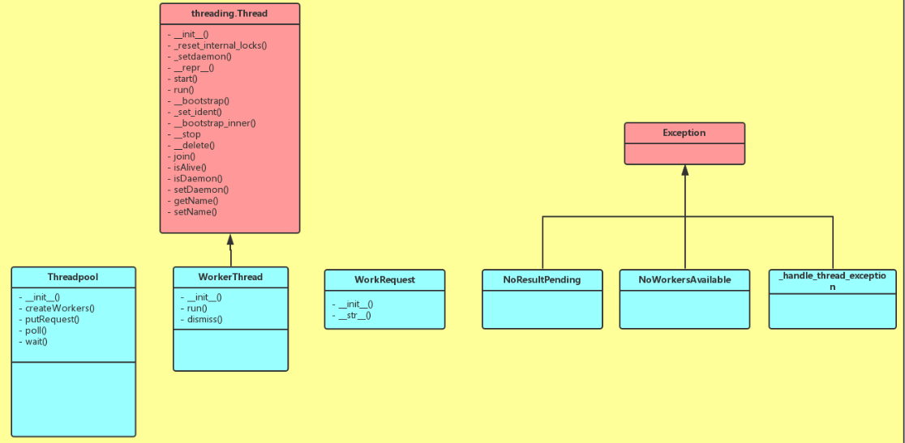

目录

<!-- TOC -->

- [tags: [python, ]](#tags-python)
- [1. 编译安装python](#1-%E7%BC%96%E8%AF%91%E5%AE%89%E8%A3%85python)
- [2. jupyter](#2-jupyter)
- [3. mkdocs](#3-mkdocs)
- [进程池multiprocessing.Pool](#%E8%BF%9B%E7%A8%8B%E6%B1%A0multiprocessingpool)
- [线程池threadpool](#%E7%BA%BF%E7%A8%8B%E6%B1%A0threadpool)
- [mac版python3的tf](#mac%E7%89%88python3%E7%9A%84tf)
- [copy deepcopy](#copy-deepcopy)
- [gc](#gc)
  - [引用计数（主要）](#%E5%BC%95%E7%94%A8%E8%AE%A1%E6%95%B0%E4%B8%BB%E8%A6%81)
  - [标记清除](#%E6%A0%87%E8%AE%B0%E6%B8%85%E9%99%A4)
  - [分代回收](#%E5%88%86%E4%BB%A3%E5%9B%9E%E6%94%B6)
- [collections](#collections)
  - [OrderedDict](#ordereddict)

<!-- /TOC -->

## 1. 编译安装python

python总体上有两个版本，cp27m是ucs2，cp27mu是ucs4，UCS2认为每个字符占用2个字节，UCS4认为每个字节占用4个字符，都是UNICODE的编码形式。

一般基于python的深度学习框架大多默认提供ucs4版本（当然也有ucs2版本），为了以后使用方便，下面我们会用gcc482编译生成python-ucs4版本


1、官网下载python release， https://www.python.org/ftp/python/2.7.14/Python-2.7.14.tgz

2、解压缩到 Python-2.7.14，cd Python-2.7.14

3、编译：

首先，手动安装tk

如果是64位系统，可能需要修改

```shell
LIB_RUNTIME_DIR = $(libdir):/usr/X11R6/lib64
X11_LIB_SWITCHES = $(XFT_LIBS) -L/usr/X11R6/lib64 -lX11
```

然后在python解压出来的路径里

```shell
./configure --enable-unicode=ucs4
```

打开Makefile，

```shell
#修改36行为
CC=/opt/compiler/gcc-4.8.2/bin/gcc -pthread

#修改37行为
CXX=/opt/compiler/gcc-4.8.2/bin/g++ -pthread

#修改101行(prefix=)为想要编译生成python的位置，例如 
prefix=     /home/work/xxx/exp_space/python-2.7.14

## 如果要安装支持tk的（matplot.pyplot需要！！）
## 那么就修改以下两个地方
TCLTK_INCLUDES=-I/home/work/.jumbo/include/ -I/usr/X11R6/include/
TCLTK_LIBS=-L/home/work/.jumbo/lib/ -ltk8.6 -ltcl8.6
```

然后还需要！！！！

```shell
export LD_LIBRARY_PATH=/home/work/.jumbo/lib/:$LD_LIBRARY_PATH
```

然后：

```shell
make
make install
```

然后记得把tk的so拷过来，例如：

```shell
cp ~/.jumbo/lib/libtcl8.6.so /home/disk2/daiwenkai/tools/python-2.7.14-tk/lib/python2.7/lib-dynload/
cp ~/.jumbo/lib/libtcl/home/disk2/daiwenkai/tools/python-2.7.14-tk/lib/python2.7/lib-dynload/
```

4、安装pip

```shell
curl https://bootstrap.pypa.io/get-pip.py -o get-pip.py
python get-pip.py
```

## 2. jupyter

小技巧：如何把整个notebook里的各级目录的东西一起下载？(我们发现在界面里一次只能下载一个文件。。。)

打开一个python窗口，然后输入(google搜出来的啦。。)

```shell
!tar -czhvf notebook.tar.gz *
```

其中的-h参数，是把软链对应的真实文件搞过来哈~。。


## 3. mkdocs

```shell
pip install mkdocs
```

参考：[https://www.mkdocs.org/](https://www.mkdocs.org/)

## 进程池multiprocessing.Pool

官方文档：[https://docs.python.org/2.7/library/multiprocessing.html](https://docs.python.org/2.7/library/multiprocessing.html)

[https://www.cnblogs.com/gengyi/p/8620853.html](https://www.cnblogs.com/gengyi/p/8620853.html)

demo代码

```python
import multiprocessing as mp

def test(msg):
    print msg

p = mp.Pool(processes = 5) # 创建5条进程

for i in range(10):
    msg = 'hello-%d'%i
    p.apply_async(test, (msg, )) # 向进程池添加任务

p.close() # 关闭进程池，不再接受请求
p.join() # 等待所有的子进程结束
```

## 线程池threadpool

参考[http://www.cnblogs.com/Eva-J/p/5106564.html](http://www.cnblogs.com/Eva-J/p/5106564.html)

在初始化中，它会根据我们的需求，启动相应数量的线程，这些线程是初始化好的，一直到程序结束，不会停止。

它们从任务队列中获取任务，在没有任务的时候就阻塞，

他们当我们有任务的时候，对任务进行初始化，放入任务队列，

拿到任务的线程结束了自己的阻塞人生，欢欢喜喜的拿回去执行，

并在执行完毕之后，将结果放入结果队列，继续到任务队列中取任务，如果没有任务就进入阻塞状态。

<html>
<br/>


<br/>

</html>

demo代码

```python
import threadpool
def func(a, b, c):
      print a, b, c
pool = threadpool.ThreadPool(20, poll_timeout=None)
lst = []
for i in range(500):
      dic = {"a": i, "b": i+1, "c": i}
      pair = (None, dic)
      lst.append(pair)

requests = threadpool.makeRequests(func, lst)
[pool.putRequest(req) for req in requests]
pool.wait()
```

如果遇到『most likely raised during interpreter』问题，可以参考[https://blog.csdn.net/daijiguo/article/details/79488548](https://blog.csdn.net/daijiguo/article/details/79488548)

写成：

```python
pool = threadpool.ThreadPool(20, poll_timeout=None)
```

## mac版python3的tf

在[https://pypi.org/project/tensorflow/1.11.0/#files](https://pypi.org/project/tensorflow/1.11.0/#files)找到tensorflow-1.8.0-cp36-cp36m-macosx_10_11_x86_64.whl这个版本的，下下来(注，如果macosx的版本是10.11以下，好像最高只能装1.8的tf，macosx版本高的话，再试试咯~)

然后

```shell
sudo -H pip3 install ./tensorflow-1.8.0-cp36-cp36m-macosx_10_11_x86_64.whl
```

## copy deepcopy

参考[https://iaman.actor/blog/2016/04/17/copy-in-python](https://iaman.actor/blog/2016/04/17/copy-in-python)

Python中的对象之间赋值(=运算)时是按引用传递的，如果需要拷贝对象，需要使用标准库中的copy模块。

copy.copy 浅拷贝 vs copy.deepcopy 深拷贝：

+ 对于简单的 object，用 shallow copy 和 deep copy 没区别

```python
>>> import copy
>>> origin = 1
>>> cop1 = copy.copy(origin) 
#cop1 是 origin 的shallow copy
>>> cop2 = copy.deepcopy(origin) 
#cop2 是 origin 的 deep copy
>>> origin = 2
>>> origin
2
>>> cop1
1
>>> cop2
1
#cop1 和 cop2 都不会随着 origin 改变自己的值
>>> cop1 == cop2
True
>>> cop1 is cop2
True
```

+ 复杂的object， 如list中套着list的情况，**shallow copy中的子list，并未从原object真的「独立」出来。**

```python
>>> import copy
>>> origin = [1, 2, [3, 4]]
#origin 里边有三个元素：1， 2，[3, 4]
>>> cop1 = copy.copy(origin)
>>> cop2 = copy.deepcopy(origin)
>>> cop1 == cop2
True
>>> cop1 is cop2
False 
#cop1 和 cop2 看上去相同，但已不再是同一个object
>>> origin[2][0] = "hey!" 
>>> origin
[1, 2, ['hey!', 4]]
>>> cop1
[1, 2, ['hey!', 4]]
>>> cop2
[1, 2, [3, 4]]
#把origin内的子list [3, 4] 改掉了一个元素，观察 cop1 和 cop2
```

浅copy容易遇到的『坑』：

```python
# 把 [1, 2, 3] 看成一个物品。a = [1, 2, 3] 就相当于给这个物品上贴上 a 这个标签。而 b = a 就是给这个物品又贴上了一个 b 的标签。
>>> a = [1, 2, 3]
>>> b = a
>>> a = [4, 5, 6] # 赋新的值给 a
>>> a
[4, 5, 6]
>>> b
[1, 2, 3]
# a 的值改变后，b 并没有随着 a 变。
# a = [4, 5, 6] 就相当于把 a 标签从 [1 ,2, 3] 上撕下来，贴到了 [4, 5, 6] 上。
# 在这个过程中，[1, 2, 3] 这个物品并没有消失。 b 自始至终都好好的贴在 [1, 2, 3] 上，既然这个 reference 也没有改变过。 b 的值自然不变。

>>> a = [1, 2, 3]
>>> b = a
>>> a[0], a[1], a[2] = 4, 5, 6 # 改变原来 list 中的元素
>>> a
[4, 5, 6]
>>> b
[4, 5, 6]
# a 的值改变后，b 随着 a 变了
# a[0], a[1], a[2] = 4, 5, 6 则是直接改变了 [1, 2, 3] 这个物品本身。把它内部的每一部分都重新改装了一下。内部改装完毕后，[1, 2, 3] 本身变成了 [4, 5, 6]。
# 而在此过程当中，a 和 b 都没有动，他们还贴在那个物品上。因此自然 a b 的值都变成了 [4, 5, 6]。
```


## gc

参考[https://juejin.im/post/5b34b117f265da59a50b2fbe](https://juejin.im/post/5b34b117f265da59a50b2fbe)

### 引用计数（主要）

在Python中，每一个对象的核心就是一个结构体PyObject，它的内部有一个引用计数器（ob_refcnt）

```c++
typedef struct_object {
 int ob_refcnt;
 struct_typeobject *ob_type;
} PyObject;
```

引用计数的意思就是，一个对象在它刚被New出来的时候因为被New方法引用了所以他的引用计数就是1，如果它被引用（也就是在之前的基础上 例如：b=a，被丢入函数列表等等被引用就会在引用计数上加1），如果引用它的对象被删除的时候（在之前的基础上DEL b）那么它的引用计数就会减少一一直到当它的引用计数变为0的时候，垃圾回收机制就会回收。

优点就是简单快速，缺点是维护成本稍微有点高（多了个refcnt要维护），无法解决循环引用的情况：

```python
a=[1,2]
b=[2,3]
a.append(b)
b.append(a)
DEL a
DEL b
```

### 标记清除

标记清除就是用来解决循环引用的问题的只有容器对象才会出现引用循环，比如列表、字典、类、元组。
首先，为了追踪容器对象，需要每个容器对象维护两个额外的指针，
用来将容器对象组成一个链表，指针分别指向前后两个容器对象，方便插入和删除操作。试想一下，现在有两种情况：

case1:

```python
a=[1,3]
b=[2,4]
a.append(b)
b.append(a)
del a
del b
```

case2:

```python
a=[1,3]
b=[2,4]
a.append(b)
b.append(a)
del a
```

有两块，一个是root链表(root object)，另外一个是unreachable链表。

对于case1，原来再未执行DEL语句的时候，a,b的引用计数都为2（init+append=2），但是在DEL执行完以后，a,b引用次数互相减1。a,b陷入循环引用的圈子中，然后标记-清除算法开始出来做事，找到其中一端a,开始拆这个a,b的引用环（我们从A出发，因为它有一个对B的引用，则将B的引用计数减1；然后顺着引用达到B，因为B有一个对A的引用，同样将A的引用减1，这样，就完成了循环引用对象间环摘除。），去掉以后发现，a,b循环引用变为了0，所以a,b就被处理到unreachable链表中直接被做掉。

对于case2，简单一看那b取环后引用计数还为1，但是a取环，就为0了。这个时候a已经进入unreachable链表中，已经被判为死刑了，但是这个时候，root链表中有b。如果a被做掉，那世界上还有什么正义... ，在root链表中的b会被进行引用检测引用了a，如果a被做掉了，那么b就...凉凉，一审完事，二审a无罪，所以被拉到了root链表中。

搞两个链表的原因：

之所以要剖成两个链表，是基于这样的一种考虑：现在的unreachable可能存在被root链表中的对象，直接或间接引用的对象，这些对象是不能被回收的，一旦在标记的过程中，发现这样的对象，就将其从unreachable链表中移到root链表中；当完成标记后，unreachable链表中剩下的所有对象就是名副其实的垃圾对象了，接下来的垃圾回收只需限制在unreachable链表中即可。

### 分代回收

了解分类回收，首先要了解一下，GC的阈值，所谓阈值就是一个临界点的值。随着你的程序运行，Python解释器保持对新创建的对象，以及因为引用计数为零而被释放掉的对象的追踪。从理论上说，创建==释放数量应该是这样子。但是如果存在循环引用的话，肯定是创建>释放数量，当创建数与释放数量的差值达到规定的阈值的时候，分代回收机制就登场啦。

垃圾回收=垃圾检测+释放。

分代回收思想将对象分为三代（generation 0,1,2），0代表幼年对象，1代表青年对象，2代表老年对象。根据弱代假说（越年轻的对象越容易死掉，老的对象通常会存活更久。）
新生的对象被放入0代，如果该对象在第0代的一次gc垃圾回收中活了下来，那么它就被放到第1代里面（它就升级了）。如果第1代里面的对象在第1代的一次gc垃圾回收中活了下来，它就被放到第2代里面。```gc.set_threshold(threshold0[,threshold1[,threshold2]])```设置gc每一代垃圾回收所触发的阈值。从上一次第0代gc后，如果分配对象的个数减去释放对象的个数大于threshold0，那么就会对第0代中的对象进行gc垃圾回收检查。 从上一次第1代gc后，如过第0代被gc垃圾回收的次数大于threshold1，那么就会对第1代中的对象进行gc垃圾回收检查。同样，从上一次第2代gc后，如过第1代被gc垃圾回收的次数大于threshold2，那么就会对第2代中的对象进行gc垃圾回收检查。

## collections

### OrderedDict

使用OrderedDict会根据**放入元素的先后顺序**进行排序。所以输出的值是排好序的。

```python
import collections
d1 = collections.OrderedDict()
d1['a'] = 'A'
d1['2'] = '2'
d1['c'] = 'C'
d1['b'] = 'B'
d1['1'] = '1'
for k,v in d1.items():
    print k,v

d1 = {}
d1['a'] = 'A'
d1['2'] = '2'
d1['c'] = 'C'
d1['b'] = 'B'
d1['1'] = '1'
print "xxx"
for k,v in d1.items():
    print k,v

#输出
a A
2 2
c C
b B
1 1
xxx
a A
1 1
c C
2 2
b B
```

OrderedDict对象的字典对象，如果其顺序不同那么Python也会把他们当做是两个不同的对象

```python
import collections
d1 = collections.OrderedDict()
d1['a'] = 'A'
d1['2'] = '2'

d2 = collections.OrderedDict()
d2['2'] = '2'
d2['a'] = 'A'

print d2 == d1 ## False
```
