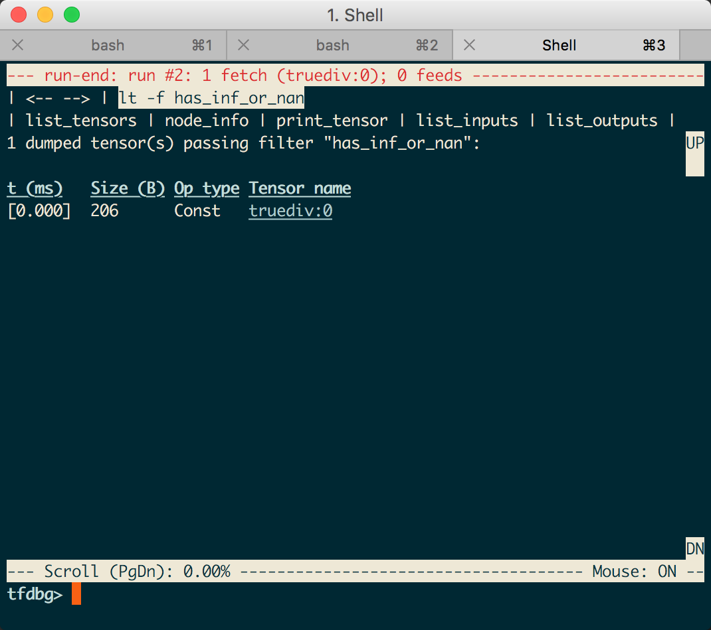
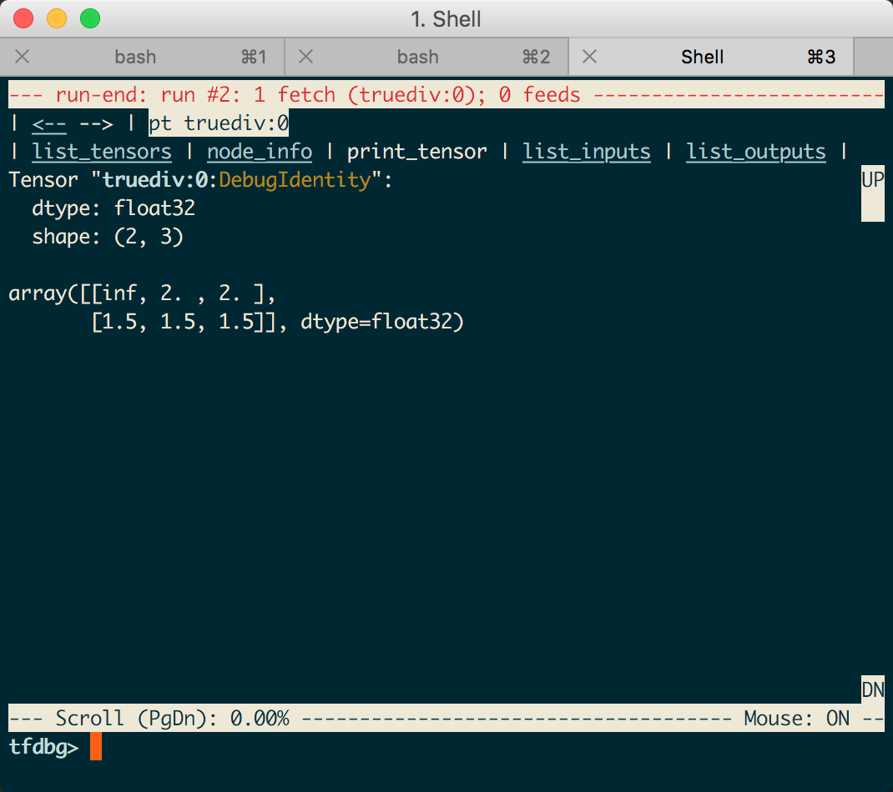

目录

<!-- TOC -->

- [基本函数](#%E5%9F%BA%E6%9C%AC%E5%87%BD%E6%95%B0)
  - [tf.truncated-normal](#tftruncated-normal)
  - [tf.reduce-*](#tfreduce)
- [tf.nn](#tfnn)
  - [cost](#cost)
    - [tf.nn.softmax-cross-entropy-with-logits](#tfnnsoftmax-cross-entropy-with-logits)
    - [tf.nn.weighted-cross-entropy-with-logits](#tfnnweighted-cross-entropy-with-logits)
    - [tf.nn.nce-loss](#tfnnnce-loss)
  - [activations](#activations)
    - [tf.nn.relu](#tfnnrelu)
  - [ops](#ops)
    - [tf.nn.embedding-lookup](#tfnnembedding-lookup)
    - [tf.nn.conv2d](#tfnnconv2d)
    - [tf.nn.max-pool](#tfnnmax-pool)
- [tf.contrib.layers](#tfcontriblayers)
  - [tf.contrib.layers.flatten](#tfcontriblayersflatten)
  - [tf.contrib.layers.fully-connected](#tfcontriblayersfully-connected)
- [常见问题](#%E5%B8%B8%E8%A7%81%E9%97%AE%E9%A2%98)
  - [steps v.s. epoch](#steps-vs-epoch)
  - [nan](#nan)
    - [情况1：loss出现nan](#%E6%83%85%E5%86%B51loss%E5%87%BA%E7%8E%B0nan)
    - [情况2：更新网络时出现Nan值](#%E6%83%85%E5%86%B52%E6%9B%B4%E6%96%B0%E7%BD%91%E7%BB%9C%E6%97%B6%E5%87%BA%E7%8E%B0nan%E5%80%BC)

<!-- /TOC -->

## 基本函数

### tf.truncated-normal

tf.truncated_normal(shape, mean=0.0, stddev=1.0, dtype=tf.float32, seed=None, name=None)

从截断的正态分布中输出随机值。 
生成的值服从具有指定平均值和标准偏差的正态分布，如果生成的值大于平均值2个标准偏差的值则丢弃重新选择。

在tf.truncated_normal中如果x的取值在区间（μ-2σ，μ+2σ）之外则重新进行选择。这样**保证了生成的值都在均值附近。**

### tf.reduce-*

**tf.reduce_mean:** computes the mean of elements across dimensions of a tensor. Use this to sum the losses over all the examples to get the overall cost. You can check the full documentation [here.](https://www.tensorflow.org/api_docs/python/tf/reduce_mean)

实现代码在```tensorflow/python/ops/math_ops.py```

tensorflow中有一类在tensor的某一维度上求值的函数。

+ 求最大值tf.reduce_max()
+ 求平均值tf.reduce_mean()

参数：
+ input_tensor:待求值的tensor。
+ keepdims:是否保持其他维不变。（之前叫keep_dims）
+ axis:要对哪一维进行操作(之前叫reduction_indices)，只对这维求max/min，其他维删除。如果设置了keepdims=True，那么其他维的大小保持不变，要在[-rank(input_tensor), rank(input_tensor))范围内。

先看一个简单的例子：

```python
x=tf.constant([[1,4,3],[4,2,6]],dtype=tf.float32) # x.shape=(2, 3)
y = tf.reduce_max(x,axis=1,keepdims=True) 
# 2行3列，axis=1就在列维度操作，n列变成1列，即每一行求max，合到一列里
# 相当于只有第1维有值其他几维没东西了，第1维存的是其他几维的max
sess = tf.Session()
print x.shape
print sess.run(y)
print y.shape

y = tf.reduce_max(x,axis=0,keepdims=True) 
# 2行3列，axis=0就在行维度操作，n行变成1行，即每一列求max，合到一行里
# 相当于只有第0维有值其他几维没东西了，第0维存的是其他几维的max
sess = tf.Session()
print x.shape
print sess.run(y)
print y.shape
```

输出：

```python
(2, 3)
[[4.]
 [6.]]
(2, 1)

(2, 3)
[[4. 4. 6.]]
(1, 3)
```

再看个复杂一点的

```python
x=tf.constant([[[1,2,3],[4,5,6]],[[22,33,44],[55,66,77]]],dtype=tf.float32) # x.shape=(2, 2, 3)
y = tf.reduce_max(x,axis=0,keepdims=True)
sess = tf.Session()
print sess.run(y) 
print y.shape

y = tf.reduce_max(x,axis=1,keepdims=True)
sess = tf.Session()
print sess.run(y)
print y.shape

y = tf.reduce_max(x,axis=2,keepdims=True)
sess = tf.Session()
print sess.run(y)
print y.shape
```

输出：

```python
[[[22. 33. 44.]
  [55. 66. 77.]]]
(1, 2, 3)

[[[ 4.  5.  6.]]

 [[55. 66. 77.]]]
(2, 1, 3)

[[[ 3.]
  [ 6.]]

 [[44.]
  [77.]]]
(2, 2, 1)
```

## tf.nn

### cost

#### tf.nn.softmax-cross-entropy-with-logits

**tf.nn.softmax_cross_entropy_with_logits(logits = Z3, labels = Y):** computes the softmax entropy loss. This function both computes the softmax activation function as well as the resulting loss. You can check the full documentation  [here.](https://www.tensorflow.org/api_docs/python/tf/nn/softmax_cross_entropy_with_logits)

#### tf.nn.weighted-cross-entropy-with-logits

正常的cross-entropy loss如下：

```
targets * -log(sigmoid(logits)) +
    (1 - targets) * -log(1 - sigmoid(logits))
```

其实就是，`\(L(\hat y, y)=-(ylog\hat y+(1-y)log(1-\hat y))\)`

而所谓的weighted，就是乘了一个pos_weight：

```
targets * -log(sigmoid(logits)) * pos_weight +
    (1 - targets) * -log(1 - sigmoid(logits))
```

#### tf.nn.nce-loss

原理和使用参考[https://daiwk.github.io/posts/nlp-word2vec.html#4-nce](https://daiwk.github.io/posts/nlp-word2vec.html#4-nce)

[https://www.tensorflow.org/versions/r1.9/api_docs/python/tf/nn/nce_loss](https://www.tensorflow.org/versions/r1.9/api_docs/python/tf/nn/nce_loss)

抄过来：

在NCE的实现中，使用的是log_uniform_candidate_sampler：

+ 会在[0, range_max)中采样出一个整数k(**k相当于词的id**)
+ P(k) = (log(k + 2) - log(k + 1)) / log(range_max + 1)

`\[
\begin{aligned}
P(k)&=\frac{1}{log(range\_max+1)}log(\frac{k+2}{k+1}) \\ 
 &= \frac{1}{log(range\_max+1)}log(1+\frac{1}{k+1}) \\
\end{aligned}
\]`

**k越大，被采样到的概率越小。**而我们的词典中，可以发现**词频高**的**index小**，所以高词频的词会被**优先**采样为负样本。

nce的实现可以参考：[https://www.jianshu.com/p/fab82fa53e16](https://www.jianshu.com/p/fab82fa53e16)

### activations

#### tf.nn.relu

**tf.nn.relu(Z1):** computes the elementwise ReLU of Z1 (which can be any shape). You can read the full documentation [here.](https://www.tensorflow.org/api_docs/python/tf/nn/relu)

### ops

#### tf.nn.embedding-lookup

```python
tf.nn.embedding_lookup(
    params,
    ids,
    partition_strategy='mod',
    name=None,
    validate_indices=True,
    max_norm=None
)
```

是```tf.gather```的generalization。

+ ```params```: 
+ ```ids```: 一个int32或者int64的tensor，包括了需要lookup的ids
+ ```partition_strategy```: 如果```len(params) > 1```，这个参数有用。有```div```和```mod```两种取值，默认是```mod```
+ ```name```: 这个op的名字
+ ```validate_indices```: 已经没用了
+ ```max_norm```：如果非None，如果emb的l2 norm比这个值大，就clip掉


详解：

其中的```params```是一个list的tensors。

+ 如果这个list的size是1，也就是说只有一个vocab_size x emb_size的tensor，那就是普通的emb。
+ 如果这个list的size大于1，即```len(params) > 1```，**这个list里每个tensor第二维要一样（emb的size），第一维可以不一样（每个partition里有多少个词）**。其实就是一个大型embedding tensor的partitioning，可以是```PartitionedVariable```。

如果，那么会根据partition_strategy来进行partition：

+ mod的切分方式：

partition号是```p = id % len(params)```。所以如果有5个id，要分成3个partition，那么结果就是```[[0, 3], [1, 4], [2]]```。所以这个时候，输入的params的shape就是```[(2, emb_size), (2, emb_size), (1, emb_size)]```。

+ div的切分方式：

partition是连续的。

所以如果有5个id，要分成3个partition，那么结果就是```[[0, 1], [2, 3], [4]]```。所以这个时候，输入的params的shape就是```[(2, emb_size), (2, emb_size), (1, emb_size)]```。

返回的shape：```shape(ids) + shape(params)[1:]```，即ids的size x emb_size

#### tf.nn.conv2d

**tf.nn.conv2d(X,W1, strides = [1,s,s,1], padding = 'SAME'):** given an input $X$ and a group of filters ```W1```, this function convolves ```W1```'s filters on X. The third input ([1,f,f,1]) represents the strides for each dimension of the input (m, n_H_prev, n_W_prev, n_C_prev). You can read the full documentation [here](https://www.tensorflow.org/api_docs/python/tf/nn/conv2d)

实现代码在```tensorflow/python/ops/gen_nn_ops.py```中。

```python
tf.nn.conv2d(
    input,
    filter,
    strides,
    padding,
    use_cudnn_on_gpu=True,
    data_format='NHWC',
    dilations=[1, 1, 1, 1],
    name=None
)
```

输入的shape是```[batch, in_height, in_width, in_channels]```，即『NHWC』，一个kernel或filter的shape是```[filter_height, filter_width, in_channels, out_channels]```。这个函数实现如下功能：

+ 对filter进行flatten，变成一个shape是```[filter_height * filter_width * in_channels, output_channels]```的2D矩阵
+ 将input tensor的image patches进行extract，并组成一个shape是```[batch, out_height, out_width, filter_height * filter_width * in_channels]```的virtual tensor。
+ 对于每一个patch，right-multiplies the filter matrix and the image patch vector.

```python
output[b, i, j, k] =
    sum_{di, dj, q} input[b, strides[1] * i + di, strides[2] * j + dj, q] *
                    filter[di, dj, q, k]
```

必须满足```strides[0] = strides[3] = 1```，对于最common的case，也就是horizontal and vertices strides是一样的， ```strides = [1, stride, stride, 1]```

#### tf.nn.max-pool

**tf.nn.max_pool(A, ksize = [1,f,f,1], strides = [1,s,s,1], padding = 'SAME'):** given an input A, this function uses a window of size (f, f) and strides of size (s, s) to carry out max pooling over each window. You can read the full documentation [here](https://www.tensorflow.org/api_docs/python/tf/nn/max_pool)

## tf.contrib.layers

### tf.contrib.layers.flatten

**tf.contrib.layers.flatten(P)**: given an input P, this function flattens each example into a 1D vector it while maintaining the batch-size. It returns a flattened tensor with shape [batch_size, k]. You can read the full documentation [here.](https://www.tensorflow.org/api_docs/python/tf/contrib/layers/flatten)

### tf.contrib.layers.fully-connected

**tf.contrib.layers.fully_connected(F, num_outputs):** given a the flattened input F, it returns the output computed using a fully connected layer. You can read the full documentation [here.](https://www.tensorflow.org/api_docs/python/tf/contrib/layers/fully_connected)


## 常见问题

### steps v.s. epoch

参考[https://stackoverflow.com/questions/42816124/steps-vs-num-epochs-in-tensorflow-getting-started-tutorial](https://stackoverflow.com/questions/42816124/steps-vs-num-epochs-in-tensorflow-getting-started-tutorial)

整理了一下，大概是这样吧：

epoch：1个epoch等于使用一次训练集中的全部样本训练；也就是训练整个数据集的重复数。
step: number of times the training loop in your learning algorithm will run to update the parameters in the model. 相当于如果每batchsize个样本update一次模型，那么应该就是

`\[
num_examples \times epochs / batchsize = steps
\]`

如果设置的steps比上面的大，可能会继续训？相当于加多了epoch？如果比上面的数小的话，相当于early stopping吧？

Why do we need this? There are many variations on gradient descent (batch, stochastic, mini-batch) as well as other algorithms for optimizing the learning parameters (e.g., L-BFGS). Some of them need to see the data in batches, while others see one datum at a time. Also, some of them include random factors/steps, hence you might need multiple passes on the data to get good convergence.

### nan

[https://blog.csdn.net/qq_22291287/article/details/82712050](https://blog.csdn.net/qq_22291287/article/details/82712050)

#### 情况1：loss出现nan

大致的解决办法就是，在出现Nan值的loss中一般是使用的TensorFlow的log函数，然后计算得到的Nan，一般是输入的值中出现了负数值或者0值，在TensorFlow的官网上的教程中，使用其调试器调试Nan值的出现，也是查到了计算log的传参为0；而解决的办法也很简单，假设传参给log的参数为y，那么在调用log前，进行一次数值剪切，修改调用如下：

```python
loss = tf.log(tf.clip_by_value(y,1e-8,1.0))
```

这样，y的最小值为0的情况就被替换成了一个极小值，1e-8，这样就不会出现Nan值了

tf.clip_by_value这个函数，是将第一个参数，限制在第二、三个参数指定的范围之内，使用这个函数的原意是要避免0值，并没有限制最大值，可以稍加修改，就确保了对于y值的剪切，不会影响到其数值的上限：

```python
loss = tf.log(tf.clip_by_value(y,1e-8,tf.reduce_max(y)))
```

但是在实际的神经网络中使用的时候，我发现这样修改后，虽然loss的数值一直在变化，可是优化后的结果几乎是保持不变的，这就存在问题了。

经过检查，其实并不能这么简单的为了持续训练，而修改计算损失函数时的输入值。这样修改后，loss的数值很可能（存在0的话确定就是）假的数值，会对优化器优化的过程造成一定的影响，导致优化器并不能正常的工作。

要解决这个假的loss的方法很简单，就是人为的改造神经网络，来控制输出的结果，不会存在0。这就需要设计好最后一层输出层的激活函数，每个激活函数都是存在值域的。

比如要给一个在(0,1)之间的输出（不包含0），那么显然sigmoid是最好的选择。不过需要注意的是，在TensorFlow中，tf.nn.sigmoid函数，在输出的参数非常大，或者非常小的情况下，会给出边界值1或者0的输出，这就意味着，改造神经网络的过程，并不只是最后一层输出层的激活函数，你必须确保自己大致知道每一层的输出的一个范围，这样才能彻底的解决Nan值的出现。

举例说明就是TensorFlow的官网给的教程，其输出层使用的是softmax激活函数，其数值在[0,1]，这在设计的时候，基本就确定了会出现Nan值的情况，只是发生的时间罢了。

#### 情况2：更新网络时出现Nan值

更新网络中出现Nan值很难发现，但是一般调试程序的时候，会用summary去观测权重等网络中的值的更新，因而，此时出现Nan值的话，会报错类似如下：

```shell
InvalidArgumentError (see above for traceback): Nan in summary histogram for: weight_1
```

这样的情况，一般是由于优化器的学习率设置不当导致的，而且一般是学习率设置过高导致的，因而此时可以尝试使用更小的学习率进行训练来解决这样的问题。

+ 数据本身，是否存在Nan,可以用numpy.any(numpy.isnan(x))检查一下input和target
+ 在训练的时候，整个网络随机初始化，很容易出现Nan，这时候需要把学习率调小，可以尝试0.1，0.01，0.001，直到不出现Nan为止，如果一直都有，那可能是网络实现问题。学习率和网络的层数一般成反比，层数越多，学习率通常要减小。有时候可以先用较小的学习率训练5000或以上次迭代，得到参数输出，手动kill掉训练，用前面的参数fine tune，这时候可以加大学习率，能更快收敛哦
+ 如果是图片，那么得转化为float 也就是/255.
+ relu和softmax两层不要连着用，最好将relu改成tanh,什么原因呢
+ 参数初始化
+ batch size 选择过小
+ 最后还没有排除问题的话，TensorFlow有专门的内置调试器(tf_debug)来帮助调试此类问题[https://www.tensorflow.org/guide/debugger](https://www.tensorflow.org/guide/debugger)

```python
from tensorflow.python import debug as tf_debug

# 建立原来的Session

sess = tf.Session()

# 用tfdbg的Wrapper包裹原来的Session对象：

sess = tf_debug.LocalCLIDebugWrapperSession(sess)

sess.add_tensor_filter("has_inf_or_nan", tf_debug.has_inf_or_nan)

# 以上为所有需要的代码变动，其余的代码可以保留不变，因为包裹有的sess和原来的界面一致。
# 但是每次执行`sess.run`的时候，自动进入调试器命令行环境。

sess.run(train_op, feed_dict=...)
```

！！！**目前看，只能在mac或者windows这种有图形界面的地方玩的哈！！**

在tfdbg命令行环境里面，输入如下命令，可以让程序执行到inf或nan第一次出现。

```shell
tfdbg> run -f has_inf_or_nan
```

一旦inf/nan出现，界面现实所有包含此类病态数值的张量，按照时间排序。所以第一个就最有可能是最先出现inf/nan的节点。可以用node_info, list_inputs等命令进一步查看节点的类型和输入，来发现问题的缘由。

来看个简单demo（假设是demo.py）：

```python
from __future__ import print_function
import numpy as np
import tensorflow as tf

from tensorflow.python import debug as tf_debug

def test_deubg_nan():
    a_1 = tf.constant([[2, 2, 2], [3, 3, 3]], dtype=tf.float32)
    b_1 = tf.constant([[0., 1, 1], [2, 2, 2]], dtype=tf.float32)
    init = tf.global_variables_initializer()
    sess = tf.Session()
    ## add this
    sess = tf_debug.LocalCLIDebugWrapperSession(sess)
    sess.add_tensor_filter("has_inf_or_nan", tf_debug.has_inf_or_nan)
    sess.run(init)

    m = sess.run(tf.divide(a_1, b_1))

test_deubg_nan()

```

执行```python demo.py```，出现如下界面时，输入```run -f has_inf_or_nan```：

<html>
<br/>


<br/>

</html>

然后在这个页面里，就可以拿鼠标乱点了。。

<html>
<br/>


<br/>

</html>

比如点```true:div:0```，就会出现详情，也可以点左上角的返回啥的，继续看其他tensor啦。。

<html>
<br/>


<br/>

</html>
