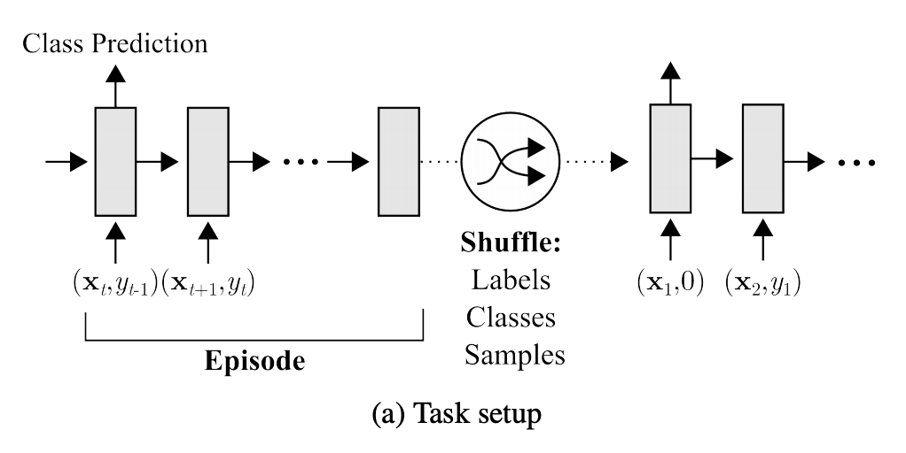
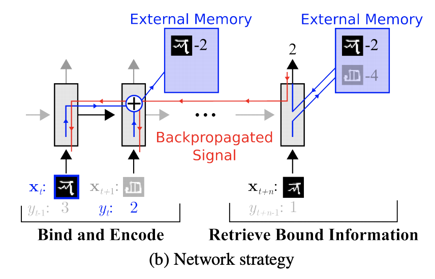
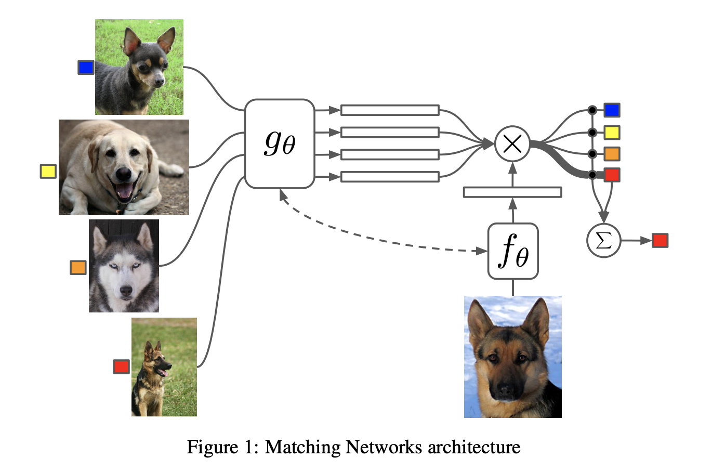
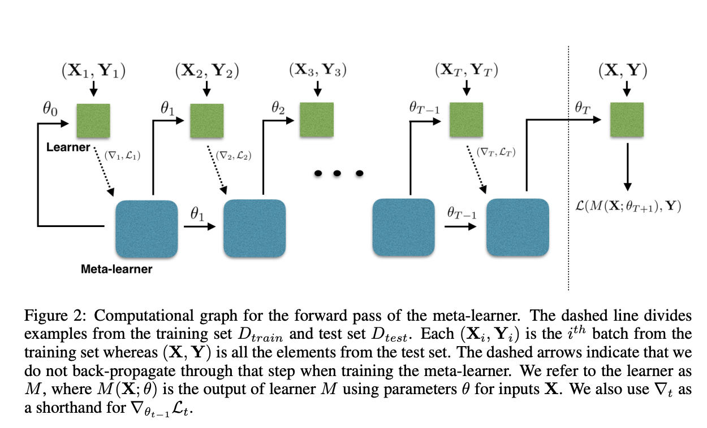

目录

<!-- TOC -->

- [定义](#%E5%AE%9A%E4%B9%89)
- [分类](#%E5%88%86%E7%B1%BB)
  - [model based](#model-based)
    - [One-shot learning with memory-augmented neural networks](#one-shot-learning-with-memory-augmented-neural-networks)
    - [Meta networks](#meta-networks)
  - [metric based](#metric-based)
    - [Siamese Network](#siamese-network)
    - [Match Network](#match-network)
    - [Prototype Network](#prototype-network)
    - [Relation Network](#relation-network)
  - [optimization based](#optimization-based)
    - [Optimization as a model for few-shot learning](#optimization-as-a-model-for-few-shot-learning)
    - [Model-agnostic meta-learning for fast adaptation of deep networks](#model-agnostic-meta-learning-for-fast-adaptation-of-deep-networks)

<!-- /TOC -->

参考[小样本学习（Few-shot Learning）综述](https://mp.weixin.qq.com/s?__biz=MzA3MzI4MjgzMw==&mid=2650759590&idx=3&sn=d7573d59fdffae5fc7bb83ea77a26fa6&chksm=871aa5d8b06d2cce197f93547df18d412c173dcb2149f31797c1c9fbea2ec7948f6b1100ab3e&mpshare=1&scene=1&srcid=0429y1qxBdLrdZ8C5KgRqP0e&pass_ticket=ZltpB2rBQ1hXYEBIClPX5yEh187BJtWG0mhs8mqho%2F%2FHR%2BUZZqkJ8efTvcnsT5KF#rd)

参考[当小样本遇上机器学习 fewshot learning](https://blog.csdn.net/qq_16234613/article/details/79902085)

参考[Few-shot Learning: A Survey](https://arxiv.org/pdf/1904.05046.pdf)

关于meta learning，可以参考[https://daiwk.github.io/posts/dl-meta-learning.html](https://daiwk.github.io/posts/dl-meta-learning.html)

参考[基于小样本学习的意图识别冷启动](https://mp.weixin.qq.com/s?__biz=MzIwMTc4ODE0Mw==&mid=2247496949&idx=1&sn=f0c2ec025be78ebc9f87fe30b78967c3&chksm=96ea2b75a19da26365cae1a30f7e8d7363fae366ced91277ee0380758b98096a7d839e80df7e&mpshare=1&scene=1&srcid=&pass_ticket=OEoJxI2kFvfmi6pDQlY3W%2FGC2MeNgyiIRuMCWgKgSHf5DYmZLcpg4jkhV1VOz5EE#rd)

## 定义

Few-shot Learning 是 Meta Learning 在**监督学习**领域的应用

Meta Learning，又称为learning to learn，在meta training阶段将数据集分解为不同的**meta task**，去学习类别变化的情况下模型的泛化能力，在**meta testing**阶段，面对全新的类别，**不需要变动已有的模型**，就可以完成分类。

few-shot的训练集中包含了很多的类别，每个类别中有多个样本。

+ 在训练阶段，会在训练集中随机**抽取C个类别**，每个类别**K个样本**（总共CK个数据），构建一个 meta-task，作为模型的**支撑集（support set）**输入；
+ 再从这**C个类**中**剩余的数据**中抽取一批（batch）样本作为模型的**预测对象（batch set）**。

即要求模型从C\*K个数据中学会如何区分这C个类别，这样的任务被称为**C-way K-shot**(C类，每个类K个样本)问题。

训练过程中，每次训练 **(episode)**都会**采样**得到**不同meta-task**。这种机制使得模型学会**不同meta-task**中的**共性部分**，比如如何提取重要特征及比较样本相似等，**忘掉** meta-task中**task相关**部分，因此，在面对新的**未见过的 meta-task**时，也能较好地进行分类。

## 分类

主要分为Mode Based，Metric Based 和 Optimization Based三大类。

### model based

通过模型结构的设计快速在**少量样本上更新参数**，直接建立输入`\(x\)`和预测值`\(P\)`的映射函数。

`\[
P_{\theta}(y | x, S)=f_{\theta}(x, S)
\]`

#### One-shot learning with memory-augmented neural networks

[One-shot learning with memory-augmented neural networks](https://arxiv.org/abs/1605.06065)使用**记忆增强**的方法。基于记忆的神经网络方法早在2001年被证明可以用于meta-learning。通过**权重更新**来**调节bias**，并且通过学习**将表达**快速**缓存**到**记忆**中来调节输出。

利用循环神经网络的**内部记忆**单元**无法扩展**到需要对**大量新信息**进行编码的**新任务**上。因此，需要让存储在记忆中的表达既要**稳定**又要是**元素粒度访问**的，前者是说当**需要时就能**可靠地访问，后者是说可**选择性地**访问相关的信息；另外，参数数量**不能被内存的大小束缚**。**神经图灵机**（NTMs）和**记忆网络**就符合这种必要条件。

参考[https://daiwk.github.io/posts/dl-ntm-memory-networks.html](https://daiwk.github.io/posts/dl-ntm-memory-networks.html)

文章基于**神经网络图灵机（NTMs）**的思想，因为 NTMs 能通过外部存储（external memory）进行短时记忆，并能通过**缓慢权值更新**来进行**长时记忆**，NTMs可以学习将表达存入记忆的策略，并如何用这些表达来进行预测。由此，文章方法可以**快速准确**地**预测**那些**只出现过一次的数据**。

基于LSTM等RNN的模型，将数据**看成序列**来训练，在测试时输入新的类的样本进行分类。

如下图，在`\(t\)`时刻，模型输入`\(\left(\mathbf{x}_{t}, y_{t-1}\right)\)`，即**当前时刻**的**样本**`\(x_t\)`，**上一时刻**的**真实label** `\(y_{t-1}\)`，然后基于这两个来**预测当前时刻的类别**。在新episode开始时，要对样本和label进行shuffle。

<html>
 

 
</html>

如下图，在external memory里面里存储绑定好（bind & encode，得到bound information）的上一次的输入的表示和对应的label（representation-class label）。具体地，当前时间步的输入`\(x_t\)`的label`\(y_t\)`是在下一时间步给出的（上面那段话说的）。如果后面的时间步(图中的`\(t+n\)`）中的样本`\(x_{t+n}\)`，有这个class的样本出现的时候，应该能够直接从external memory中retrieve到bound information，并直接进行预测。从这个prediction step进行反向传播时对**之前时间步的权重更新**进行shape，从而提升这种bind strategy。

<html>
 

 
</html>

#### Meta networks

[Meta Networks](https://arxiv.org/abs/1703.00837)的快速泛化能力源自其**"快速权重"**的机制，在**训练**过程中**产生的梯度**被用来作为**快速权重的生成**。模型包含一个**meta learner**和一个**base learner**：

+ meta learner：用于**学习meta task之间的泛化信息**，并使用**memory机制**保存这种信息
+ base learner：用于**快速适应新的task**，并**和meta learner交互**产生预测输出

### metric based

通过度量**batch集中**的样本和**support集**中样本的**距离**，借助最近邻的思想完成分类

`\[
P_{\theta}(y | x, S)=\sum_{\left(x_{i}, y_{i}\right) \in S} k_{\theta}\left(x, x_{i}, S\right) y_{i}
\]`

如果在 Few-shot Learning 的任务中去训练普通的基于cross-entropy的**神经网络分类器**，那么几乎**肯定是会过拟合**，因为神经网络分类器中有数以万计的参数需要优化。

所以，很多**非参数化的方法**（最近邻、K-近邻、Kmeans）是不需要优化参数的，因此可以在meta-learning的框架下构造一种可以端到端训练的 few-shot 分类器。该方法是**对样本间距离分布进行建模**，使得**同类样本靠近，异类样本远离**。

#### Siamese Network

siamese的经典论文：

+ [Learning a similarity metric discriminatively, with application to face verification](https://www.researchgate.net/publication/4156225_Learning_a_similarity_metric_discriminatively_with_application_to_face_verification?enrichId=rgreq-69df456718ba3ae3e30d3cdc40686c21-XXX&enrichSource=Y292ZXJQYWdlOzQxNTYyMjU7QVM6MTAxMzE1NTUyMjE5MTQyQDE0MDExNjY5MTg0MTE%3D&el=1_x_3&_esc=publicationCoverPdf)
+ [Signature Verification Using a Siamese Time Delay Neural Network](https://www.researchgate.net/publication/221620245_Signature_Verification_Using_a_Siamese_Time_Delay_Neural_Network?enrichId=rgreq-4152865765293445c4c6b41da78b8790-XXX&enrichSource=Y292ZXJQYWdlOzIyMTYyMDI0NTtBUzoxODEyMDE3ODAzNTUwNzJAMTQyMDIxMzI3OTMxNA%3D%3D&el=1_x_3&_esc=publicationCoverPdf)

[Siamese neural networks for one-shot image recognition](https://www.cs.cmu.edu/~rsalakhu/papers/oneshot1.pdf)

通过**有监督**的方式训练**孪生网络**来学习，然后重用网络所提取的特征进行one/few-shot学习。

孪生网络是一个双路的神经网络，训练时，通过组合的方式构造不同的成对样本，输入网络进行训练，在最上层通过**样本对的距离**判断他们**是否属于同一个类**，并产生对应的概率分布。

在**预测阶段**，孪生网络处理**测试**样本和**支撑**集之间**每一个样本对**，最终预测结果为**支撑集上概率最高的类别**。

可以参考下[https://yq.aliyun.com/articles/209297](https://yq.aliyun.com/articles/209297)，翻译自[https://sorenbouma.github.io/blog/oneshot/](https://sorenbouma.github.io/blog/oneshot/)，代码：[https://github.com/sorenbouma/keras-oneshot](https://github.com/sorenbouma/keras-oneshot)

#### Match Network

[Matching networks for one shot learning](https://arxiv.org/abs/1606.04080)

为**支撑**集和**Batch**集构建**不同的编码器**，最终分类器的输出是**支撑集**样本和**query**之间预测值的**加权求和**。

<html>
 

 
</html>

建模过程的创新，文章提出了基于**memory**和**attention**的matching nets，使得可以快速学习。

训练过程的创新，文章基于传统机器学习的一个原则，即训练和测试是要在同样条件下进行的，提出在**训练时**不断地**让网络只看每一类**的**少量样本**，这将**和测试的过程保持一致**。

构建一个从有`\(k\)`个image-label的pair对的样本的支撑集`\(S=\left\{\left(x_{i}, y_{i}\right)\right\}_{i=1}^{k}\)`到分类器`\(c_{S}(\hat{x})\)`的一个map，使得given一个测试样本`\(\hat{x}\)`能得到他的输出`\(\hat{y}\)`的概率分布。

定义`\(P(\hat{y} | \hat{x}, S):S \rightarrow c_{S}(\hat{x})\)`，其中`\(P\)`是通过nn的参数构建的。所以，给定一个没见过的样本`\(\hat{x}\)`和支撑集`\(S\)`，最终的预测结果就是`\(\arg \max _{y} P(y | \hat{x}, S)\)`

模型的最终输出形式就是：

`\[
\hat{y}=\sum_{i=1}^{k} a\left(\hat{x}, x_{i}\right) y_{i}
\]`

其中，`\(x_{i}, y_{i}\)`来自于支撑集`\(S=\left\{\left(x_{i}, y_{i}\right)\right\}_{i=1}^{k}\)`。而`\(a\)`是attention机制，是`\(X \times X\)`上的一种kernel，所以类似于一个kernel density estimator。

attention kernel一个常见的形式如下，对cos距离`\(c\)`求softmax：

`\[
a\left(\hat{x}, x_{i}\right)=e^{c\left(f(\hat{x}), g\left(x_{i}\right)\right)} / \sum_{j=1}^{k} e^{c\left(f(\hat{x}), g\left(x_{j}\right)\right)}
\]`

其中的`\(f\)`是对测试集样本`\(\hat{x}\)`的emb，`\(g\)`是对支撑集样本`\(x\)`的emb。

进一步地，期望支撑集学到的`\(g\)`可以modify测试集的emb函数`\(f\)`。可以通过如下两种方式来：

+ 把整个支撑集的数据都告诉`\(g\)`，也就是`\(g\)`不只是`\(g(x_i)\)`，应该是`\(g(x_i,S)\)`。可以把整个支撑集看成一个sequence，然后用一个双向lstm来根据整个支撑集这个context来进行emb。
+ Fully Conditional Embeddings (FCE)：使用一个对整个set `\(S\)`有read-attention的LSTM。

`\[
f(\hat{x}, S)=\operatorname{attLSTM}\left(f^{\prime}(\hat{x}), g(S), K\right)
\]`

其中，`\(f^{\prime}(\hat{x})\)`是LSTM的输入features(在每个时间步都是**常量**)；`\(K\)`是LSTM的unrolling steps的一个固定数目；`\(g(S)\)`是对集合`\(S\)`中每个元素`\(x_i\)`的emb函数。

参考附录，attLSTM的一个时间步的运算如下：

`\[
\begin{aligned} 
\hat{h}_{k}, c_{k} &=\operatorname{LSTM}\left(f^{\prime}(\hat{x}),\left[h_{k-1}, r_{k-1}\right], c_{k-1}\right) \\ 
h_{k} &=\hat{h}_{k}+f^{\prime}(\hat{x}) \\ 
r_{k-1} &=\sum_{i=1}^{|S|} a\left(h_{k-1}, g\left(x_{i}\right)\right) g\left(x_{i}\right) \\ 
a\left(h_{k-1}, g\left(x_{i}\right)\right) &=\operatorname{softmax}\left(h_{k-1}^{T} g\left(x_{i}\right)\right) 
\end{aligned}
\]`

假设`\(g^{\prime}\left(x_{i}\right)\)`是一个神经网络（类似上面提到的`\(f^{\prime}\)`），定义`\(g\left(x_{i}, S\right)=\vec{h}_{i}+\overleftarrow{h}_{i}+g^{\prime}\left(x_{i}\right)\)`，从而`\(g(S)\)`如下：

`\[
\begin{aligned} \vec{h}_{i}, \vec{c}_{i} &=\operatorname{LSTM}\left(g^{\prime}\left(x_{i}\right), \vec{h}_{i-1}, \vec{c}_{i-1}\right) \\ 
\overleftarrow{h}_{i}, \overleftarrow{c}_{i} &=\operatorname{LSTM}\left(g^{\prime}\left(x_{i}\right), \overleftarrow{h}_{i+1}, \overleftarrow{c}_{i+1}\right) 
\end{aligned}
\]`

#### Prototype Network

每个类别都存在一个原型表达，该类的原型是**support set**在**embedding空间中的均值**。然后，分类问题变成在**embedding空间中的最近邻**。

文章采用在Bregman散度下的指数族分布的混合密度估计，文章在训练时采用**比测试**时**更多的类别数**，即**训练**时每个episodes采用20个类（**20 way**），而**测试**对在5个类（**5 way**）中进行，其效果相对训练时也采用5 way的提升了2.5个百分点。

#### Relation Network

前面介绍的几个网络结构在最终的**距离度量**上都使用了**固定的度量**方式，如**cosine，欧式距离等**，这种模型结构下所有的**学习过程**都发生在**样本的embedding**阶段。

[Learning to compare: Relation network for few-shot learning](https://arxiv.org/abs/1711.06025)认为，度量方式也是网络中非常重要的一环，需要对其进行建模，所以该网络不满足单一且固定的距离度量方式，而是**训练一个网络来学习（例如 CNN）距离的度量方式**，在 loss 方面也有所改变，考虑到relation network**更多的关注relation score**，更像一种回归，而非 0/1 分类，所以使用了**MSE**取代了cross-entropy。

### optimization based

认为**普通的梯度下降**方法**难以**在few-shot场景下**拟合**，因此通过调整优化方法来完成小样本分类的任务。

`\[
P_{\theta}(y | x, S)=f_{\theta(S)}(x)
\]`

#### Optimization as a model for few-shot learning

[Optimization as a model for few-shot learning](https://openreview.net/pdf?id=rJY0-Kcll)

文章发现：

+ 首先，这些梯度优化算法包括momentum, adagrad, adadelta, ADAM等，**无法在几步内完成优化**，特别是在非凸的问题上，**多种超参的选取无法保证收敛的速度**。
+ 其次，**不同任务****分别随机初始化**会影响任务收敛到好的解上。虽然 finetune 这种迁移学习能缓解这个问题，但当新数据相对原始数据偏差比较大时，迁移学习的性能会大大下降。我们需要一个**系统的学习通用初始化**，使得训练从一个好的点开始，它和迁移学习不同的是，它能保证该初始化能**让finetune从一个好的点开始。**

文章**学习**的是一个**模型参数的更新函数**，即更新规则。它不是在多轮的episodes学习一个单模型，而是在**每个episode学习特定的模型**。

学习基于梯度下降的参数更新算法，采用LSTM表达meta learner，用其**状态**表达**目标分类器的参数的更新**，最终学会如何在新的分类任务上，对分类器网络（learner）进行**初始化**和**参数更新**。这个优化算法同时考虑**一个任务**的**短时知识**和跨**多个任务**的**长时知识**。

设定目标为通过少量的迭代步骤捕获优化算法的泛化能力，由此meta learner可以训练让learner在每个任务上收敛到一个好的解。另外，通过捕获所有任务之前**共享的基础知识**，进而更好地**初始化**learner。

以训练 miniImage 数据集为例，

**训练**过程中，从训练集（64 个类，每类 600 个样本）中随机采样 5 个类，每个类 5 个样本，构成**支撑集**，去**学习learner**；然后从训练集的样本（采出的 5 个类，每类剩下的样本）中采样构成**Batch集**，集合中每类有 15 个样本，用来**获得learner的loss**，去**学习meta leaner**。

**测试**的流程一样，从测试集（16 个类，每类 600 个样本）中随机采样 5 个类，每个类 5 个样本，构成**支撑集**Support Set，去**学习learner**；然后从测试集剩余的样本（采出的 5 个类，每类剩下的样本）中采样构成**Batch集**，集合中每类有 15 个样本，用来**获得learner的参数**，进而**得到预测的类别概率**。

这两个过程分别如下图中虚线左侧和右侧。

<html>
 

 
</html>

meta learner的目标是在各种**不同的学习任务**上**学出一个模型**，使得可以仅用少量的样本就能解决一些新的学习任务。这种任务的挑战是模型需要结合之前的经验和当前新任务的少量样本信息，并避免在新数据上过拟合。 

#### Model-agnostic meta-learning for fast adaptation of deep networks

[Model-Agnostic Meta-Learning for Fast Adaptation of Deep Networks](https://arxiv.org/abs/1703.03400)

使得可以在小量样本上，用少量的迭代步骤就可以获得较好的泛化性能，而且模型是容易 fine-tine 的。而且这个方法无需关心模型的形式，也不需要为 meta learning 增加新的参数，直接用梯度下降来训练 learner。

