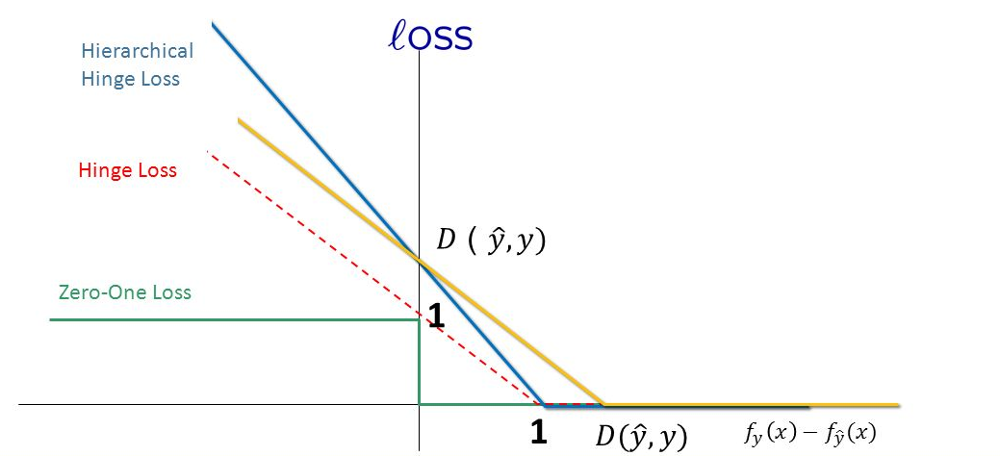

目录

<!-- TOC -->

- [损失函数](#%E6%8D%9F%E5%A4%B1%E5%87%BD%E6%95%B0)
    - [Hinge loss](#hinge-loss)
    - [Softmax Loss](#softmax-loss)
    - [Squared Loss](#squared-loss)
    - [Exponentially Loss](#exponentially-loss)
    - [其他loss](#%E5%85%B6%E4%BB%96loss)

<!-- /TOC -->

参考[https://blog.csdn.net/u010976453/article/details/78488279](https://blog.csdn.net/u010976453/article/details/78488279)

## 损失函数

是一个**非负实值**函数，通常用`\(L(Y,f(x))\)` 来表示。**损失函数越小，模型的鲁棒性就越好。**

常用损失函数有：

1. 铰链损失（Hinge Loss）：主要用于支持向量机（SVM） 中； 
2. 交叉熵损失 （Cross Entropy Loss，Softmax Loss ）：用于Logistic 回归与Softmax 分类中； 
3. 平方损失（Square Loss）：主要是最小二乘法（OLS）中； 
4. 指数损失（Exponential Loss） ：主要用于Adaboost 集成学习算法中； 
5. 其他损失（如0-1损失，绝对值损失）

### Hinge loss

Hinge loss的通用的函数表达式为：

`\[L(m_i) = max(0,1-m_i(w))\]`

表示如果被正确分类，损失是0，否则损失就是`\(1-m_i(w)\)`，其中的`\(m_i(w)\)`就是实际值和预测值之差。下图的红色虚线就是hinge loss

<html>
 

 

</html>

Hinge 可以用来解**间距最大化**的问题，最有代表性的就是SVM问题：

`\[
    \underset{w,\zeta}{argmin} \frac{1}{2}||w||^2+ C\sum_i \zeta_i \\
st.\quad \forall y_iw^Tx_i \geq 1- \zeta_i \\
\zeta_i \geq 0
\]`

将约束项进行变形，则为： 

`\[
    \zeta_i \geq 1-y_iw^Tx_i
\]`

进一步地，可以把损失函数写为：

`\[
\begin{equation}\begin{split}J(w)&=\frac{1}{2}||w||^2 + C\sum_i max(0,1-y_iw^Tx_i) \\
&= \frac{1}{2}||w||^2 + C\sum_i max(0,1-m_i(w)) \\
&= \frac{1}{2}||w||^2 + C\sum_i L_{Hinge}(m_i)
\end{split}\end{equation}
\]`

因此， SVM 的损失函数可以看作是**L2-norm**和**Hinge loss**之和。

### Softmax Loss

平方损失函数可以通过线性回归在假设样本是高斯分布的条件下推导得到，而逻辑回归得到的并不是平方损失。在逻辑回归的推导中，它**假设样本服从伯努利分布（0-1分布）**，然后求得满足该分布的似然函数，接着取对数求极值等等。而逻辑回归并没有求似然函数的极值，而是把极大化当做是一种思想，进而推导出它的经验风险函数为：最小化负的似然函数`\(\max F(y, f(x)) \rightarrow \min -F(y, f(x)))\)`，从损失函数的视角来看，它就成了Softmax 损失函数了。

log损失函数的标准形式： 

`\[
L(Y,P(Y|X)) = -\log P(Y|X)
\]`

取对数是为了方便计算极大似然估计，因为在MLE中，直接求导比较困难，所以通常都是先取对数再求导找极值点。损失函数`\(L(Y, P(Y|X))\)`表达的是样本X 在分类Y的情况下，使概率`\(P(Y|X)\)`达到最大值（换言之，就是利用已知的样本分布，找到最有可能（即最大概率）导致这种分布的参数值；或者说什么样的参数才能使我们观测到目前这组数据的概率最大）。因为log函数是单调递增的，所以`\(logP(Y|X)\)`，因此在前面加上负号之后，最大化`\(P(Y|X)\)`就等价于最小化`\(L\)`了。

### Squared Loss

最小二乘法是线性回归的一种，OLS将问题转化成了一个凸优化问题。在线性回归中，它假设样本和噪声都服从高斯分布（中心极限定理），最后通过极大似然估计（MLE）可以推导出最小二乘式子。最小二乘的基本原则是：最优拟合直线应该是使各点到回归直线的距离和最小的直线，即平方和最小。

平方损失（Square loss）的标准形式如下： 

`\[
L(Y, f(X)) = (Y - f(X))^2
\]`

当样本个数为n时，此时的损失函数为： 

`\[
L(Y, f(X)) =\sum_{i=1} ^n (Y-f(X))^2
\]`

实际应用中，我们使用均方差（MSE）作为一项衡量指标，公式如下： 

`\[
MSE = \frac{1}{n} \sum_{i=1} ^{n} (\tilde{Y_i} - Y_i )^2
\]`

### Exponentially Loss

`\[
L(Y,f(X)) = \exp [-Yf(X)]
\]`

主要应用于 Boosting 算法中，在Adaboost 算法中，经过 m 次迭代后，可以得到

`\[
f_m(x)=f_{m-1}(x) + \alpha_m G_m(x)
\]`

Adaboost 每次迭代时的目的都是找到最小化下列式子的参数`\(\alpha\)`和G：

`\[
\arg \min_{\alpha,G} = \sum_{i=1}^N \exp[-y_i(f_{m-1}(x_i) + \alpha G(x_i))]
\]`

所以，Adabooost 的目标式子就是指数损失，在给定n个样本的情况下，Adaboost 的损失函数为： 

`\[
L(Y,f(X)) = \frac{1}{2} \sum_{i=1}^n \exp[-y_if(x_I)]
\]`

### 其他loss

0-1 损失函数：

`\[
L(Y,f(X)) =\left\{
\begin{aligned}
0 & \quad if \quad  Y \neq f(X)\\
1 & \quad if \quad Y = f(X)\\
\end{aligned}
\right.
\]`

绝对值损失函数：

`\[
L(Y,f(X)) =  |Y-f(X)|
\]`