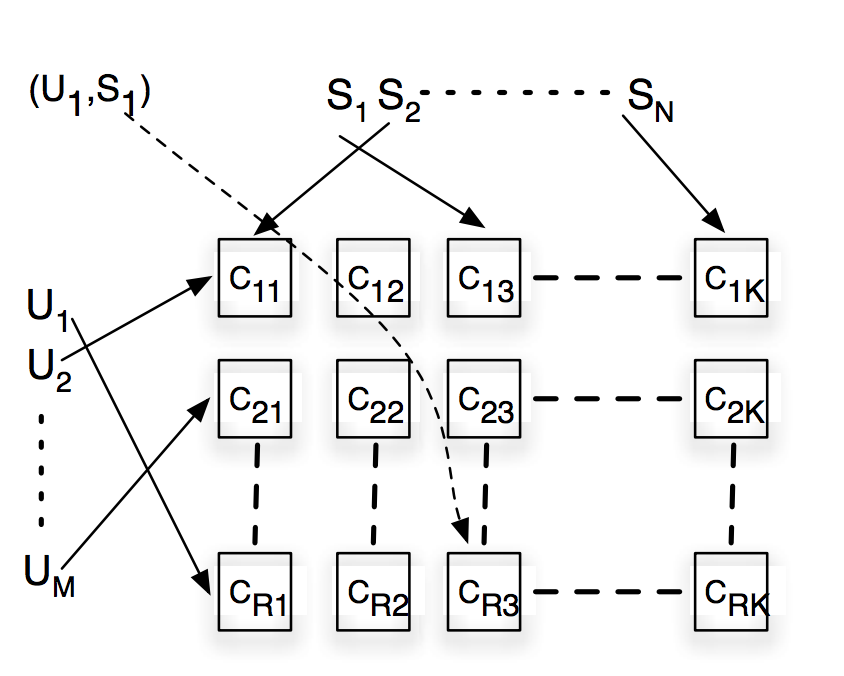

目录

<!-- TOC -->

- [EM算法](#em%e7%ae%97%e6%b3%95)

<!-- /TOC -->

## EM算法

参考[https://blog.csdn.net/fuqiuai/article/details/79484421](https://blog.csdn.net/fuqiuai/article/details/79484421)

分布式的EM，以PLSI为例，看google www07发的那篇讲google news的推荐算法的：[Google News Personalization: Scalable Online Collaborative Filtering](https://www2007.org/papers/paper570.pdf)

对于`\(T\)`个训练样本来讲，新闻是`\(s\)`，用户是`\(u\)`，引入一个中间隐变量`\(z\)`，就有两个条件概率(CPD, conditional probability distribution)`\(p(z|u)\)`和`\(p(s|z)\)`，(也就是**从u到z再到s**)然后就是要最大化条件似然的乘积，也就是要最小化负的经验log风险：

`\[
L(\theta) = - \frac{1}{T}\sum ^{T}_{t=1}\log(p(s_t|u_t;\theta))
\]`

而这可以通过EM来解。

E-step计算如下的`\(Q\)`值，也就是后验的隐变量的概率：

`\[
q^*(z;u,s;\hat{\theta}):=p(z|u,s;\hat{\theta})=\frac{\hat{p}(s|z)\hat{p}(z|u)}{\sum_{z\in Z}\hat{p}(s|z)\hat{p}(z|u)}
\]`

M-step使用上面的Q计算如下分布：

`\[
\begin{matrix}
p(s|z) &= \frac{\sum_uq^*(z;u,s;\hat{\theta})}{\sum_s\sum_uq^*(z;u,s;\hat{\theta})}\\ 
p(z|u) &= \frac{\sum_sq^*(z;u,s;\hat{\theta})}{\sum_z\sum_sq^*(z;u,s;\hat{\theta})}
\end{matrix}
\]`

其中的`\(\hat{p}\)`指的是上一轮EM迭代产出的`\(p\)`。

假设M=N=1kw，L=1000,也就是1kw个user，1kw个item，然后有1000个隐变量，那么需要存`\((M+N)\times L\times 4=80GB\)`的内存来存储两个CPD(假设double占4字节)。单机是不行的，搞成分布式的。。

加两个中间项：

`\[
\begin{matrix}
N(z,s)=\sum_uq^*(z;u,s;\hat{\theta})\\
N(z)=\sum_s\sum_u^*(z;u,s;\hat{\theta})
\end{matrix}
\]`

那么，

`\[
q^*(z;u,s;\hat{\theta}):=p(z|u,s;\hat{\theta})=\frac{\frac{N(z,s)}{N(z)}\hat{p}(z|u)}{\sum_{z\in Z}\frac{N(z,s)}{N(z)}\hat{p}(z|u)}
\]`

其中，

`\[
\hat{p}(z|u) = \frac{\sum_sq^*(z;u,s;\hat{\theta})}{\sum_z\sum_sq^*(z;u,s;\hat{\theta})}
\]`

这样，就可以把`\(p(s|z)\)`干掉了

对于每个给定的(u,s)的pair对，计算 `\(q^*(z;u,s;\hat{\theta}):=p(z|u,s;\hat{\theta})\)`时，需要之前多轮迭代的信息：`\(\hat{p}(z|u)\)`、`\(N(z,s)\)`和`\(N(z)\)`。当统计信息足够多时，对于一个(u,s)对，计算`\(q^*\)`是可以独立且并行的。

我们看一个`\(R\times K\)`的shard。假设所有用户被hash到`\(R\)`个group里，所有news被hash到`\(K\)`个group里。也就是说`\((u_1,s_1)\)`这个pair对，按下图就是被分到了`\(C_{R3}\)`这个shard里去了。然后在一个shard中，只要存储这个shard里的所有(u,s)的pair对的点展信息就行了，来计算里面的CPD。所以一个shard需要存的CPD就只有1/R的用户的CPD和1/K的news的CPD。

map输出3个kv：`\((u,q^*)\)`、`\((i,q^*)\)`和`\((z,q^*)\)`。

对于reduce来说，

+ 负责s的reduce对所有的z计算`\(N(z,s)\)`
+ 负责u的reduce计算`\(p(z|u)\)`
+ 负责z的reduce计算`\(N(z)\)`。每一个(u,s)的pair就会产出一条记录给负责z的reduce。。所以可以在shuffle阶段做一些预处理，防止reduce单节点太慢

<html>
 

 
</html>
