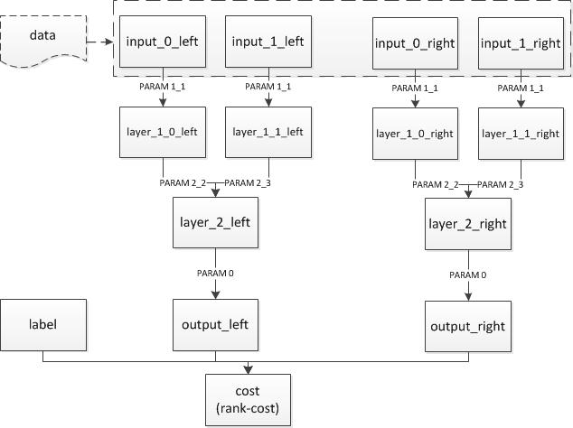

目录

<!-- TOC -->

- [learning to rank简介](#learning-to-rank简介)
    - [point-wise](#point-wise)
    - [pair-wise](#pair-wise)
    - [list-wise](#list-wise)
- [ltr的常见网络结构](#ltr的常见网络结构)
    - [pairwise](#pairwise)
    - [listwise的lambdarank](#listwise的lambdarank)

<!-- /TOC -->

## learning to rank简介

参考：
[https://github.com/PaddlePaddle/models/tree/develop/ltr](https://github.com/PaddlePaddle/models/tree/develop/ltr)

### point-wise

### pair-wise

ranknet

### list-wise

lambdarank

## ltr的常见网络结构

### pairwise

以paddle为例：

我们希望训练一个dnn来描述“语义相似度”。期望的输入是两个词，输出一个float值，表示这两个字有多么相似。这个相似度最好和人们的直观感受相对应，而对于具体数值其实并不是很关心。比如，我们训练出来的模型计算出“北京vs上海=1.2”，“北京vs鼠标=0.12”，看起来就挺合理的。

在这种情况下，需要训练的并不是“某一条instance对应一个label”，而是“北京和上海的语义相似度，大于北京和鼠标的语义相似度”。这时候就需要引入pairwise的训练。在这个例子中，每一条样本有4个slot和一个label：slot0是北京，slot1是上海，slot2是北京，slot3是鼠标，label是1。

假设模型已经训练好了，我们需要的是“两个输入一个输出”，但是训练的时候却是“四个输入一个输出”。这需要我们把配置写成“共享参数”。即，在“4个输入”的情况下，这4个输入的前2个所使用的网络，和后2个使用的网络，是一样的。获得两个“子网络”的输出之后，再在最后接一个pn-pair层，把两个子网络的输出和label接在一起。

结构如下：



```python

## data
Layer(type = "data", name = "input0_left", size=10000)
Layer(type = "data", name = "input1_left", size=10000)
Layer(type = "data", name = "input0_right", size=10000)
Layer(type = "data", name = "input1_right", size=10000)


## 左侧的网络和右侧的网络，注意连接方式和参数名字都是一样的，只是layer和input的不同。
Layer(inputs = [Input("input0_left", parameter_name = "_layer1_1.w0"),], name = "layer1_0_left", bias = Bias(parameter_name = "_layer1_1.wbias"), active_type = "tanh", type = "fc", size = 128)
Layer(inputs = [Input("input1_left", parameter_name = "_layer1_1.w0"),], name = "layer1_1_left", bias = Bias(parameter_name = "_layer1_1.wbias"), active_type = "tanh", type = "fc", size = 128)
Layer(inputs = [Input("input0_right", parameter_name = "_layer1_1.w0"),], name = "layer1_0_right", bias = Bias(parameter_name = "_layer1_1.wbias"), active_type = "tanh", type = "fc", size = 128)
Layer(inputs = [Input("input1_right", parameter_name = "_layer1_1.w0"),], name = "layer1_1_right", bias = Bias(parameter_name = "_layer1_1.wbias"), active_type = "tanh", type = "fc", size = 128)

## 加多两层
Layer(inputs = [Input("layer1_0_left", parameter_name = "_layer2_2.w"), Input("layer1_1_left", parameter_name = "_layer2_3.w")], name = "layer2_left", bias = Bias(parameter_name = "_layer2.bias"), active_type = "tanh", type = "fc", size = 64)
Layer(inputs = [Input("layer1_0_right", parameter_name = "_layer2_2.w"), Input("layer1_1_right", parameter_name = "_layer2_3.w")], name = "layer2_right", bias = Bias(parameter_name = "_layer2.bias"), active_type = "tanh", type = "fc", size = 64)
Layer(inputs = [Input("layer2_left", parameter_name = "_layerO.w")], name = "output_left", bias = Bias(parameter_name = "_layerO.bias"), type = "fc", size = 1)
Layer(inputs = [Input("layer2_right", parameter_name = "_layerO.w")], name = "output_right", bias = Bias(parameter_name = "_layerO.bias"), type = "fc", size = 1)

## 输出cost
Layer(inputs = ["output_left", "output_right", "label"], name = "cost", type = "rank-cost")

Inputs("input0_left", "input1_left", "input0_right", "input1_right", "label") 
Outputs("cost")

```

### listwise的lambdarank

业界公认的LTR方法性能排序为Listwise~=Pairwise >> Pointwise。基于listwise的lambdarank在Yahoo! LTR challenge中夺得了冠军。**lambdaRank训练速度相对pairwise方法提升20倍**，同时保持效果不变。

Listwise方法的几个优势：

+ 原始数据无需组pair，从而避免了因组pair导致的数据量、数据大小的成倍增长。这也一定程度上加快了训练过程。
+ 优化目标为NDCG，通过指定NDCG截断个数，可以忽略大量尾部带噪声的样本的排序，从而集中优化前几位的排序。
+ 直接利用原始数据的打分信息进行排序学习，避免了通过分数大小组pair带来的信息损失。

在paddle中使用lambdaRank需要注意数据输入格式。为了保证同一个query下的title组成的样本（即一个list）不被随机分拆、打乱，用户需要把同一个query的所有样本组成一个sequence输入网络（可以使用ProtoDataProvider或者PyDataProvider实现）。另外，用户还需要输入每一条样本的打分，以计算NDCG并更新梯度。

```python
DataLayer(name = "query", size = 5000000)
DataLayer(name = "title", size = 5000000)
DataLayer(name = "score", size = 1)
DataLayer(name = "label", size = 1)
Layer(name = "emb", type = "fc", size = 128, active_type = "relu", inputs = Input("query", parameter_name="emb.w"), bias = Bias(parameter_name="emb.bias"))
Layer(name = "output", type = "fc", size = 1, inputs = "emb")
 
Layer(name = "cost", type = "lambda_cost", NDCG_num = 8, max_sort_size = -1, inputs = ["output", "score"])
 
Inputs("query","title","score","label")
Outputs("cost")
```

+ 实际上这里并不需要用到label，只是为了兼容DataProvider而作占位。
+ lambda_cost的输出是当前batch的平均NDCG。
+ lambda_cost参数说明：
	+ NDCG_num指定NDCG截断个数，这里即计算NDCG@8。
	+ max_sort_size指定部分排序的个数。由lambdaRank算法原理，该数必须大于等于NDCG_num。其数值越大，则用于计算梯度的pair越多，从而信息越多，效果越好。默认为-1，此时同一list下的所有样本均会组成pair用于更新梯度（即信息利用最全面）。
+ 由于需要计算NDCG，因此用户需要保证所有list的样本数量均大于等于NDCG_num，并且保证不含有打分全为0的list。