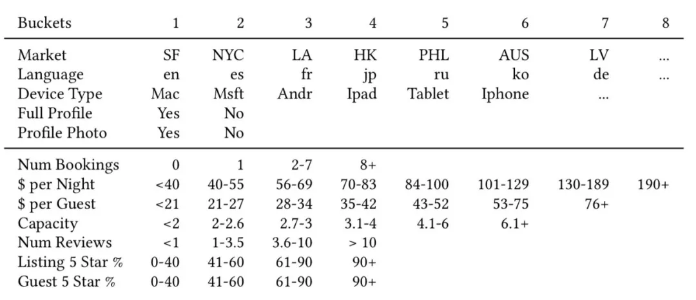

目录

<!-- TOC -->

- [learning to rank简介](#learning-to-rank%E7%AE%80%E4%BB%8B)
  - [point-wise](#point-wise)
  - [pair-wise](#pair-wise)
    - [gbrank](#gbrank)
    - [ranksvm和IRsvm](#ranksvm%E5%92%8Cirsvm)
    - [ranknet](#ranknet)
  - [list-wise](#list-wise)
- [ltr的常见网络结构](#ltr%E7%9A%84%E5%B8%B8%E8%A7%81%E7%BD%91%E7%BB%9C%E7%BB%93%E6%9E%84)
  - [pairwise](#pairwise)
  - [listwise的lambdarank](#listwise%E7%9A%84lambdarank)
- [应用](#%E5%BA%94%E7%94%A8)
  - [美团点评的lambdarank](#%E7%BE%8E%E5%9B%A2%E7%82%B9%E8%AF%84%E7%9A%84lambdarank)
    - [用户ID的Embedding](#%E7%94%A8%E6%88%B7id%E7%9A%84embedding)
    - [lambdadnn的使用](#lambdadnn%E7%9A%84%E4%BD%BF%E7%94%A8)

<!-- /TOC -->

## learning to rank简介

参考：

[https://github.com/PaddlePaddle/models/tree/develop/legacy/ltr](https://github.com/PaddlePaddle/models/tree/develop/legacy/ltr)

### point-wise

### pair-wise

#### gbrank

[https://www.cnblogs.com/bentuwuying/p/6684585.html](https://www.cnblogs.com/bentuwuying/p/6684585.html)

#### ranksvm和IRsvm

[https://www.cnblogs.com/bentuwuying/p/6683832.html](https://www.cnblogs.com/bentuwuying/p/6683832.html)

#### ranknet

ranknet用的是crossentropy的loss：[https://blog.csdn.net/puqutogether/article/details/42124491](https://blog.csdn.net/puqutogether/article/details/42124491)

ranknet的文章：[https://icml.cc/2015/wp-content/uploads/2015/06/icml_ranking.pdf](https://icml.cc/2015/wp-content/uploads/2015/06/icml_ranking.pdf)

### list-wise

lambdarank

NDCG是一个处处非平滑的函数，直接以它为目标函数进行优化是不可行的。

LambdaRank提供了一种思路：绕过目标函数本身，**直接构造一个特殊的梯度（称之为Lambda梯度）**，按照梯度的方向修正模型参数，最终能达到拟合NDCG的方法。通过该梯度构造出的深度学习网络称之为LambdaDNN。

LambdaRank模型是通过Pairwise来构造的，通常将**同Query**下**有点**击样本和**无点**击样本构造成一个样本Pair

## ltr的常见网络结构

### pairwise

以paddle为例：

我们希望训练一个dnn来描述“语义相似度”。期望的输入是两个词，输出一个float值，表示这两个字有多么相似。这个相似度最好和人们的直观感受相对应，而对于具体数值其实并不是很关心。比如，我们训练出来的模型计算出“北京vs上海=1.2”，“北京vs鼠标=0.12”，看起来就挺合理的。

在这种情况下，需要训练的并不是“某一条instance对应一个label”，而是“北京和上海的语义相似度，大于北京和鼠标的语义相似度”。这时候就需要引入pairwise的训练。在这个例子中，每一条样本有4个slot和一个label：slot0是北京，slot1是上海，slot2是北京，slot3是鼠标，label是1。

假设模型已经训练好了，我们需要的是“两个输入一个输出”，但是训练的时候却是“四个输入一个输出”。这需要我们把配置写成“共享参数”。即，在“4个输入”的情况下，这4个输入的前2个所使用的网络，和后2个使用的网络，是一样的。获得两个“子网络”的输出之后，再在最后接一个pn-pair层，把两个子网络的输出和label接在一起。

结构如下：


```python

## data
Layer(type = "data", name = "input0_left", size=10000)
Layer(type = "data", name = "input1_left", size=10000)
Layer(type = "data", name = "input0_right", size=10000)
Layer(type = "data", name = "input1_right", size=10000)


## 左侧的网络和右侧的网络，注意连接方式和参数名字都是一样的，只是layer和input的不同。
Layer(inputs = [Input("input0_left", parameter_name = "_layer1_1.w0"),], name = "layer1_0_left", bias = Bias(parameter_name = "_layer1_1.wbias"), active_type = "tanh", type = "fc", size = 128)
Layer(inputs = [Input("input1_left", parameter_name = "_layer1_1.w0"),], name = "layer1_1_left", bias = Bias(parameter_name = "_layer1_1.wbias"), active_type = "tanh", type = "fc", size = 128)
Layer(inputs = [Input("input0_right", parameter_name = "_layer1_1.w0"),], name = "layer1_0_right", bias = Bias(parameter_name = "_layer1_1.wbias"), active_type = "tanh", type = "fc", size = 128)
Layer(inputs = [Input("input1_right", parameter_name = "_layer1_1.w0"),], name = "layer1_1_right", bias = Bias(parameter_name = "_layer1_1.wbias"), active_type = "tanh", type = "fc", size = 128)

## 加多两层
Layer(inputs = [Input("layer1_0_left", parameter_name = "_layer2_2.w"), Input("layer1_1_left", parameter_name = "_layer2_3.w")], name = "layer2_left", bias = Bias(parameter_name = "_layer2.bias"), active_type = "tanh", type = "fc", size = 64)
Layer(inputs = [Input("layer1_0_right", parameter_name = "_layer2_2.w"), Input("layer1_1_right", parameter_name = "_layer2_3.w")], name = "layer2_right", bias = Bias(parameter_name = "_layer2.bias"), active_type = "tanh", type = "fc", size = 64)
Layer(inputs = [Input("layer2_left", parameter_name = "_layerO.w")], name = "output_left", bias = Bias(parameter_name = "_layerO.bias"), type = "fc", size = 1)
Layer(inputs = [Input("layer2_right", parameter_name = "_layerO.w")], name = "output_right", bias = Bias(parameter_name = "_layerO.bias"), type = "fc", size = 1)

## 输出cost
Layer(inputs = ["output_left", "output_right", "label"], name = "cost", type = "rank-cost")

Inputs("input0_left", "input1_left", "input0_right", "input1_right", "label") 
Outputs("cost")

```

### listwise的lambdarank

业界公认的LTR方法性能排序为Listwise~=Pairwise >> Pointwise。基于listwise的lambdarank在Yahoo! LTR challenge中夺得了冠军。**lambdaRank训练速度相对pairwise方法提升20倍**，同时保持效果不变。

Listwise方法的几个优势：

+ 原始数据无需组pair，从而避免了因组pair导致的数据量、数据大小的成倍增长。这也一定程度上加快了训练过程。
+ 优化目标为NDCG，通过指定NDCG截断个数，可以忽略大量尾部带噪声的样本的排序，从而集中优化前几位的排序。
+ 直接利用原始数据的打分信息进行排序学习，避免了通过分数大小组pair带来的信息损失。

在paddle中使用lambdaRank需要注意数据输入格式。为了保证同一个query下的title组成的样本（即一个list）不被随机分拆、打乱，用户需要把同一个query的所有样本组成一个sequence输入网络（可以使用ProtoDataProvider或者PyDataProvider实现）。另外，用户还需要输入每一条样本的打分，以计算NDCG并更新梯度。

```python
DataLayer(name = "query", size = 5000000)
DataLayer(name = "title", size = 5000000)
DataLayer(name = "score", size = 1)
DataLayer(name = "label", size = 1)
Layer(name = "emb", type = "fc", size = 128, active_type = "relu", inputs = Input("query", parameter_name="emb.w"), bias = Bias(parameter_name="emb.bias"))
Layer(name = "output", type = "fc", size = 1, inputs = "emb")
 
Layer(name = "cost", type = "lambda_cost", NDCG_num = 8, max_sort_size = -1, inputs = ["output", "score"])
 
Inputs("query","title","score","label")
Outputs("cost")
```

+ 实际上这里并不需要用到label，只是为了兼容DataProvider而作占位。
+ lambda_cost的输出是当前batch的平均NDCG。
+ lambda_cost参数说明：
	+ NDCG_num指定NDCG截断个数，这里即计算NDCG@8。
	+ max_sort_size指定部分排序的个数。由lambdaRank算法原理，该数必须大于等于NDCG_num。其数值越大，则用于计算梯度的pair越多，从而信息越多，效果越好。默认为-1，此时同一list下的所有样本均会组成pair用于更新梯度（即信息利用最全面）。
+ 由于需要计算NDCG，因此用户需要保证所有list的样本数量均大于等于NDCG_num，并且保证不含有打分全为0的list。

## 应用

### 美团点评的lambdarank

[大众点评搜索基于知识图谱的深度学习排序实践](https://mp.weixin.qq.com/s?__biz=MjM5NjQ5MTI5OA==&mid=2651750220&idx=1&sn=42df36757a7007808c56b53ee6832713&chksm=bd12a6018a652f17de2f66e28ba203bde1e8ae22155687fd3abe73b0336900a855c057e6ad38&mpshare=1&scene=1&srcid=0117dRsxGP0zSDCmQ4pTmBDF&pass_ticket=yoIK672aXk4WPiJRK3zkCxK5C5wwnua1%2B%2F115s%2FKJyXjdHQlvctIkGZpDsP%2FPVPZ#rd)

#### 用户ID的Embedding

常用方法是直接将用户ID经过Embedding后作为特征接入到模型中，但是最后上线的效果却不尽如人意。通过分析用户的行为数据，我们发现相当一部分用户ID的行为数据较为稀疏，导致用户ID的Embedding没有充分收敛，未能充分刻画用户的偏好信息。

Airbnb发表在KDD 2018上的文章[Real-time Personalization using Embeddings for Search Ranking at Airbnb](https://astro.temple.edu/~tua95067/kdd2018.pdf)为这种问题提供了一种解决思路——利用**用户基础画像和行为数据**对**用户ID进行聚类**。Airbnb的主要场景是为旅游用户提供民宿短租服务，一般**用户一年旅游的次数在1-2次之间**，因此Airbnb的用户行为数据相比点评搜索会更为稀疏一些。

<html>
<br/>


<br/>

</html>

如上图所示，将用户画像特征和行为特征进行离散分桶，拼接特征名和所属桶号，得到的聚类ID为：```US_lt1_pn3_pg3_r3_5s4_c2_b1_bd2_bt2_nu3```

采取了类似Airbnb的方案，稀疏性的问题得到了很好的解决，并且这样做还获得了一些额外的收益。大众点评作为一个本地化的生活信息服务平台，大部分用户的行为都集中自己的常驻地，导致用户到达一个**新地方**时，排序个性化明显不足。通过这种聚类的方式，将**异地**有**相同行为的用户聚集**在一起，也能解决一部分跨站的个性化问题。

#### lambdadnn的使用

Lambda梯度需要对同Query下的样本进行计算，但是正常情况下所有的样本是随机Shuffle到各个Worker的。因此我们需要对样本进行预处理：

+ 通过QueryId进行Shuffle，将同一个Query的样本聚合在一起，同一个Query的样本打包进一个TFRecord。
+ 由于每次请求Query召回的Doc数不一样，对于可变Size的Query样本在拉取数据进行训练时需要注意，TF会自动补齐Mini-Batch内每个样本大小一致，导致输入数据中存在大量无意义的默认值样本。这里我们提供两点处理方式：
    + MR过程中对Key进行处理，使得多个Query的样本聚合在一起，然后在训练的时候进行动态切分。
    + 读取到补齐的样本，根据设定的补齐标记获取索引位，去除补齐数据。

还进行了如下优化：

+ 将ID类特征的映射等操作一并在预处理中完成，减少多轮Training过程中的重复计算。
+ 将样本转TfRecord，利用RecordDataSet方式读取数据并计算处理，Worker的计算性能大概提升了10倍。
+ Concat多个Categorical特征，组合成Multi-Hot的Tensor进行一次Embedding_Lookup操作，减少Map操作的同时有助于参数做分片存储计算。
+ 稀疏Tensor在计算梯度以及正则化处理时保留索引值，仅对有数值的部分进行更新操作。
+ 多个PS服务器间进行分片存储大规模Tensor变量，减少Worker同步更新的通讯压力，减少更新阻塞，达到更平滑的梯度更新效果。

整体下来，对于30亿左右的样本量、上亿级别的特征维度，一轮迭代大概在半小时内完成。适当的增加并行计算的资源，可以达到分钟级的训练任务。

NDCG的计算公式中，折损的权重是随着位置呈指数变化的。然而实际曝光点击率随位置变化的曲线与NDCG的理论折损值存在着较大的差异。

对于移动端的场景来说，用户在下拉滑动列表进行浏览时，视觉的焦点会随着滑屏、翻页而发生变动。例如用户翻到第二页时，往往会重新聚焦，因此，会发现第二页头部的曝光点击率实际上是高于第一页尾部位置的。我们尝试了两种方案去微调NDCG中的指数位置折损：

+ 根据实际曝光点击率拟合折损曲线：根据实际统计到的曝光点击率数据，拟合公式替代NDCG中的指数折损公式，绘制的曲线如图12所示。
+ 计算Position Bias作为位置折损：Position Bias在业界有较多的讨论，其中[7][8]将用户点击商户的过程分为观察和点击两个步骤：a.用户需要首先看到该商户，而看到商户的概率取决于所在的位置；b.看到商户后点击商户的概率只与商户的相关性有关。步骤a计算的概率即为Position Bias，这块内容可以讨论的东西很多，这里不再详述。

经过上述对NDCG计算改造训练出的LambdaDNN模型，相较Base树模型和Pointwise DNN模型，在业务指标上有了非常显著的提升。

Lambda梯度除了与DNN网络相结合外，事实上可以与绝大部分常见的网络结构相结合。为了进一步学习到更多交叉特征，我们在LambdaDNN的基础上分别尝试了LambdaDeepFM和LambdaDCN网络；其中DCN网络是一种加入Cross的并行网络结构，交叉的网络每一层的输出特征与第一层的原始输入特征进行显性的两两交叉，相当于每一层学习特征交叉的映射去拟合层之间的残差。

离线的对比实验表明，Lambda梯度与DCN网络结合之后充分发挥了DCN网络的特点，简洁的多项式交叉设计有效地提升模型的训练效果。


近期Google开源的TF Ranking(参考[https://daiwk.github.io/posts/platform-tf-ranking.html](https://daiwk.github.io/posts/platform-tf-ranking.html))提出的Groupwise模型也对我们有一些启发。目前绝大部分的Listwise方法只是体现在模型训练阶段，在打分预测阶段依然是Pointwise的，即只会考虑当前商户相关的特征，而不会考虑列表上下文的结果，未来我们也会在这个方向上进行一些探索。
