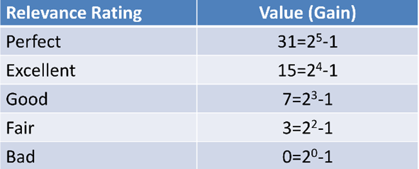
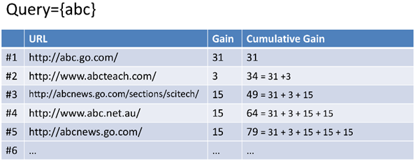

目录

<!-- TOC -->

- [MAP](#map)
- [NDCG](#ndcg)
    - [G](#g)
    - [CG](#cg)
    - [DCG](#dcg)
    - [IDCG](#idcg)
    - [NDCG](#ndcg-1)
    - [limitations](#limitations)

<!-- /TOC -->

## MAP

[http://blog.sciencenet.cn/blog-791354-763077.html](http://blog.sciencenet.cn/blog-791354-763077.html)

## NDCG

NDCG表示归一化折损累积增益(Normalized discounted cumulative gain)，

NDCG如何理解？对于搜索引擎，本质是用户搜一个query，引擎返回一个结果列表，那么如何衡量这个结果列表的好坏？我能够想到的是：

+ 我们希望把最相关的结果放到排名最靠前的位置，因为大部分用户都是从上往下阅读的，那么最相关的在前面可以最大程度减少用户的阅读时间；
+ 我们希望整个列表的结果尽可能的和query相关；

第一个条件的满足是首要的，而第二个条件的加入是保证整体结果质量，而这两个条件都体现在了NDCG里面，首先，计算NDCG，需要计算Gain，这个gain即是每条结果的质量的定义，NDCG把所有结果相加最终相加保证，整体质量越高的列表NDCG值越大。同时，Discounted的设计使得越靠前的结果权重越大，这保证了第一条，更相关的排在靠前的结果会有更大的NDCG值。从这两点看，以NDCG为优化目标，保证了搜索引擎在返回结果总体质量好的情况下，把更高质量结果排在更前面。

### G

首先，理解g(gain)，表示自己定义的一种获得，用来衡量网页的相关性程度，例如

<html>
 

 
</html>

### CG

CG（cumulative gain），累积获得，指的是网页gain的累加，例如

<html>
 

 
</html>

`\[\mathrm{CG}_p=\sum^p_{i=1}{rel_i}\]`

其中，`\(rel_i\)`是第i个网页的gain

### DCG

分母与位次正相关，也就是说，越靠后的doc，我们对他的打压越严重。

`\[\mathrm{DCG}_p=\sum^p_{i=1}{\frac{rel_i}{log_2(i+1)}}=rel_1+\sum^p_{i=2}{\frac{rel_i}{log_2(i+1)}}\]`

其中，`\(rel_i\)`是第i个网页的gain

大多数搜索公司和kaggle用的DCG如下：

`\[\mathrm{DCG}_p=\sum^p_{i=1}{\frac{2^{rel_i}-1}{log_2(i+1)}}\]`

### IDCG

Ideal DCG，理想状况下的DCG。也就是说，相关性完全由高到低排序时算出的DCG：

`\[\mathrm{IDCG}_p=\sum^{|REL|}_{i=1}{\frac{2^{rel_i}-1}{log_2(i+1)}}\]`

### NDCG

`\[\mathrm{nDCG}_p=\frac{\mathrm{DCG}_p}{\mathrm{IDCG}_p}\]`

最完美的排序算法就是DCG=IDCG，即NDCG=1。

### limitations

+ 并没有对bad的文档进行惩罚。
+ xxx