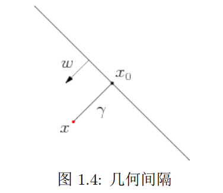
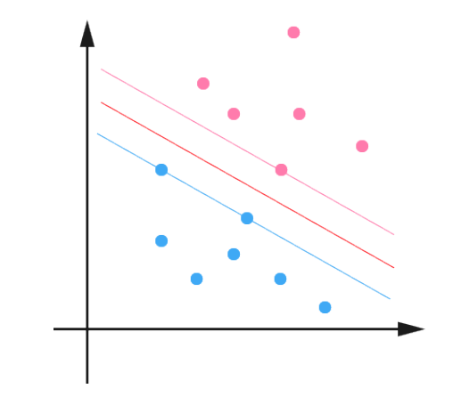

目录

<!-- TOC -->

- [1. 最大间隔分类器](#1-最大间隔分类器)
    - [1.1 logistic regression](#11-logistic-regression)
    - [1.2 +1/-1分类](#12-1-1分类)
    - [1.3 函数间隔与几何间隔](#13-函数间隔与几何间隔)
        - [1.3.1 函数间隔(functional margin)`\(\hat{\gamma}\)`](#131-函数间隔functional-margin\\hat\gamma\)
        - [1.3.2 几何间隔(geometric margin)`\(\tilde{\gamma}\)`](#132-几何间隔geometric-margin\\tilde\gamma\)
        - [1.3.3 最大间隔分类器（maximum margin classifier）](#133-最大间隔分类器maximum-margin-classifier)
    - [2. support vector](#2-support-vector)
    - [3. kernel](#3-kernel)
    - [4. Outliers](#4-outliers)
    - [5. Numerical Optimization](#5-numerical-optimization)
    - [6. Duality](#6-duality)
    - [7. Kernel II](#7-kernel-ii)

<!-- /TOC -->

参考:

+ **支持向量机通俗导论（理解SVM的三层境界）**：[http://blog.csdn.net/v_july_v/article/details/7624837](http://blog.csdn.net/v_july_v/article/details/7624837)

+ **支持向量机: Maximum Margin Classifier**
[http://blog.pluskid.org/?p=632](http://blog.pluskid.org/?p=632)

+ **支持向量机: Support Vector**
[http://blog.pluskid.org/?p=682](http://blog.pluskid.org/?p=682)

+ **支持向量机: Kernel**
[http://blog.pluskid.org/?p=685](http://blog.pluskid.org/?p=685)

+ **支持向量机：Outliers**
[http://blog.pluskid.org/?p=692](http://blog.pluskid.org/?p=692)

+ **支持向量机：Numerical Optimization**
[http://blog.pluskid.org/?p=696](http://blog.pluskid.org/?p=696)

+ **支持向量机：Duality**
[http://blog.pluskid.org/?p=702](http://blog.pluskid.org/?p=702)

+ **支持向量机：Kernel II**
[http://blog.pluskid.org/?p=723](http://blog.pluskid.org/?p=723)

## 1. 最大间隔分类器

### 1.1 logistic regression

**0/1分类：** 给sigmoid之前的函数值`\(\theta^Tx\)`是负无穷到正无穷，sigmoid之后的值相当于取y=1时的概率值，大于0.5就视为1的类。如果`\(\theta^Tx>0\)`则`\(sigmoid(\theta^Tx)>0.5\)`，换言之，要学到参数`\(\theta\)`，使正例的的`\(\theta^Tx\)`远大于0，负例的`\(\theta^Tx\)`远小于0.

### 1.2 +1/-1分类

svm中，使用+1/-1分类(方便推导公式)，而非logistic regression的0/1分类。

`\[
g(f(x))=g(\omega^Tx+b) =
\begin{cases}
+1, \omega^Tx+b >= 0 \\
-1, \omega^Tx+b < 0 \\
\end{cases}
\]`

最简单的情形，假设数据是线性可分的。

所以，要寻找超平面的两条边界间的最大间隔，从而求w和b。

### 1.3 函数间隔与几何间隔

#### 1.3.1 函数间隔(functional margin)`\(\hat{\gamma}\)`

函数间隔：`\(\hat{\gamma}=y(\omega^Tx+b)=yf(x)\)`（保证margin的非负）

超平面`\((\omega,b)\)`关于数据集T上的函数间隔：(w,b)关于T中所以样本点的函数间隔的最小值：

`\[
\hat{\gamma}=min\hat{\gamma}_i,i=0,1,...
\]`

当w，b同时扩大时，超平面没变（`\(\omega^Tx+b=0,2\omega^Tx+2b=0\)`），**但函数间隔却变大了**，所以，需要规范化。

#### 1.3.2 几何间隔(geometric margin)`\(\tilde{\gamma}\)`

点`\(x\)`投影到超平面的点为`\(x_0\)`,因为`\(\omega\)`是垂直于超平面的法向量，设`\(x\)`到超平面的距离是`\(\gamma\)`,那么

`\[
x=x_0+\gamma \frac{\omega}{||\omega||}
\]`

因为`\(x_0\)`是超平面上的点，所以`\(f(x_0)=0\)`，所以
`\[
\\x=x_0+\gamma\frac{\omega}{||\omega||}
\\\omega^Tx=\omega^Tx_0+\gamma\frac{\omega^T\omega}{||\omega||}
\\\omega^Tx+b=\omega^Tx_0+b+\gamma\frac{\omega^T\omega}{||\omega||}
\\f(x)=0+\gamma\frac{\omega^T\omega}{||\omega||}
\\f(x)=\gamma||\omega||
\\\gamma=\frac{f(x)}{||\omega||}
\]`

因为`\(\gamma\)`也是有符号的，而间隔只要他的绝对值，所以，几何间隔定义为：

`\[
\tilde{\gamma}=y\gamma=\frac{yf(x)}{||\omega||}=\frac{\hat{\gamma}}{||\omega||}
\]`

即，**几何间隔＝函数间隔/`\(||\omega||\)`**

#### 1.3.3 最大间隔分类器（maximum margin classifier）

对一个数据点进行分类，当这个点和超平面之间的间隔越大的时候，分类正确的把握越大(离超平面越远，那他肯定不是分界面附近的点，肯定属于某一个类别)。对于一个包含n个点的数据集，我们可以很自然地定义它的间隔为所有这n个点的间隔中最小的那个。于是，为了使得分类的把握尽量大，我们希望所选择的超平面能够最大化这个间隔值（**最大化这n个点里离超平面最近的点和超平面间的间隔**）。

所以，最大间隔分类器的目标就是：

`\[
\max\tilde{\gamma}, s.t. y_i(\omega^Tx_i+b)=\hat{\gamma}_i>=\hat{\gamma}, i=1,2,...,n
\]`

其中，`\(\hat{\gamma}=\tilde{\gamma}||\omega||\)`。

由于，即使超平面固定，`\(\hat{\gamma}\)`也会随着`\(||\omega||\)`的变化而变化，而我们的目标是固定超平面，所以可以固定`\(\hat{\gamma}\)`也可以固定`\(||\omega||\)`。为了方便推导，这里选择固定`\(\hat{\gamma}\)`。令`\(\hat{\gamma}=1\)`，则`\(\tilde{\gamma}=\frac{1}{||\omega||}\)`，所以，优化目标转化为：

`\[
\max\frac{1}{||\omega||}, s.t. y_i(\omega^Tx_i+b)=\hat{\gamma}_i>=1, i=1,2,...,n
\]`

图中，红色和蓝色两个超平面到中间的超平面的距离都是`\(\tilde{\gamma}\)`，当这个分类间隔最大的时候，这两个超平面上的点都叫做support vector,满足`\(y(\omega^Tx+b)=1\)`，而非support vector的点，都有`\(y(\omega^Tx+b)>1\)`。

### 2. support vector

support vector的一个最直接的好处就是计算和存储上的优越性，几百万个点，实际上可能只有一两百个surpport vector，存储这一两百个点拿来做inference之类的就够了。

### 3. kernel

### 4. Outliers

### 5. Numerical Optimization

### 6. Duality

### 7. Kernel II

