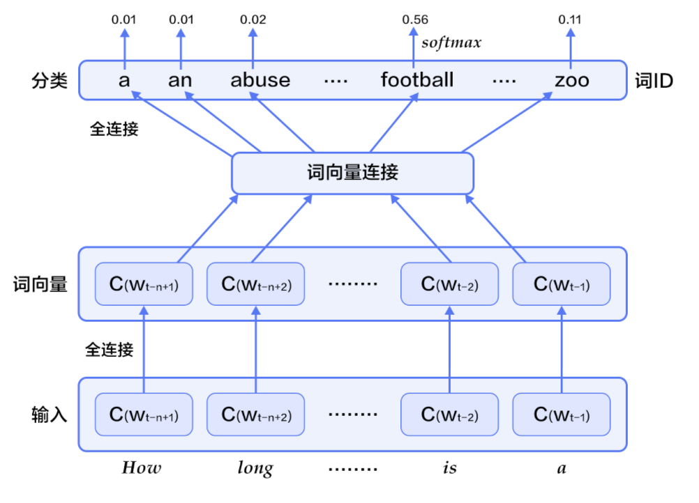
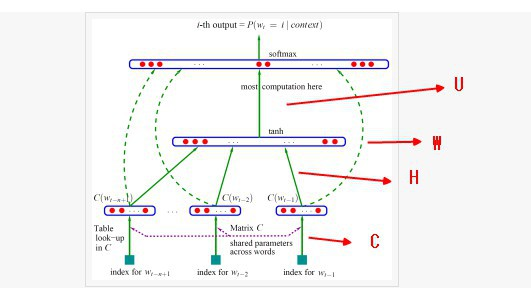

目录

<!-- TOC -->

- [1. 统计语言模型](#1-统计语言模型)
    - [N-gram模型](#n-gram模型)
    - [神经网络语言模型（NNLM）](#神经网络语言模型nnlm)
- [2. CBOW(Continuous Bag-of-Words)](#2-cbowcontinuous-bag-of-words)
- [3. Continuous skip-gram](#3-continuous-skip-gram)

<!-- /TOC -->

参考cdsn博客：[http://blog.csdn.net/zhaoxinfan/article/details/27352659](http://blog.csdn.net/zhaoxinfan/article/details/27352659)

参考paddlepaddle book: [https://github.com/PaddlePaddle/book/blob/develop/04.word2vec/README.cn.md](https://github.com/PaddlePaddle/book/blob/develop/04.word2vec/README.cn.md)

Word2vec的原理主要涉及到**统计语言模型**（包括N-gram模型和神经网络语言模型(nnlm)），**continuous bag-of-words**模型以及**continuous skip-gram**模型。

语言模型旨在为语句的联合概率函数`\(P(w_1,...,w_T)\)`建模。语言模型的目标是，希望模型对有意义的句子赋予大概率，对没意义的句子赋予小概率。 常用条件概率表示语言模型：

`\[
P(w_1, ..., w_T) = \prod_{t=1}^TP(w_t | w_1, ... , w_{t-1})
\]`

# 1. 统计语言模型
## N-gram模型

n-gram是一种重要的文本表示方法，表示一个文本中连续的n个项。基于具体的应用场景，每一项可以是一个字母、单词或者音节。一般用每个n-gram的历史n-1个词语组成的内容来预测第n个词。

## 神经网络语言模型（NNLM）

Yoshua Bengio等科学家就于2003年在著名论文 Neural Probabilistic Language Models中介绍如何学习一个神经元网络表示的词向量模型。神经概率语言模型（Neural Network Language Model，NNLM）通过**一个线性映射和一个非线性隐层连接，**同时学习了语言模型和词向量，即通过学习大量语料得到词语的向量表达，通过这些向量得到整个句子的概率。用这种方法学习语言模型可以**克服维度灾难（curse of dimensionality）,即训练和测试数据不同导致的模型不准。**

实际上越远的词语其实对该词的影响越小，那么如果考虑一个n-gram, 每个词都只受其前面n-1个词的影响，则有：

`\[
P(w_1, ..., w_T) = \prod_{t=n}^TP(w_t|w_{t-1}, w_{t-2}, ..., w_{t-n+1})
\]`

给定一些真实语料，这些语料中都是有意义的句子，N-gram模型的优化目标则是最大化目标函数:

`\[
\frac{1}{T}\sum_t f(w_t, w_{t-1}, ..., w_{t-n+1};\theta) + R(\theta)
\]`

其中，`\(f(w_t, w_{t-1}, ..., w_{t-n+1})\)`表示根据历史n-1个词得到当前词`\(w_t\)`的条件概率，`\(R(\theta)\)`表示参数正则项。

<html>
 

 
</html>

+ 对于每个样本，模型输入`\(w_{t-n+1},...w_{t-1}\)`，输出句子第t个词为字典中`\(|V|\)`个词的概率。每个输入词`\(w_{t-n+1},...w_{t-1}\)`通过矩阵`\(C\)`映射到词向量`\(C(w_{t-n+1}),...C(w_{t-1})\)`

+ 然后所有词语的词向量连接成一个大向量，并经过一个非线性映射得到历史词语的隐层表示：

`\[
g=Utanh(\theta^Tx + b_1) + Wx + b_2
\]`

其中，x为所有词语的词向量连接成的大向量，表示文本历史特征；`\(g\)`表示未经归一化的所有输出单词概率，`\(g_i\)`表示未经归一化的字典中第i个单词的输出概率。其他参数为词向量层到隐层连接的参数。

+ 根据softmax的定义，通过归一化`\(g_i\)`, 生成目标词`\(w_t\)`的概率为：

`\[
P(w_t | w_1, ..., w_{t-n+1}) = \frac{e^{g_{w_t}}}{\sum_i^{|V|} e^{g_i}}
\]`

+ 整个网络的损失值(cost)为多类分类交叉熵，用公式表示为：

`\[
J(\theta) = -\sum_{i=1}^N\sum_{c=1}^{|V|}y_k^{i}log(softmax(g_k^i))
\]`

其中`\(y_k^i\)`表示第i个样本第k类的真实标签(0或1)，`\(softmax(g_k^i)\)`表示第i个样本第k类softmax输出的概率。

# 2. CBOW(Continuous Bag-of-Words)

CBOW模型通过一个词的上下文（各N个词）预测当前词。当N=2时，模型如下图所示：

<html>
 

 

</html>

具体来说，不考虑上下文的词语输入顺序，CBOW是用上下文词语的词向量的均值来预测当前词。即：

`\[
context = \frac{x_{t-1} + x_{t-2} + x_{t+1} + x_{t+2}}{4}
\]`

其中`\(x_t\)`为第t个词的词向量，分类分数（score）向量 `\(z=U*context\)`，最终的分类y采用softmax，损失函数采用多类分类交叉熵。

# 3. Continuous skip-gram

CBOW的好处是对上下文词语的分布在词向量上进行了平滑，去掉了噪声，因此在小数据集上很有效。而Skip-gram的方法中，用一个词预测其上下文，得到了当前词上下文的很多样本，因此可用于更大的数据集。

<html>
 

 

</html>

如上图所示，Skip-gram模型的具体做法是，将一个词的词向量映射到2n个词的词向量（2n表示当前输入词的前后各n个词），然后分别通过softmax得到这2n个词的分类损失值之和。
