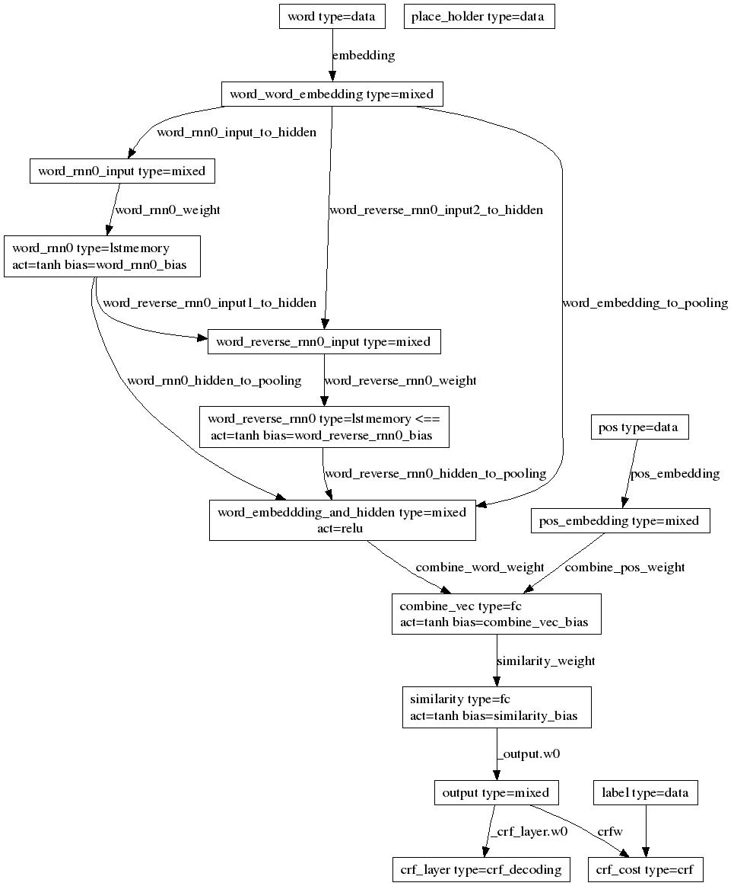

目录

<!-- TOC -->

- [老Paddle使用整理](#老paddle使用整理)
    - [1. 预处理](#1-预处理)
        - [1.1 预处理基本知识](#11-预处理基本知识)
        - [1.1.1 预处理的文本结构：](#111-预处理的文本结构)
            - [1.1.2 预处理的7个param](#112-预处理的7个param)
            - [1.1.3 proto格式](#113-proto格式)
                - [1.1.3.1 local预处理](#1131-local预处理)
                - [1.1.3.2 cluster预处理](#1132-cluster预处理)
            - [1.1.4 使用pyDataProvider格式](#114-使用pydataprovider格式)
    - [2. 训练](#2-训练)

<!-- /TOC -->

# 老Paddle使用整理

以**bi-lstm+crf**进行品牌词识别为例，对老paddle的使用进行总结。

## 1. 预处理

### 1.1 预处理基本知识

### 1.1.1 预处理的文本结构：

```
label;slotid0 fea1[:weight] fea2[:weight];slotid1 fea1[:weight] ...;
```

- fea:可以是离散值也可以是连续值
- slot数至少为1，也就是，至少有两个分号

<html>
<center>
<table border="2" cellspacing="0" cellpadding="6" rules="all" frame="border">

<thead>
<tr>
<th scope="col" class="left">说明</th>
<th scope="col" class="left">样本例子</th>
</tr>
</thead>

<tbody>
<tr>
<td class="left">连续特征，单slot，特征维数是5</td>
<td class="left">0;0 3.15 0 0 0 6.28;<br>
1;0 3.14 6.28 9.42; 非法，对于连续特征，每个slot必须包含的特征数应该跟维数一致。</td>
</tr>
<tr>
<td class="left">连续特征，2个slot，特征维数都是5</td>
<td class="left">0;0 0 1 2 3 4.5;1 3.14 0 0 0 0;<br>
1;1 3.14 6.28 0 0 0; 合法，slot0为空。</td>
</tr>
<tr>
<td class="left">离散特征，单slot，特征维数是1024</td>
<td class="left">0;0 1 2 3 5;<br>
1;0 1 32 64 512 1023;<br>
0;0 1023 1024; 非法，特征维数是1024，从0开始，所以最大的特征index只能是1023，特征越界。</td>
</tr>
<tr>
<td class="left">离散特征，3个slot，第1个slot有1024维特征，第2、3个slot有512维特征</td>
<td class="left">0;0 1 4 1023;1 4 7 3;2 2 6 511;<br>
1;2 1 5 88 511;</td>
</tr>
<tr>
<td class="left">离散带权特征，单slot，特征维数是1024</td>
<td class="left">0;0 1:3.14 2:6.28 0:0 4:12.56 1023:3.1415926;</td>
</tr>

</tbody>
</table></center>
</html>

#### 1.1.2 预处理的7个param

- param1：不需要修改，默认dnn_inst_
- param2：多少个slot，每个slot分别是什么类型
<html>
<center>
<table border="2" cellspacing="0" cellpadding="6" rules="all" frame="border">

<thead>
<tr>
<th scope="col" class="left">param2取值</th>
<th scope="col" class="left">含义</th>
</tr>
</thead>

<tbody>
<tr>
<td class="left">0</td>
<td class="left">连续值特征，fea为浮点数的情况</td>
</tr>
<tr>
<td class="left">1</td>
<td class="left">离散值特征，不带权，fea为整数的情况</td>
</tr>
<tr>
<td class="left">2</td>
<td class="left">离散值特征，带权，fea为整数，后面跟着冒号和浮点数weight的情况</td>
</tr>
<tr>
<td class="left">3</td>
<td class="left">id特征，仅包含一个整数，可作为样本的label或者id （从Paddle 1.0.0.7版本开始支持）</td>
</tr>

</tbody>
</table></center>
</html>
使用场景：
<html>
<center>
<table border="2" cellspacing="0" cellpadding="6" rules="all" frame="border">

<thead>
<tr>
<th scope="col" class="left">使用场景</th>
<th scope="col" class="left">用法</th>
</tr>
</thead>

<tbody>
<tr>
<td class="left">样本只有1个slot，该slot由离散型特征组成</td>
<td class="left">param2=1</td>
</tr>
<tr>
<td class="left">样本只有1个slot，该slot由连续型特征组合</td>
<td class="left">param2=0</td>
</tr>
<tr>
<td class="left">样本有3个slot，其中slot0包含连续特征，其余slot包含离散特征</td>
<td class="left">param2=“0 1 1” 【记得这里有双引号】</td>
</tr>
<tr>
<td class="left">样本有4个slot，其中slot0和slot2的特征是连续的，其他都是离散型特征</td>
<td class="left">param2=“0 1 0 1” 记得这里有双引号</td>
</tr>
<tr>
<td class="left">样本有若干个slot，所有slot的特征都是离散型特征</td>
<td class="left">param2=1</td>
</tr>

</tbody>
</table></center>
</html>

- param3：维数1 维数2 ... label数
例如：

<html>
<center>
<table border="2" cellspacing="0" cellpadding="6" rules="all" frame="border">

<thead>
<tr>
<th scope="col" class="left">param3</th>
<th scope="col" class="left">说明</th>
</tr>
</thead>

<tbody>
<tr>
<td class="left">"100 100 336 10"</td>
<td class="left">多slot样本，三个slot的维数分别为100,100和336，label为10，即十分类问题</td>
</tr>
<tr>
<td class="left">"536 2"</td>
<td class="left">单slot样本，第一个slot为536维特征，label为2，即二分类问题</td>
</tr>
</tbody>
</table></center>
</html>

- param4：是否对转换后二进制格式的数据压缩，默认不压缩(False)
- param5：label/哪个slot需要使用词典替换特征。例如：param5="--dict=0:dict11,2:dict2"  表示，label用dict1替换，slot0，slot1【写1,2，实际上是slot0,1】用dict2替换
- param6：如果文本格式中的slot_id是不是从0开始的整数，而是字符串等，需要设置该参数，设置样例：param6="--slotid=slotid0 slotid1 slotid2" 
- param7：如果忽略不在词典中的word，需要设置该参数为True，设置样例：param7="–ignore=True"


#### 1.1.3 proto格式
假定一条样本为中文句子**“百度 公司 创立于 2000年”**，样本的类别为“0”。假定“百度”在词表中的id为23，“公司”为35，“创立于”为10，“2000年”为87，词表大小为23984，共有3个类别。
首先我们将其转换成文本格式（label; slot_id word_id1 word_id2 word_id3 word_id4……）【注意，slotid没有实际意义，只是一个编号，表示有多少维特征，从0开始递增】:

>0;0 23 35 10 87;

而这里我们要需要进行序列标注，所以在wordid这一维特征之外，还要用到别的两个特征，总共如下：

- wordid：假设训练集使用jieba分词完有4870个词。
- 词性：pos，假设使用jieba进行词性标注，那么有110个类别。[ICTCLAS 汉语词性标注集](http://fhqllt.iteye.com/blog/947917)
- 占位符：全部写0【老paddle需要这个字段，新paddle不用】

比如，一个单词有8个汉字，那么，我们转化为：

>0;0 1383 2523 4396 1253 3967 4333 490 613;1 48 94 94 32 86 17 70 25;2 0 0 0 0 0 0 0 0;

接下来，使用txt2proto工具进行转换：

##### 1.1.3.1 local预处理

使用txt2proto这个bin，三个参数，第一个是输出文件，第二个是param2，第三个是param3
```shell
cat INPUT_FILE | txt2proto OUTPUT_FILE "1" "23984 3"
```

##### 1.1.3.2 cluster预处理

需要编写两个conf：

以train为例：

```shell
# Local dir.
LOCAL_HADOOP_HOME=xxxxx

# HDFS.
conf_hdfs=hdfs://xxxxxx
conf_ugi=xxxx,xxxx
conf_tracker=xxxx

# Data dir.
input_dir="xxx/brand_recognize/input/data_test"
output_dir="xxx/brand_recognize/preprocess/data_test_pb"
# Dictionary dir
dict_dir=
#If force_reuse_output_path is True ,paddle will remove outputdir without check outputdir exist
force_reuse_output_path=
# Job parameters.
JOBNAME="xxxx_gen_proto_test_brand_recognize"
MAPCAP=5000
REDCAP=5000
MAPNUM=1000
REDNUM=1000
```

#### 1.1.4 使用pyDataProvider格式


## 2. 训练
需要准备common.conf和trainer_config.conf

集群版的common.conf:
local版的common.conf：

[trainer.conf](http://daiwk.github.io/assets/bilstm_crf.conf):



```python

import math

################################### Data Configuration ###################################
word_dim = 4870
pos_dim = 110
label_dim = 4
TrainData(ProtoData(files = "train.list", type = "proto_sequence"))
TestData(ProtoData(files = "test.list", type = "proto_sequence"))

################################### Algorithm Configuration ###################################
Settings(
         algorithm='sgd',
         learning_rate_decay_a=0,
         learning_rate_decay_b=0,
         batch_size=12,
         learning_rate=0.01,
         learning_method='adagrad',
         #ada_epsilon=1.0,
         #num_batches_per_send_parameter=2,
         #num_batches_per_get_parameter=1,
        )
################################### Network Configuration ###################################
Inputs("word", "pos", "label", "place_holder")
embedding_size = 256
hidden_dim = 256
sentence_vec_dim = 256
output_dim = 256
pos_embedding_size = 20
num_rnn_layers = 1

lr_hid_col = 1
lr_output = 1
lr_keep = 0.1

Layer(name = "word", type = "data", size = word_dim)
Layer(name = "pos", type = "data", size = pos_dim)
Layer(name = "label", type = "data", size = label_dim)
Layer(name = "place_holder", type = "data", size = 1)

name = "word"
parameter_name = ["word"]
offset = 0

MixedLayer(
    name = name + "_word_embedding",
    size = embedding_size,
    bias = False,
    inputs = TableProjection(
        name, 
        initial_std = 1 / math.sqrt(embedding_size),
        learning_rate = lr_keep,
        parameter_name = "embedding",
        #sparse_remote_update=True
        )
)

for j in range(num_rnn_layers):
    input_name = (name + "_reverse_rnn%d" % (j-1)) if j > 0 else name + "_word_embedding"
    MixedLayer(
        name = name + "_rnn%d_input" % j,
        size = hidden_dim, 
        bias = False,
        inputs = FullMatrixProjection(input_name,
                initial_std = 1 / math.sqrt(hidden_dim), 
                parameter_name="%s_rnn%d_input_to_hidden" % (parameter_name[offset], j),
                learning_rate =lr_hid_col)
    )
    Layer(
        name = name + "_rnn%d" % j,
        type = "lstmemory",
        active_type = "tanh",
        active_state_type = "tanh",
        active_gate_type = "sigmoid",
        bias = Bias(initial_std=0, parameter_name = '%s_rnn%d_bias' % (parameter_name[offset], j), learning_rate = lr_hid_col if j > 0 else lr_keep),
        inputs = Input(name + "_rnn%d_input" % j, 
            initial_std = 1/math.sqrt(hidden_dim),
            parameter_name="%s_rnn%d_weight" % (parameter_name[offset], j),
            learning_rate = lr_hid_col)
    )
    MixedLayer(
        name = name + "_reverse_rnn%d_input" % j,
        size = hidden_dim, 
        bias = False,
        inputs = [FullMatrixProjection(name + "_rnn%d" % j,
                initial_std = 1 / math.sqrt(hidden_dim), 
                parameter_name = "%s_reverse_rnn%d_input1_to_hidden" % (parameter_name[offset], j),
                learning_rate =lr_hid_col), 
            FullMatrixProjection(input_name, 
                initial_std = 1 / math.sqrt(hidden_dim),
                parameter_name = '%s_reverse_rnn%d_input2_to_hidden' % (parameter_name[offset], j),
                learning_rate = lr_hid_col)]
    )
    Layer(
        name = name + "_reverse_rnn%d" % j,
        type = "lstmemory",
        active_type = "tanh",
        active_state_type = "tanh",
        active_gate_type = "sigmoid",
        reversed = True,
        bias = Bias(initial_std=0, parameter_name = '%s_reverse_rnn%d_bias' % (parameter_name[offset], j), learning_rate = lr_hid_col),
        inputs = Input(name + "_reverse_rnn%d_input" % j, 
            initial_std = 1/math.sqrt(hidden_dim),
            parameter_name="%s_reverse_rnn%d_weight" % (parameter_name[offset], j),
            learning_rate = lr_hid_col)
    )

MixedLayer(
    name = name + "_embeddding_and_hidden",
    size = sentence_vec_dim,
    active_type = "relu",
    bias = False,
    inputs = [FullMatrixProjection(name + "_rnn%d" % j,
            initial_std = 0.000001 / math.sqrt(output_dim),
            parameter_name="%s_rnn%d_hidden_to_pooling" % (parameter_name[offset], j),
            learning_rate = lr_hid_col) for j in range(num_rnn_layers)] +
        [FullMatrixProjection(name + "_reverse_rnn%d" % j,
            initial_std = 0.000001 / math.sqrt(output_dim),
            parameter_name="%s_reverse_rnn%d_hidden_to_pooling" % (parameter_name[offset], j),
            learning_rate = lr_hid_col) for j in range(num_rnn_layers)] +
        [FullMatrixProjection(name + "_word_embedding",
            initial_std = 0.000001 / math.sqrt(output_dim),
            parameter_name = "%s_embedding_to_pooling" % (parameter_name[offset]),
            learning_rate = lr_hid_col)]
)

MixedLayer(
    name = "pos_embedding",
    size = pos_embedding_size,
    bias = False,
    inputs = TableProjection(
        "pos", 
        initial_std = 1 / math.sqrt(pos_embedding_size),
        learning_rate = lr_output,
        parameter_name = "pos_embedding",
        #sparse_remote_update=True
        )
)

FCLayer(
    name = "combine_vec",
    size = output_dim,
    active_type = "tanh",
    bias = Bias(initial_std = 0, parameter_name = 'combine_vec_bias', learning_rate = lr_output),
    inputs = [Input(
        name + "_embeddding_and_hidden",
        learning_rate = lr_output, 
        initial_std = 1 / math.sqrt(sentence_vec_dim),
        parameter_name = 'combine_%s_weight' % name,
        )] + 
        [Input(
        "pos_embedding",
        learning_rate = lr_output,
        initial_std = 1 / math.sqrt(pos_embedding_size),
        parameter_name = 'combine_pos_weight'
        )]
)


FCLayer(
    name = "similarity",
    size = output_dim,
    active_type = "tanh",
    bias = Bias(initial_std = 0, parameter_name = 'similarity_bias', learning_rate = lr_output),
    inputs = [FullMatrixProjection(
        "combine_vec",
        learning_rate = lr_output, 
        initial_std = 1 / math.sqrt(output_dim),
        parameter_name = 'similarity_weight'
        )]
)

MixedLayer(
    name = "output",
    size = label_dim,
    #active_type = "softmax",
    #active_type = "sigmoid",
    #bias = Bias(initial_std = 0, parameter_name = 'output_bias', learning_rate = lr_output),
    bias = False,
    inputs = [FullMatrixProjection(
        "similarity",
        #learning_rate = lr_output, 
        initial_std = 1 / math.sqrt(output_dim),
        #parameter_name = 'output_weight'
        )]
)

CRFLayer(
    name = "crf_cost",
    size = label_dim,
    inputs = [
    Input("output", parameter_name="crfw"),
    Input("label")
    ]
)

Layer(
    name = "crf_layer",
    size = label_dim,
    type = 'crf_decoding',
    #bias = Bias(initial_std = 0, parameter_name = 'crf_bias', learning_rate = lr_output),
    inputs = [
        Input("output"),
        #Input("label")
    ]
)

Evaluator(
    name = "error",
    type = "sum",
    inputs = "crf_layer",
)

#Evaluator(
#    name = "chunk_f1",
#    type = "chunk",
#    inputs = ["crf_layer", "label"],
#    #chunk_scheme = "plain",
#    chunk_scheme = "IOB",
#    #num_chunk_types = 3,
#    num_chunk_types = 2,
#)

Outputs("crf_cost")
```

老paddle支持的所有layer：
[http://wiki.baidu.com/pages/viewpage.action?pageId=42366874](http://wiki.baidu.com/pages/viewpage.action?pageId=42366874)

***注意：**运行submit的时候，会自己产出train.list和test.list，并且会生成tester_config.conf*

使用的是ecom的线下集群，

查看所有任务：[http://xxxx/job/](http://xxxx/job/)

查看当前任务（jobid=287811.xxx）运行：
[http://xxxx/job/i-287811/](http://xxxx/job/i-287811/)

干掉这个job：
qdel 287811.xxxx


预测：
predict这个bin的用法：
I1020 12:35:10.277036 25364 Main.cpp:44] Model path or feature type or both missing. Please read the usage below:
I1020 12:35:10.277549 25364 Main.cpp:46] ./predict model_path feature_type(s) [logLevel] [isSequence]
I1020 12:35:10.277555 25364 Main.cpp:47] @model_path: path where the model stored. the directory indicated by model_path should contain 1 binary network configuration file and 1 sub directory naming 'model' that contains the model itself.
I1020 12:35:10.277562 25364 Main.cpp:52] @feature_type: [0|1|2] integer(s) to indicate the type of features in each instance.
I1020 12:35:10.277567 25364 Main.cpp:54] 0 -> continues values. floating points.
I1020 12:35:10.277572 25364 Main.cpp:55] 1 -> discrete values without weights. integers.
I1020 12:35:10.277577 25364 Main.cpp:56] 2 -> discrete values with weights. integers:float.
I1020 12:35:10.277581 25364 Main.cpp:57] @logLevel: from 0 to 4(default), 0 for print debug info (which will lead to core dump on failure), 4 for suppress debug info.
I1020 12:35:10.277586 25364 Main.cpp:60] isSequence is used for SparseNonValuePredictor or MultipleTypesPredictor.
I1020 12:35:10.277591 25364 Main.cpp:61] If isSequence=1, sparse_non_value slots (and only those slots) will be treated as SEQUENCE.
I1020 12:35:10.277596 25364 Main.cpp:62] example: 
I1020 12:35:10.277601 25364 Main.cpp:63] ./predict ./myModel 0
I1020 12:35:10.277604 25364 Main.cpp:64] ./predict ./myModel "0 0 1 2"  <- instance with 4 slots, each slot contain different type of features.


[INFO][PredictorInternal.cpp][readBinaryConf][40] content length of binary conf is [3923].
[INFO][PredictorInternal.cpp][readBinaryConf][72] read binary conf file done.
[INFO][PredictorInternal.cpp][init][420] output[0]: dim=[4], name=[crf_layer].
[INFO][PredictorInternal.cpp][init][429] input[0]: dim=[4870], name=[word].
[INFO][PredictorInternal.cpp][init][429] input[1]: dim=[110], name=[pos].
[INFO][PredictorInternal.cpp][init][429] input[2]: dim=[1], name=[place_holder].