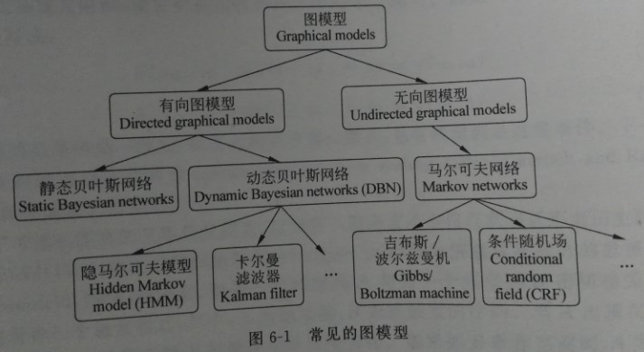
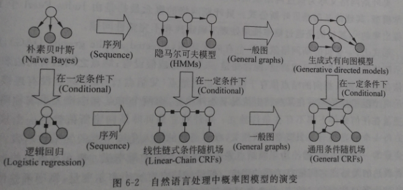
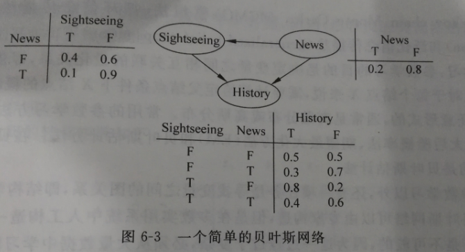
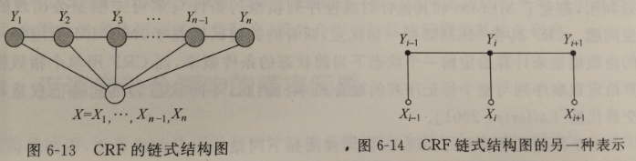

目录

<!-- TOC -->

- [**1. 概率图模型**](#1-概率图模型)
- [**2. 贝叶斯网络**](#2-贝叶斯网络)
- [**3. 马尔可夫模型**](#3-马尔可夫模型)
- [**4. 隐马尔可夫模型**](#4-隐马尔可夫模型)
- [**5. 层次化的隐马尔可夫模型**](#5-层次化的隐马尔可夫模型)
- [**6. 马尔可夫网络**](#6-马尔可夫网络)
- [**7. 最大熵模型**](#7-最大熵模型)
- [**8. 最大熵隐马尔可夫模型**](#8-最大熵隐马尔可夫模型)
- [**9. CRF**](#9-crf)
- [**友情链接**](#友情链接)

<!-- /TOC -->

《统计自然语言处理（第2版）》p104-128,《机器学习》p319-340

# **1. 概率图模型**

概率图模型(probalistic graphical models)在**概率模型**的基础上，使用了**基于图的方法**来表示概率分布（或者概率密度、密度函数），是一种通用化的不确定性知识表示和处理方法。概率图模型的表达中，**结点表示变量**，**结点之间的边表示相应变量之间的对应关系**。

例如，假设S为一个汉语句子，X是句子S切分出来的词序列，那么，分词的过程可以看作是推断使`\(P(X|S)\)`最大的词序列X的分布。而词性标注中，可以看作在给定序列X的情况下，寻找一组最可能的词性标签分布T，使得`\(P(T|X)\)`最大。

根据图模型的边是否有向，可以分为有向概率图模型和无向概率图模型：

 

而概率图模型在nlp中的演变过程如下所示：

# **2. 贝叶斯网络**

贝叶斯网络又称**信度网络或信念网络**（belief networks），基础理论是贝叶斯公式，目的是通过**概率推理** 处理**不确定性和不完整性问题**。

一个贝叶斯网络就是一个**有向无环图**（directed acyclic graph, DAG），**结点表示随机变量** （可观测量/隐含变量/未知参量或假设等），**有向边表示条件依存关系**（箭头指向的结点依存于发出箭头的结点【父节点】）。两个结点没有连线表示两个随机变量在某些特定情况下**条件独立**，如果有连线，则任何条件下都不可能条件独立。

每一个结点都和一个概率函数相关，概率函数的输入是该结点的父结点所表示的随机变量的一组特定值，输出为当前结点表示的随机变量的概率值。概率值的大小表示结点之间已存关系的强度。

对于一篇写了某个岛屿的文章而言，是否是一篇新闻记为事件N，是否记录了历史记为事件H，是否记录了旅游风光记为事件S。

**

则三个事件的联合概率函数为：

`\[
P(H,S,N)=P(H|S,N)P(S|N)P(N)
\]`

下面我们来算一个概率：一篇关于某岛屿的文章是记录了历史，那么，它是一篇新闻的概率有多大？

`\[
P(N=T|H=T)=\frac{P(H=T,N=T))}{P(H=T))}\\
=\frac {\sum _{S\in \{T,F\}}P(H=T,S,N=T)} {\sum _{N,S\in \{T,F\}}P(H=T,S,N)}\\
=\frac{(0.4\times 0.1\times 0.2=0.008)_{TTT}+(0.3\times 0.9\times 0.2=0.054)_{TFT}}{0.008_{TTT}+0.054_{TFT}+0.256_{TTF}+0.24_{TFF}}\\
=11.11\%
\]`

构造贝叶斯网络主要有**表示、推断和学习**三大问题：

+ **表示：**在某一随机变量的集合`\(x=\{X_1,L,X_n\}\)`上给出其**联合概率分布**`\(P\)`。贝叶斯网络表示中的主要问题是：即使在随机变量**仅有2种取值**的简单情况下，**一个联合概率分布也需要对`\(x_1,L,x_n\)`的所有`\(2^n\)`种不同取值下的概率进行说明**，计算代价、需要学习的参数数量都非常大，几步不可完成。
+ **推断：**由于贝叶斯网络是变量及其关系的完整模型，所以可以回答关于变量的询问（如当观察到某些变量（证据变量）时，推断另一些变量子集的变化）。在已知某些证据的情况下**计算变量的后验分布**的过程称为**概率推理**。常用的**精确推理方法**包括**变量消除法**（variable elimination）和**团树法** （clique【完全联通子图】 tree）。变量消除法的基本任务是计算条件概率`\(p(X_Q|X_E=x)\)`，其中，`\(X_Q\)`是询问变量的集合，`\(X_E\)`是已知证据的变量集合。基本思想是通过分步计算不同变量的边缘分布，按顺序逐个消除未观察到的非询问变量。团树法使用更全局化的数据结构调度各种操作，以获得更加有益的计算代价。常用的**近似推理算法**有重要性抽样法（importance sampling）、随机马尔可夫链蒙特卡罗模拟法（Markov chain Monte Carlo,MCMC）、循环信念传播法（loopy belief propagation）和泛化信念传播法（generalized belief propagation）等。
+ **学习：**包括**参数学习**和**结构学习**两部分。参数学习目的是决定变量之间相互关联的量化关系，即依存强度估计。对每个结点而言，需要计算**给定父结点条件下该结点的条件概率**。通常的参数学习方法包括**最大似然估计法、最大后验概率法、期望最大化法（EM）和贝叶斯估计方法**。贝叶斯图模型中用的比较多的是贝叶斯估计方法。结构学习指的是，寻找变量之间的图关系。简单情况下可以由专家来构造一个图，但多数实用系统中，需要从大量数据里学习网络结构和局部分布的参数。

# **3. 马尔可夫模型**

# **4. 隐马尔可夫模型**

# **5. 层次化的隐马尔可夫模型**

# **6. 马尔可夫网络**

类似贝叶斯网络，但主要有以下两个区别：一是可以表示贝叶斯网络无法表示的一些依赖关系（如循环依赖）；另一方面，不能表示贝叶斯网络能表达的某些关系（如推导关系）。

马尔可夫网络：一组有马尔可夫性质的随机变量的联合概率分布模型，由无向图`\(G\)`和定义在`\(G\)`上的势函数组成。一个无向图`\(G=(V,E)\)`，每个顶点`\(x_i \in V\)`表示在集合`\(X\)`上的一个随机变量，每条边`\(\{x_i,x_j\}\in E(i\neq j)\)`表示直接相连的两个随机变量`\(x_i\)`和`\(x_j\)`之间的一种依赖关系。

如果图的一个子图（点和边都是原图的子集）的**任意两个结点之间都有边相连**，那么这个子图就是一个完全子图（complete subgraph），又称**团（clique）。**一个团的完全子团称为子团。如果`\(C\)`是无向图`\(G\)`的一个子团，且不能再加进任何一个`\(G\)`的结点使其成为一个更大的团，则称`\(C\)`为**最大团**。无向图中，不使用条件概率密度进行参数化，而使用称为团势能（clique potential）作为参数化因子。**每个团都对应着一个势函数（非负实函数），表示团的一个状态。**一般，用`\(\mathbf{x}_C\)`表示团`\(C\)`中的所有结点，用`\(\phi (\mathbf{x}_C)\)`表示团势能。由于要求势能函数`\(\phi (\mathbf{x}_C)\)`**非负**，所以，一般将`\(\phi (\mathbf{x}_C)\)`定义为：`\(\phi (\mathbf{x}_C)=exp\{-E(\mathbf{x}_C)\}\)`，其中`\(E(\mathbf{x}_C)\)`称为`\(\mathbf{x}_C\)`的能量函数。

如果分布`\(p_{\phi }(x_1,x_2,...,x_n)\)`的图模型可以表示为一个马尔可夫网络`\(H\)`，当`\(C\)`是`\(H\)`上完全子图的集合【《统计学习方法》p193以及《机器学习》p323说，`\(C\)`应该是**最大团**】时，我们说`\(H\)`上的分布`\(p_{\phi }(x_1,x_2,...,x_n)\)`可以用`\(C\)`的团势能函数`\(\phi (\mathbf{x}_C)\)`进行因子化：`\(\phi =\{\phi_1(\textbf{x}_{C_{1}}),...,\phi_K(\textbf{x}_{C_{K}})\}\)`。`\(p_{\phi }(x_1,x_2,...,x_n)\)`可以看作`\(H\)`上的一个吉布斯分布（Gibbs distribution），其概率分布密度为：

`\[
p(x_1,x_2,...,x_n)=\frac{1}{Z}\prod _{i=1}^K\phi _i(\textbf{x}_{C_i})
\]`

其中，`\(Z\)`是一个归一化常量，称为划分函数（partition function）。

`\[
Z=\sum _{x_1,...,x_n}\prod _{i=1}^K\phi _i(\textbf{x}_{C_i})
\]`

其中，`\(\textbf{x}_{C_i}\subseteq \{x_1,x_2,...,x_n\}(1\leqslant i\leqslant K)\)`，并且满足`\(\bigcup_{i=1}^{K}\textbf{x}_{C_i}=\{x_1,x_2,...,x_n\}\)`（意思是，不需要所有的团，只需要能覆盖所有结点的子团就行了，所以呢，也经常直接用最大团来代替`\(C_i\)`）。【另外，个人对`\(Z\)`的理解，可以理解为遍历每个结点，把包含他的子团乘起来，最后累加，不知对不对……】显然，在无向图模型中每个`\(C_i\)`对应于一个团，而相应的吉布斯分布就是整个图模型的概率分布。因子化的乘积运算可以变成加法运算：

`\[
p(x_1,x_2,...,x_n)=\frac{1}{Z}exp\{-\sum _{i=1}^KE_{C_i}(x_{C_i})\}=\frac{1}{Z}exp\{-E(\textbf{x})\}
\]`

其中，`\(E(\textbf{x})=\sum_{i=1}^{K}E_{C_i}(x_{C_i})\)`。

# **7. 最大熵模型**

最大熵模型的基本原理是：在只掌握关于未知分布的部分信息的情况下，符合已知知识的概率分布可能有多个，但使熵值最大的概率分布最真实地反映了事件的分布情况，因为**熵定义了随机变量的不确定性，当熵最大时，随机变量最不确定，最难准确地预测其行为，**也就是说，在已知部分信息的前提下，关于未知分布最合理的推断应该是符合已知信息的最不确定或最大随机的推断。

对于自然语言处理中某个歧义消解问题，用`\(A\)`表示待消歧问题所有可能候选结果的集合，`\(B\)`表示当前歧义点所在上下文信息构成的集合，则称`\((a,b)\)`为模型的一个特征。一般定义`\(\{0,1\}\)`域上的一个二值函数来表示特征：

`\[
f(a,b) =
\begin{cases}
1, 如果(a,b)\in(A,B)，且满足某种条件 \\
0, else \\
\end{cases}
\]`

在不引起混淆的情况下，有时也直接把特征函数`\(f(a,b)\)`称作特征。将“判定歧义问题为某种可能的结果`\(a\in A\)`”看作一个事件，该歧义点所在的上下文出现的某些信息看作这个事件发生的条件`\(b\in B\)`，那么，建立最大熵模型的目的就是计算判定结果`\(a\)`的条件概率`\(p(a|b)\)`，即利用条件最大熵模型选择条件概率`\(p(a|b)\)`最大的候选结果作为最终的判定结果：

`\[
\hat{p}(a|b)=\underset{p\in P}{argmax}H(p)
\]`

其中，`\(P\)`是指所建模型中所有与已知样本的概率分布相吻合的概率分布的集合。

# **8. 最大熵隐马尔可夫模型**

# **9. CRF**

CRF(Conditional Random Field)条件随机场是用于标注和划分**序列结构数据**的**概率化**结构模型。

对于给定的输出标识序列Y和观测序列X，CRF通过定义**条件概率`\(P(Y|X)\)`**而非联合概率`\(P(X,Y)\)`来描述模型。也可以将CRF看作一个**无向图模型**或者，马尔可夫随机场（Markov Random Field）。

定义：设`\(G=(V,E)\)`为一个无向图，`\(V\)`为结点集合，`\(E\)`为无向边的集合。`\(Y=\{Y_v|v\in V\}\)`，即`\(V\)`中的 每一个结点对应于一个随机变量`\(Y_v\)`，其取值范围为可能的标记集合`\(\{y\}\)`。如果以观察序列`\(X\)`为条件，每一个随机变量`\(Y_v\)`都满足以下马尔可夫特性 \eqref{eq:9.1}：

`\[
p(Y_v|X,Y_w,w\neq v)=P(Y_v|X,Y_w,w\sim v)
\tag{Eq-9.1}
\label{eq:9.1}
\]`

其中`\(，w\sim v\)`表示两个结点在图`\(G\)`中是邻近结点。那么`\((X,Y)\)`为一个随机场。

理论上，只要在标记序列中描述了一定的条件独立性，`\(G\)`的图结构可以是任意的。对序列进行建模可以形成最简单、最普通的链式结构（chain-structured）图，结点对应标记序列`\(Y\)`中的元素：

显然，观察序列`\(X\)`的元素之间并不存在图结构，因为这里只是将观察序列`\(X\)`作为条件，并不对其做任何独立性假设。

在给定观察序列`\(X\)`时，某个特定标记序列`\(Y\)`的概率可以定义为 \eqref{eq:9.2}：
`\[
exp(\sum _j \lambda _jt_j(y_{i-1},y_i,X,i)+\sum _k \mu _ks_k(y_i,X,i))
\tag{Eq-9.2}
\label{eq:9.2}
\]`

其中，`\(t_j(y_{i-1},y_i,X,i)\)`是**转移函数**，表示对于观察序列`\(X\)`及其标注序列`\(i\)`及`\(i-1\)`位置上标记的转移概率。

`\(s_k(y_i,X,i)\)`是**状态函数**，表示对于观察序列`\(X\)`其`\(i\)`位置的标记概率。

`\(\lambda _j\)`和`\(\mu _k\)`分别是`\(t_j\)`和`\(s_k\)`的权重，需要从训练样本中预估出来（模型参数）。

参照最大熵模型的做法，在定义特征函数时可以定义一组关于观察序列的`\(\{0,1\}\)`二值特征`\(b(X,i)\)`来标识训练样本中某些分布特性，例如

`\[
b(X,i) = 
\begin{cases}
1, X的i位置为某个特定的词 \\
0, else \\
\end{cases}
\]`

转移函数可以定义为如下形式：

`\[
t_j(y_{i-1},y_i,X,i) = 
\begin{cases}
b(X,i), y_{i-1}和y_i满足某种搭配条件 \\
0, else \\
\end{cases}
\]`

为了便于描述，可以将状态函数写成如下形式：
`\[
s(y_i,X,i)=s(y_{i-1},y_i,X,i)
\]`

这样，特征函数可以统一表示为 \eqref{eq:9.3}：
`\[
F_j(Y,X)=\sum _{i=1}^{n}f_j(y_{i-1},y_i,X,i)
\tag{Eq-9.3}
\label{eq:9.3}
\]`

其中，每个局部特征函数`\(f_j(y_{i-1},y_i,X,i)\)`表示状态特征`\(s(y_{i-1},y_i,X,i)\)`或转移函数`\(t_j(y_{i-1},y_i,X,i)\)`。

由此，条件随机场定义的条件概率如下\eqref{eq:9.4}：
`\[
p(Y|X,\lambda )=\frac{1}{Z(X)}exp(\lambda _j\cdot F_j(Y,X))
\tag{Eq-9.4}
\label{eq:9.4}
\]`

其中，分母`\(Z(X)\)`为归一化因子\eqref{eq:9.5}：
`\[
Z(X)=\sum _Yexp(\lambda _j \cdot F_j(Y,X))
\tag{Eq-9.5}
\label{eq:9.5}
\]`

条件随机场模型也需要解决3个问题：**特征的选取、参数训练和解码**。训练过程可以在训练数据集上基于**对数似然函数的最大化**进行。

相对于HMM,CRF的主要优点在于他的**条件随机性**，只需要考虑当前已经出现的观测状态，**没有独立性的严格要求** ，对于整个序列内部的信息和外部观测信息均可有效利用，**避免了**MEMM（最大熵隐马尔可夫模型）和其他针对线性序列模型的条件马尔可夫模型会出现的**标识偏置问题**。(the transitions leaving a given
state compete only against each other, rather than against
all other transitions in the model.In the extreme
case, a state with a single outgoing transition effectively
ignores the observation. In those cases, unlike in HMMs,
Viterbi decoding cannot downgrade a branch based on observations
after the branch point, and models with statetransition
structures that have sparsely connected chains of
states are not properly handled.)

CRF具有MEMM的一切优点，亮着的关键区别在于，MEMM使用每一个状态的指数模型来计算给定前一个状态下当前状态的条件概率，而CRF用**单个指数模型来计算给定观察序列和整个标记序列的联合概率**。因此，不同状态的不同特征权重可以相互交换代替。(The critical difference between CRFs and
MEMMs is that a MEMM uses per-state exponential models
for the conditional probabilities of next states given the
current state, while a CRF has a single exponential model
for the joint probability of the entire sequence of labels
given the observation sequence.)

(We can also think of a CRF as a finite state model with unnormalized
transition probabilities. However, unlike some
other weighted finite-state approaches (LeCun et al., 1998),
CRFs assign a well-defined probability distribution over
possible labelings, trained by maximum likelihood or MAP
estimation. Furthermore, the loss function is convex,2 guaranteeing
convergence to the global optimum.)

<html>

<table border="2" cellspacing="0" cellpadding="6" rules="all" frame="border">

<thead>
<tr>
<th scope="col" class="left">算法</th>
<th scope="col" class="left">优缺点</th>
</tr>
</thead>

<tbody>
<tr>
<td class="left">隐马尔可夫模型(HMM)</td>
<td class="left">最大的缺点就是由于其输出独立性假设，导致其不能考虑上下文的特征，限制了特征的选择</td>
</tr>
<tr>
<td class="left">最大熵隐马尔可夫模型(MEMM)</td>
<td class="left">解决了隐马的问题，可以任意选择特征，但由于其在每一节点都要进行归一化，所以只能找到局部的最优值，同时也带来了标记偏见的问题，即凡是训练语料中未出现的情况全都忽略掉</td>
</tr>
<tr>
<td class="left">条件随机场（CRF）</td>
<td class="left">很好的解决了这一问题，他并不在每一个节点进行归一化，而是所有特征进行全局归一化，因此可以求得全局的最优值。</td>
</tr>
</tbody>
</table>

</html>

crf经典资料：

+ 开山之作：[Conditional random fields: Probabilistic models for segmenting and labeling sequence data(Lafferty,2001)](../assets/Conditional random fields Probabilistic models for segmenting and labeling sequence data.pdf)

工具：**CRF++(c++)/CRFSuite(c)/MALLET(java)/nltk(python)**

# **友情链接**

+ [Graphical Models in a Nutshell](https://ai.stanford.edu/~koller/Papers/Koller+al:SRL07.pdf)
+ 图模型教科书：《Probabilistic Graphical Models: Principles and Techniques》
+ Prasoon Goyal的博客
    + part1:
        + [https://blog.statsbot.co/probabilistic-graphical-models-tutorial-and-solutions-e4f1d72af189](https://blog.statsbot.co/probabilistic-graphical-models-tutorial-and-solutions-e4f1d72af189) 
        + [想了解概率图模型？你要先理解图论的基本定义与形式](https://mp.weixin.qq.com/s?__biz=MzA3MzI4MjgzMw==&mid=2650725041&idx=1&sn=0c57ba70e2613e6af80c4ab61c996d44&chksm=871b1ecfb06c97d9547e50705d3e74a2b8c41254f0efc2dd88d2e89eec3bfac5da089f28c398&scene=21#wechat_redirect)
    + part2:
        + [https://blog.statsbot.co/probabilistic-graphical-models-tutorial-d855ba0107d1](https://blog.statsbot.co/probabilistic-graphical-models-tutorial-d855ba0107d1) 
        + [读懂概率图模型：你需要从基本概念和参数估计开始](https://mp.weixin.qq.com/s/S-6Mb6zNzVPpxR8DbWdT-A)

