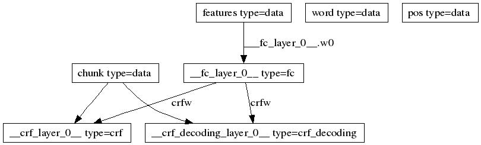
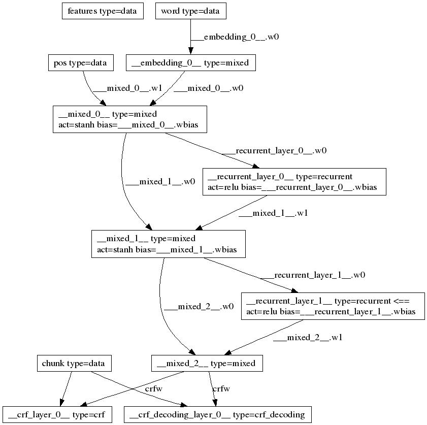

目录

<!-- TOC -->

- [**1. 【2015】Bidirectional LSTM-CRF Models for Sequence Tagging**](#1-2015bidirectional-lstm-crf-models-for-sequence-tagging)
- [**2. 【2016】Conditional Random Fields as Recurrent Neural Networks**](#2-2016conditional-random-fields-as-recurrent-neural-networks)
- [**3. 【2016,ACL】Deep Recurrent Models with Fast-Forward Connections for Neural Machine Translation**](#3-2016acldeep-recurrent-models-with-fast-forward-connections-for-neural-machine-translation)
- [**4. 在paddlepaddle上实现**](#4-在paddlepaddle上实现)
    - [4.1 数据集说明](#41-数据集说明)
    - [4.2 dataprovider](#42-dataprovider)
        - [4.2.1 initializer的流程：](#421-initializer的流程)
        - [4.2.1 process的流程：](#421-process的流程)
    - [4.3 linear_crf](#43-linear_crf)
    - [4.4 rnn_crf](#44-rnn_crf)

<!-- /TOC -->


# **1. 【2015】Bidirectional LSTM-CRF Models for Sequence Tagging**

[论文地址](../assets/Bidirectional LSTM-CRF Models for Sequence Tagging.pdf)

# **2. 【2016】Conditional Random Fields as Recurrent Neural Networks**

[论文地址](../assets/Conditional Random Fields as Recurrent Neural Networks.pdf)

# **3. 【2016,ACL】Deep Recurrent Models with Fast-Forward Connections for Neural Machine Translation**
[论文地址](../assets/Deep Recurrent Models with Fast-Forward Connections for Neural Machine Translation.pdf)

# **4. 在paddlepaddle上实现**

掉渣天的徐老师已经在开源版本的paddlepaddle实现了[rnn+crf](https://github.com/baidu/Paddle/tree/develop/demo/sequence_tagging)，我们直接拿来学习学习就好啦！！！【此demo只在github版本有，且paddle的其他源都已经不维护了，诸君请自重~】


## 4.1 数据集说明

先看一下数据集的说明：
[http://www.clips.uantwerpen.be/conll2000/chunking/](http://www.clips.uantwerpen.be/conll2000/chunking/)

```shell
#[NP He ] [VP reckons ] [NP the current account deficit ] [VP will narrow ] [PP to ] [NP only # 1.8 billion ] [PP in ] [NP September ] .
#
#He        PRP  B-NP
#reckons   VBZ  B-VP
#the       DT   B-NP
#current   JJ   I-NP
#account   NN   I-NP
#deficit   NN   I-NP
#will      MD   B-VP
#narrow    VB   I-VP
#to        TO   B-PP
#only      RB   B-NP
##         #    I-NP
#1.8       CD   I-NP
#billion   CD   I-NP
#in        IN   B-PP
#September NNP  B-NP
#.         .    O
#
#The O chunk tag is used for tokens which are not part of any chunk
#
#
```

首先，需要将文件组织成三列，第一列是单词（中文的单字），第二列是tag_pos（part-of-speech tag as derived by the Brill tagger），第三列是标签tag（B-x表示开始，I-x表示中间）。比如，我们写好了test.txt，那么我们运行**gzip test.txt**，这样，就生成了test.txt.gz（解压的时候gzip -dc test.txt.gz > test.txt，就会生成test.txt[**如果不用-c参数，会默认删掉test.txt.gz**]）。

<html>
<center>
<table border="2" cellspacing="0" cellpadding="6" rules="all" frame="border">

<thead>
<tr>
<th scope="col" class="left">文件</th>
<th scope="col" class="left">行数</th>
<th scope="col" class="left">序列个数</th>
</tr>
</thead>

<tbody>
<tr>
<td class="left">train.txt</td>
<td class="left">220663</td>
<td class="left">8936</td>
</tr>
<tr>
<td class="left">test.txt</td>
<td class="left">49389</td>
<td class="left">2012</td>
</tr>

</tbody>
</table></center>
</html>
<br>


## 4.2 dataprovider

然后我们来仔细看一下dataprovider：

```python

# Feature combination patterns.(crf要用到的特征？)
# [[-1,0], [0,0]]  means previous token at column 0 and current token at 
# column 0 are combined as one feature.
patterns = [
    [[-2,0]],
    [[-1,0]],
    [[0,0]],
    [[1,0]],
    [[2,0]],

    [[-1,0], [0,0]], 
    [[0,0], [1,0]], 

    [[-2,1]],
    [[-1,1]],
    [[0,1]],
    [[1,1]],
    [[2,1]],
    [[-2,1], [-1,1]],
    [[-1,1], [0,1]],
    [[0,1], [1,1]],
    [[1,1], [2,1]],

    [[-2,1], [-1,1], [0,1]],
    [[-1,1], [0,1], [1,1]],
    [[0,1], [1,1], [2,1]],
]

dict_label = {
 'B-ADJP': 0,
 'I-ADJP': 1,
 'B-ADVP': 2,
 'I-ADVP': 3,
 'B-CONJP': 4,
 'I-CONJP': 5,
 'B-INTJ': 6,
 'I-INTJ': 7,
 'B-LST': 8,
 'I-LST': 9,
 'B-NP': 10,
 'I-NP': 11,
 'B-PP': 12,
 'I-PP': 13,
 'B-PRT': 14,
 'I-PRT': 15,
 'B-SBAR': 16,
 'I-SBAR': 17,
 'B-UCP': 18,
 'I-UCP': 19,
 'B-VP': 20,
 'I-VP': 21,
 'O': 22
}

def make_features(sequence):
    length = len(sequence)
    num_features = len(sequence[0])
    def get_features(pos):
        if pos < 0:#比如，特征是[[-1,0]]，但现在是第0个字，传进来pos就是0-1，但不能0-1啊，就标为#B1（向前超出了1个）
            return ['#B%s' % -pos] * num_features
        if pos >= length:#同样道理，向后超出了多少个
            return ['#E%s' % (pos - length + 1)] * num_features
        return sequence[pos]

    for i in xrange(length):
        for pattern in patterns:
            fname = '/'.join([get_features(i+pos)[f] for pos, f in pattern]) #例如，feature是[[0,1], [1,1], [2,1]],那么，fname可能是NNP/NNP/POS，如果是[[2,1]],那么，fname就是POS
            sequence[i].append(fname)


#create_dictionaries函数中：

#cutoff: a list of numbers. If count of a feature is smaller than this,              
# it will be ignored.          
cutoff = [3, 1, 0]
cutoff += [3] * len(patterns)

cutoff=[3, 1, 0, 3, 3, 3, 3, 3, 3, 3, 3, 3, 3, 3, 3, 3, 3, 3, 3, 3, 3, 3]                                                      

#if oov_policy[i] is OOV_POLICY_USE, id 0 is reserved for OOV features of            
#i-th column.                                                                        

OOV_POLICY_IGNORE = 0
OOV_POLICY_USE = 1
OOV_POLICY_ERROR = 2

oov_policy = [OOV_POLICY_IGNORE, OOV_POLICY_ERROR, OOV_POLICY_ERROR]
oov_policy += [OOV_POLICY_IGNORE] * len(patterns)

oov_policy=[0, 2, 2, 0, 0, 0, 0, 0, 0, 0, 0, 0, 0, 0, 0, 0, 0, 0, 0, 0, 0, 0]

                                                                             
#return a list of dict for each column
def create_dictionaries(filename, cutoff, oov_policy):
    def add_to_dict(sequence, dicts):
        num_features = len(dicts)
        for features in sequence:
            l = len(features)
            assert l == num_features, "Wrong number of features " + line
            for i in xrange(l):
                if features[i] in dicts[i]:
                    dicts[i][features[i]] += 1
                else:
                    dicts[i][features[i]] = 1

    num_features = len(cutoff)
    dicts = []
    for i in xrange(num_features):
        dicts.append(dict())

    f = gzip.open(filename, 'rb')

    sequence = []

    for line in f:
        line = line.strip()
        if not line:#空串，用于区分不同句子
            make_features(sequence)
            add_to_dict(sequence, dicts)
            sequence = []
            continue
        features = line.split(' ')
        sequence.append(features)


    for i in xrange(num_features):
        dct = dicts[i]
        n = 1 if oov_policy[i] == OOV_POLICY_USE else 0
        todo = []
        for k, v in dct.iteritems():
            if v < cutoff[i]:
                todo.append(k)
            else:
                dct[k] = n
                n += 1
            
        if oov_policy[i] == OOV_POLICY_USE:
            # placeholder so that len(dct) will be the number of features
            # including OOV
            dct['#OOV#'] = 0

        logger.info('column %d dict size=%d, ignored %d' % (i, n, len(todo)))
        for k in todo:
            del dct[k]

    f.close()
    return dicts

```

### 4.2.1 initializer的流程：

+ 初始化cutoff=[3, 1, 0, 3, 3, 3, 3, 3, 3, 3, 3, 3, 3, 3, 3, 3, 3, 3, 3, 3, 3, 3]（长度3+len(patterns)，即3+feature）
+ 初始化oov_policy=[0, 2, 2, 0, 0, 0, 0, 0, 0, 0, 0, 0, 0, 0, 0, 0, 0, 0, 0, 0, 0, 0]，其中，**OOV_POLICY_IGNORE = 0；OOV_POLICY_USE = 1；OOV_POLICY_ERROR = 2**，也就是说除了第二个和第三个（i=1,2,...）设成oov_err，其他全部设成oov_ignore！
+ dicts = create_dictionaries(file, cutoff, oov_policy)：
	+ 初始化dicts数组，数组长度为num_features(即len(cutoff)，即3+feature)，每个元素是一个空字典
	+ 初始化sequence = []
	+ 遍历文件，
	    + features = line.split(' ')，将features放进sequence中。（也就是说sequence最开始会有3个元素：词，tag_pos，tag，比如'jetliners', 'NNS', 'I-NP'）
	    + 每读到空行，表示一个序列结束了，
	        + 进行make_features(sequence)：将这一个序列（比如训练数据有100个序列，这是第77个，而这个序列有19个字符）sequence[i]【0<=i<=18】变成['jetliners', 'NNS', 'I-NP', "'s", '747', 'jetliners', '.', '#E1', '747/jetliners', 'jetliners/.']之类的，**长度为feature+3**个数的数组（其实就是最开始放进去的那3个元素，再加上每个feature拿到对应的值）
	        + 进行add_to_dict(sequence, dicts)：遍历sequence中的每个元素features（features长度为feature+3），对每个元素，遍历len(features)=feature+3，如果features[i] in dicts[i]，那么dicts[i][features[i]] += 1，反之，dicts[i][features[i]] = 1。实际上，就是**dicts长度始终是feature+3**，每个元素是一个字典，key是sequence（长度为序列个数）里面每个元素features的每个元素(特征)，value是这些元素出现的次数。
	        + 重置sequence = []，并continue
	+ 遍历dicts(i=0->features+3),
		+ dct = dicts[i]
		+ n = 1 if oov_policy[i] == OOV_POLICY_USE else 0
		+ todo = []
		+ 遍历dct的元素k, v
			+ 如果v < cutoff[i]，那么todo.append(k)**【表示，这个feature的这个元素出现的次数小于cutoff里面定义的次数，例如[-2,0]这个feature里面，有一个词'hello',他出现的次数只有5，那么我就把这个feature里的'hello'(也就是k)放到todo里面，最后干掉！】**
			+ 否则：dct[k] = n；n += 1【对dicts[i]也就是dct的value进行重新赋值！按顺序来，从n开始。例如，这次可能cutoff的阈值是3，然后我们保留下来大于3的7个feature值，可能他们各自的次数是成百上千，但这里，**我们重新编个号，如果oov_policy[i]=OOV_POLICY_USE，那么就是1-7，否则就是0-6**】
		+ 如果oov_policy[i] == OOV_POLICY_USE，那么dct['#OOV#'] = 0 【placeholder so that len(dct) will be the number of features】
		+ 遍历todo的每个元素k，del dct[k]
+ dicts[2] = dict_label 【dict_label = {'B-ADJP': 0, 'I-ADJP': 1,...,'O': 22 },因为可能训练集里并没有全部的B-xx,I-xx和O，所以，**这里用这一步把训练集的第2个元素变成全集！！** ，这样一来，**dicts就是，词、brill tagger、B-/I-xx/O、23个feature出现次数大于他们各自阈值的value以及他们对应的重新赋予的id（oov_policy如果这个feature是OOV_POLICY_USE就从1开始，否则从0开始），另外，B-/I-xx/O那列是全集！**】
+ settings.dicts = dicts
+ settings.oov_policy = oov_policy
+ input_types = []
+ num_features = len(dicts)
+ for i=0->num_original_columns:【num_original_columns=3】
	+ input_types.append(integer_sequence(len(dicts[i])))
+ 如果patterns不空，那么：
	+ dim = 0
	+ for i=num_original_columns->num_features:
		+ dim += len(dicts[i])
	+ input_types.append(sparse_binary_vector_sequence(dim))【sparse binary vector, most of the value is **0,** and the non zero elements are fixed to **1.**】
+ settings.input_types = input_types【**只有4个元素，前三个每个均是长度为len(dicts[i])的integer sequence，最后一个元素是sparse_binary_vector，维度是3->3+feature的所有len(dicts[i])的和**】

### 4.2.1 process的流程：

+ num_features = len(dicts)
+ num_sequences = 0
+ sequence = []
+ 遍历输入文件：
	+ features = line.split(' ')，将features放进sequence中。（也就是说sequence最开始会有3个元素：词，tag_pos，tag，比如'jetliners', 'NNS', 'I-NP'）
	+ 每读到空行，表示一个序列结束了，
		+ 进行make_features(sequence)【和initialize一样】
		+ yield gen_sample(sequence)【代码如下所示，大致是，对每一个sequence的元素，产出一个feature+3维的数组sample，前三个元素都是list，从dicts中获取相应value对应的id，append进去，如果拿不到==>若对应的oov_policy是OOV_POLICY_IGNORE(feature0),那么append 0xffffffff，否则如果是OOV_POLICY_ERROR（feature1\2），那么打日志，即仍是空数组，否则填充0；然后，sample append一个[]。然后vec=[],对于后面feature个元素，遍历完一个元素，dim += len(dicts[i])，对于这个元素，如果找得到id，那么vec.append dim + id，否则如果OOV_POLICY_IGNORE，那么pass，否则如果是OOV_POLICY_ERROR，那么打日志，即vec仍为[]，否则vec.ids.append(dim + 0)。遍历完了之后，把这个vec append到sample[-1]里面去。然后返回sample。也就是说，**sample的格式是[[feature0的id们], [feature1的id们], [feature2的id们], [[feature3的0+id们], [feature4的len(dicts[3])+id们], feature5的len(dicts[3])+len(dicts[4])+id们...]]**】
		+ sequence = []
		+ num_sequences += 1
		+ continue
+ 打印一下num_sequences，关闭文件，结束

```python
    def gen_sample(sequence):
        num_features = len(dicts)
        sample = [list() for i in xrange(num_original_columns)] #【num_original_columns=3】
        if patterns:
            sample.append([])
        for features in sequence:
            assert len(features) == num_features, \
                "Wrong number of features: " + line
            for i in xrange(num_original_columns):# 前三个
                id = dicts[i].get(features[i], -1)
                if id != -1:
                    sample[i].append(id)
                elif oov_policy[i] == OOV_POLICY_IGNORE:
                    sample[i].append(0xffffffff)
                elif oov_policy[i] == OOV_POLICY_ERROR:
                    logger.fatal("Unknown token: %s" % features[i])
                else:   
                    sample[i].append(0)

            if patterns:
                dim = 0 
                vec = []
                for i in xrange(num_original_columns, num_features): #后面那些crf feature
                    id = dicts[i].get(features[i], -1)
                    if id != -1:
                        vec.append(dim + id)
                    elif oov_policy[i] == OOV_POLICY_IGNORE:
                        pass    
                    elif oov_policy[i] == OOV_POLICY_ERROR:
                        logger.fatal("Unknown token: %s" % features[i])
                    else:   
                        vec.ids.append(dim + 0)
                            
                    dim += len(dicts[i])
                sample[-1].append(vec)
        return sample
```

## 4.3 linear_crf

实现的其实是[sgd_crf](http://leon.bottou.org/projects/sgd#stochastic_gradient_crfs)，我们可以看到，模型结构图如下所示【不要急 慢慢看】：



首先，从train.txt中，我们可以发现：

+ slot 0 size=6778 # dicts[0],输入单词字典的大小
+ slot 1 size=44 # dicts[1],brill tag的大小 
+ slot 2 size=23 # dicts[2],B-/I-xx/O的大小
+ feature size=76328 # 3->3+feature的所有len(dicts[i])的和 

另外，num_label_types=int(math.ceil(float(slot2_size)) / 8)) * 8 = 24

4个**data_layer**：
+ features：size=76328
+ word： size=6778
+ pos: size=44
+ chunk: size=num_label_types=24

接下来是一个fc_layer(input=features,size=num_label_types=24,name=crf_input)

然后这个crf_input后面接了一个crf_layer(input=crf_input,label=chunk)

## 4.4 rnn_crf

实现的其实是大标题3的双向lstm和大标题2的crf，我们可以看到，模型结构图如下所示【不要急 慢慢看】：




