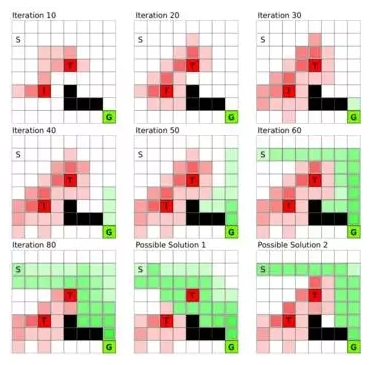
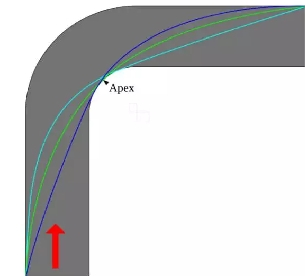
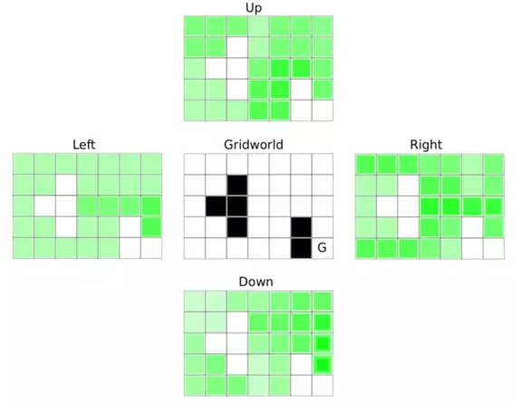
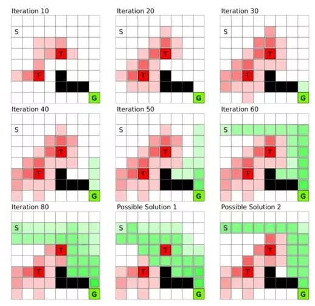

目录

<!-- TOC -->

- [强化学习概述](#强化学习概述)
- [价值函数（VALUE FUNCTION）](#价值函数value-function)
- [贴现因子（DISCOUNTING FACTOR）](#贴现因子discounting-factor)
- [策略函数（POLICY FUNCTION）](#策略函数policy-function)
- [Q-函数（Q-FUNCTION）](#q-函数q-function)
- [Q-学习（Q-Learning）](#q-学习q-learning)
- [深度 Q-学习（DEEP Q-LEARNING）](#深度-q-学习deep-q-learning)
- [AlphaGo](#alphago)

<!-- /TOC -->

更多资料参见[wildml的rl专题](http://www.wildml.com/2016/10/learning-reinforcement-learning/)

from [机器之心翻译](https://mp.weixin.qq.com/s?__biz=MzA3MzI4MjgzMw==&mid=2650719294&idx=1&sn=f1a01cd6710e6ea9629619cd3324d102&chksm=871b0040b06c895642ff961a6fe81f05c5e9776aff5da4845f2d3d874f88213863afd2059833&mpshare=1&scene=1&srcid=1002mDtDsEDixxCswQJOs2rH&pass_ticket=DoiMlYDlmCK%2FTS99n6JzBzzsHdN7QoyC81j%2BvUNHFkqqmuADrJsZlH0yXSTgpVEB#rd)

选自 devblogs.nvidia.com;机器之心编译;参与：武竞、Rick R、吴攀

本文是 NVIDIA 博客上 Tim Dettmers 所写的《Deep Learning in a Nutshell》系列文章的第四篇。据介绍，该系列文章的目的是「提供对每一种概念的理解而不是其数学和理论上的细节」。除了必要理解的数学术语之外，这些文章还提供了直观的类比和图像来帮助理解深度学习。在此之前，作者已经探讨了深度学习的核心概念、深度学习的训练及其历史、序列学习，本文（第四篇）的主题是强化学习（Reinforcement Learning）。

## 强化学习概述

学习骑自行车需要试错（trial and error），这很像强化学习。

还记得你是如何学习骑自行车的吗？一般都有一个大人在你旁边或你后面帮助你，并鼓励你骑出你自行车生涯的第一步，在你绊倒或摔倒的时候还会帮助你再次尝试。解释儿童学习骑自行车的方式是很困难的，而即使很好的解释对从没骑过自行车的人而言也不会有多少意义：你必须自己去感受。

所以如果你不能解释如何骑上自行车的，又怎么能学会骑自行车呢？事实上，你是在不断地通过尝试进行学习，你很可能会跌倒，或至少可能会突然停下然后不得不控制好自己。你会不断跌倒或跌跌撞撞——直到你突然掌握了一些诀窍，能在你再次跌倒前前进几米了。
在这个学习过程中，反馈信号告诉我们：我们所做的要么会带来痛苦（嗷，痛死啦！我下次不能再这样做了！），要么会带来奖励（喔！我骑上去了！感觉好棒！我只需要一直这样做就行了！）

在强化学习的问题上，我们认为存在一个代理（agent）在尝试通过决策来最大化其所能收到的奖励。因此一个可以收到最大可能的奖励的代理可以被看作是在给定的状态下执行了最好的动作。这里所谓的代理（agent）是指一种抽象的实体，它可以是任何执行动作的对象或主体：自动汽车、机器人、人类、客户支持聊天机器人、围棋棋手。代理的状态（state）是指代理的位置以及代理在其抽象环境中的存在状态；比如说，在虚拟现实世界中的一个特定位置、一栋建筑、一个国际象棋棋盘或在赛道上的位置和速度。

为了简化强化学习的问题和解决方案，通常会对环境进行简化，使代理只知道对决策重要的细节，而其它的都可以被抛弃。就像学习骑自行车的例子一样，强化学习也只有两个可以学习的反馈源：惩罚（penalty，跌倒的痛苦）和奖励（reward，成功骑行几米的快乐）。如果我们将惩罚看作是负奖励（negative reward），那么整个学习问题都将是关于探索环境和经过一个又一个的状态来尝试最大化我们的代理所得到的奖励，直到实现目标状态（从 A 到 B 自动驾驶；赢得一场国际象棋比赛；通过聊天解决一个客户问题）：简而言之，这就是强化学习。

## 价值函数（VALUE FUNCTION）

强化学习是通过奖励或惩罚来学习怎样选择能产生最大积累奖励的行动的算法。为了找到这些行动，在我们目前的环境（environment）中首先找到最有价值的状态（states）是很有用的。举一个例子，在赛车跑道上最有价值的是终点线，这也是奖励最多的状态，因此在跑道之上的状态也比在跑道之外的状态更有价值。

一旦我们确定了哪些状态是有价值的，我们就可以给这些状态赋回馈值。例如，当赛车偏离跑道时，这些状态就被赋予惩罚；而当赛车跑完一圈时，就会收到一个奖励；当赛车跑出当前最短的时间时，也会收到一个奖励；等等。

我们可以将这些状态和回馈当成一个离散函数。比如把跑道看作 1×1 的方格。对应到这些方格中的奖励就可以用数字表示。例如目标状态的奖励可能为 10，而偏离跑道的方格的惩罚为 -2，其它方格的奖励为 0。假设这个函数是 3 维的，那么最佳的行动是让函数的值越高越好（即最大奖励）的行动。

这些状态中，有些中间状态并不一定有奖励（奖励为 0），但是这些状态是通向奖励状态的必经之路。例如，你必须在跑完一圈之前转弯，或者必须跑完一圈才有机会跑出最短时间。

经过训练的或设定好的价值函数会给中间状态赋予部分奖励，例如，认为赛车完成第二个转弯比第一个更有价值，因为第二个转弯代表了更接近目标的状态。价值函数通过提供中间奖励，能帮助代理（agent）更容易地判断下一步要移动到哪个状态。

图 1：通过全状态的价值迭代（value iteration）构建价值函数（value function）。每一个方格代表一个状态：S 是起始状态，G 是目标状态，T 是陷阱，而黑色的方格不能进入。价值迭代中，我们初始化陷阱状态和目标状态的回馈，然后这些回馈值就会随着时间传递到所有状态直至达到平衡。取决于陷阱状态的惩罚值和目标状态的奖励值，不同的回馈值可能产生不同的解决方案；最后的两张图是两种不同的解。

图 2：转弯处不同的赛车线。不同赛车线的距离不同，可能的速度不同，磨损轮胎的力度也不同。优化跑圈时间的价值函数会找到使转弯处的总时间耗费最少的状态转换（state transitions）。

这个框架说明了，每一个状态的值都会被周围状态的值所影响。图 1 每一个方格代表一个状态：S 和 G 分别是起始状态和目标状态，T 方块是陷阱，而黑色的方格不能进入。目的是从状态 S 移动到状态 G。把这些格子当作赛车跑道，那么随着时间推移我们创建了一个「斜坡」，连接起始状态和目标状态，所以只要沿着最陡峭的方向前进就可以达到目标。这就是价值函数的主旨思想：提供每个状态的价值估计，从而我们可以一步一步根据奖励做出决策。

价值函数也可以察觉细微的问题。例如，相比偏离跑道外的状态，赛车在跑道两侧的惩罚并没有那么大；但是这并不能有效地将赛车纠正回跑道中心，也就无法达到理想的跑圈时间（赛车无法在高速下转弯）。因此，安全和速度二者无法兼顾，价值函数在赛道上找到一条最适合的既快又安全的路径。通过更改回馈值，可以调整最后的解决方案。例如，如果跑圈时间越短奖励越多，那么价值函数会给危险但可能使时间更短的状态赋予更高的价值。

## 贴现因子（DISCOUNTING FACTOR）

尽管价值函数决定回馈值的大小，agent 采取的行动还取决于一个叫贴现因子（discounting factor）的参数，它限定了 agent 会在多大程度上受到较远状态的影响。当状态改变，局部回馈值会乘以贴现因子计入价值函数。当贴现因子为 0.5 时，仅经过 3 次状态改变，回馈值就会变成初始值的八分之一，所以 agent 更倾向于搜索临近状态的回馈值。因此贴现因子是决定价值函数推荐稳健还是激进行动的权重要素。

例如，跑得快的赛车可能得到高奖励，所以一个接近于零的贴现因子就会导向跑得越快越好的激进策略。但是一个谨慎的 agent 知道，当前方有急转弯时，跑得越快越好并不是一个好策略；而在恰当时机将速度慢下来，可能会在之后得到一个更短的跑圈时间，因此得到更高的奖励。要有这样的远见，agent 需要将跑得快的奖励延后，所以一个接近于 1 的贴现因子可能会更好。

价值函数的贴现因子保证了，远处的回馈值能根据距离或步数部分的减少。这个因子通常被设定为一个值，这个值很重视长期的回馈，但又不是那么重视（例如每经过一次状态转换衰减 5%）。

该算法首先把所有状态的回馈值初始化为 0 或者特定的值，然后搜索所有状态的可能的下一个状态，并估计下一个状态 agent 可能得到的回馈，通过这种方式学习每一个状态特有的局部回馈值。如果 agent 在下一个状态得到回馈，那么这个回馈就会累计到当前的状态中。重复这个过程，直到每个状态的局部回馈值不再改变，意味着每次变换状态采取的可能转向以及每个状态的回馈值都被考虑在内。图 1 为价值迭代的过程。

这种方法也许起初看起来并不高效，但是动态规划（dynamic programming）的技巧可以让它更加高效。在子问题已经解决的前提下，动态规划能解决更高层次的问题：B 到 C 的回馈值可以被用于计算 A->B->C 和 D→B->C 的链式状态的回馈值。

总之，价值函数和价值迭代提供了一个局部回馈值的地图，agent 根据它就可以找到有最大奖励的状态。

## 策略函数（POLICY FUNCTION）

策略函数（policy function）是根据价值函数选择产生最大（长期）奖励的行动的一组策略。在所有可能的下一步行动中，通常没有明确的优胜者。例如，agent 面临选择下一步进入 4 个状态 A, B, C, D 中的一个，它们的奖励分别为 A=10, B=10, C=5, D=5。A 与 B 都是好的即刻选择，但是随着时间的推移，A 状态之后的路径得到的奖励可能比 B 状态好得多，或者进入 C 状态的行动甚至是最好的选择。所以在训练的过程中，探索所有的选择是值得的，但同时，如果只看到即刻奖励，就可能会导致非最优的选择。那么，我们如何在探索尽量高的奖励和探索尽量少的路径之间找到一个平衡点呢？

一个聪明的方法是按照奖励值的比例随机选取状态。在这个例子中，选择 A 的概率为 33% ( 10/(10+10+5+5) )，同样选择 B, C, D 的概率分别为 33%, 16%, 16%。策略函数的随机选择的原理对学习一个好的策略至关重要。因为，也许存在一个看上去是反直觉的，但是有效甚至关键的成功策略。

例如，如果你以跑得快来训练赛车，它会尝试以最快的速度在转弯抄近道。但是当你把其它选手也纳入模型时，这个策略并不是最优的。agent 会将其他选手在转弯处减速考虑在内，以免发生超车甚至撞车。另一个场景是，在转弯处高速行驶可能会更快的磨损轮胎，导致赛程中的停顿，浪费宝贵的时间。

值得注意的是，策略函数和价值函数相互依赖。给定一个价值函数，不同的策略会导致不同的选择；同样给定一个策略函数，agent 会将不同行动赋予不同的价值。给一个棋类游戏赋予「快去赢」的策略，价值函数就会对赢棋可能性高的行动赋予高价值（牺牲棋子以获得赢棋胜算会被赋予高价值）。但是如果赋予「以大比分领先获胜」的策略，那么策略函数会学习在特定的游戏中选择能最大化得分的行动（从不牺牲棋子）。

这些只是许多例子中的两个。如果想得到特定的结果，我们可以同时使用策略和价值函数来指导 agent 学习策略，最终达到特定的结果。这使得强化学习既灵活又强大。

我们训练策略函数通过（1）随机初始化——例如，让每一个状态被选择的概率与它的回馈值成正比——然后用这些回馈值初始化价值函数；即把所有没有直接回馈值状态的回馈值设成 0（如跑道终点的奖励为 10，偏离跑道外的惩罚为 -2，所有跑道上的状态的回馈值为 0）。（2）训练价值函数知道收敛（见图 1）.（3）对于特定状态（状态 A），增大能让奖励增加最多的行动（从 A 移动到 B）的概率值（相比从 A 到 C，这种移动也许会导致很低甚至负的回馈值，像牺牲棋子，但是它仍可以最终赢得游戏）。（4）最后，重复步骤（1）直到策略不再改变。

## Q-函数（Q-FUNCTION）

我们已经看到策略和价值函数是高度相依的：我们的策略大多取决于我们看重什么，而我们看重什么决定了我们的行动。因此我们或许可以把策略和价值函数结合起来，这个结合就叫 Q-函数（Q-function）。

Q-函数考虑了当前的状态（如价值函数）和下一步行动（如策略函数），然后针对状态-行动组合，返回局部回馈值。在更复杂的情况下，Q-函数可能会结合更多状态来预测下一步状态。例如，如果行动的方向是很重要的，我们需要至少 2 个状态去预测下一步状态，因为只用一个状态（如一幅静止图像）去推断精确的方向几乎是不可能的。我们也可以将输入状态传给 Q-函数去得到每个可能状态的局部回馈值。然后我们可以按照局部回馈值的比例，随机选取下一步的行动（这种方法叫探索（exploration））；或者直接选取最高价值的行动（这种方法叫利用（exploitation））。

然而，Q-函数的要旨实际上并不在此。设想一辆自动驾驶汽车：有太多的「状态」以至于无法建立一个覆盖所有状态的价值函数；地球上的所有道路的每一个可能的位置和可能的速度实在太多，要计算它们的局部回馈值几乎是不可能的。相反，Q-函数（1）只在一步的范围内查找所有可能的下一步状态然后（2）基于当前状态和下一步状态，查看最佳的可能行动。所以对于每一个下一步状态，Q-函数会向前探索一步（并不会探索所有可能的步数直到终止，如价值函数）。这些「向前探索一步」被表示为状态-行动组合。例如，状态 A 有 4 个可能行动，所以我们有行动组合 A->A, A->B, A->C, A→D。对每一个状态有 4 个行动的一个 10×10 网格的状态，我们可以将整个 Q-函数表示为 4 个 10×10 的矩阵，或一个 10×10×4 的张量（tensor）。图 3 展示了一个网格问题（在 2D 平面上每步可以移动到相邻状态，目标为右下角的 G）的解。

图 3：一个含有障碍状态（黑色方格）网格问题的 Q-函数，目标为右下角的 G。图示的 4 个矩阵展示了每个状态 4 种行动的回馈值（或者 Q-函数中的 Q-值），绿色颜色越深代表 Q-值越高。agent 会以更高的概率选择颜色更深的状态，或在贪婪（greedy）的情况下直接选择当前状态周围颜色最深的做行动。这会使 agent 以最快的速度达到目标。这个行为是与初始位置独立的。

在有些情况下我们需要为绝对无限状态建模。例如，自动驾驶汽车的「状态」经常会被表示为一个连续函数，如神经网络，神经网络会将所有状态的变量（如速度和位置）纳入，然后对每一个行动输出 Q-值。

为什么只获取一些状态的信息是有益的呢？很多状态是非常相关的，所以在两个不同但是相似的状态采取相同的行动可能都会取得成功。例如，跑道上每一个转弯是不同的，但是每一个左转弯赛车学到的内容——什么时候开始转弯，怎样调整速度等等——对下一个左转弯时有用的。所以，随着时间的推移，一个赛车 agent 会学到越来越好的左转弯技术，将来即使遇到没见过的赛道也会轻松应对。

## Q-学习（Q-Learning）

为了训练 Q-函数我们将所有状态-行动组合的 Q-值初始化为零，并将一些状态给定的回馈值作为这些状态的初始化值。起初 agent 并不知道如何获得奖励（agent 只能看到下一个状态的 Q-值，初始时都为 0），agent 可能会探索很多状态直到发现一个奖励。因此我们会对训练 Q-函数定义一个训练长度（例如 100 步），或者定义训练直到达到某些状态（跑道上完成一圈）。这保证了我们不会卡在学习一个无用状态行动的过程中，这些无用状态可能不管做了多少次迭代却仍无法得到有用的回馈值。

图 4：网格中的 Q-学习，S 是起始状态，G 是目标状态，T 方格是陷阱，黑色的方格是障碍状态。在 Q-学习过程中，agent 一步一步探索环境，起初并不知道目标状态 G。一旦目标状态到起始状态附近的路径建立，算法会迅速收敛到一个解，然后再进一步找到问题的最佳策略。

学习 Q-函数是从结果（奖励）到开始（起始状态）进行的。图 4 描绘了与图 1 比较的 Q-学习的网格变化。假设目标是以最少的步数达到目标状态 G。最开始 agent 随机移动直到（碰巧）进入陷阱或目标状态。因为陷阱离起始状态很近，agent 很可能最初会先碰到陷阱，但是一旦 agent 在磕磕绊绊中遇到目标状态，这种情况就会改变。从那以后的迭代，到达目标状态之前的那些状态（向前探索一步）就会被赋予局部奖励，同时因为奖励更接近起始位置，agent 也更可能遇到这样的奖励状态。通过这种方式，我们建立起一连串从目标到起始状态的局部回馈值，而且 agent 越是常遇到有局部回馈值的状态，局部回馈值就收敛得越快（见图 4）。

## 深度 Q-学习（DEEP Q-LEARNING）

一辆自动驾驶汽车也许需要考虑许多状态：每一个不同速度和位置的组合就是一个不同的状态。但是大多数状态是相似的。将相似的状态放在一起并认为它们有相似的 Q-值是否可行？这就是深度学习需要派上用场的地方。

我们可以将当前驾驶员看到的视野——一张图像——输入到卷积神经网络（CNN），训练它预测下一个可能行动的回馈值。因为相似状态的图像也是相似的（许多左转弯看起来相似），它们也会导致相似的行动。例如。神经网络会生成许多左转弯，并且甚至在没有遇到过的左转弯做出适当的行动。正如一个通过很多物品的图像训练的卷积神经网络能够准确识别这些物品一样，一个通过很多相似左转弯训练的网络也能够对不同左转弯做出速度和位置的微调。

然而要成功地使用深度 Q 学习，我们不能简单地应用规则来训练之前所描述的 Q 函数。如果我们盲目地应用 Q 学习规则，那么网络将在进行左转弯时学习做好左转弯，但同时将开始忘记如何做好右转弯。这是因为所有神经网络的动作都使用相同的权重；调整左转弯的权重会使它们在其他情况中表现得更糟糕。解决方案是将所有输入图像和输出动作存储为「经验（experiences）」：即将状态、动作和奖励三者一起存储。

运行了一段时间训练算法后，我们从迄今为止的所有经验中随机选择一个，并为神经网络权重创造一个均值更新，它能为每一个发生在那些经验期间的动作最大化 Q 值（奖励）。这样我们可以在同一时间教我们的神经网络左转和右转。由于在跑道上的较早期驾驶经验并不重要——因为它们源于我们代理的经验不足、甚至是初学者的一个时期——我们只跟踪固定数量的过去经验并忽略休息期。这个过程被称为经验回放（experience replay）。

经验回放是一种由生物学所启发的方法。人脑中的海马体是每个大脑半球的强化学习中心。海马体储存我们白天制造的所有经验，但它的经验记忆能力有限，一旦达到记忆限度，学习会变得更加困难（考前填鸭式）。在夜间，海马体的这种记忆缓冲区被遍布皮质的神经活动清空到皮质中。皮质是大脑的「硬盘驱动器」，几乎所有记忆都储存在那里。手部动作的记忆存储在「手区」，听觉记忆存储在「听觉区」，等等。这种从海马体向外扩散的特征性神经活动称为睡眠纺锤（sleep spindle）。虽然目前没有强有力的证据来支持它，许多睡眠研究人员认为，我们通过做梦来帮助海马体将白天收集到的经验与我们在皮质中的记忆整合到一起，从而形成连贯的图片。

所以你看，存储记忆与将记忆以某种协调的方式写回，这不仅对于深度强化学习、而且对于人类学习来说都是一个重要的过程。这种生物相似性给我们增加了一点信心，说明我们的大脑理论可能是正确的，也说明我们设计的算法走在了正确的道路上。

## AlphaGo

由谷歌 DeepMind 所开发的 AlphaGo 在 2016 年制造了大新闻，它成为第一个在游戏中击败人类职业玩家的计算机程序。接着它以 4:1 击败了一位世界顶尖棋手李世石（Lee Sedol）。AlphaGo 结合了之前本文所提到的许多元素；即（1）价值（value）和（2）策略（policy）神经网络，其中（1）代表了围棋游戏中当前配置的值函数，从而预测每步棋之间的相对值；而（2）策略函数则表明应该选择走哪部棋以赢得游戏。这些网络是卷积网络，它把棋盘当做一张 19×19 的输入「图像」（每个位置一个像素）。

由于我们已经有了许多围棋游戏的记录，通过使用来自专业人员的围棋游戏数据，这些记录对于训练策略网络很有用。该策略网络基于这些数据训练，以在给定游戏配置的游戏中预测出围棋冠军的下一步棋。

一旦完成该监督训练阶段，强化学习就登场了。这里 AlphaGo 与自己对抗并试图改善其策略来挑选行动（策略网络），以评估谁将获胜（价值网络）。即使是仅仅训练策略网络，这种方法也比之前最著名的围棋算法 Pachi 更好，后者利用树搜索（tree-search）算法和启发式算法（heuristics）。然而仅仅在价值网络的帮助下，深度学习方法的性能仍然可以得到显著提高。

当价值网络在整个游戏中被训练时往往很难进行推广，由于配置的高度相关性，网络会去学习识别一局比赛（比如说，如果这场比赛在 1978 年北京的 A vs. B，那么我会根据历史知道是 A 获胜了）而不是去识别好的走子。为了解决这个问题，DeepMind 生成了很多使 AlphaGo 与自身对抗的数据，然后选取每场比赛中的几个位置来训练价值网络。这与经验回放类似，其中我们从未独立地查看过冗长的动作序列，而是以非常不同的状态和行动的组合方式。

价值网络表现出与带有 rollout 策略的蒙特卡洛（Monte Carlo）搜索树相似的表现，但是 AlphaGo 在深度学习方法的顶端使用了蒙特卡洛搜索树以取得更好的性能。带有推出策略的蒙特卡洛搜索树是什么？想象这样一个游戏配置树，其中一次行动就是一个边缘，而其节点是不同的游戏配置。例如你处于一个特定的游戏配置中，拥有 200 个可能的行动——也就是有 200 个节点连接到你的当前节点上——然后你选择某一次行动（一个边缘导致一个节点），从而产生一棵有着 199 个不同节点的新树，这些节点可在当前的行动之后被连接上。然而这棵树从未被完全扩大，因为它以指数级生长并需要太长时间来完全地被评估，所以在蒙特卡洛树搜索中，我们只采取一条沿着树进入到一定深度的路线，以使评估更有效。

在 rollout 策略中，我们查看当前的状态，运用策略网络来选择树中下一节点的行动，并为每个玩家重复随后的所有行动，直到游戏结束得出胜负。这提供了另一种快速而贪婪的方法来评估一次行动的价值。然后这种洞察力也可以用来提高价值网络的准确性，有了更准确的价值函数，我们也能够进一步改善我们的策略函数：对一个行动是好是坏了解得更准确，使我们能够基于良好的、之前被认为是坏的行动来开发策略。或者换句话说，AlphaGo 能够思考一些对人类来说不可能办到、但却能赢得比赛的策略。

AlphaGo 也使用蒙特卡洛搜索树用于训练。该树包含在每次迭代中更新的 Q 值边界、访问数 (N) 和一个先验概率 (P)。最初，Q 值、访问数和先验概率为零。一次迭代中，每次行动根据三个参数 (Q,N,P) 进行选择。例如要决定走 E5 是否为一步好棋，该行动后的新棋盘状态是由下述两个因素结合进行评估：（1）策略网络，为该行动设置初始先验概率；（2a）价值网络，为该行动分配一个值；（2b）蒙特卡洛 rollout，为该行动分配另一个值。步骤（2a）和（2b）通过一个参数和 Q 值进行加权，访问数 (N) 由该路径上的平均估值进行更新（如果该行动平均而言是相对好的则增加 Q 值，反之则减少 Q 值）。同一次行动的值随着每一次迭代的进行，由访问数（的增加）而略有减少，以至于将有更高的概率勘探到新的行动。这保证了勘探和开采之间的平衡。然而我们也得到越来越多对于已采取行动的准确估计。随着时间的推移，树为那些非常有力的行动分配更高的 Q 值。通过这个训练过程，AlphaGo 用每次训练迭代去学习采取更好的行动，从而学习哪次动作将赢得比赛。至此直到我们创造一个优于人类专家的围棋机器人，剩下的仅仅是计算能力和时间的问题了。
