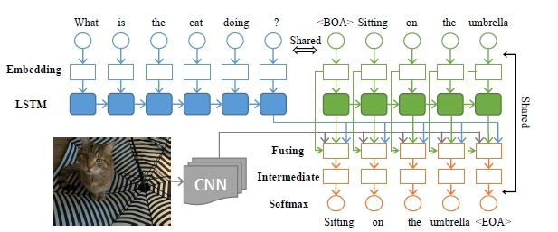

项目主页：
[http://idl.baidu.com/FM-IQA.html](http://idl.baidu.com/FM-IQA.html)


目录：

<!-- TOC -->

- [背景介绍](#%E8%83%8C%E6%99%AF%E4%BB%8B%E7%BB%8D)
- [模型概览](#%E6%A8%A1%E5%9E%8B%E6%A6%82%E8%A7%88)
- [数据准备](#%E6%95%B0%E6%8D%AE%E5%87%86%E5%A4%87)
  - [数据介绍与下载](#%E6%95%B0%E6%8D%AE%E4%BB%8B%E7%BB%8D%E4%B8%8E%E4%B8%8B%E8%BD%BD)
    - [下载MSCOCO数据](#%E4%B8%8B%E8%BD%BDmscoco%E6%95%B0%E6%8D%AE)
  - [下载图片－q/a的标注数据集](#%E4%B8%8B%E8%BD%BD%E5%9B%BE%E7%89%87%EF%BC%8Dqa%E7%9A%84%E6%A0%87%E6%B3%A8%E6%95%B0%E6%8D%AE%E9%9B%86)
      - [英文qa:](#%E8%8B%B1%E6%96%87qa)
    - [中文qa:](#%E4%B8%AD%E6%96%87qa)
  - [模型结构](#%E6%A8%A1%E5%9E%8B%E7%BB%93%E6%9E%84)
    - [3.1 LSTM(Q)](#31-lstmq)
    - [3.1 CNN](#31-cnn)
    - [3.1 LSTM(A)](#31-lstma)
    - [3.4 fusing layer](#34-fusing-layer)
    - [3.5 intermediate and softmax](#35-intermediate-and-softmax)

<!-- /TOC -->

## 背景介绍 

本文模型取名为mQA(Multilingual Image Question Answering)，可以自动回答关于图片的问题。answer可以是**一句话，一个短语或者是一个单词**。主要包含了四部分：lstm-q(提取question representation), cnn(提取visual representation), lstm-a(提取answer的linguistic context), fusing component(结合上述三个模块的输出，生成answer)。数据集大小：15w图片以及他们对应　的31w的中文q-a对，以及他们对应的英文翻译。

本教程主要介绍图像分类的深度学习模型，以及如何使用PaddlePaddle训练m-rnn模型。

## 模型概览



## 数据准备

### 数据介绍与下载

通用图像分类公开的标准数据集常用的有[CIFAR](https://www.cs.toronto.edu/~kriz/cifar.html)、[ImageNet](http://image-net.org/)、[COCO](http://mscoco.org/)等，常用的细粒度图像分类数据集包括[CUB-200-2011](http://www.vision.caltech.edu/visipedia/CUB-200-2011.html)、[Stanford Dog](http://vision.stanford.edu/aditya86/ImageNetDogs/)、[Oxford-flowers](http://www.robots.ox.ac.uk/~vgg/data/flowers/)等。其中ImageNet数据集规模相对较大，大量研究成果基于ImageNet。ImageNet数据从2010年来稍有变化，常用的是ImageNet-2012数据集，该数据集包含1000个类别：训练集包含1,281,167张图片，每个类别数据732至1300张不等，验证集包含50,000张图片，平均每个类别50张图片。

由于ImageNet数据集较大，下载和训练较慢，为了方便大家学习，我们使用[CIFAR10](https://www.cs.toronto.edu/~kriz/cifar.html)数据集。CIFAR10数据集包含60,000张32x32的彩色图片，10个类别，每个类包含6,000张。其中50,000张图片作为训练集，10000张作为测试集。图11从每个类别中随机抽取了10张图片，展示了所有的类别。

#### 下载MSCOCO数据

```shell
#!/bin/bash

function download_mscoco()

{
mkdir data
cd data

# http://mscoco.org/dataset/#download
#2014 Training images [80K/13GB]
#2014 Val. images [40K/6.2GB]
#2014 Testing images [40K/6.2GB]
#2015 Testing images [80K/12.4G]
wget http://msvocds.blob.core.windows.net/coco2014/train2014.zip
wget http://msvocds.blob.core.windows.net/coco2014/val2014.zip
wget http://msvocds.blob.core.windows.net/coco2014/test2014.zip
wget http://msvocds.blob.core.windows.net/coco2015/test2015.zip


#annotations
#2014 Train/Val object instances [158MB]
#2014 Train/Val person keypoints [70MB]
#2014 Train/Val image captions [18.8MB]
#2014 Testing Image info [0.74MB]
#2015 Testing Image info [1.83MB]
wget http://msvocds.blob.core.windows.net/annotations-1-0-3/instances_train-val2014.zip
wget http://msvocds.blob.core.windows.net/annotations-1-0-3/person_keypoints_trainval2014.zip
wget http://msvocds.blob.core.windows.net/annotations-1-0-3/captions_train-val2014.zip
wget http://msvocds.blob.core.windows.net/annotations-1-0-4/image_info_test2014.zip
wget http://msvocds.blob.core.windows.net/annotations-1-0-4/image_info_test2015.zip

}

function unzip_data()
{
cd data
#2014 Training images [80K/13GB]
#2014 Val. images [40K/6.2GB]
#2014 Testing images [40K/6.2GB]
#2015 Testing images [80K/12.4G]
unzip train2014.zip
unzip val2014.zip
unzip test2014.zip
unzip test2015.zip


#annotations
#2014 Train/Val object instances [158MB]
#2014 Train/Val person keypoints [70MB]
#2014 Train/Val image captions [18.8MB]
#2014 Testing Image info [0.74MB]
#2015 Testing Image info [1.83MB]
unzip instances_train-val2014.zip
unzip person_keypoints_trainval2014.zip
unzip captions_train-val2014.zip
unzip image_info_test2014.zip
unzip image_info_test2015.zip


}

download_mscoco
unzip_data
```

### 下载图片－q/a的标注数据集

##### 英文qa:

下载地址为[http://pan.baidu.com/s/1qXh68w8](http://pan.baidu.com/s/1qXh68w8)

数据schema:

#### 中文qa:

下载地址为[http://pan.baidu.com/s/1qXh68w8](http://pan.baidu.com/s/1qXh68w8)
数据schema:


下面命令用于下载数据和基于训练集计算图像均值，在网络输入前，基于该均值对输入数据做预处理。

```bash
./data/get_data.sh
```

### 模型结构

本教程中m-QA模型包含了LSTM(Q)、CNN、LSTM(A)、fusing layer以及intermediate and softmax层。

#### 3.1 LSTM(Q)

#### 3.1 CNN

#### 3.1 LSTM(A)

#### 3.4 fusing layer


$$ \mathbf{f}(t)=g(\mathbf{V}_{\mathbf{r}_{Q}}\mathbf{r}_Q+\mathbf{V}_{\mathbf{I}}\mathbf{I}+\mathbf{V}_{\mathbf{r}_{A}}\mathbf{r}_A(t)+\mathbf{V}_{\mathbf{w}}\mathbf{w}(t))  $$

#### 3.5 intermediate and softmax

