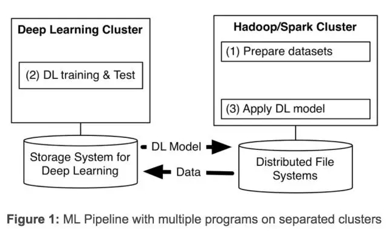

目录

<!-- TOC -->

<!-- /TOC -->

[机器知心文章：](https://mp.weixin.qq.com/s?__biz=MzA3MzI4MjgzMw==&mid=2650723201&idx=2&sn=81dd9fbd5f00b1d17437c17a2e14f8c9&chksm=871b17ffb06c9ee92edc24c76eb32c05173ce2831c4109fb779293fdec9de146bf5e34fadd6d&scene=0&pass_ticket=cRg%2Fd4VBk6Un%2BRmxRlIcTdkS45x%2BlrSXeEh%2BFaF%2FTqiBl%2Ba0V%2BvF404WLkESRtTu#rd)

+ TensorFlowOnSpark 开源地址： [github.com/yahoo/TensorFlowOnSpark](github.com/yahoo/TensorFlowOnSpark) 
+ RDMA 增强版开源地址： [github.com/yahoo/tensorflow/tree/yahoo](github.com/yahoo/tensorflow/tree/yahoo) 
+ 提供多示例程序（包括 MNIST，Cifar10，Inception，and VGG）以说明 TensorFlow 程序到TensorFlowOnspar转换过程，并且利用 RDMA。地址：[https://github.com/yahoo/TensorFlowOnSpark/tree/master/examples](https://github.com/yahoo/TensorFlowOnSpark/tree/master/examples)
+ 提供一张亚马逊机器图像用于在 AWS EC2 上应用 TensorFlowOnSpark。接着，与 CaffeOnSpark 一样，我们会推进 TensorFlowOnSpark。地址：[https://github.com/yahoo/TensorFlowOnSpark/wiki/GetStarted_EC2 ](https://github.com/yahoo/TensorFlowOnSpark/wiki/GetStarted_EC2 )

近几年，深度学习发展的非常迅速。在雅虎，我们发现，为了从海量数据中获得洞察力，需要部署分布式深度学习。现有的深度学习框架常常要求为深度学习单独设定集群，迫使我们要为一个机器学习流程（见下图 1）创建多个程序。

设定独立的集群则需要我们转移大数据集，带来了不必要的系统复杂性和端到端的学习延迟。

去年我们通过开发和公开 CaffeOnSpark 解决了 scaleout 的问题，我们开源的框架支持在相同的 Spark 和 Hadoop 集群上进行分布式深度学习和大数据处理。我们在雅虎内部使用 CaffeOnSpark 改善了我们的 NSFW 图像检测，自动从实况录像中识别电竞比赛片段等等。在社区大量有价值的反馈和贡献下，CaffeOnSpark 已经得到了更新，现在可以支持 LSTM，有了一个新的数据层，可以训练与测试交错，有了一个 Python API，和 Docker container 的部署。这些都提升了我们的用户体验。但是那些使用 TensorFlow 框架的人怎么办？于是我们效仿了之前的做法，开发了 TensorFlowOnSpark。

TensorFlow 公开后，谷歌于 2016 年 4 月就开放了一个带有分布式学习功能的增强版 TensorFlow。2016 年 10 月，TensorFlow 开始支持 HDFS。然而在谷歌云之外，用户仍然需要一个 TensorFlow 应用的专用集群。TensorFlow 程序无法在现有的大数据集群上部署，这样一来，那些想大规模使用这个技术的人就需要花更多的成本和时间。

为了打破这个限制，几个社区项目将 TensorFlow 连接到 Spark 集群上。SparkNet 让 Spark 执行器获得了可以运行 TensorFlow 网络的能力。DataBricks 提出 tensorframe，用来使用 TensorFlow 程序操纵 Apache Spark 的数据帧。虽然这些方法都朝着正确的方向迈出了一步，但是我们检查他们的代码后发现，我们无法让多个 TensorFlow 过程直接相互沟通，我们也无法实现异步分布式学习，并且我们需要在迁移现有的 tensorflow 程序上花大功夫。

