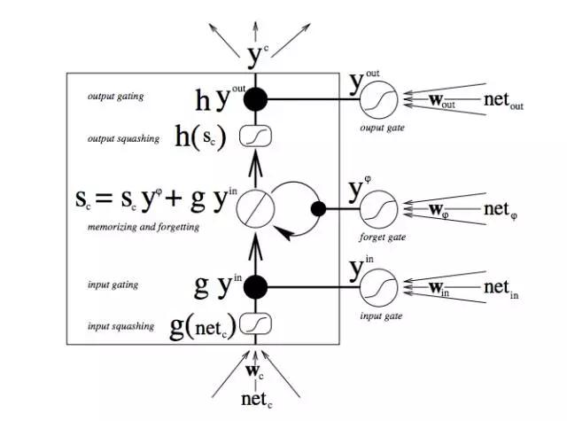
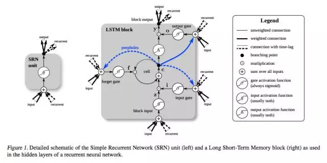

<!-- TOC -->

- [LSTM 的优势](#lstm-的优势)

<!-- /TOC -->

参考： [lstm之父Jürgen Schmidhuber](https://mp.weixin.qq.com/s?__biz=MzA3MzI4MjgzMw==&mid=2650724769&idx=1&sn=796676a27891f0ed5c5eac30ac1ac3a3&chksm=871b1ddfb06c94c9d853dfcdcedceeb7ca337972032da7f2db7bee12056e663dfda84b2e7270&mpshare=1&scene=1&srcid=0326w3RMbGfNfIGCmwpXxabV&pass_ticket=Htlvu54Fy3u%2F7%2BrIyF5OA2H235rnZvGZ9TN12axFlz1gzulu4QPYwr2E5IM3920U#rd)

## LSTM 的优势

LSTM 是 Sepp Hochreiter 和 Jürgen Schmidhuber 在上世纪九十年代中期提出的，它可以解决梯度消失的问题，这一问题是影响 RNN 表现的重大障碍。

LSTM 还可保留误差，用于沿时间和层进行反向传递。LSTM 将误差保持在更为恒定的水平，让 RNN 能够进行许多个时间步的学习（超过 1000 个时间步），从而打开了建立远距离因果联系的通道。

LSTM 将信息存放在递归网络正常信息流之外的门控单元中。这些单元可以存储、写入或读取信息，就像计算机内存中的数据一样。单元通过门的开关判定存储哪些信息，以及何时允许读取、写入或清除信息。但与计算机中的数字式存储器不同的是，这些门是模拟的，包含输出范围全部在 0～１之间的 sigmoid 函数的逐元素相乘操作。相比数字式存储，模拟值的优点是可微分，因此适合反向传播。

这些门依据接收到的信号而开关，而且与神经网络的节点类似，它们会用自有的权重集对信息进行筛选，根据其强度和导入内容决定是否允许信息通过。这些权重就像调制输入和隐藏状态的权重一样，会通过递归网络的学习过程进行调整。也就是说，记忆单元会通过猜测、误差反向传播、用梯度下降调整权重的迭代过程学习何时允许数据进入、离开或被删除。

首先，最底部的三个箭头表示信息从多个点流入记忆单元。当前输入与过去的单元状态不只被送入记忆单元本身，同时也进入单元的三个门，而这些门将决定如何处理输入。

图中的黑点即是门，分别决定何时允许新输入进入，何时清除当前的单元状态，以及/或何时让单元状态对当前时间步的网络输出产生影响。S_c 是记忆单元的当前状态，而 g_y_in 是当前的输入。记住，每个门都可开可关，而且门在每个时间步都会重新组合开关状态。记忆单元在每个时间步都可以决定是否遗忘其状态，是否允许写入，是否允许读取，相应的信息流如图所示。

图中较大的黑体字母即是每项操作的结果。

下面是另一张图，将简单 RNN（左）与 LSTM 单元（右）进行对比。蓝线可忽略；图例有助理解。

应当注意的是，LSTM 的记忆单元在输入转换中给予加法和乘法不同的角色。两张图中央的加号其实就是 LSTM 的秘密。虽然看起来异常简单，这一基本的改变能帮助 LSTM 在必须进行深度反向传播时维持恒定的误差。LSTM 确定后续单元状态的方式并非将当前状态与新输入相乘，而是将两者相加，这正是 LSTM 的特别之处。（当然，遗忘门依旧使用乘法。）

不同的权重集对输入信息进行筛选，决定是否输入、输出或遗忘。遗忘门的形式是一个线性恒等函数，因为如果门打开，则记忆单元的当前状态就只会与 1 相乘，正向传播一个时间步。

此外，讲到简单的窍门，将每个 LSTM 单元遗忘门的偏差设定为 1，经证明可以提升网络表现。

**关于梯度消失的解决，可以参考[知乎：LSTM如何来避免梯度弥散和梯度爆炸？](https://www.zhihu.com/question/34878706)**
+ An Empirical Exploration of Recurrent Network Architectures
+ Empirical Evaluation of Gated Recurrent Neural Networks on Sequence Modeling

另外，梯度爆炸问题，lstm无法解决，需要通过梯度cliping来解决(On the difficulty of training Recurrent Neural Networks)

