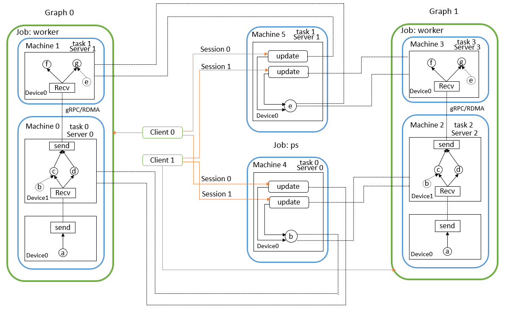
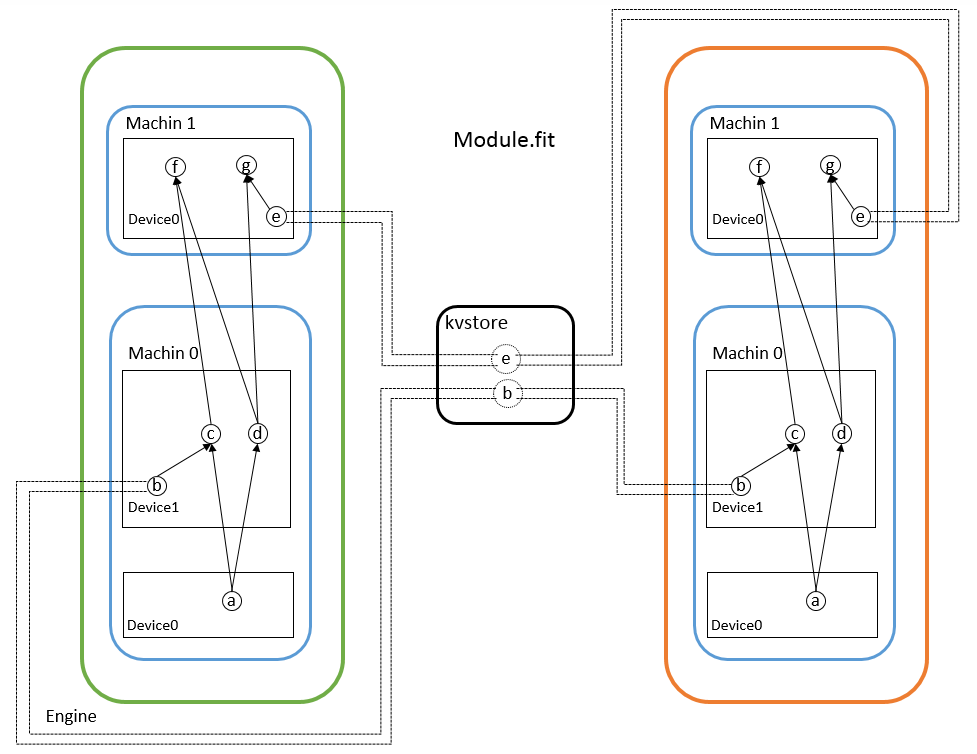
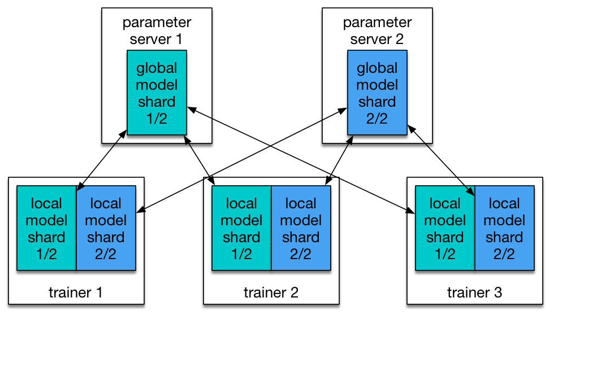

目录

<!-- TOC -->

- [1. tensorflow](#1-tensorflow)
- [x. 现有几个平台的对比](#x-现有几个平台的对比)
    - [使用构成](#使用构成)
    - [分布式实现](#分布式实现)

<!-- /TOC -->

-- 整理自《tensorflow实战》 chap 2

## 1. tensorflow

和Theano一样支持自动求导，用户不用通过bp求梯度。和Caffe一样，核心代码是用C++写的，简化上线部署的复杂度（手机这种内存&cpu都紧张的嵌入式设备，也可以直接用C++接口运行复杂模型）。tf还通过swig，提供了官方的py/go/java接口。

使用python时，有一个影响效率的问题：每个mini-batch要从python中feed到网络中，

## x. 现有几个平台的对比

感谢xxx同学提供~~

参考[https://chenrudan.github.io/blog/2017/02/25/comparetfmxpd.html](https://chenrudan.github.io/blog/2017/02/25/comparetfmxpd.html)

### 使用构成

+ tf

TensorFlow想做的是人工智能的算法引擎，它不仅提供了深度学习的基本元件例如卷积、pooling、lstm等，提供很多基本计算操作，在这一年还围绕着算法开发推出了TensorFlow Serving用于将算法动态部署到线上[6]、想取代scikit-learn的tf.contrib.learn[7]、将不同尺寸的输入处理成相同规模用于批处理的TensorFlow Fold[8]、在移动平台上跑算法[9]、支持Java/Go语言的接口、分布式实例等等。这些都可以看出TensorFlow在不断扩张版图，它不只是一个框架提供一些API供用户调用，也同时在围绕着算法推出各种配套服务。也许由于TensorFlow的扩张，做优化的人不够多，导致现在运行效率就算是分布式版本都比其他框架都要慢[4]，而且版本间有时候函数接口还老不兼容。最新的1.0的版本说Inception v3神经网络的训练速度提升了58倍[10]，个人觉得tf底层实现不会大改，如果要提速可能需要针对各个网络单独设计优化版本。

<html>
 

 

</html>

+ mxnet

MXNet也是将算法表达成了有向计算图，将数据和计算表达成有向图中的节点，与TensorFlow不同的是，MXNet将计算图中每一个节点，包括数据节点variable、基本计算floor、神经网络操作pooling都封装在symbol里面，而TensorFlow将数据节点、基本计算、神经网络操作封装成了不同的类，所以它们之间流通需要通过tensor，而MXNet计算图的节点输出类型统一是symbol，通过outputs访问symbol中的NDarray数据。当构建好计算图的节点、连接方式，就通过executor来启动计算，包括计算图的前向计算输出和反向计算导数。MXNet为训练深度学习实现了Model/Module两个类，Model在executor上又封装了一层，实现了feedforward功能，将forward和backward整合在了一起，用户直接调用feedforward.fit即可完成训练、更新参数。而Module的接口好像也差不多，官网说Model只是为了提供一个接口方便训练，Module是为了更高一层的封装。

+ paddle

paddle的架构挺像caffe的，基于神经网络中的功能层来开发的，一个层包括了许多复杂的操作，例如图1中右边展开的所有操作合起来可以作为这里的一个卷积层。它将数据读取DataProvider、功能层Layers、优化方式Optimizer、训练Evaluators这几个分别实现成类，组合层构成整个网络，但是只能一层一层的累加还不够实用，为了提高灵活性，额外设置了mixed_layer用来组合不同的输入。但是这种比较粗粒度的划分就算能组合不同输入也不会像上面的灵活，比如add和conv这种操作在上面两种框架中是属于同一层面的，而在paddle中则会是conv里面包含add。看得出paddle在尽可能简化构造神经网络的过程，它甚至帮用户封装好了networks类，里面是一些可能需要的组合，例如卷积+batchNorm+pooling。它希望提供更简便的使用方式，用户不需要更改什么主体文件，直接换数据用命令行跑。

### 分布式实现

首先说说深度学习算法实现分布式需要干什么，分布式就是将一个参数巨多、数据居多的神经网络分成一些小任务放在多个机器多个显卡上面执行，针对这两个特性有两种解决方案，参数多就把网络切分放在不同设备上，数据量大就多台机器同时执行相同代码处理不同数据，前者称为模型并行后者称为数据并行[19]。神经网络相对其他分布式问题的特殊之处在于，不同机器上的网络参数在训练时都会独立的求导更新，然而这些参数在新的迭代开始之前要保证相对一致(由于可以异步更新，不同机器之间可以不完全一样，但肯定不能差别过大)，因此就出现了Parameter Server[20]，它保存了神经网络的权重等参数，决定了何时接收对这些数据的修改，决定了何时将修改后的数据发放到不同机器的计算节点上。假设需要训练图3中的神经网络，其中节点b和e是网络参数，machine 0和machine 1构成了模型并行，machine01和machine23构成了数据并行，中间的是参数服务器，用于收发参数。目前三个框架都说支持模型并行和数据并行，从用户实现上来看还是各有不同。

<html>
 

 

</html>

tf不同的功能以job划分，例如运行整个computation graph是一个功能，作为parameter server存储更新交换参数是一个功能。job由一系列task组成，每个task是一个进程，它完成指定的工作，计算、传输、读写等等。在tf的分布式实现中，用户要实现的分布式程序主要是两个部分，分别是graph的配置和集群的配置，client需要定义computation graph的结构，节点放在哪个job/task上，并且创建session，通过session请求graph计算到什么地方，一个client对应一个computation graph，如果采用了数据并行，那么就会产生多个graph。集群配置确定了有多少台机器，哪台机器执行哪个task。具体的代码实现参考[21]。

tf没有专门实现paramter server，而是实现了server，server对象负责交换数据，但不是只交换网络的参数，只要涉及到不同设备间要交换的数据都是由server管理，例如下图中machine0的device 0和device 1之间交换网络的输入输出，因此，在实现神经网络时一般需要将网络参数放在称为ps的job中，从而在网络运行时自动的更新参数。一个task会实例化一个server对象，不同机器之间交换数据的协议有多种，例如gRPC、RDMA等。然后手动在不同的机器上分别执行程序，如下图所示。

<html>
 

 

</html>

MXNet通过kvstore实现parameter server从而实现多机运行程序，设备之间传输是通过确定数据所在的context后相互交换NDArray。从15年推出的时候就已经支持分布式了，它将网络分布式训练的过程已经封装好，用户只需要确定网络的配置，哪些操作放在哪个GPU之上，开放给用户的接口是Module类的fit函数，这个函数内部会自动创建kvstore对象，在训练的时候梯度和权重会自己push/pull。启动分布式程序也不需要自己手动在多台机器上执行命令，MXNet封装好了launch.py，传入机器个数、主机ip等就能在一台机器上启动多台机器运行程序。

<html>
 

 

</html>

PaddlePaddle的分布式结构主要有两个部分，trainer和parameter server。前者是配置网络，功能层、优化算法的python接口封装在了trainer_config_helpers类中，用户可以使用这些接口配置自己的网络，后者没有将接口放出来给用户使用，而是在c++程序中实现的，再通过python来调用c++程序。pd给的例子中通过fabric库来启动分布式程序，可以做到在一台机器上启动多台机器。在parameter server的使用上，pd针对一个网络可以拥有多个参数服务器ps，每个ps负责一部分的网络参数，与所有的trainers进行交换数据，如下图所示。

<html>
 

 

</html>

