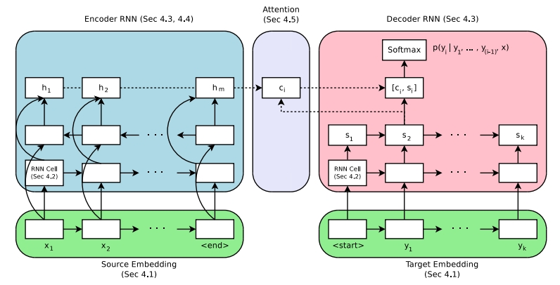

目录

<!-- TOC -->

- [1. 简介](#1-简介)
- [2. 安装](#2-安装)
- [3. 基本概念](#3-基本概念)
- [4. 示例：nmt](#4-示例nmt)
    - [4.1 数据格式](#41-数据格式)
    - [4.2 数据下载](#42-数据下载)
    - [4.3 小数据集：generate toy data](#43-小数据集generate-toy-data)
    - [4.4 定义模型](#44-定义模型)
    - [4.5 训练](#45-训练)
    - [4.6 预测](#46-预测)
    - [4.7 使用beamsearch进行decode](#47-使用beamsearch进行decode)
    - [4.8 基于checkpoint进行评估](#48-基于checkpoint进行评估)
    - [4.9 计算BLEU](#49-计算bleu)

<!-- /TOC -->

使用tf，但独立于tensorflow/models之外的一个seq2seq的框架：

主页：[https://google.github.io/seq2seq/](https://google.github.io/seq2seq/)

## 1. 简介

对应的论文：
[Massive Exploration of Neural Machine Translation Architectures](https://arxiv.org/pdf/1703.03906.pdf)

整体架构图：



## 2. 安装

首先安装python-tk（python的gui）

```
apt-get install python-tk
```

然后设置matplotlib的[backend](http://matplotlib.org/faq/usage_faq.html#what-is-a-backend)

```
echo "backend : Agg" >> $HOME/.config/matplotlib/matplotlibrc
```

然后安装seq2seq

```
cd seq2seq
pip install -e .
```

测试一下

```
python -m unittest seq2seq.test.pipeline_test
```

## 3. 基本概念


## 4. 示例：nmt

经典：
+ [Neural Machine Translation by Jointly Learning to Align and Translate](https://arxiv.org/abs/1409.0473)
+ [Neural Machine Translation and Sequence-to-sequence Models: A Tutorial (Neubig et al.)](https://arxiv.org/pdf/1703.01619.pdf)
+ [Tensorflow Sequence-To-Sequence Tutorial](https://www.tensorflow.org/tutorials/seq2seq)

### 4.1 数据格式

正常的分词是空格切分或者常用的分词工具（如Moses的[tokenizer.perl](https://github.com/moses-smt/mosesdecoder/blob/master/scripts/tokenizer/tokenizer.perl)、框架有[spacy](https://spacy.io/docs/usage/processing-text)/[nltk](http://www.nltk.org/api/nltk.tokenize.html)/[stanford的分词](https://nlp.stanford.edu/software/tokenizer.shtml)）。

但用于nmt时存在如下问题：
+ nmt输出的是在词上的概率分布，所以如果可能的词很多，那么会非常慢。如果vocabulary中有拼错的词和派生词，那vocabulary就可能趋向无穷大……而我们实际上可能会**人工限制vocabulary size在10,000-100,000的范围内。**
+ loved和loving来自同一词根，但却被当成完全不同的两个词来看待。

对于这种**open vocabulary**的问题一，一种解决方法就是从给定的文本中学习**subword units**。例如，loved可以被分成lov和ed，loving可以被分成lov和ing。这样，一方面可以产生新的词（unknown words），另一方面，可以缩减vocabulary size。本示例用到的就是**[Byte Pair Encoding (BPE)](https://arxiv.org/pdf/1508.07909.pdf)**

用法：

```
# Clone from Github
git clone https://github.com/rsennrich/subword-nmt
cd subword-nmt

# Learn a vocabulary using 10,000 merge operations
./learn_bpe.py -s 10000 < train.tok > codes.bpe

# Apply the vocabulary to the training file
./apply_bpe.py -c codes.bpe < train.tok > train.tok.bpe
```

结果如下，会用对不常见的词（如例子中的Nikitin）使用```@@```进行切分。

```
Madam President , I should like to draw your attention to a case in which this Parliament has consistently shown an interest. It is the case of Alexander Ni@@ ki@@ tin .
```

### 4.2 数据下载

使用预处理过的English-German WMT'16 Translation Task的数据集进行训练。 参考wmt16_en_de.sh，需要自定义```OUTPUT_DIR```变量。这个脚本下载数据、使用Moses Tokenizer进行分词、清理了training data、学习了约32,000的vocabulary大小的subword units.也可以直接去google drive下载预处理过的[WMT'16 EN-DE Data (502MB)](https://drive.google.com/open?id=0B_bZck-ksdkpM25jRUN2X2UxMm8)。

格式如下：

<html>
<center>
<table border="2" cellspacing="0" cellpadding="6" rules="all" frame="border">

<thead>
<tr>
<th scope="col" class="left">文件名</th>
<th scope="col" class="left">描述</th>

</tr>
</thead>

<tbody>
<tr>
<td class="left">train.tok.clean.bpe.32000.en</td>
<td class="left">The English training data, one sentence per line, processed using BPE.</td>
</tr>
<tr>
<td class="left">train.tok.clean.bpe.32000.de</td>
<td class="left">The German training data, one sentence per line, processed using BPE.</td>
</tr>
<tr>
<td class="left">vocab.bpe.32000</td>
<td class="left">The full vocabulary used in the training data, one token per line.</td>
</tr>
<tr>
<td class="left">newstestXXXX.*</td>
<td class="left">Development and test data sets, in the same format as the training data. We provide both pre-processed and original data files used for evaluation. </td>
</tr>

</tbody>
</table></center>
</html>	

然后需要设置环境变量：

```
# Set this to where you extracted the downloaded file
export DATA_PATH=

export VOCAB_SOURCE=${DATA_PATH}/vocab.bpe.32000
export VOCAB_TARGET=${DATA_PATH}/vocab.bpe.32000
export TRAIN_SOURCES=${DATA_PATH}/train.tok.clean.bpe.32000.en
export TRAIN_TARGETS=${DATA_PATH}/train.tok.clean.bpe.32000.de
export DEV_SOURCES=${DATA_PATH}/newstest2013.tok.bpe.32000.en
export DEV_TARGETS=${DATA_PATH}/newstest2013.tok.bpe.32000.de

export DEV_TARGETS_REF=${DATA_PATH}/newstest2013.tok.de
export TRAIN_STEPS=1000000
```

### 4.3 小数据集：generate toy data

直接跑toy.sh就行了,然后设置一下环境变量

```
export DATA_PATH=
export DATA_TYPE=copy # or reverse

export VOCAB_SOURCE=${DATA_PATH}/nmt_data/toy_${DATA_TYPE}/train/vocab.sources.txt
export VOCAB_TARGET=${DATA_PATH}/nmt_data/toy_${DATA_TYPE}/train/vocab.targets.txt
export TRAIN_SOURCES=${DATA_PATH}/nmt_data/toy_${DATA_TYPE}/train/sources.txt
export TRAIN_TARGETS=${DATA_PATH}/nmt_data/toy_${DATA_TYPE}/train/targets.txt
export DEV_SOURCES=${DATA_PATH}/nmt_data/toy_${DATA_TYPE}/dev/sources.txt
export DEV_TARGETS=${DATA_PATH}/nmt_data/toy_${DATA_TYPE}/dev/targets.txt

export DEV_TARGETS_REF=${DATA_PATH}/nmt_data/toy_${DATA_TYPE}/dev/targets.txt
export TRAIN_STEPS=1000
```

### 4.4 定义模型

标准的模型是[seq2seq with attention](https://arxiv.org/abs/1409.0473),它有大量的超参数。在example_configs下有small/medium/large等conf，例如，medium的conf:

```
model: AttentionSeq2Seq
model_params:
  attention.class: seq2seq.decoders.attention.AttentionLayerBahdanau
  attention.params:
    num_units: 256
  bridge.class: seq2seq.models.bridges.ZeroBridge
  embedding.dim: 256
  encoder.class: seq2seq.encoders.BidirectionalRNNEncoder
  encoder.params:
    rnn_cell:
      cell_class: GRUCell
      cell_params:
        num_units: 256
      dropout_input_keep_prob: 0.8
      dropout_output_keep_prob: 1.0
      num_layers: 1
  decoder.class: seq2seq.decoders.AttentionDecoder
  decoder.params:
    rnn_cell:
      cell_class: GRUCell
      cell_params:
        num_units: 256
      dropout_input_keep_prob: 0.8
      dropout_output_keep_prob: 1.0
      num_layers: 2
  optimizer.name: Adam
  optimizer.params:
    epsilon: 0.0000008
  optimizer.learning_rate: 0.0001
  source.max_seq_len: 50
  source.reverse: false
  target.max_seq_len: 50
```

### 4.5 训练

**单GPU（例如TitanX），即使是small模型，训练WMT'16 English-German数据要收敛得好几天。在8GPU的集群上，用tf的分布式训练，large模型需要2-3天。**而对于toy数据，在cpu上，1000 step大概要10min。

```
export MODEL_DIR=${TMPDIR:-/tmp}/nmt_tutorial
mkdir -p $MODEL_DIR

python -m bin.train \
  --config_paths="
      ./example_configs/nmt_small.yml,
      ./example_configs/train_seq2seq.yml,
      ./example_configs/text_metrics_bpe.yml" \
  --model_params "
      vocab_source: $VOCAB_SOURCE
      vocab_target: $VOCAB_TARGET" \
  --input_pipeline_train "
    class: ParallelTextInputPipeline
    params:
      source_files:
        - $TRAIN_SOURCES
      target_files:
        - $TRAIN_TARGETS" \
  --input_pipeline_dev "
    class: ParallelTextInputPipeline
    params:
       source_files:
        - $DEV_SOURCES
       target_files:
        - $DEV_TARGETS" \
  --batch_size 32 \
  --train_steps $TRAIN_STEPS \
  --output_dir $MODEL_DIR
```

其中，参数如下：
+ config_paths：可以输入多个conf文件，会**按顺序merge在一起**。nmt_small.yml描述模型类型及超参数，train_seq2seq.yml包括了common options，例如，追踪什么metric、多久sample一次response。
+ model_params：可以重写模型参数，yaml/json格式。大部分参数其实在nmt_small.yml里都定义了，但
+ input_pipeline_train：如何读训练集。例子中是parallel text format。
+ input_pipeline_dev：如何读验证集。例子中是parallel text format。
+ output_dir：模型的checkpoint和summary的存放位置。

使用tensorboard监控输出目录（有log_perplexity和bleu等指标）：

```
tensorboard --logdir $MODEL_DIR
```

### 4.6 预测

```
export PRED_DIR=${MODEL_DIR}/pred
mkdir -p ${PRED_DIR}

python -m bin.infer \
  --tasks "
    - class: DecodeText" \
  --model_dir $MODEL_DIR \
  --input_pipeline "
    class: ParallelTextInputPipeline
    params:
      source_files:
        - $DEV_SOURCES" \
  >  ${PRED_DIR}/predictions.txt
```

其中，
+ tasks：
+ model_dir：
+ model_dir：

### 4.7 使用beamsearch进行decode

beamsearch并不是使用贪心的方法去寻找最可能的词，而是```keeps several hypotheses, or "beams", in memory and chooses the best one based on a scoring function. ```。可以通过指定model_params来使用beamsearch。另外，使用beamsearch会使预测时间变得**significantly longer**。

```
python -m bin.infer \
  --tasks "
    - class: DecodeText
    - class: DumpBeams
      params:
        file: ${PRED_DIR}/beams.npz" \
  --model_dir $MODEL_DIR \
  --model_params "
    inference.beam_search.beam_width: 5" \
  --input_pipeline "
    class: ParallelTextInputPipeline
    params:
      source_files:
        - $DEV_SOURCES" \
  > ${PRED_DIR}/predictions.txt
```

另外，上面的例子显示了，tasks参数可以传多个task进去；另外，还把结果存放在了${PRED_DIR}/beams.npz中。用法：

```
import numpy as np
r = np.load("/tmp/nmt_tutorial/pred/beams.npz")
print r.files
##得到：['predicted_ids', 'beam_parent_ids', 'log_probs', 'scores']
```

### 4.8 基于checkpoint进行评估

infer脚本默认只评估最新的checkpoint，如果想指定checkpoint，可以传```checkpoint_path```参数。

### 4.9 计算BLEU

以下命令可以计算bleu：

```
./bin/tools/multi-bleu.perl ${DEV_TARGETS_REF} < ${PRED_DIR}/predictions.txt
```

**注意：**

如果你使用toy造数据，可以直接```git clone https://github.com/daiwk/seq2seq.git```，然后运行dwk_train.sh即可。