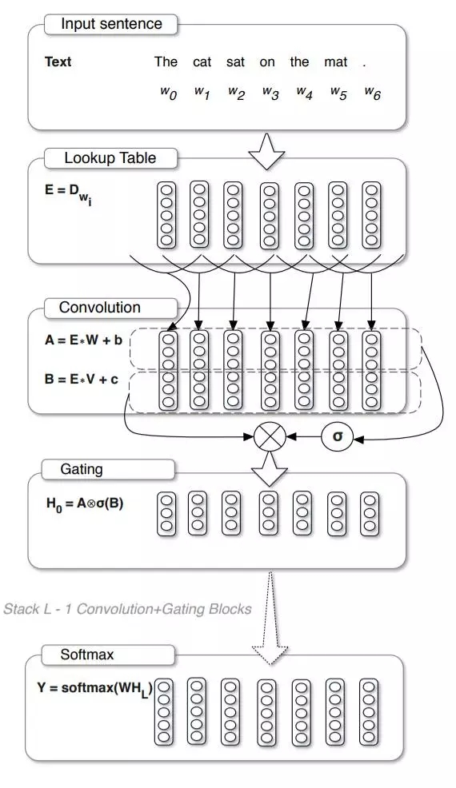

目录

<!-- TOC -->

<!-- /TOC -->

lua版本：

[https://github.com/facebookresearch/fairseq](https://github.com/facebookresearch/fairseq)

pytorch版本：

这个repository其实包括了很多：

+ Convolutional Neural Networks (CNN)
    + Dauphin et al. (2017): Language Modeling with Gated Convolutional Networks
    + Gehring et al. (2017): Convolutional Sequence to Sequence Learning
    + Edunov et al. (2018): Classical Structured Prediction Losses for Sequence to Sequence Learning
    + New Fan et al. (2018): Hierarchical Neural Story Generation
+ Long Short-Term Memory (LSTM) networks
    + Luong et al. (2015): Effective Approaches to Attention-based Neural Machine Translation
    + Wiseman and Rush (2016): Sequence-to-Sequence Learning as Beam-Search Optimization
+ Transformer (self-attention) networks
    + Vaswani et al. (2017): Attention Is All You Need
    + New Ott et al. (2018): Scaling Neural Machine Translation
    + New Edunov et al. (2018): Understanding Back-Translation at Scale

[https://github.com/pytorch/fairseq](https://github.com/pytorch/fairseq)

Convolutional Sequence to Sequence Learning

[https://arxiv.org/abs/1705.03122](https://arxiv.org/abs/1705.03122)

参考[https://www.zhihu.com/question/59645329](https://www.zhihu.com/question/59645329)小结了一下：

+ Trick1: 加上一个position embedding给CNN更多的“位置感”
+ Trick2: 给CNN的输出加gate
+ Trick3: 给CNN都加上residual connection
+ Trick4: 一层attention不够那就上叠加的attention然后就好用了

参考[http://www.dataguru.cn/article-12165-1.html](http://www.dataguru.cn/article-12165-1.html)

传统的seq2seq模型是基于RNN来实现的，特别是LSTM，这就带来了计算量复杂的问题。Facebook作出大胆改变，**将编码器、解码器、注意力机制甚至是记忆单元全部替换成卷积神经网络**。虽然单层CNN只能看到固定范围的上下文，但是**将多个CNN叠加起来就可以很容易将有效的上下文范围放大。**Facebook将此模型成功地应用到了英语-法语机器翻译、英语-德语机器翻译，不仅刷新了二者前期的记录，而且还将训练速度提高了一个数量级，无论是GPU还是CPU上。

用于语言建模的**Gated CNN**模型如下图所示，可以看到，

+ 最上层的word embedding操作与传统的语言建模没有区别，
+ 紧接着就是对这些embedding向量划分时间窗并做卷积操作，注意这里使用了两个卷积神经网络，
    + 这两个神经网络中的其中一个通过激活函数一个与另外一个进行相乘，得到最终的输出。
    + 其中一个卷积神经网络的功能就是充当了闸门的作用，即控制着多少有用的信息作为最终的输出。

<html>
 

 

</html>

其中的CNN可以参考一下[http://paddlepaddle.org/documentation/docs/zh/1.0/beginners_guide/basics/recommender_system/index.html](http://paddlepaddle.org/documentation/docs/zh/1.0/beginners_guide/basics/recommender_system/index.html)

n个词，emb是k，输入nxk，filter的大小是hxk，一个filter做卷积就得到一个n-h+1维的向量，即第二张图的一列，这个例子是有4个卷积核，那第二张图里就有4列，然后这个"时间维的"max-pooling就是对这四列，每列的所有元素求max(相当于对于每列有一个pooling，它的大小和这一列一样大)，最终得到4个元素。

<html>
 

 

</html>

如上图，对于编码器，原始的单词首先需要经过embedding层得到其相应的embedding向量，然后将embedding向量作为Gated CNN的输入，这里需要注意的是，为了保证经过卷积操作之后与之前的输入长度一致，卷积需要做pad操作。模型中有两个地方都使用到了GLU(Gated Linear Unit)，我在图中已经用红色字眼标出，编码器的embedding和解码器的embedding分别通过各自的GLU单元得到各自的分布式状态，将两个状态矩阵进行点乘即可得到注意力权重，图中已用红色字体Attention标出，具体的注意力权重的计算如下公式所示：

`\[
a^l_{ij}=\frac{exp(d^l_i\cdot z^u_j)}{\sum ^m_{t=1}exp(d^l_i\cdot z^u_t)}
\]`

注意到图中编码器的embedding和编码器的状态进行相加，并且乘上注意力权重，得到的结果文中称之为条件输入c，这里我们可以对比传统的注意力机制，传统的注意力机制是直接将注意力权重和编码器的状态进行相乘，而这里引入了embedding量，文中解释是因为embedding可以在做预测的时候可以结合具体元素的信息，增加了位置感，条件输入c的计算如下图公式所示：

`\[
c^l_{i}=\sum ^m_{j=1}a^l_{ij}(z^u_j+e_j)
\]`

将条件输入c加上解码器的状态，即可得到输出序列的概率。作者最终在机器翻译上相比其他RNN的模型速度提高了近10倍。

