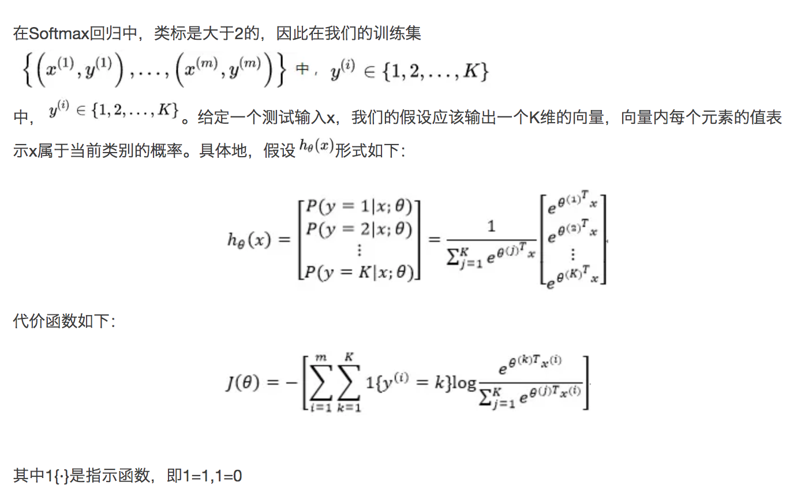
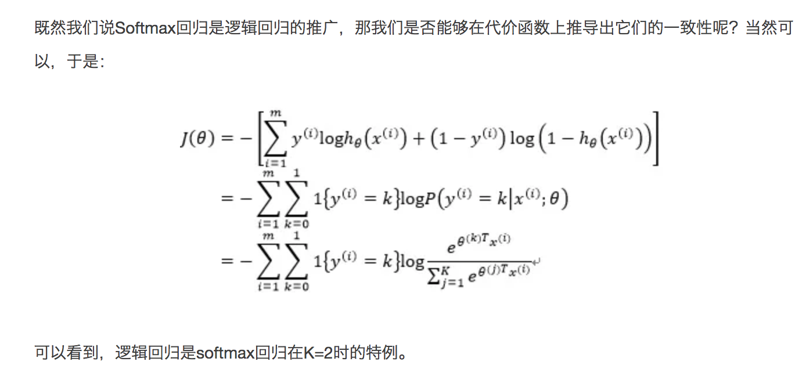
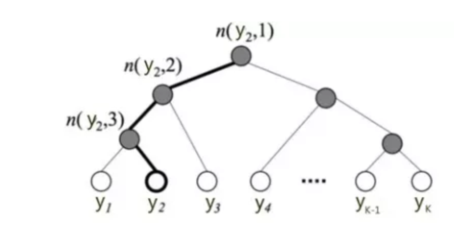
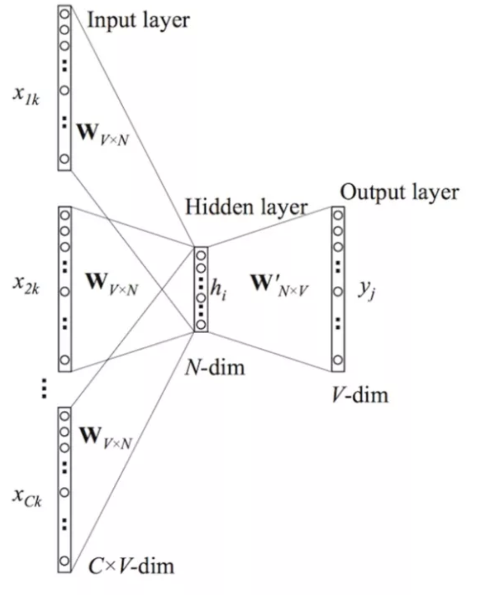
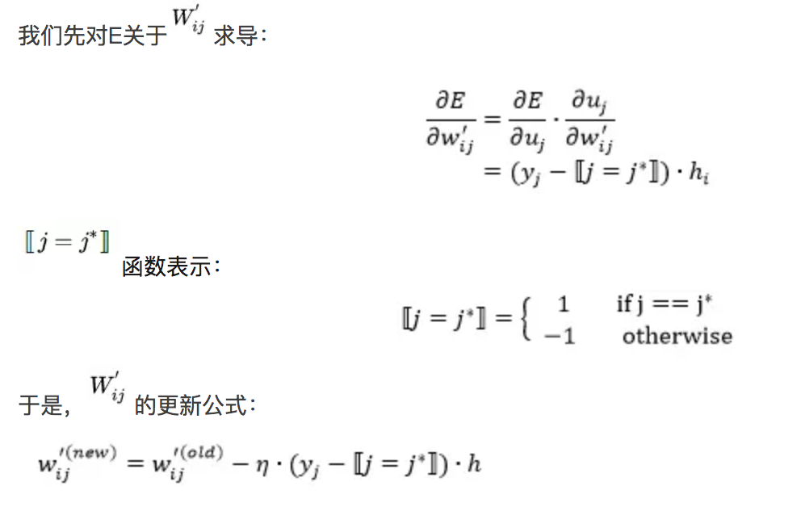
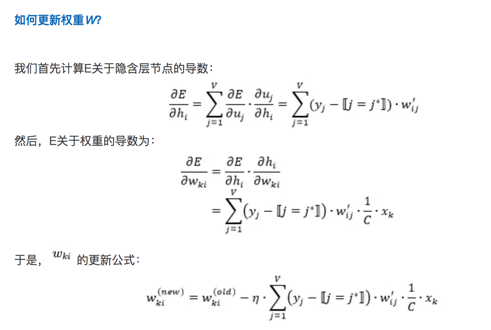
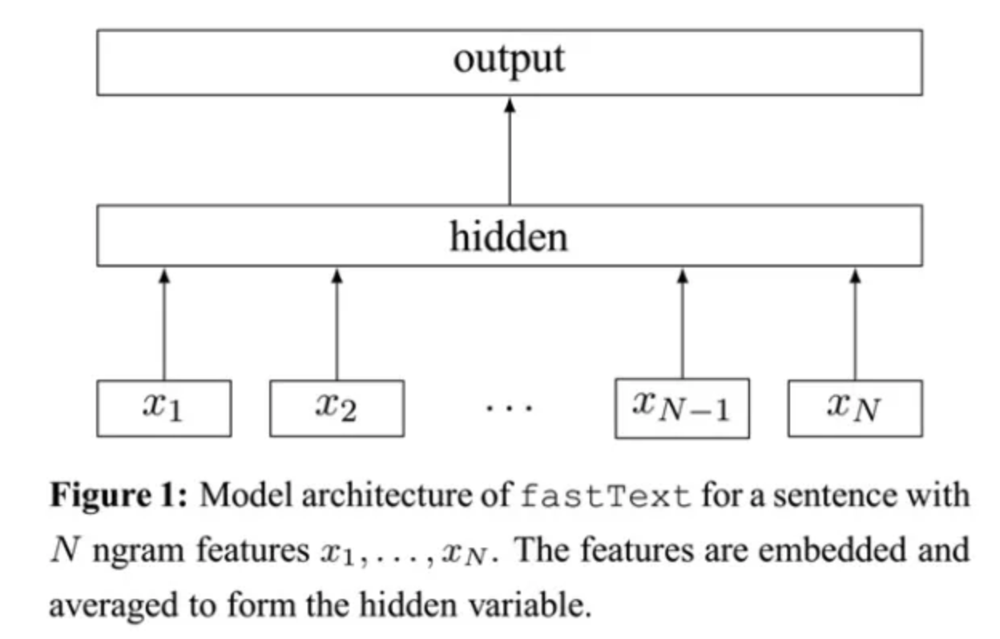

目录
<!-- TOC -->

- [0. 原理](#0-原理)
    - [0.1 softmax回归](#01-softmax回归)
    - [0.2 分层softmax](#02-分层softmax)
    - [0.4 n-gram](#04-n-gram)
    - [0.5 CBOW](#05-cbow)
        - [0.5.1 前向传播](#051-前向传播)
        - [0.5.2 反向传播](#052-反向传播)
    - [0.6 skip-gram](#06-skip-gram)
    - [0.7 fasttext](#07-fasttext)
- [1. bin使用方法](#1-bin使用方法)
    - [训练](#训练)
    - [预测](#预测)
- [2. python使用方法](#2-python使用方法)
    - [安装](#安装)

<!-- /TOC -->

paper: 

【提出fasttext的paper】[Bag of Tricks for Efficient Text Classification](https://arxiv.org/pdf/1607.01759v3.pdf)

[Enriching Word Vectors with Subword Information](https://arxiv.org/pdf/1607.04606.pdf)

website: [https://fasttext.cc/](https://fasttext.cc/)【有pretrained-vectors可以下载】

## 0. 原理

参考[fastText原理及实践](https://mp.weixin.qq.com/s?__biz=MzA3MzI4MjgzMw==&mid=2650736673&idx=4&sn=d5cb11250b28912accbc08ddb5d9c97b&chksm=871acc5fb06d45492ee54f3ff42e767bdc668d12c615b8ddc7e0aaeae7748aafe1aa53686176&mpshare=1&scene=1&srcid=0126lb9yqb0yUzJ30cmJc7ML&pass_ticket=5bhFv%2FwprJeuXSNRdbTSRrHitcKLawmckNnlQIBt%2FjavQ3ytUGB53qdfRz7NsZP4#rd)

在文本分类任务中，fastText（浅层网络）往往能取得和深度网络相媲美的精度，却在训练时间上比深度网络快许多数量级。在标准的多核CPU上， 能够训练**10亿词级别语料库**的词向量在**10分钟之内**，能够分类有着**30万多类别**的**50多万句子**在**1分钟**之内。

### 0.1 softmax回归

softmax回归被称作多项逻辑回归（multinomial logistic regression），是逻辑回归在处理多类别任务上的推广。

<html>
<br/>

<br/>
</html>

<html>
<br/>

<br/>
</html>

### 0.2 分层softmax

softmax中，我们需要对所有的K个概率做归一化，这在`\(|y|\)`很大时非常耗时。分层softmax的基本思想是使用树的层级结构替代扁平化的标准Softmax，在计算`\(P(y=j)\)`时，只需计算**一条路径上的所有节点的概率值**，无需在意其它的节点。

<html>
<br/>

<br/>
</html>

树的结构是根据**类标的频数**构造的**霍夫曼树**。

+ **K**个不同的类标组成所有的**叶子**节点。
+ **K-1个内部节点**作为内部参数。
+ 从根节点到某个叶子节点经过的节点和边形成一条路径，路径长度被表示为`\(L(y_j)\)`。

`\[
p(y_j)=\prod _{l=1}^{L(y_j)-1}\sigma (\left \lfloor n(y_j,l+1)=LC(n(y_j,l)) \right \rfloor \cdot \theta _{n(y_j,l)} ^TX) 
\]`

其中，

+ `\(l\)`表示第几层（从1开始）；
+ `\(\sigma (\cdot )\)`表示sigmoid函数；
+ `\(LC(n)\)`表示n节点的左孩子；
+ `\(\left \lfloor \right \rfloor \)`是一个特殊的函数，定义如下：

`\[
\left \lfloor x \right \rfloor =\left\{\begin{matrix}
1, if x =true
\\ -1,otherwise
\end{matrix}\right.
\]`

+ `\(\theta _{n(y_j,l)}\)`是中间节点`\(n(y_j,l)\)`的参数

高亮的节点和边是**从根节点到`\(y_2\)`的路径**，路径长度`\(L(y_2)=3\)`，

`\[
\\P(y_2)=P(n(y_2,1),left)P(n(y_2,2),left)P(n(y_2,3),right)
\\=\sigma (\theta _{n(y_2,1)}^TX) \cdot \sigma (\theta _{n(y_2,2)}^TX) \cdot \sigma (-\theta _{n(y_2,3)}^TX) 
\]`

于是，从根节点走到叶子节点`\(y_2\)`，其实是做了3次二分类的lr。通过分层的Softmax，计算复杂度一下从`\(|K|\)`降低到**`\(log_2|K|\)`**。

### 0.4 n-gram

基本思想是将文本内容按照字节顺序进行大小为N的滑动窗口操作，最终形成长度为N的字节片段序列。n-gram产生的特征只是作为文本特征的候选集，你后面可能会采用信息熵、卡方统计、IDF等文本特征选择方式筛选出比较重要特征。

### 0.5 CBOW

CBOW模型的基本思路是：用上下文预测目标词汇。

<html>
<br/>

<br/>
</html>

+ 输入层由目标词汇y的上下文单词`\({x_1,...,x_c}\)`组成，`\(x_i\)`是一个one-hot后的V维向量；
+ 隐层是N维向量h；
+ 输出层是one-hot编码后的目标词y

权重：

+ 每个输入向量通过VxN维的权重矩阵W（C个向量，共享同一个W）连接到隐层
+ 隐层通过V*N维的权重矩阵W'连接到输出层

因为词库V往往非常大，使用标准的softmax计算相当耗时，于是CBOW的输出层采用的是分层Softmax。

#### 0.5.1 前向传播

**隐层的输出是C个上下文单词向量先求和，然后乘以W,再取平均**，得到的一个N维向量:

`\[
h=\frac{1}{C}W \sum ^C_{i=1}x_i 
\]`

然后计算输出层的每个节点：`\(u_j=v'_{w_j}^T \cdot h\)`。

其中的`\(v'_{w_j}\)`是矩阵W'的第j列**(W'是N行V列，即，第j个词对应的N维向量)**，`\(u_j\)`就是一个N维向量和N维向量的转置乘出来的一个值，

最后，`\(u_j\)`作为softmax的输入，得到`\(y_j\)`：

`\[
y_j=p(w_{y_j}|w_1,...,w_C)=\frac {exp(u_j)}{\sum ^V_{j'=1}exp(u_{j'})}
\]`

#### 0.5.2 反向传播

定义损失函数，objective是最大化给定输入上下文，target单词的条件概率如下：

<html>
<br/>
<br/>
</html>

更新W'：

<html>
<br/>
<br/>
</html>

更新W：

<html>
<br/>
<br/>
</html>

### 0.6 skip-gram

### 0.7 fasttext

word2vec把语料库中的**每个单词当成原子**的，它会为每个单词生成一个向量。这**忽略了单词内部的形态特征**，比如：“apple” 和“apples”，"xx公司"和"xx"，两个单词都有较多公共字符，即它们的内部形态类似，但是在传统的word2vec中，这种单词内部形态信息因为它们被转换成不同的id丢失了。

为了克服这个问题，fastText使用了**字符级别**的**n-grams**来表示一个单词。例如，apple的3-gram如下：

“<ap”,  “app”,  “ppl”,  “ple”, “le>”

<表示前缀，>表示后缀。进一步，我们可以用这5个trigram的向量叠加来表示“apple”的词向量。

好处：

1. 对于**低频词生成的词向量**效果会更好。因为它们的n-gram可以和其它词共享。
2. 对于**训练词库之外的单词(未登录词)**，仍然可以构建它们的词向量。我们可以叠加它们的字符级n-gram向量。

注：当然，最新的方法其实是[BPE](https://daiwk.github.io/posts/nlp-nmt.html#71-backbone%E6%A8%A1%E5%9E%8B)。

fastext的架构图如下：

<html>
<br/>
<br/>
</html>

相同点：

和CBOW一样，fastText模型也只有三层：输入层、隐含层、输出层（Hierarchical Softmax），输入都是多个经向量表示的单词，输出都是一个特定的target，隐含层都是对**多个词向量的叠加平均**。

不同点：

+ CBOW的输入是目标单词的上下文，fastText的输入是**多个单词**及**其n-gram特征**，这些特征用来表示单个文档；
+ CBOW的输入单词被onehot编码过，fastText的输入特征是被embedding过；
+ word2vec是一个无监督算法，而fasttext是一个有监督算法。CBOW的输出是目标词汇，fastText的输出是文档对应的类标。

对于N篇文档，最小化针对所有文档的 negative loglikelihood(其实就是多分类的交叉熵)：

`\[
-\frac {1}{N}\sum ^N_{n=1}y_nlog(f(BAx_n))
\]`

其中，`\(x_n\)`是第n篇文档的normalized bag of features。A是基于word的look-up table，即词的embedding向量，`\(Ax_n\)`是将word的embedding向量找到后相加或者取平均，得到hidden向量。B是函数f的参数，f是softmax。

## 1. bin使用方法

编译好的bin地址：[https://daiwk.github.io/assets/fasttext](https://daiwk.github.io/assets/fasttext)

### 训练

+ 训练数据demo：[https://daiwk.github.io/assets/train_demo_fasttext.txt](https://daiwk.github.io/assets/train_demo_fasttext.txt)

格式(空格分割)：

```
__label__xx w1 w2 w3 ...
```

+ 训练命令：

```
./fasttext supervised -input train_demo_fasttext.txt -output haha.model
```

高级参数：

```
-minn 1 -maxn 6: 不用切词，1-6直接n-gram
```

### 预测


+ 测试数据demo：[https://daiwk.github.io/assets/test_demo_fasttext.txt](https://daiwk.github.io/assets/test_demo_fasttext.txt)

格式(空格分割）：

```
__label__00 key w1 w2 w3 ...
```

其中，**key可以中间有\1等任何分隔符，但key里面不能有空格**

+ 预测命令

```
cat test_demo_fasttext.txt | ./fasttext predict-prob haha.model.bin - 
```

+ 预测输出

```
key __label__xx probability
```

## 2. python使用方法

### 安装

```
xxxx/pip install cython
xxxx/pip install fasttext
```

