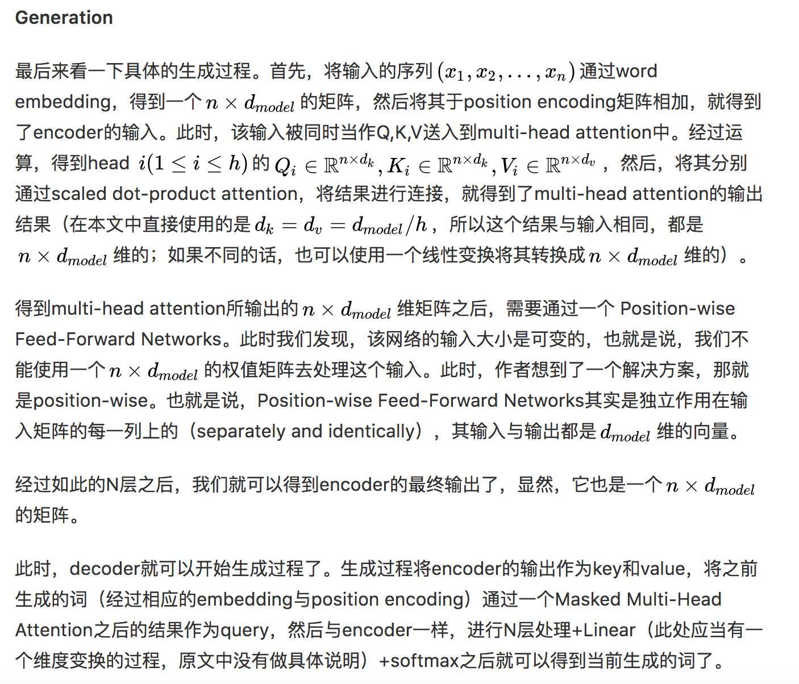

目录

<!-- TOC -->

- [1. 简介](#1-简介)
- [2. 模块化多任务训练](#2-模块化多任务训练)
- [3. 内置的最佳实践](#3-内置的最佳实践)
- [4. Attention Is All You Need](#4-attention-is-all-you-need)
    - [4.1 背景](#41-背景)
    - [4.2 架构](#42-架构)
        - [4.2.1 encoder and decoder stacks](#421-encoder-and-decoder-stacks)
        - [4.2.2 attention](#422-attention)
        - [4.2.3 position-wise feed-forward networks](#423-position-wise-feed-forward-networks)
        - [4.2.4 embeddings and softmax](#424-embeddings-and-softmax)
        - [4.2.5 positional encoding](#425-positional-encoding)
        - [4.2.6 生成过程](#426-生成过程)
    - [4.3 训练](#43-训练)
        - [4.3.1 训练数据和batching](#431-训练数据和batching)
        - [4.3.2 hardware & schedule](#432-hardware--schedule)
        - [4.3.3 optimizer](#433-optimizer)
        - [4.3.4 regularizatioin](#434-regularizatioin)
    - [4.4 结果](#44-结果)
        - [4.4.1 机器翻译](#441-机器翻译)
        - [4.4.2 model variations](#442-model-variations)
        - [4.4.3 English Constituency Parsing](#443-english-constituency-parsing)
- [5. One Model To Learn Them All](#5-one-model-to-learn-them-all)
- [6. 实践](#6-实践)
    - [6.1 安装cuda 8.0](#61-安装cuda-80)
    - [6.2 安装tensor2tensor](#62-安装tensor2tensor)
- [7. 代码解析](#7-代码解析)
    - [7.1 原版（tensor2tensor）](#71-原版tensor2tensor)
    - [7.2 单纯transformer](#72-单纯transformer)

<!-- /TOC -->

参考[一个模型库学习所有：谷歌开源模块化深度学习系统Tensor2Tensor](https://mp.weixin.qq.com/s?__biz=MzA3MzI4MjgzMw==&mid=2650728195&idx=1&sn=fee60fcf9d65a7fc1a4724c36518abc5&chksm=871b237db06caa6b4ec51f4bdb26d4f300d1fdb7883d067d16bb028fad5eeda85f9da205cafe&mpshare=1&scene=1&srcid=0620OFv5szDePHE3dhbAsDgH&pass_ticket=02kbaa2bXJP8WM9p0uBjXe%2F%2FwL4NTu7po2dscLQk1ttBb0YAEBNnLOiV07OR7Anm#rd)

github: [https://github.com/tensorflow/tensor2tensor](https://github.com/tensorflow/tensor2tensor)

## 1. 简介

T2T 能够帮助人们为各种机器学习程序创建最先进的模型，可应用于多个领域，如翻译、语法分析、图像信息描述等，大大提高了研究和开发的速度。T2T 中也包含一个数据集和模型库，其中包括谷歌近期发布的几篇论文中提出的最新模型（Attention Is All You Need、Depthwise Separable Convolutions for Neural Machine Translation 和 One Model to Learn Them All）。

T2T 库中的两个模型：SliceNet 和 Transformer 的表现超过了此前的业界最佳水平 GNMT+MoE。其中，Transformer 的分数超过 GNMT 模型 3.8 分，而 GNMT 已经超过基准水平（基于短语的翻译系统 MOSES）4 分了。值得注意的是，**使用 T2T，你可以用一块 GPU，一天的时间实现此前业界最佳水准的表现：使用小型 Transformer 模型，在单 GPU 训练一天时间后可以达到 24.9 的 BLEU 分数。**现在，所有人都可以自己构建最好的翻译模型了。

## 2. 模块化多任务训练

T2T 库构建于 TensorFlow 之上，定义了深度学习系统所需的各个组件：数据集、模型架构、优化器、学习速率衰减方案、超参数等等。最重要的是，它实现了所有这些组件之间的标准对接形式，并使用了目前最好的机器学习方法。这样，你可以选择任何一组数据集、模型、优化器，然后设定超参数，开始训练，并查看它的性能。通过架构的模块化，**在输入和输出数据之间的每一块都是张量-张量的函数**。这意味着如果你对模型架构有了新想法，你无须改动整个模型，你可以保留嵌入部分、损失函数和其他所有部分，仅仅用自己的函数替换模型体的一部分，该函数将张量作为输入，并返回一个张量。

这意味着 T2T 很灵活，训练无需局限在一个特定的模型或数据集上。它如此容易以至于像著名的 LSTM 序列到序列模型这样的架构可通过几行代码被定义。你也可以在不同领域的多任务上训练一个单一模型，你甚至还可以同时在所有的数据集上训练一个单一模型。很高兴我们的 MultiModel（就像这样被训练并包含在 T2T 中）在很多任务上获得了好结果，甚至是在 ImageNet、MS COCO、WSJ、 WM 和 Penn Treebank 解析语料库上进行联合训练也不例外。这是首次单个模型被证明可以同时执行多个任务。

## 3. 内置的最佳实践

我们的首次发行也提供了脚本，可生成大量数据集（广泛用于研究社区），一些模型，大量超参数配置，trade 的其他重要技巧的一个执行良好的实现。尽管全部列举它们很难，如果你决定用 T2T 运行你的模型，将会免费获得序列的正确填充（padding），相应的交叉熵损失，调试良好的 Adam 优化器参数，自适应批处理，同步的分布式训练，调试良好的图像数据增强，标签平滑和大量的超参数配置（包括上述在翻译方面取得当前最佳结果的超参数配置）。

例如，考虑一下把英语语句解析成其语法选区树（grammatical constituency tree）。这个问题被研究了数十年，人们费了很大劲给出了可靠的方法。它可被称为序列到序列问题，可通过神经网络来解决，但它过去常常需要很多调试。借助 T2T，我们只需几天就可以添加解析数据集生成器，并调节我们的注意力转换器模型以训练这一问题。

## 4. Attention Is All You Need

链接：[https://arxiv.org/abs/1706.03762](https://arxiv.org/abs/1706.03762)

主要的序列转换模型（dominant sequence transduction model）都是基于复杂的 RNN 或 CNN的encoder-decoder模型。表现最佳的模型也需通过注意力机制（attention mechanism）连接编码器和解码器。**我们提出了一种新型的简单网络架构——Transformer，它完全基于注意力机制，彻底放弃了循环和卷积。**两项机器翻译任务的实验表明，这些模型的**翻译质量更优，同时更并行，所需训练时间也大大减少。**我们的模型在 WMT 2014 英语转德语的翻译任务中取得了 BLEU 得分 28.4 的成绩，领先当前现有的最佳结果（包括集成模型）超过 2 个 BLEU 分值。在 WMT 2014 英语转法语翻译任务上，在 8 块 GPU 上训练了 3.5 天之后，我们的模型获得了新的单模型顶级 BLEU 得分 41.0，只是目前文献中最佳模型训练成本的一小部分。我们表明 Transformer 在其他任务上也泛化很好，把它成功应用到了有大量训练数据和有限训练数据的英语组别分析上。

### 4.1 背景

rnn需要当前时间步的状态，以及之前时间步的状态，所以这种序列特性天生地（inherently）难以并行，当序列较长时，由于内存有限，这缺陷尤为明显。最近的解决方法主要有两种：factorization tricks[《Factorization tricks for LSTM networks》](https://arxiv.org/abs/1703.10722)和conditional computation[《Outrageously large neural networks: The sparsely-gated mixture-of-experts layer》](https://arxiv.org/abs/1701.06538)[Conditional computation, where parts of the network are active on a per-example basis, has been proposed in theory as a way of dramatically increasing model capacity without a proportional increase in computation.]。**但序列计算的局限性一直还在。**

注意力机制往往只是与rnn结合使用，可以不需要关心输入输出序列的distance就能对输入输出序列的依赖关系进行建模(allows modeling of dependencies without regard to their distance in the input or output sequences.)。

本文的Transformer避开了recurrence，只用attention，便可以刻画出输入和输出的依赖关系。由于并行性得到了提升，训练时间可以缩短到8个P100 GPU只要12小时，并且翻译质量有所提升。

Extended Neural GPU([《Can active memory replace attention?》](https://arxiv.org/abs/1610.08613))、ByteNet([《Neural machine translation in linear time》](https://arxiv.org/abs/1610.10099))、ConvS2S（[《Convolutional Sequence to Sequence Learning》](https://arxiv.org/abs/1705.03122)）都**使用CNN并行地计算所有输入和输出位置的隐层表示，从而减少序列计算。**其中，对任意两个输入和输出位置进行计算与他们间的距离有关，ConvS2S是线性时间复杂度，ByteNet是log时间复杂度。而Transformer则是常数时间复杂度(前提是the cost of reduced effective resolution due
to averaging attention-weighted positions, an effect we counteract with Multi-Head Attention)。

另外，self-attention(即intra-attention)是一种会对一个单独的序列的不同位置进行关联的注意力机制。

### 4.2 架构

沿用了encoder-decoder架构，框架用于解决由一个任意长度的源序列到另一个任意长度的目标序列的变换问题。即编码阶段将整个源序列编码成一个向量，解码阶段通过最大化预测序列概率，从中解码出整个目标序列。Transformer同样使用了encoder-decoder，在编码和解码阶段均使用stacked self-attention、point-wise和全连接。

#### 4.2.1 encoder and decoder stacks

<html>
<br/>


<br/>

</html>

+ encoder:

encoder堆叠了N=6层，每层有两个子层：

  + multi-head self-attention
  + position-wise的全连接层

这两个子层内均是residual connection，再加上layer normalization，即，`\(LayerNorm(x+Sublayer(x))\)`（即图中的Add&Norm），Sublayer是子层自己实现的函数。**为了方便这些residual connection，架构中的所有子层（包括embedding）,输出的维度均是`\(d_{model}=512\)`。**

注：LayerNorm是Batch Normalization的一个变体，BN针对一个minibatch的输入样本，计算均值和方差，基于计算的均值和方差来对某一层神经网络的输入X中每一个case进行归一化操作。但BN有两个明显不足：1、高度依赖于mini-batch的大小，实际使用中会对mini-Batch大小进行约束，不适合类似在线学习（mini-batch为1）情况；2、不适用于RNN网络中normalize操作：BN实际使用时需要计算并且保存某一层神经网络mini-batch的均值和方差等统计信息，对于对一个固定深度的前向神经网络（DNN，CNN）使用BN，很方便；但对于RNN来说，sequence的长度是不一致的，换句话说RNN的深度不是固定的，不同的time-step需要保存不同的statics特征，可能存在一个特殊sequence比其的sequence长很多，这样training时，计算很麻烦。但LN可以有效解决上面这两个问题。LN中同层神经元输入拥有相同的均值和方差，不同的输入样本有不同的均值和方差；而BN中则针对不同神经元输入计算均值和方差，同一个minibatch中的输入拥有相同的均值和方差。因此，LN不依赖于mini-batch的大小和输入sequence的深度，因此可以用于bath-size为1和RNN中对边长的输入sequence的normalize操作。参考[深度学习加速器Layer Normalization-LN](https://mp.weixin.qq.com/s?__biz=MzIxNDgzNDg3NQ==&mid=2247483765&idx=1&sn=be24746f5e99058a4b9e8e209848a717&chksm=97a0caa1a0d743b7440c224e17fdc8579a88793940470e6d028b34040f7385f2b99d4da17478&scene=21#wechat_redirect)

+ decoder:

decoder同样堆叠了N=6层。**在encoder的两个子层的基础上，decoder加了一个子层，即，对encoder的输出增加了一个masked multi-head attention层【通过添加mask，这个子层不要encoder的输出作为输入，只要output的embedding作为输入】。**连接一样是Add & Norm。另外，**还对self-attention子层进行了修改，prevent positions from attending to subsequent positions.** **由于输入的output embedding有一个position的offset，所以结合masking，可以保证对位置i的预测，只依赖于位置小于i的位置的输出。**

#### 4.2.2 attention

attention函数：将一个query和一系列的(key, value)对映射起来。其中，**query、key、value均是向量，维度分别为`\(d_k\)`, `\(d_k\)`, `\(d_v\)`。**最终的输出是各value的加权组合（v的权重w其实就是下面公式里V的系数`\(softmax(\frac{QK^T}{\sqrt{d_k}})\)`）：

`\[
q->[(k_1,v_1), (k_2,v_2), ...]->attention=w_1*v_1+w_2*v_2+...
\]`

<html>
<br/>


<br/>

</html>

其中权重是通过如下方法获取的：

+ scaled dot-product attention

query和所有key算点积，然后除以`\(\sqrt{d_k}\)`，然后算softmax，得到的就是value的weight。实际应用中，一系列的query，记为矩阵`\(Q\)`，同样地，有`\(K\)`和`\(V\)`。

`\[
Attention(Q,K,V)=softmax(\frac{QK^T}{\sqrt{d_k}})V
\]`

<html>
<br/>


<br/>

</html>

有两种常用的attention：addictive attention和dot-product attention。dot-product attention和scaled dot-product attention的唯一区别就是，没有除以`\(\sqrt{d_k}\)`。addictive attention使用一个只有一个隐层的前馈神经网络计算weight。计算复杂度上二者相似，但由于有高度优化的矩阵乘法实现，所以dot-product的速度和空间利用会更好。

当`\(d_k\)`不大时，additive attention比没用scale的dot-product attention表现更好。但`\(d_k\)`很大时，点积会变得特别大，所以softmax会出现有些区域的梯度变得特别小（**例如，假设`\(q\)`和`\(k\)`是独立的随机变量，均值都是0，方差都是1，那么他们的点积`\(qk=\sum^{d_k}_{i=1}q_ik_i\)`的均值是0，方差是`\(d_k*1^2=d_k\)`。【详见下面的两个随机变量的和与积的方差推导】**），因此，需要通过除以`\(\sqrt{d_k}\)`来scale。

`\[
\\设 X 与 Y 是两个随机变量，则方差
\\V(X+Y)= V(X)+V(Y)+2Cov(X,Y)
\\V(X -Y)= V(X)+V(Y)-2Cov(X,Y)
\\特别的，当X，Y是两个不相关的随机变量则
\\V(X+Y)=V(X)+V(Y),V(X-Y)=V(X)+V(Y)
\]`

<html>
<br/>


<br/>

</html>

+ multi-head attention

实际应用中，并不是直接计算`\(d_{model}\)`维【前面提到了，架构中的所有子层（包括embedding）,输出的维度均是`\(d_{model}=512\)`】的query，key，value。而是把这`\(d_{model}\)`维拆成`\(h\)`份，所以`\(d_k=d_v=d_{model}/h\)`,(因为`\(d_{model}\)`是一样的，`\(h\)`也是一样的【本文设为8】，所以`\(d_k=d_v\)`)。而这个变换通过对`\(Q,K,W\)`各自进行一个线性变换，变成`\(d_k,d_k,d_v\)`维即可，最终通过concat(把`\(h\)`个结果首尾相连),然后再做一个线性变换，变成`\(d_{model}\)`维。

`\[
\\MultiHead(Q,K,V)=Concat(head_1,...,head_h)W^Q
\\where\ head_i=Attention(QW_i^Q,KW_i^K,VW_i^V)
\]`

其中，`\(W_i^Q\in \mathbb{R}^{d_{model}\times d_k}\)`，`\(W_i^K\in \mathbb{R}^{d_{model}\times d_k}\)`，`\(W_i^V\in \mathbb{R}^{d_{model}\times d_v}\)`，`\(W_i^O\in \mathbb{R}^{hd_v\times d_{model}}\)`

+ attention在本模型中的应用

  + encoder-decoder结构中，对当前层的decoder而言，query来自前一层的decoder，key和value来自encoder的输出。
  + encoder有self-attention层。在self-attention中，所有层的key，value和query都来自于前一层encoder的输出。因此，当前层的encoder的每个位置可以attend to前一层的所有位置。
  + 类似的，当前层的encoder的每个位置（例如位置i）可以attend to前一层的所有位置（包括位置i）。但为了保持auto-regressive特性，需要阻止leftword infomation（左边，即encoder的输出） 流入decoder，所以在scaled dot-product attention里使用mask把所有输入给softmax的都mask掉（**图figure2中的mask(opt)**）。相当于不要Q(上一层decoder的输出)，也不要K，V（encoder的输出，所以图里，encoder的输出在mask这层被干掉了，所以没画这条线）

#### 4.2.3 position-wise feed-forward networks

其实每个encoder和decoder层，除了attention子层之外，还有一个全连接的前馈网络。这个前馈网络会作用于每一个position。这个前馈网络包括了两种线性变换：

`\[
FFN(x)=ReLU(xW_1+b_1)W_2+b_2=max(0, xW_1+b_1)W_2+b_2
\]`

**不同位置的线性变换是一样的，不同层的变换是不同的。**

另一种理解方法其实就是，2个卷积层（kernel size=1）。本文中，`\(d_{model}=512\)`，inner-layer的维度是`\(d_ff=2048\)`。其实，这种position-wise的前馈网络实际上可以看作是另一种attention（附录里有说明。。。。）

#### 4.2.4 embeddings and softmax

与其他序列转换模型类似，本文也使用learned embeddings对input tokens和output tokens转换为`\(d_{model}\)`维的向量（架构图中的 input embedding和output embedding）。

同时也使用learned linear变换和softmax将decoder的输出转换为预测的下一个token的概率。

本文中，与[Using the output embedding to improve language models](https://arxiv.org/pdf/1608.05859.pdf)类似【看一看！！！。。。】，两个embedding层与pre-softmax transformation均共享同一个参数矩阵。

#### 4.2.5 positional encoding

鉴于本模型没有cnn也没有rnn，为了引入序列的位置信息，需要加入"position encoding"。在encoder和decoder的底部，也就是对应的embedding之后，加入了`\(d_{model}\)`维的position encoding，与embedding的维数一致，便于对二者求和。

本文使用的position encoding如下:

`\[
\\PE_{(pos,2i)}=sin(pos/10000^{2i/d_{model}})
\\PE_{(pos,2i+1)}=cos(pos/10000^{2i/d_{model}})
\]`

pos是位置，i是维度。因为对于任意固定的offset k，`\(PE_{pos+k}\)`能被表示为`\(PE_{pos}\)`的线性函数 。

#### 4.2.6 生成过程

参考[从《Convolutional Sequence to Sequence Learning》到《Attention Is All You Need》](https://zhuanlan.zhihu.com/p/27464080)


<html>
<br/>


<br/>

</html>

### 4.3 训练

#### 4.3.1 训练数据和batching

#### 4.3.2 hardware & schedule

#### 4.3.3 optimizer


#### 4.3.4 regularizatioin


### 4.4 结果

#### 4.4.1 机器翻译

#### 4.4.2 model variations

#### 4.4.3 English Constituency Parsing

Constituency: 选区；选区的选民；支持者；主顾
## 5. One Model To Learn Them All

单一模型同时在 ImageNet、多个翻译任务、image caption（COCO 数据集）、一个语音识别语料库和一个英文解析任务中获得训练。该模型架构整合了多个领域的组件。它包含卷基层、注意力机制和 sparsely-gated 层，其中的每个组件对于特定任务都是非常重要的，我们观察到添加这些组件并不会影响模型性能——在大多数情况下，它反而会改善任务中的表现。我们还展示了**多个任务联合训练会让仅含少量数据的任务收益颇丰，而大型任务的表现仅有少量性能衰减。**

链接：[https://arxiv.org/abs/1706.05137](https://arxiv.org/abs/1706.05137)

## 6. 实践

### 6.1 安装cuda 8.0

+ 安装cuda 8.0
+ 安装cuda 8.0所需的对应cudnn版本（t2t要求cudnn5.0 for cuda 8.0）

### 6.2 安装tensor2tensor

```
# Assumes tensorflow or tensorflow-gpu installed
pip install tensor2tensor

# Installs with tensorflow-gpu requirement
pip install tensor2tensor[tensorflow_gpu]

# Installs with tensorflow (cpu) requirement
pip install tensor2tensor[tensorflow]
```

## 7. 代码解析

### 7.1 原版（tensor2tensor）

[https://github.com/tensorflow/tensor2tensor](https://github.com/tensorflow/tensor2tensor)

### 7.2 单纯transformer

[https://github.com/Kyubyong/transformer](https://github.com/Kyubyong/transformer)

代码解析：
[https://blog.csdn.net/mijiaoxiaosan/article/details/74909076](https://blog.csdn.net/mijiaoxiaosan/article/details/74909076)
