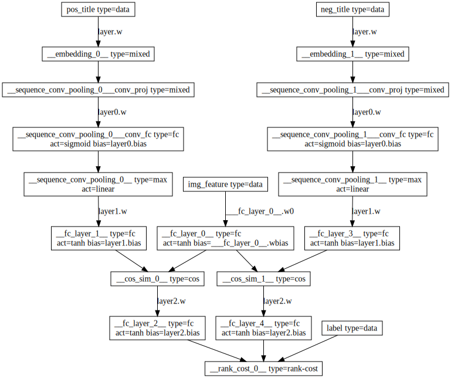
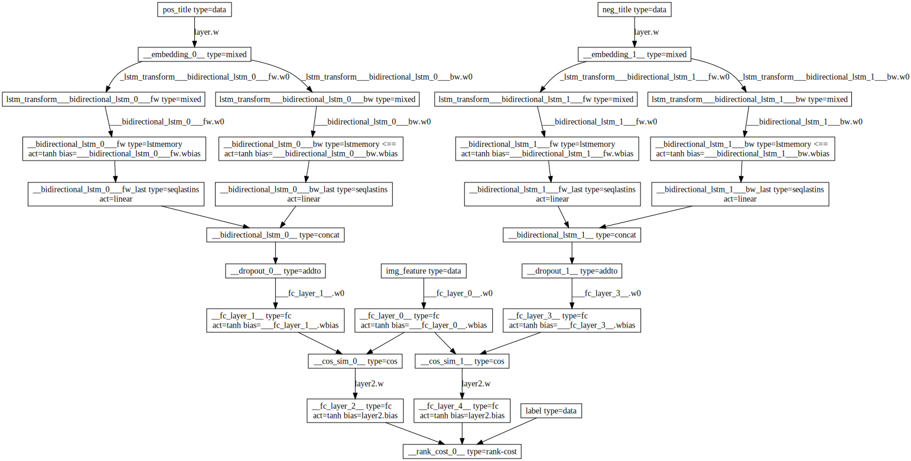
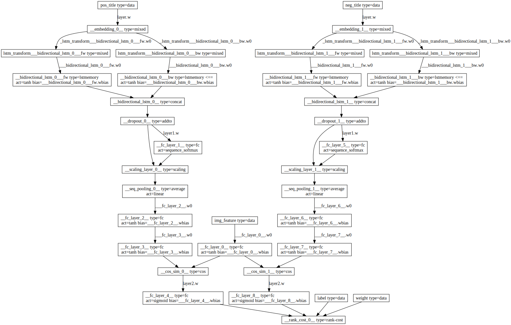
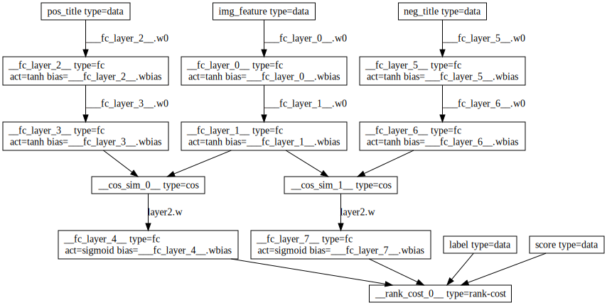
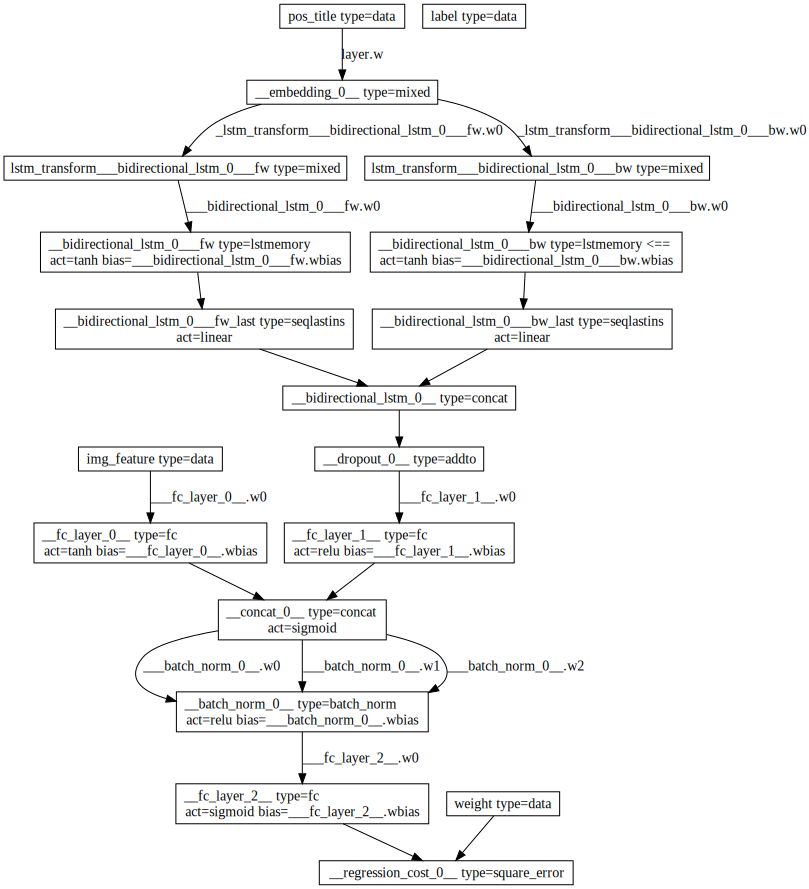
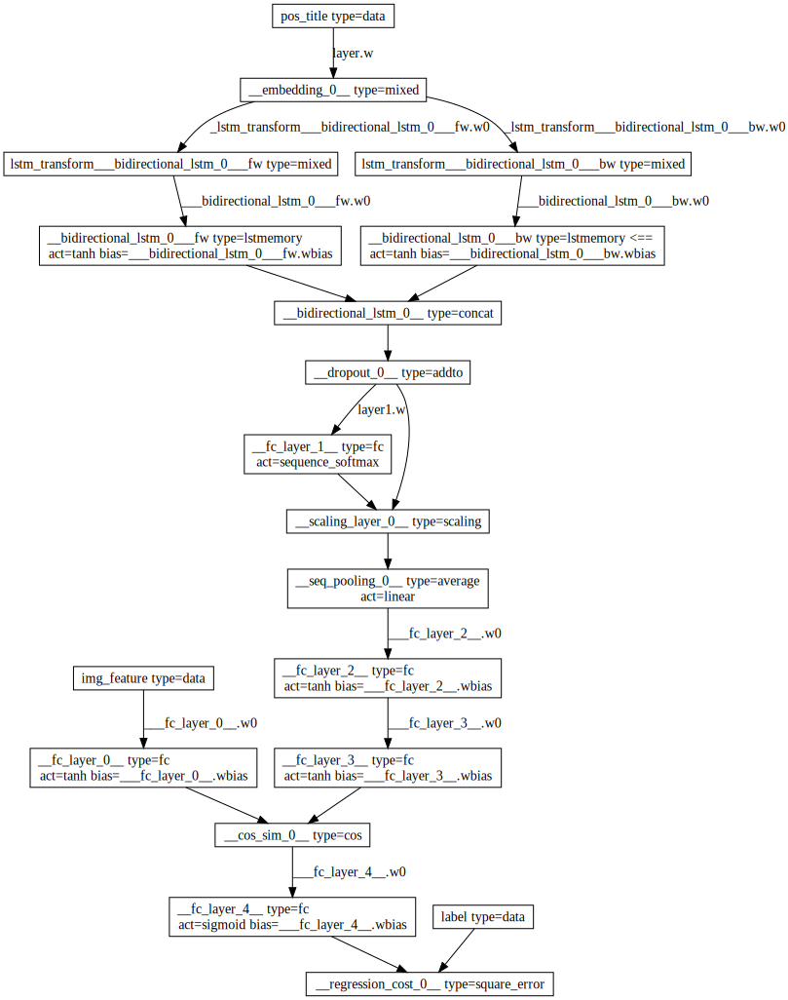

目录

<!-- TOC -->

- [1. 正负例直接算rank_cost](#1-正负例直接算rank_cost)
    - [1.1 basic模型](#11-basic模型)
    - [1.2 升级文本表示为bi-lstm](#12-升级文本表示为bi-lstm)
    - [1.3 训练数据更新（不使用标题）](#13-训练数据更新不使用标题)
    - [1.4 使用nlpc的wordembedding](#14-使用nlpc的wordembedding)
- [2. 回归现有模型](#2-回归现有模型)
    - [2.1 拟合图搜相关性模型](#21-拟合图搜相关性模型)
    - [2.2 拟合idl模型](#22-拟合idl模型)

<!-- /TOC -->

## 1. 正负例直接算rank_cost

使用rank_cost([paddle_v2的layers](http://www.paddlepaddle.org/doc/api/v2/config/layer.html)):

`\[
\begin{align}\begin{aligned}C_{i,j} & = -\tilde{P_{ij}} * o_{i,j} + log(1 + e^{o_{i,j}})\\o_{i,j} & =  o_i - o_j\\\tilde{P_{i,j}} & = \{0, 0.5, 1\} \ or \ \{0, 1\}\end{aligned}\end{align}
\]`

+ `\(C_{i,j}\)`是cross-entropy cost。
+ `\(\tilde{P_{i,j}}\)`是label。1是正序（左>右），0是逆序。
+ `\(o_i\)`和`\(o_j\)`是左、右的输出，是1维的。

weight的引入:参考[Ranking with Ordered Weighted Pairwise Classification](http://machinelearning.org/archive/icml2009/papers/163.pdf)

### 1.1 basic模型

文本采用word2vec获取标题向量，cos_sim计算 图文的相关性，然后用pairwise训练

<html>
 

 

</html>

### 1.2 升级文本表示为bi-lstm

目前简单抽取1k的图文配对（1k正+1k随机产出的负例），
+ 如果正例的相关性>负例的相关性，则暂认为：判定有效
+ 模型误判：如果正例判定不相关（<0）或负例判定相关(>0)

<html>
 

 

</html>

### 1.3 训练数据更新（不使用标题）

之前都用title，现在改成单元内的bidword,pic的pair对。并且，引入rank_cost的weight参数。

<html>
 

 

</html>

### 1.4 使用nlpc的wordembedding

把lstm改成nlpc的wordembedding。如果文本数据量少（短文本）的话，用这个其实就好了。不用接lstm。

<html>
 

 

</html>

## 2. 回归现有模型

把rank_cost换成regression_cost

### 2.1 拟合图搜相关性模型

<html>
 

 

</html>

### 2.2 拟合idl模型

<html>
 

 

</html>
