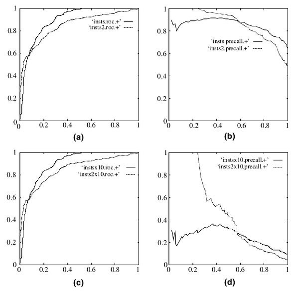
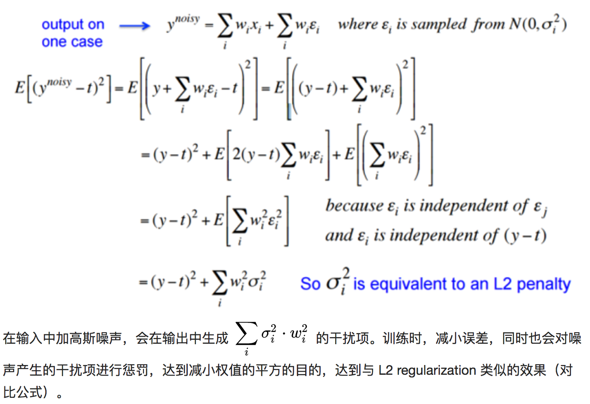
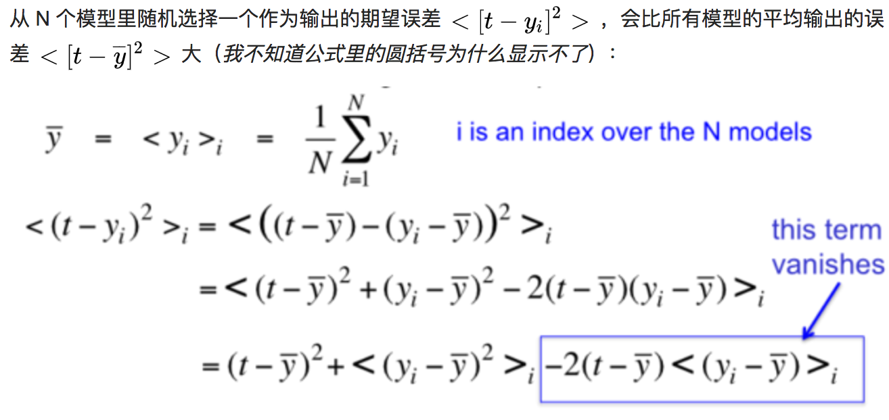

目录

<!-- TOC -->

- [1. 评价指标](#1-评价指标)
    - [1.1 关于auc和p/r/f1...](#11-关于auc和prf1)
- [1.2 auc](#12-auc)
- [1.3 roc curve v.s. precision-recall curve](#13-roc-curve-vs-precision-recall-curve)
    - [1.3.1 ROC与PR曲线](#131-roc与pr曲线)
- [2. 过拟合问题](#2-过拟合问题)
    - [2.1 获取更多数据](#21-获取更多数据)
        - [从数据源头获取更多数据](#从数据源头获取更多数据)
        - [根据当前数据集估计数据分布参数，使用该分布产生更多数据](#根据当前数据集估计数据分布参数使用该分布产生更多数据)
        - [数据增强（Data Augmentation）](#数据增强data-augmentation)
    - [2.2 使用合适的模型](#22-使用合适的模型)
        - [2.2.1 网络结构](#221-网络结构)
        - [2.2.2 训练时间（early stopping）](#222-训练时间early-stopping)
        - [2.2.3 限制权值/正则化](#223-限制权值正则化)
        - [2.2.4 增加噪声](#224-增加噪声)
            - [2.2.4.1 在输入中加噪声](#2241-在输入中加噪声)
            - [2.2.4.2 在权值上加噪声](#2242-在权值上加噪声)
            - [2.2.4.3 对网络的响应加噪声](#2243-对网络的响应加噪声)
    - [2.3 使用多种模型](#23-使用多种模型)
        - [2.3.1 bagging](#231-bagging)
        - [2.3.2 boosting](#232-boosting)
        - [2.3.3 dropout](#233-dropout)
    - [2.4 贝叶斯方法](#24-贝叶斯方法)
- [3. 模型参数与训练样本规模的关系](#3-模型参数与训练样本规模的关系)
    - [3.1 How much training data do you need](#31-how-much-training-data-do-you-need)
    - [3.2 lstm参数规模计算](#32-lstm参数规模计算)
    - [3.3 embedding layer参数规模计算](#33-embedding-layer参数规模计算)

<!-- /TOC -->

## 1. 评价指标

### 1.1 关于auc和p/r/f1...

参考[https://stackoverflow.com/questions/34698161/how-to-interpret-almost-perfect-accuracy-and-auc-roc-but-zero-f1-score-precisio](https://stackoverflow.com/questions/34698161/how-to-interpret-almost-perfect-accuracy-and-auc-roc-but-zero-f1-score-precisio)

One must understand crucial difference between AUC ROC and "point-wise" metrics like accuracy/precision etc. ROC is a function of a threshold. Given a model (classifier) that outputs the probability of belonging to each class we usually classify element to the class with the highest support. However, sometimes we can get better scores by changing this rule and requiring one support to be 2 times bigger than the other to actually classify as a given class. This is often true for imbalanced datasets. This way you are actually modifing the learned prior of classes to better fit your data. ROC looks at **"what would happen if I change this threshold to all possible values"** and then AUC ROC computes the integral of such a curve.

Consequently:

+ **high AUC ROC vs low f1 or other "point" metric,** means that your classifier currently does a bad job, however you can find the threshold for which its score is actually pretty decent
+ **low AUC ROC and low f1 or other "point" metric,** means that your classifier currently does a bad job, and even fitting a threshold will not change it
+ **high AUC ROC and high f1 or other "point" metric,** means that your classifier currently does a decent job, and for many other values of threshold it would do the same
+ **low AUC ROC vs high f1 or other "point" metric,** means that your classifier currently does a decent job, however for many other values of threshold - it is pretty bad

## 1.2 auc

首先，P/R/accuracy/F-measure如下：
`\[\\precision=\frac{TP}{所有预测为正例的样本}=\frac{TP}{TP+FP}
\\recall=\frac{TP}{所有真正的正例}=\frac{TP}{TP+FN}
\\accuracy=\frac{所有预测对的}{全量}=\frac{TP+TN}{P+N}
\\F-measure=\frac{2}{\frac{1}{presion}+\frac{1}{recall}}
\]`

ROC曲线（Receiver Operating Characteristic），y轴是TPR(就是recall)，x轴是FPR(1-specificity)。(所有我预测为P的样本里，拿预测对的去算tpr(纵轴)，预测错的去算fpr(横轴))
`\[\\TPR=\frac{TP}{所有真正的正例}=\frac{TP}{TP+FN}
\\FPR=\frac{FP}{所有真正的负例}=\frac{FP}{FP+TN}\]`

+ 第一个点，(0,1)，即FPR=0, TPR=1，这意味着FN（false negative）=0，并且FP（false positive）=0。这是一个完美的分类器，它将所有的样本都正确分类。
+ 第二个点，(1,0)，即FPR=1，TPR=0，类似地分析可以发现这是一个最糟糕的分类器，因为它成功避开了所有的正确答案。
+ 第三个点，(0,0)，即FPR=TPR=0，即FP（false positive）=TP（true positive）=0，可以发现该分类器预测所有的样本都为负样本（negative）。
+ 第四个点（1,1），分类器实际上预测所有的样本都为正样本。

从Mann-Whitney U statistic的角度来讲，AUC就是从所有1样本中随机选取一个样本，从所有0样本中随机选取一个样本，然后根据你的分类器对两个随机样本进行预测，把1样本预测为1的概率为p1，把0样本预测为1的概率为p0，p1>p0的概率就等于AUC。所以AUC反应的是分类器对样本的排序能力。

也就是说，一个关于AUC的很有趣的性质是，它和Wilcoxon-Mann-Witney Test是等价的。因此有如下的auc计算方法：

在有限样本中我们常用的得到概率的办法就是通过频率来估计之。这种估计随着样本规模的扩大而逐渐逼近真实值。这 和上面的方法中，样本数越多，计算的AUC越准确类似，也和计算积分的时候，小区间划分的越细，计算的越准确是同样的道理。

M为正类样本的数目，N为负类样本的数目，n为样本数（即n=M+N）。

可以首先对score从大到小排序，然后令最大score对应的sample 的rank为n，第二大score对应sample的rank为n-1，以此类推。然后把所有的正类样本的rank相加，再减去M-1种两个正样本组合的情况。得到的就是所有的样本中有多少对正类样本的score大于负类样本的score。然后再除以M×N。即 

`\[
AUC=\frac {\sum _{i\in positiveClass} rank_i-\frac{M(1+M)}{2}}{M\times N}
\]`

公式解释：

+ 为了求的组合中正样本的score值大于负样本，如果所有的正样本score值都是大于负样本的，那么第一位与任意的进行组合score值都要大，我们取它的rank值为n，但是n-1中有M-1是正样例和正样例的组合这种是不在统计范围内的（为计算方便我们取n组，相应的不符合的有M个），所以要减掉，那么同理排在第二位的n-1，会有M-1个是不满足的，依次类推，故得到后面的公式M*(M+1)/2，我们可以验证在正样本score都大于负样本的假设下，AUC的值为1
+ 根据上面的解释，不难得出，rank的值代表的是能够产生score前大后小的这样的组合数，但是这里包含了（正，正）的情况，所以要减去这样的组（即排在它后面正例的个数），即可得到上面的公式
+ 另外，特别需要注意的是，再存在score相等的情况时，对相等score的样本，需要 赋予相同的rank(无论这个相等的score是出现在同类样本还是不同类的样本之间，都需要这样处理)。具体操作就是再把所有这些score相等的样本 的rank取平均。然后再使用上述公式。 

awk代码见assets下的[calc_auc.sh](../assets/calc_auc.sh)

## 1.3 roc curve v.s. precision-recall curve

在PR曲线中，以Recall为x轴，Precision为y轴。Recall与TPR的意思相同，而Precision指正确分类的正样本数占总正样本的比例。

既然已经这么多评价标准，为什么还要使用ROC和AUC呢？因为ROC曲线有个很好的特性：当测试集中的正负样本的分布变化的时候，ROC曲线能够保持不变。在实际的数据集中经常会出现类不平衡（class imbalance）现象，即负样本比正样本多很多（或者相反），而且测试数据中的正负样本的分布也可能随着时间变化。下图是ROC曲线和Precision-Recall曲线[(The relationship between Precision-Recall and ROC curves)](http://mark.goadrich.com/articles/davisgoadrichcamera2.pdf)的对比：

<html>
 

 
</html>

在上图中，(a)和(c)为ROC曲线，(b)和(d)为Precision-Recall曲线。(a)和(b)展示的是分类其在原始测试集（正负样本分布平衡）的结果，(c)和(d)是将测试集中负样本的数量增加到原来的10倍后，分类器的结果。可以明显的看出，ROC曲线基本保持原貌，而Precision-Recall曲线则变化较大。

### 1.3.1 ROC与PR曲线

参考：
[https://stats.stackexchange.com/questions/7207/roc-vs-precision-and-recall-curves](https://stats.stackexchange.com/questions/7207/roc-vs-precision-and-recall-curves)

对于needle-in-haystack（大海捞针） type problems or problems where the "positive" class is more interesting than the negative class这类问题，更适合使用PR曲线。

`\[
\\ Precision=P(Y=1|\hat {Y}=1) 
\\ Recall=Sensitivity=P(\hat{Y}=1|Y=1)
\\ Specificity=P(\hat{Y}=1|Y=0)
\]`

组成ROC曲线的Sensitivity和Specificity，基于的都是the true class label(真实的label，而非预测的label)的条件概率(given的都是Y=1或者Y=0)。所以，不论`\(P(Y=1)\)`是多少，他们都是一样的。

而precision和sensitivity组成了pr曲线。Precision基于的条件是你预测的，所以，当不同的数据集有不同的类别分布时，`\(P(Y=1)\)`就会有差别，所以就有不同的baseline的`\(P(Y=1)\)`,那么，你预测的类别就会不一样。

如果你只关心某一种已知background probabily的population，而且正例比负例更加interesting（例如，文档检索领域precision很流行），由于Precision正好回答了"What is the probability that this is a real hit given my classifier says it is?"，所以，PR曲线更适合。

因此，
+ PR曲线适用于：『"How meaningful is a positive result from my classifier given the baseline probabilities of my problem?"』这类问题。
+ ROC曲线适用于：『"How well can this classifier be expected to perform in general, at a variety of different baseline probabilities?"』这类问题。

在ROC空间，ROC曲线越**凸向左上方**向效果越好。与ROC曲线左上凸不同的是，PR曲线是**右上凸**效果越好。

ROC和PR曲线都被用于评估机器学习算法对一个给定数据集的分类性能，每个数据集都包含固定数目的正样本和负样本。而ROC曲线和PR曲线之间有着很深的关系。

  定理1：对于一个给定的包含正负样本的数据集，ROC空间和PR空间存在一一对应的关系，也就是说，如果recall不等于0，二者包含完全一致的混淆矩阵。我们可以将ROC曲线转化为PR曲线，反之亦然。

  定理2：对于一个给定数目的正负样本数据集，一条曲线在ROC空间中比另一条曲线有优势，当且仅当第一条曲线在PR空间中也比第二条曲线有优势。（这里的“一条曲线比其他曲线有优势”是指其他曲线的所有部分与这条曲线重合或在这条曲线之下。）

## 2. 过拟合问题

如何防止过拟合：
[https://www.zhihu.com/question/59201590/answer/167392763](https://www.zhihu.com/question/59201590/answer/167392763)
本质是：数据太少+模型太复杂
具体表现就是最终模型在训练集上效果好；在测试集上效果差。模型泛化能力弱。

### 2.1 获取更多数据

#### 从数据源头获取更多数据

在很多情况下，大幅增加数据本身就不容易；另外，我们不清楚获取多少数据才算够。

#### 根据当前数据集估计数据分布参数，使用该分布产生更多数据

一般不用，因为估计分布参数的过程也会代入抽样误差

#### 数据增强（Data Augmentation）

例如在图像分类问题中，物体在图像中的位置、姿态、尺度，整体图片明暗度等都不会影响分类结果，所以，可以通过图像平移、翻转、缩放、切割等手段将数据库成倍扩充。

### 2.2 使用合适的模型

#### 2.2.1 网络结构

减少网络的层数、神经元个数等来限制网络的拟合能力。

#### 2.2.2 训练时间（early stopping）

当网络权值较小时，神经元的激活函数工作在线性区，此时神经元的拟合能力较弱（类似线性神经元）。权值太大or太小时，例如sigmoid，就会出现梯度消失。

因为我们在初始化网络的时候一般都是初始为较小的权值。训练时间越长，部分网络权值可能越大。如果我们在合适时间停止训练，就可以将网络的能力限制在一定范围内。

#### 2.2.3 限制权值/正则化

原理同上，但是这类方法直接将权值的大小加入到 Cost 里，在训练的时候限制权值变大。例如L2：

`\[C=C_0+\frac{\lambda}{2n}\sum _{i}w^2_i\]`

训练过程需要降低整体的 Cost，这时候，一方面能降低实际输出与样本之间的误差`\(C_0\)`，另一方面也能降低权值大小。

#### 2.2.4 增加噪声

##### 2.2.4.1 在输入中加噪声

噪声会随着网络传播，按照权值的平方放大，并传播到输出层，对误差 Cost 产生影响。

<html>
 

 

</html>

##### 2.2.4.2 在权值上加噪声

在初始化网络的时候，用0均值的高斯分布作为初始化。Alex Graves 的手写识别 RNN 就是用了这个方法
[A novel connectionist system for unconstrained handwriting recognition.](http://people.idsia.ch/~juergen/tpami_2008.pdf)

##### 2.2.4.3 对网络的响应加噪声

如在前向传播过程中，让默写神经元的输出变为 binary 或 random。这种做法会打乱网络的训练过程，让训练更慢，但据 Hinton 说，在测试集上效果会有显著提升。

### 2.3 使用多种模型

训练多个模型，以每个模型的平均输出作为结果。

<html>
 

 

</html>

#### 2.3.1 bagging

简单理解，就是分段函数的概念：用不同的模型拟合不同部分的训练集。以随机森林（Rand Forests）为例，就是训练了一堆互不关联的决策树。但由于训练神经网络本身就需要耗费较多自由，所以一般不单独使用神经网络做Bagging。

#### 2.3.2 boosting

既然训练复杂神经网络比较慢，那我们就可以只使用简单的神经网络（层数、神经元数限制等）。通过训练一系列简单的神经网络，加权平均其输出。

#### 2.3.3 dropout

在训练时，每次随机（如50%概率）忽略隐层的某些节点；这样，我们相当于随机从2^H个模型中采样选择模型。同时，由于每个网络只见过一个训练数据（每次都是随机的新网络），所以其实这是类似 bagging 的做法。

此外，而不同模型之间权值共享（共同使用这 H 个神经元的连接权值），相当于一种权值正则方法，实际效果比 L2 regularization 更好。

### 2.4 贝叶斯方法

## 3. 模型参数与训练样本规模的关系

### 3.1 How much training data do you need

10倍规则法——即是要训练出一个性能良好的模型，所需训练样本数量应是模型参数数量的10倍。

因而，借由10倍规则法，将估量训练样本数量的问题转换为只要知道模型中参数数量就可以训练出一个性能良好的模型问题。基于这一点这引发了一些争论：

（1）对于线性模型 ，例如逻辑回归模型。基于每个特征，模型都分配了相应的参数，从而使得参数的数量和输入的特征数量相等，然而这里可能存在一些问题：你的特征可能是稀疏的，所以，计数的特征数量并不是直接的。

译者注：我觉得这句话的意思是，稀疏特征，例如稀疏特征的编码是01001001对于模型的训练能够起到作用的特征是少数的，而不起作用的特征占大多数。依照上述线性规则，若模型对于每个特征分配相应的参数，也就是说对于无用的特征也分配了相应的参数，再根据10倍规则法，获取是模型参数数量10倍的训练样本集，此时的训练样本数量对于最佳的训练模型来说可能是超量的，所以，此时用10倍规则法得到的训练样本集未必能够真实地得出好的训练模型。

（2）由于规范化和特征选择技术，训练模型中真实输入的特征的数量少于原始特征数量。

译者注：我觉得这两点即是在解释上述利用10倍规则法来得到性能良好模型的理论是有一定的局限性，这个理论是相对于输入特征是完备且每个特征对于模型的训练都有一定的贡献程度的。但是对于（1）、（2）这两点所说的稀疏特征和特征降维技术的使用导致特征数量减少的情况，利用10倍规则法能够得到性能良好的模型的理论还有待进一步讨论。

解决上述（1）、（2）问题的一个办法即是：在提取特征时，你不仅要用到有类别标签的数据还要用到不带类别标签的数据来估计特征的数量。例如给定一个文本语料库，在标记数据进行训练之前，你可以通过统计每个单词出现的次数，来生成一个关于单词频率直方图，以此来理解你的特征空间。根据单词频率直方图，你可以去掉长尾词，来获得真实的、主要的特征数量，之后你可以运用10倍规则法来估测在得到性能良好的模型时，你所需要的训练样本数量。

与像逻辑回归这样的线性模型相比，神经网络模型提出了一组不同的问题。为了得到神经网络中参数的数量你需要：

（1）如果你的输入特征是稀疏的，计算嵌入层中（我觉得就是隐含层）参数数量。

（2）计算神经网络模型中的边数。

根本问题是在神经网络中参数之间的关系不再是线性的。所以基于逻辑回归模型的学习经验总结不再适用于神经网络模型。在像诸如神经网络这样的模型中，你可以将基于10倍规则法获取的训练样本数量作为在模型训练中输入的训练样本量的一个下界。

译者注：是在神经网络这样非线性模型中，要想获得一个性能良好的训练模型，所需训练数据最少为模型参数的10倍，实际上所需的训练数据应该比这个还多。

尽管会存在以上的争论，但是我的10倍规则法在大多数问题中都起到了作用。然而，带着对10倍规则法的疑问，你可以在开源工具箱Tensorflow中插入你自己的模型以及对训练样本的数量和模型的训练效果之间的关系作出一个假设，并通过模拟实验来研究模型的训练效果，如果你在运行过程中有了其它见解，欢迎随时分享。

翻译版：
[http://www.cnblogs.com/yymn/articles/5024354.html](http://www.cnblogs.com/yymn/articles/5024354.html)

原版：
[https://medium.com/@malay.haldar/how-much-training-data-do-you-need-da8ec091e956](https://medium.com/@malay.haldar/how-much-training-data-do-you-need-da8ec091e956)

### 3.2 lstm参数规模计算

[https://datascience.stackexchange.com/questions/10615/number-of-parameters-in-an-lstm-model](https://stackoverflow.com/questions/38080035/how-to-calculate-the-number-of-parameters-of-an-lstm-network)

[https://datascience.stackexchange.com/questions/10615/number-of-parameters-in-an-lstm-model](https://datascience.stackexchange.com/questions/10615/number-of-parameters-in-an-lstm-model)

### 3.3 embedding layer参数规模计算

[https://stackoverflow.com/questions/38189713/what-is-an-embedding-in-keras](https://stackoverflow.com/questions/38189713/what-is-an-embedding-in-keras)
