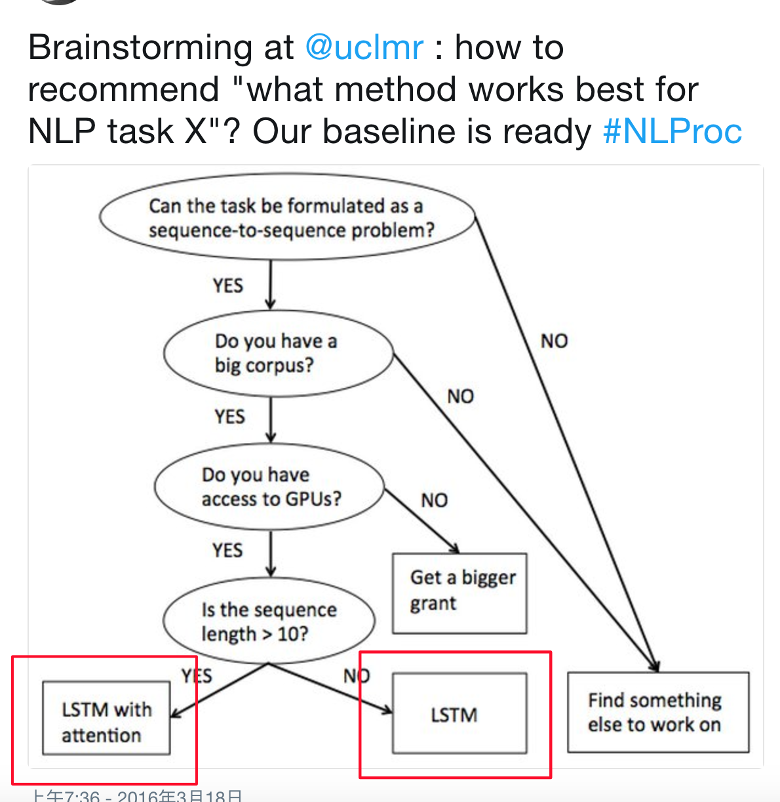

目录

<!-- TOC -->

- [introductioin](#introductioin)

<!-- /TOC -->

参考[http://ruder.io/deep-learning-nlp-best-practices/](http://ruder.io/deep-learning-nlp-best-practices/)

## introductioin

<html>
 

 
</html>

近两年来，一直有一个[running joke](https://twitter.com/IAugenstein/status/710837374473920512)，lstm with attention可以在任意任务上取得state-of-the-art的表现……但最近nlp领域有更多更有趣的研究来慢慢地远离这个标准的baseline。

