目录

<!-- TOC -->

- [0. 基础知识](#0-%E5%9F%BA%E7%A1%80%E7%9F%A5%E8%AF%86)
    - [特征离散化](#%E7%89%B9%E5%BE%81%E7%A6%BB%E6%95%A3%E5%8C%96)
    - [特征抽取](#%E7%89%B9%E5%BE%81%E6%8A%BD%E5%8F%96)
        - [特征文件](#%E7%89%B9%E5%BE%81%E6%96%87%E4%BB%B6)
        - [ins](#ins)
    - [训练（embedding训练/LR）](#%E8%AE%AD%E7%BB%83embedding%E8%AE%AD%E7%BB%83lr)
        - [ID化](#id%E5%8C%96)
        - [模型训练](#%E6%A8%A1%E5%9E%8B%E8%AE%AD%E7%BB%83)
        - [模型格式转换](#%E6%A8%A1%E5%9E%8B%E6%A0%BC%E5%BC%8F%E8%BD%AC%E6%8D%A2)
    - [指标](#%E6%8C%87%E6%A0%87)
        - [AUC定义](#auc%E5%AE%9A%E4%B9%89)
        - [AUC/QAUC/WQAUC计算](#aucqaucwqauc%E8%AE%A1%E7%AE%97)
            - [预估ctr计算](#%E9%A2%84%E4%BC%B0ctr%E8%AE%A1%E7%AE%97)
            - [AUC计算](#auc%E8%AE%A1%E7%AE%97)
            - [AUC汇总](#auc%E6%B1%87%E6%80%BB)
        - [模型校验](#%E6%A8%A1%E5%9E%8B%E6%A0%A1%E9%AA%8C)
- [1. 传统方法：](#1-%E4%BC%A0%E7%BB%9F%E6%96%B9%E6%B3%95)
    - [lr](#lr)
        - [OWLQN](#owlqn)
            - [牛顿法](#%E7%89%9B%E9%A1%BF%E6%B3%95)
            - [阻尼牛顿法](#%E9%98%BB%E5%B0%BC%E7%89%9B%E9%A1%BF%E6%B3%95)
            - [拟牛顿法 (Quasi-Newton Method)](#%E6%8B%9F%E7%89%9B%E9%A1%BF%E6%B3%95-quasi-newton-method)
            - [LBFGS—限域牛顿法](#lbfgs%E9%99%90%E5%9F%9F%E7%89%9B%E9%A1%BF%E6%B3%95)
            - [OWLQN方法](#owlqn%E6%96%B9%E6%B3%95)
                - [虚梯度](#%E8%99%9A%E6%A2%AF%E5%BA%A6)
                - [Line Search时限定象限](#line-search%E6%97%B6%E9%99%90%E5%AE%9A%E8%B1%A1%E9%99%90)
                - [OWLQN步骤](#owlqn%E6%AD%A5%E9%AA%A4)
        - [ftrl](#ftrl)
    - [lr+gbdt](#lrgbdt)
        - [LR](#lr)
        - [GBDT](#gbdt)
            - [回归树](#%E5%9B%9E%E5%BD%92%E6%A0%91)
            - [提升树算法（Boosting Decision Tree）](#%E6%8F%90%E5%8D%87%E6%A0%91%E7%AE%97%E6%B3%95boosting-decision-tree)
            - [GBDT](#gbdt)
            - [参数设置](#%E5%8F%82%E6%95%B0%E8%AE%BE%E7%BD%AE)
        - [LR+GBDT](#lrgbdt)
        - [引入id类特征](#%E5%BC%95%E5%85%A5id%E7%B1%BB%E7%89%B9%E5%BE%81)
- [2. 基于深度学习的ctr预估模型](#2-%E5%9F%BA%E4%BA%8E%E6%B7%B1%E5%BA%A6%E5%AD%A6%E4%B9%A0%E7%9A%84ctr%E9%A2%84%E4%BC%B0%E6%A8%A1%E5%9E%8B)

<!-- /TOC -->

## 0. 基础知识

### 特征离散化

[https://blog.csdn.net/u013385925/article/details/80143784](https://blog.csdn.net/u013385925/article/details/80143784)


### 特征抽取

#### 特征文件

格式

```shell
{ Fea_str \t fea_sign64 \t show_num \t clk_num \t ctr }
```

其中Fea_str：s{特征名字}：{特征内容}：slot

Feature作用如下：

+ 生成自解释特征词典，可以给下游，作为广告是否置信的依据。
+ 训练之前有个id化，会根据feature生成一份**全局词典**，并将instance中的**每一个sign映射到这个词典上**。
+ 保存的show和click值，在后面进行特征检查时有一定帮助，对比单个ins中该特征的show和click值以及该特征的整体的show click值，分析是否存在问题。

#### ins

格式

```shsell
{ Show_num clk_num fea1_sign64:1 fea2_sign64:1 ….fean_sign64:1}
```

sign是通过签名函数使“特征-字面-slot”映射到sign，作为特征的唯一标示。

slot的作用：
a. 训练时，不同的slot在训练的时候会有不同的惩罚因子。
b. 特征抽取时，不同slot会有不同的过滤条件。
c. 压缩数据时，**相同的slot的会放到一起，以slot排序**。
d. 计算sign时，**字面到sign的映射，会考虑PV使其分布均匀**。不让PV覆盖比较大的特征的ins覆盖过于集中，减小单个节点压力。

### 训练（embedding训练/LR）

整个流程主要包含下载数据、特征ID化、模型训练、模型格式转换，以及模型评估。

训练的主要过程是，将ins中用到的sign进行ID化，将ins分到不同的MPI机器上进行计算。使用模型进行训练，将训练得到的模型进行评估，通过计算其AUC值实现，**如果符合一定指标就认为模型可信**，将模型转换为要用的模式，也就是ID到sign的映射。

#### ID化

注：如果是LR，那这个weight就是一个float；如果是DNN的embedding，假设映射成一个8维向量，那这个weight就是这8维向量。

ID映射的输出有三个文件：

+ **全局的64位的sign到本地ID的映射**：对sign进行排序，平均分配到不同的MPI节点上，在各个节点上变为本地行号，因此将sign映射为[MPI节点-行号]这样一个本地ID，其中行号是32位int。这个全局号会存入fea_set文件，因此fea文件格式变为：```{sign 桶号:行号 show click ctr 特征字面}```，这个文件会传给format_model模块，进行模型format使用。
+ **每台机器上的本地ID和对应的权重及pv**：平均分配ins文件到不同的MPI节点上，也会对这些ins里的sign继续排序，变为本地ID进行模型训练。最终会整合成模型文件输出，```{桶号-行号 weight PV}```，在format阶段和fea文件进行format。
+ **每台机器上的标识这台机器存储了哪些sign的bitmap**：每个MPI节点用一个[fea个数]大小的位数组（**空间是全局sign的大小**），存放该机器上存在sign的信息，将本地的sign对应到全局sign位数组上，有该sign就置为1。

对于过来的一条ins，会将其分配到多台机器上，分别单独计算各自特征的权重值。

#### 模型训练

一台机器只计算本地的所有的ins下的特征权重，和bitmap对应后，将各个权重平均。再分到各个机器上，继续进行迭代计算新的特征权重。----感觉描述得不清楚。。

对于sigmoid`\(y=\frac{1}{1+e^{-wx}}\)`，它的导数是`\(\frac{\partial y}{\partial w}=y(1-y)\cdot (-x)\)`

对于LR，假设有`\(N\)`条样本，`\(n=1,2,...N\)`，那么对于第`\(n\)`条样本`\(y_n=sigmoid(wx_n)=\frac{1}{1+e^{-wx_n}}\)`，假设label是`\(t_n\)`，`\(t_n \in\{0,1\}\)`。交叉熵损失函数是：

`\[
Loss=\sum_{n=1}^{N}(t_nlogy_n+(1-_n)log(1-y_n))
\]`

推导梯度如下：

`\[
\begin{align*}
\frac{\partial Loss}{\partial w} &= \sum_{n=1}^{N}(t_n\frac{1}{y_n}\partial y_n-(1-t_n)\frac{1}{1-y_n}\partial y_n) \\ 
 &=  \sum_{n=1}^{N}(\frac{t_n}{y_n}-\frac{1-t_n}{1-y_n})\partial y_n \\
 &=  \sum_{n=1}^{N}(\frac{t_n-y_nt_n-y_n+y_nt_n}{y_n(1-y_n)})\partial y_n \\
 &=  \sum_{n=1}^{N}(\frac{t_n-y_n}{y_n(1-y_n)})\partial y_n \\
 &=  \sum_{n=1}^{N}(\frac{t_n-y_n}{y_n(1-y_n)})y_n(1-y_n)\cdot (-x_n) \\
 &=  \sum_{n=1}^{N}(y_n-t_n)x_n\\
\end{align*}
\]`

所以，计算第`\(n\)`条样本的梯度时，需要先算出`\(y_n\)`。对于特征离散化之后的情况，这里的`\(x_n\)`的空间是sign的空间，所以，如果一条样本有第i个特征，那么它的`\(x^{i}\)`是1，否则是0。

这里用`\(w_n^{i}(t)\)`表示第`\(n\)`条样本的第`\(i\)`个sign在`\(t\)`时刻的权重。假设总共有`\(N\)`条样本，`\(M\)`个sign。

在`\(t+1\)`时刻，对于`\(N\)`条ins而言，总共有10个特征，25个feasign，那这些feasign可能分布在4台机器上，比如第一台机器负责更新`\(sign^{3}\)`和`\(sign^{17}\)`的权重。总体来说，应该是分成以下几步吧吧吧：

+ master节点存有当前时刻各sign的权重值`\(w^{i}(t)\)`（应该是上一时刻更新完后的值）
+ 把对应权重发给对应的节点，例如，把`\(w^{3}(t)\)`和`\(w^{17}(t)\)`发给第一个节点
+ 节点1里有`\(N\)`个ins的`\(sign^{3}\)`和`\(sign^{17}\)`，那其实就有`\(N\)`行的`\(w_{n=1..N}^{3}(t)\)`和`\(N\)`行的`\(w_{n=1,..N}^{17}(t)\)`，把这两个`\(N\)`行的权重矩阵传给master
+ 比如第7条ins有`\(sign^{3}\)`和`\(sign^{22}\)`，分别来自节点1和节点2。那么把`\(w_{7}^{3}(t)\)`和`\(w_{7}^{22}(t)\)`求和，得到`\(d_{7}^(t)\)`，这里的`\(d\)`是一个`\(N*1\)`的向量。master对这`\(N\)`条样本算完这个`\(d\)`后，传给各节点
+ 对于节点1，拿到了`\(d\)`，对于`\(sign^{3}\)`，计算这`\(N\)`条样本每一条在`\(sign^{3}\)`上的梯度，得到一个`\(N*1\)`的梯度矩阵`\(G_{k=3}\)`。同理，对于`\(sign^{17}\)`，得到梯度矩阵`\(G_{k=17}\)`。
+ master收集各节点传回来的`\(G_k\)`，得到一个`\(N*M\)`的矩阵。一列是一个sign，对每一列的`\(N\)`个元素求和，得到这`\(N\)`条样本在这个sign上的总梯度。然后对`\(M\)`列的权重`\(w(t)\)`的每一列（sign）用对应的梯度进行更新。


#### 模型格式转换

模型训练结束后，完成**特征值和sign的对应**。

训练时每个节点用的是『桶号:行号』，这里通过那个全局bitmap，把这个id映射回原来的sign。所以输出的格式是```{Fean_sign64 \t weight \t pv}```。其中，Fean_sign64为feature的签名，weight即feature训练得到的权重，pv为feature展示的次数，从fea_set文件获取。

### 指标

+ AUC：衡量分类器排序质量的统计指标。全称Area Under roc Curve，为ROC曲线下的面积。在评估ctr model的AUC时，ROC曲线及AUC指标（ROC曲线下方的面积）的数值主要体现出的是**预估CTR与实际CTR排序关系的一致性**。实际的计算与其它应用有一定差别，此处计算AUC值的方式如show和click有关。
+ QAUC：每个query下的AUC值的简单平均。
+ WQAUC：WQAUC为query下AUC的展现加权平均

#### AUC定义

参考《百面》P30，假设正样本有P个，负样本有N个。横轴单位刻度设为`\(\frac{1}{N}\)`，纵轴单位刻度设为`\(\frac{1}{P}\)`，再根据模型输出的预测概率对样本进行**排序（从高到低）**。依次遍历样本，每遇到一个**正样本**，就沿**纵轴**方向画一个刻度的线，遇到一个**负样本**，就沿**横轴**方向画一个刻度的线，直到遍历完所有样本

在ctr预估场景中，ROC曲线的横轴是sum(noclk)=sum(show)-sum(clk)，纵轴是总点击数sum(click)。我们先对预估的ctr降序排列，将点依次绘制在坐标轴上，就形成了ROC曲线。曲线下方的面积/曲线终点与原点形成的矩形面积 就是AUC值。**每绘制一个点，与前一个点连接形成的直线斜率**就是`\(1-\frac{1}{ctr}\)`，也就是实际ctr越高，斜率越大。如果**保证ROC曲线的斜率递减**，就可以**保证曲线面积最大**。

换句话说，就是在**预估ctr递减的条件下，如果实际ctr也是递减的，AUC值最高，说明模型效果最好**。

**整体的AUC就是曲线下的面积除以曲线的起点、终点锚定矩型的面积。**

#### AUC/QAUC/WQAUC计算

##### 预估ctr计算

针对LR场景，比如总共有fea_size个特征，如果一条ins有其中的3个特征，比如`\(w_1,w_{23},w_{652}\)`，那就是在这fea_size的bitmap里，有3个位置是1，其他位置都是0，因为做了这个从原始特征值到sign的映射后，就不再看原始值了，所以，我们的`\(w_1x_1+w_{23}x_{23}+w_{652}x_{652}\)`其实就是`\(w_1+w_{23}+w_{652}\)`。所以，对于一条ins，它的预估ctr就是`\(\frac{1}{1+e^{-\sum {weight}}}\)`。为了计算方便，将CTR放大`\(10^16\)`倍，变成一个uint64的整数。

embed的时候 不就是在那个fea_size\*emb_size(比如10亿特征，8维向量，就是10亿\*8)的大矩阵里，比如你这条样本命中了3个feasign，就是取这3个对应的8维向量出来嘛。lr就是emb_size=1，所以是10亿\*1。

##### AUC计算

+ 计算AUC时，要求预估的ctr值满足桶内有序，桶间有序，做到全局有序。
+ 计算QAUC时，只要求相同query下的ctr值有序。

##### AUC汇总

+ AUC汇总

以两个分桶为例，每个分桶计算的AUC为图中的阴影部分。全局AUC部分需要补充P3部分的面积，

<html>
<br/>

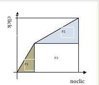
<br/>

</html>

看更多一点的桶：

<html>
<br/>

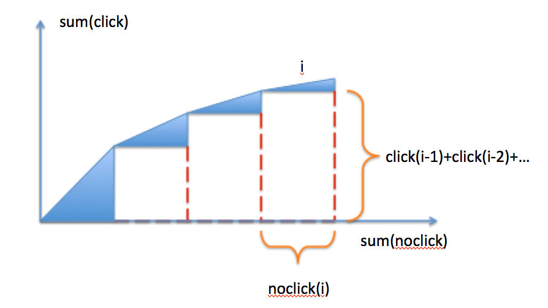
<br/>

</html>

这部分面积等于前i-1个桶的sum(click)乘以每i个桶的noclick。

+ QAUC/WAUC汇总

使用每个桶输出的`\(qauc_i\)`，`\(query\_num_i\)`，`\(wqauc_i\)`，`\(sum\_show_i\)`，使用如下公式计算整体的Qauc和Wqauc。

`\(QAUC= \sum (qauc_i * query\_num_i ) / \sum(query\_num_i)\)`
`\(WQAUC= \sum (wqauc_i * sum\_show_i ) / \sum( sum\_show_i)\)`


#### 模型校验

如果AUC值低于一定阈值会发出警报。

## 1. 传统方法：

### lr

#### OWLQN

##### 牛顿法

##### 阻尼牛顿法

##### 拟牛顿法 (Quasi-Newton Method)

##### LBFGS—限域牛顿法

##### OWLQN方法

###### 虚梯度

###### Line Search时限定象限

###### OWLQN步骤

#### ftrl


### lr+gbdt

[CTR预估中GBDT与LR融合方案](http://www.cbdio.com/BigData/2015-08/27/content_3750170.htm)

#### LR

LR映射后的函数值就是CTR的预估值。这种线性模型很容易并行化，处理上亿条训练样本不是问题，但线性模型学习能力有限，需要大量特征工程预先分析出有效的特征、特征组合，从而去间接增强LR 的非线性学习能力。

LR模型中的特征组合很关键，但又无法直接通过特征笛卡尔积 解决，只能依靠人工经验，耗时耗力同时并不一定会带来效果提升。

#### GBDT

参考[https://www.cnblogs.com/ScorpioLu/p/8296994.html](https://www.cnblogs.com/ScorpioLu/p/8296994.html)

参考[http://www.jianshu.com/p/005a4e6ac775](http://www.jianshu.com/p/005a4e6ac775)

GBDT又叫MART（Multiple Additive Regression Tree)，GBDT中的树是**回归树**（不是分类树），GBDT用来做回归预测，调整后也可以用于分类。每次迭代都在**减少残差的梯度方向新建立一颗决策树**，迭代多少次就会生成多少颗决策树。GBDT的思想使其具有天然优势，可以发现多种有区分性的特征以及特征组合，决策树的路径可以直接作为LR输入特征使用，省去了人工寻找特征、特征组合的步骤。这种通过GBDT生成LR特征的方式（GBDT+LR），业界已有实践（Facebook，Kaggle-2014），且效果不错。

##### 回归树

回归树总体流程类似于分类树，区别在于，回归树的每一个节点都会得一个预测值，以年龄为例，该预测值等于属于这个节点的所有人年龄的平均值。分枝时穷举每一个feature的每个阈值找最好的分割点，但衡量最好的标准不再是最大熵，而是最小化平方误差。也就是被预测出错的人数越多，错的越离谱，平方误差就越大，通过最小化平方误差能够找到最可靠的分枝依据。分枝直到每个叶子节点上人的年龄都唯一或者达到预设的终止条件(如叶子个数上限)，若最终叶子节点上人的年龄不唯一，则以该节点上所有人的平均年龄做为该叶子节点的预测年龄。

参考[http://blog.csdn.net/puqutogether/article/details/44593647](http://blog.csdn.net/puqutogether/article/details/44593647)

<html>
<br/>

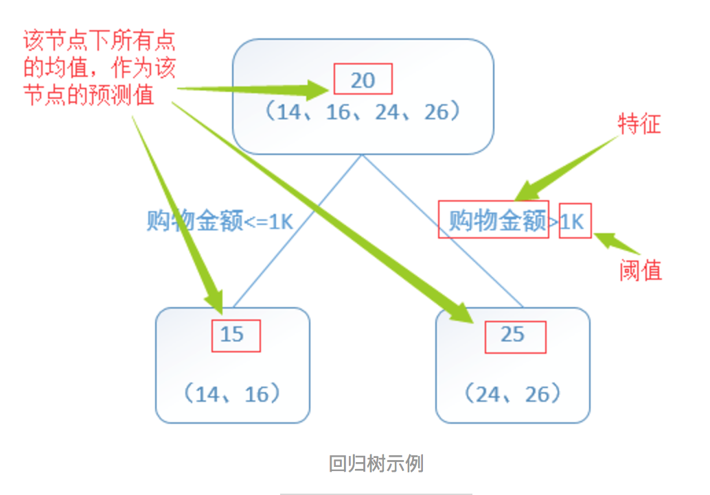
<br/>

</html>

算法如下：
<html>
<br/>

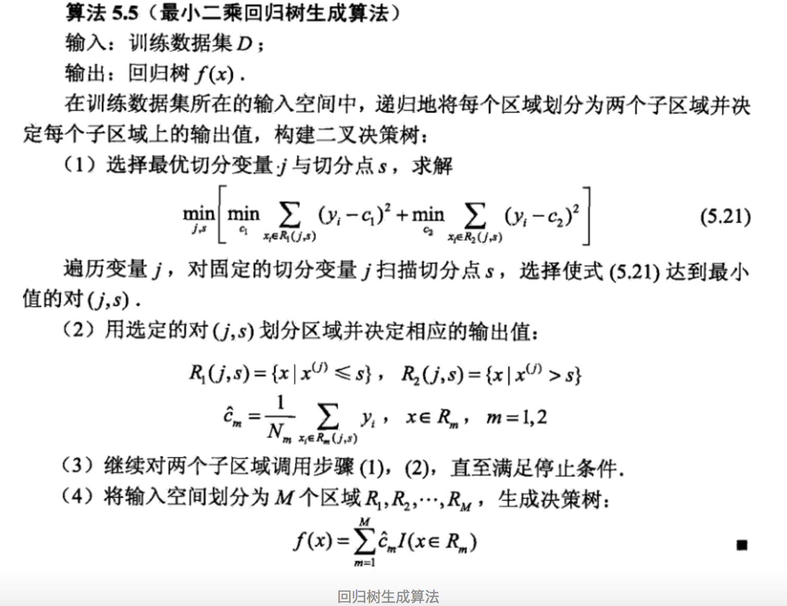
<br/>

</html>

参考[http://blog.csdn.net/suranxu007/article/details/49910323](http://blog.csdn.net/suranxu007/article/details/49910323)

##### 提升树算法（Boosting Decision Tree）

提升树是迭代多棵回归树来共同决策。当采用平方误差损失函数时，每一棵回归树学习的是之前所有树的结论和残差，拟合得到一个当前的残差回归树，残差的意义如公式：残差 = 真实值 - 预测值 。提升树即是整个迭代过程生成的回归树的累加。

训练集是4个人，A，B，C，D年龄分别是14，16，24，26。样本中有购物金额、上网时长、经常到百度知道提问等特征。
参考[http://blog.csdn.net/suranxu007/article/details/49910323](http://blog.csdn.net/suranxu007/article/details/49910323)

<html>
<br/>

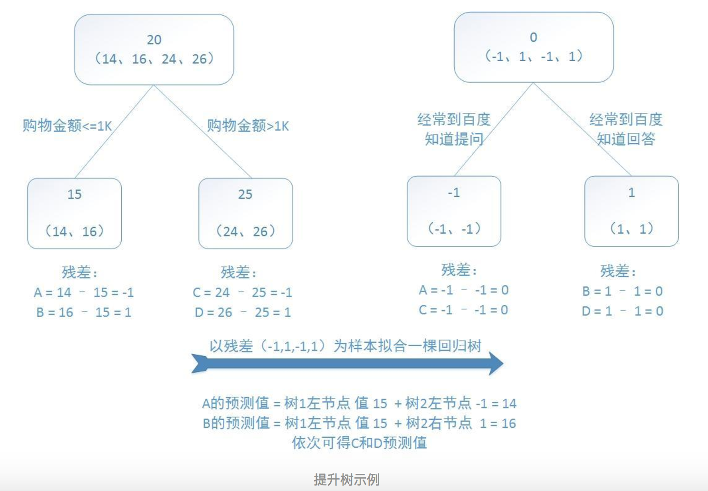
<br/>

</html>

预测值等于所有树值得累加，如A的预测值 = 树1左节点 值 15 + 树2左节点 -1 = 14。
算法如下：

<html>
<br/>

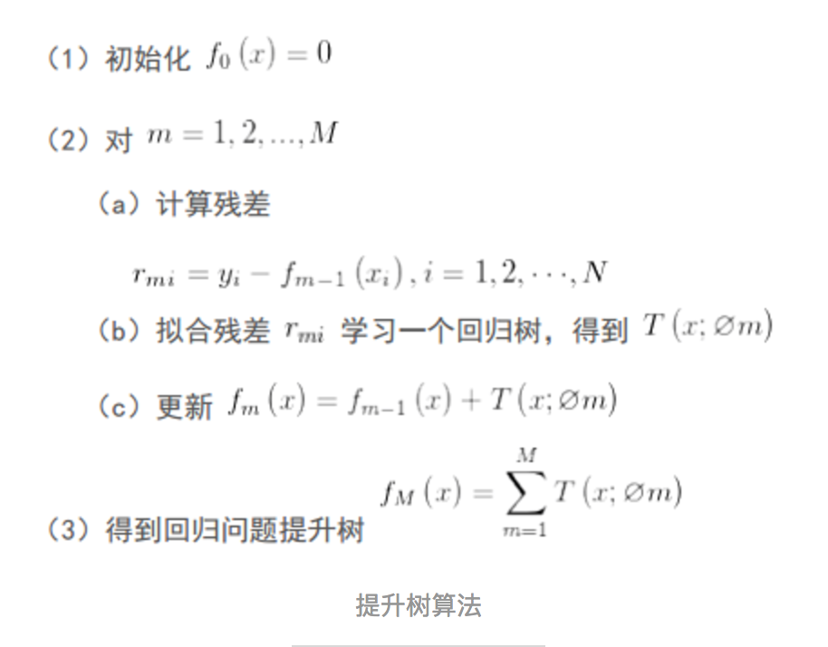
<br/>

</html>

##### GBDT

提升树利用加法模型和前向分步算法实现学习的优化过程。当损失函数是平方损失和指数损失函数时，每一步的优化很简单，如平方损失函数学习残差回归树。常见损失函数及其梯度如下：

<html>
<br/>

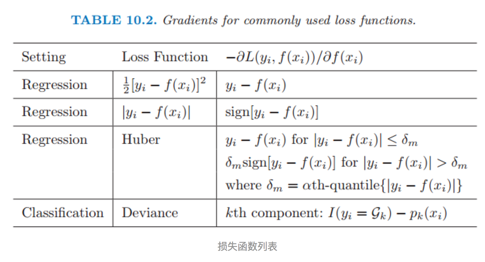
<br/>

</html>

但对于一般的损失函数，往往每一步优化没那么容易，如上图中的绝对值损失函数和Huber损失函数。针对这一问题，Freidman提出了梯度提升算法：利用最速下降的近似方法，即利用损失函数的负梯度在当前模型的值，作为回归问题中提升树算法的残差的近似值，拟合一个回归树。（注：鄙人私以为，与其说负梯度作为残差的近似值，不如说残差是负梯度的一种特例）算法如下

<html>
<br/>

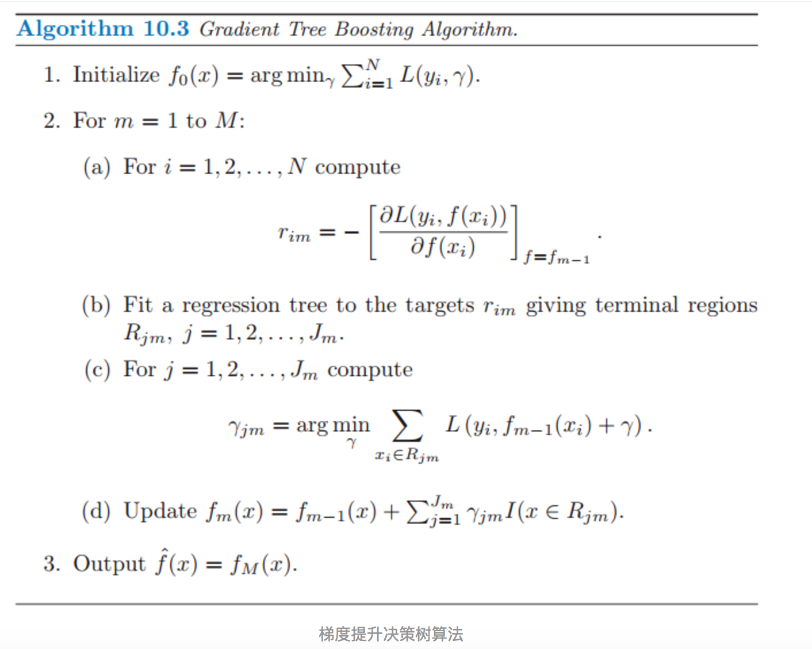
<br/>

</html>

算法步骤解释：

1、初始化，估计使损失函数极小化的常数值，它是只有一个根节点的树，即ganma是一个常数值。
2、
（a）计算损失函数的负梯度在当前模型的值，将它作为残差的估计
（b）估计回归树叶节点区域，以拟合残差的近似值
（c）利用线性搜索估计叶节点区域的值，使损失函数极小化
（d）更新回归树
3、得到输出的最终模型 f(x)

##### 参数设置

推荐GBDT树的深度：6；（横向比较：DecisionTree/RandomForest需要把树的深度调到15或更高）

一句话的解释，来自周志华老师的机器学习教科书（ 机器学习-周志华）：Boosting主要关注降低偏差，因此Boosting能基于泛化性能相当弱的学习器构建出很强的集成；Bagging主要关注降低方差，因此它在不剪枝的决策树、神经网络等学习器上效用更为明显。

Bagging算法是这样做的：每个分类器都随机从原样本中做有放回的采样，然后分别在这些采样后的样本上训练分类器，然后再把这些分类器组合起来。简单的多数投票一般就可以。其代表算法是随机森林。Boosting的意思是这样，他通过迭代地训练一系列的分类器，每个分类器采用的样本分布都和上一轮的学习结果有关。其代表算法是AdaBoost, GBDT。

其实就机器学习算法来说，其泛化误差可以分解为两部分，偏差（bias)和方差(variance)。这个可由下图的式子导出（这里用到了概率论公式D(X)=E(X^2)-[E(X)]^2）。偏差指的是算法的期望预测与真实预测之间的偏差程度，反应了模型本身的拟合能力；方差度量了同等大小的训练集的变动导致学习性能的变化，刻画了数据扰动所导致的影响。这个有点儿绕，不过你一定知道过拟合。
  如下图所示，当模型越复杂时，拟合的程度就越高，模型的训练偏差就越小。但此时如果换一组数据可能模型的变化就会很大，即模型的方差很大。所以模型过于复杂的时候会导致过拟合。
  当模型越简单时，即使我们再换一组数据，最后得出的学习器和之前的学习器的差别就不那么大，模型的方差很小。还是因为模型简单，所以偏差会很大。

<html>
<br/>

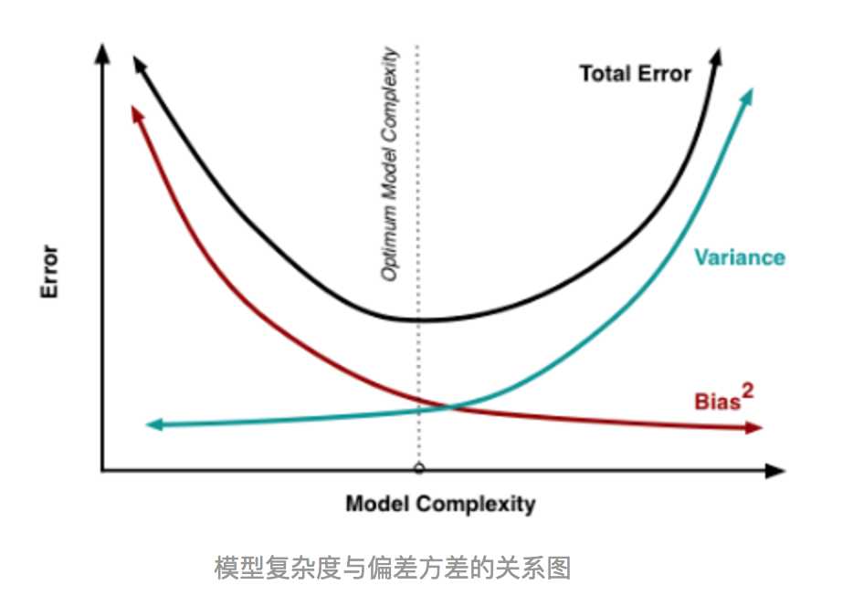
<br/>

</html>

也就是说，当我们训练一个模型时，偏差和方差都得照顾到，漏掉一个都不行。
  对于Bagging算法来说，由于我们会并行地训练很多不同的分类器的目的就是降低这个方差(variance) ,因为采用了相互独立的基分类器多了以后，h的值自然就会靠近.所以对于每个基分类器来说，目标就是如何降低这个偏差（bias),所以我们会采用深度很深甚至不剪枝的决策树。
  对于Boosting来说，每一步我们都会在上一轮的基础上更加拟合原数据，所以可以保证偏差（bias）,所以对于每个基分类器来说，问题就在于如何选择variance更小的分类器，即更简单的分类器，所以我们选择了深度很浅的决策树。

#### LR+GBDT

GBDT与LR的融合方式，Facebook的paper有个例子如下图2所示，图中Tree1、Tree2为通过GBDT模型学出来的两颗树，x为一条输入样本，遍历两棵树后，x样本分别落到两颗树的叶子节点上，每个叶子节点对应LR一维特征，那么通过遍历树，就得到了该样本对应的所有LR特征。由于树的每条路径，是通过最小化均方差等方法最终分割出来的有区分性路径，根据该路径得到的特征、特征组合都相对有区分性，效果理论上不会亚于人工经验的处理方式。

<html>
<br/>

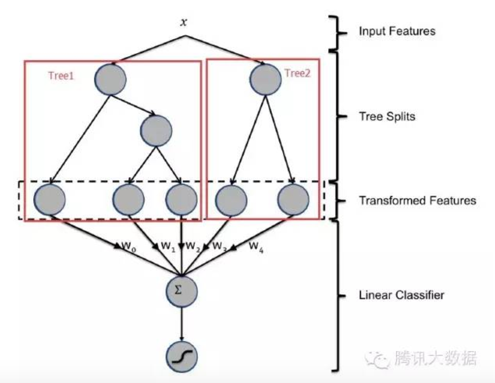
<br/>

</html>

另外，RF也是多棵树，但从效果上有实践证明不如GBDT。且GBDT前面的树，特征分裂主要体现对多数样本有区分度的特征；后面的树，主要体现的是经过前N颗树，残差仍然较大的少数样本。**优先选用在整体上有区分度的特征，再选用针对少数样本有区分度的特征**，思路更加合理，这应该也是用GBDT的原因。

#### 引入id类特征

综合考虑方案如下，使用GBDT建两类树，非ID建一类树，ID建一类树。

1）非ID类树：不以细粒度的ID建树，此类树作为base，即便曝光少的广告、广告主，仍可以通过此类树得到有区分性的特征、特征组合。

2）ID类树：以细粒度 的ID建一类树，用于发现曝光充分的ID对应有区分性的特征、特征组合。如何根据GBDT建的两类树，对原始特征进行映射？以如下图3为例，当一条样本x进来之后，遍历两类树到叶子节点，得到的特征作为LR的输入。当AD曝光不充分不足以训练树时，其它树恰好作为补充。

<html>
<br/>

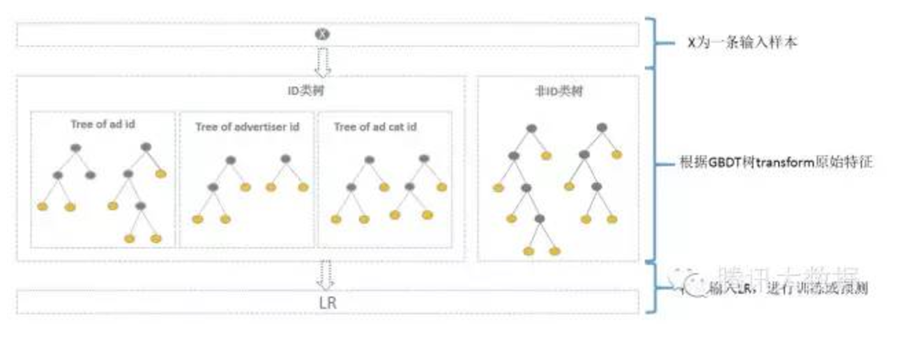
<br/>

</html>

通过GBDT 映射得到的特征空间维度如何？GBDT树有多少个叶子节点，通过GBDT得到的特征空间就有多大。一个叶子节点对应一种有区分性的特征、特征组合，对应LR的一维特征。估算一下，通过GBDT转换得到的特征空间较低，Base树、ID树各N颗，特征空间维度最高为N+N*广告数+N*广告主数+ N*广告类目数。其中广告数、广告主数、广告类目数都是有限的，同时参考Kaggle竞赛中树的数目N最多为30，则估算通过GBDT 映射得到的特征空间维度并不高，且并不是每个ID训练样本都足以训练多颗树，实际上通过GBDT 映射得到的特征空间维度更低。

如何使用GBDT 映射得到的特征？通过GBDT生成的特征，可直接作为LR的特征使用，省去人工处理分析特征的环节，LR的输入特征完全依赖于通过GBDT得到的特征。此思路已尝试，通过实验发现GBDT+LR在曝光充分的广告上确实有效果，但整体效果需要权衡优化各类树的使用。同时，也可考虑将GBDT生成特征与LR原有特征结合起来使用，待尝试。


## 2. 基于深度学习的ctr预估模型

基于深度学习的可以参考[基于深度学习的ctr预估模型集合（持续更新）](https://daiwk.github.io/posts/dl-dl-ctr-models.html)

