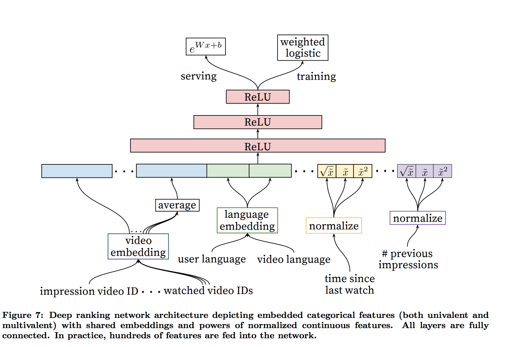

目录


<!-- TOC -->autoauto- [候选生成网络（Candidate Generation Network）](#候选生成网络candidate-generation-network)auto    - [将推荐看成分类问题](#将推荐看成分类问题)auto    - [4.2 Modeling Expected Watch Time](#42-modeling-expected-watch-time)auto- [代码实现](#代码实现)autoauto<!-- /TOC -->

参考[http://www.sohu.com/a/155797861_465975](http://www.sohu.com/a/155797861_465975)

参考[https://zhuanlan.zhihu.com/p/25343518](https://zhuanlan.zhihu.com/p/25343518)

[Deep neural networks for youtube recommendations](https://static.googleusercontent.com/media/research.google.com/zh-CN//pubs/archive/45530.pdf)

YouTube是世界上最大的视频上传、分享和发现网站，YouTube推荐系统为超过10亿用户从不断增长的视频库中推荐个性化的内容。整个系统由两个神经网络组成：**候选生成网络**和**排序网络**。候选生成网络从**百万量级**的视频库中生成**上百个**候选，排序网络对候选进行打分排序，输出**排名最高的数十个结果**。

## 候选生成网络（Candidate Generation Network）

候选生成网络将推荐问题建模为一个**类别数极大的多分类问题**：对于一个Youtube用户，使用其观看历史（视频ID）、搜索词记录（search tokens）、人口学信息（如地理位置、用户登录设备）、二值特征（如性别，是否登录）和连续特征（如用户年龄）等，对视频库中所有视频进行多分类，得到每一类别的分类结果（即每一个视频的推荐概率），最终输出概率较高的几百个视频。===>即，【使用**用户特征**，对所有视频进行分类，得到**和这个用户最相关的几百个候选结果。**】

### 将推荐看成分类问题

用户`\(U\)`在上下文`\(C\)`中，选择视频`\(i\)`的概率是：

`\[
P(w_t=i|U,C)=\frac{e^{v_iu}}{\sum _{j\in V}e^{v_ju}}
\]`

其中，`\(v_i\in R^N\)`是第i个视频的emb，`\(u\in R^N\)`是用户的emb，两个emb都是N维的，这里看起来是用内积`\(v_iu\)`把它们变成一个数。

由于视频有百万量级，所以做这么一个超大规模的分类，需要，并且使用的是到的样本**通过importance sampling进行负采样**(参考[On using very large target vocabulary for neural machine translation](http://www.aclweb.org/anthology/P15-1001))。对每一个example而言，他的cross-entropy是在true label和采样的负类中求min。在实践中，采样了数千个负类，比传统的softmax有将近100倍的速度提升。

另一种做法是hierarchical softmax(参考[Hierarchical probabilistic neural network language model](https://www.iro.umontreal.ca/~lisa/pointeurs/hierarchical-nnlm-aistats05.pdf))，但实践中效果没那么好。因为在hsoftmax中，遍历树里的每一个节点时，会引入对经常是毫无联系的类别的分辨，使得分类问题变得更困难以至于效果变差。

在线serving时，由于低延迟的要求，需要有对类别数是sublinear的时间复杂度的近邻检索方法，之前youtube的系统使用的是hashing的方法，即[Label partitioning for sublinear ranking](http://www.thespermwhale.com/jaseweston/papers/label_partitioner.pdf)。因为在线的时候，softmax的输出没啥用，所以打分问题就变成了一个在点积的空间上进行最近邻检索的问题，有很多通用库可以用，例如基于LSH的ann算法：[ An Investigation of Practical Approximate Nearest Neighbor Algorithms](http://papers.nips.cc/paper/2666-an-investigation-of-practical-approximate-nearest-neighbor-algorithms.pdf)。

注：

item-embedding也可以参考[https://zhuanlan.zhihu.com/p/24339183?refer=deeplearning-surfing](https://zhuanlan.zhihu.com/p/24339183?refer=deeplearning-surfing)里说的[Item2vec: Neural Item Embedding for Collaborative Filtering](https://arxiv.org/abs/1603.04259)的想法，把item视为word，用户的行为序列视为一个集合，item间的共现为正样本，并按照item的频率分布进行负样本采样，相似度的计算还只是利用到了item共现信息，缺点是：忽略了user行为序列信息; 没有建模用户对不同item的喜欢程度高低。


### 4.2 Modeling Expected Watch Time

训练用的是logistic regression加上cross-entropy，

假设第i个正样本的播放时长是`\(T_i\)`，使用weighted logistic regression，将正样本的权重设为播放时长，而负样本的权重设为1，这样，假设总共有N个样本，有k个被点击了，就相当于有了`\(\sum T_i\)`个正样本，N-k个负样本。所以odds（注：一个事件的几率odds指该事件发生与不发生的概率比值）就是正样本数/负样本数=`\(\frac{\sum T_i}{N-k}\)`。

而实际中，点击率P很低，也就是k很小，而播放时长的期望是`\(E(T)=\frac{\sum T_i}{N}\)`，所以`\(E(T)\)`约等于`\(E(T)(1+P)\)`，约等于odds，即`\(\frac{\sum T_i}{N-k}\)`

最后在inference的serving中，直接使用`\(e^{Wx+b}\)`来产出odds，从而近似expected watch time。

参考[https://en.wikipedia.org/wiki/Logistic_regression](https://en.wikipedia.org/wiki/Logistic_regression)

odds是平均时长，训练时输入给sigmoid的是logit，

`\[
wx+b = logit = log odds
\]`

所以，infer的时候：

`\[
E(T) = odds = e ^{logit} = e ^{log odds} = e^{wx+b}
\]`


<html>
<br/>


<br/>

</html>

## 代码实现

[https://github.com/ogerhsou/Youtube-Recommendation-Tensorflow/blob/master/youtube_recommendation.py](https://github.com/ogerhsou/Youtube-Recommendation-Tensorflow/blob/master/youtube_recommendation.py)


关于数据集：

[https://github.com/ogerhsou/Youtube-Recommendation-Tensorflow/commit/e92bac1b8b5deb0e93e996b490561baaea60bae8](https://github.com/ogerhsou/Youtube-Recommendation-Tensorflow/commit/e92bac1b8b5deb0e93e996b490561baaea60bae8)

使用的是[https://github.com/facebookresearch/fastText/blob/master/classification-example.sh](https://github.com/facebookresearch/fastText/blob/master/classification-example.sh)

数据格式：

```shell
cut -d' ' -f 1 ./data/dbpedia.train | sort | uniq -c
40000 __label__1
40000 __label__10
40000 __label__11
40000 __label__12
40000 __label__13
40000 __label__14
40000 __label__2
40000 __label__3
40000 __label__4
40000 __label__5
40000 __label__6
40000 __label__7
40000 __label__8
40000 __label__9
```

在init_data函数中，给每个__label__xx编了个号，如：

```shell
__label__6 0
__label__12 1
__label__14 2
__label__7 3
__label__2 4
__label__5 5
__label__10 6
__label__13 7
__label__3 8
__label__1 9
__label__8 10
__label__11 11
__label__9 12
__label__4 13
```

然后read_data的时候，y就用这个编号来表示（假装是时长）：

```python
y.append(label_dict[line[0]])
```

而使用的是nce_loss(参考[https://daiwk.github.io/posts/knowledge-tf-usage.html#tfnnnceloss](https://daiwk.github.io/posts/knowledge-tf-usage.html#tfnnnceloss))：

```python
ce_weights = tf.Variable(
    tf.truncated_normal([n_classes, n_hidden_1],
                        stddev=1.0 / math.sqrt(n_hidden_1)))
nce_biases = tf.Variable(tf.zeros([n_classes]))

loss = tf.reduce_mean(tf.nn.nce_loss(weights=nce_weights,
                     biases=nce_biases,
                     labels=y_batch,
                     inputs=pred,
                     num_sampled=10,
                     num_classes=n_classes))

cost = tf.reduce_sum(loss) / batch_size
optimizer = tf.train.AdamOptimizer(learning_rate=learning_rate).minimize(cost)
out_layer = tf.matmul(pred, tf.transpose(nce_weights)) + nce_biases
```

模型预测的是时长(等有时间了再细看呢！！)：

```python
    # Test model
    correct_prediction = tf.equal(tf.argmax(out_layer, 1), tf.reshape(y_batch, [batch_size]))
    # Calculate accuracy
    accuracy = tf.reduce_mean(tf.cast(correct_prediction, "float"))
```