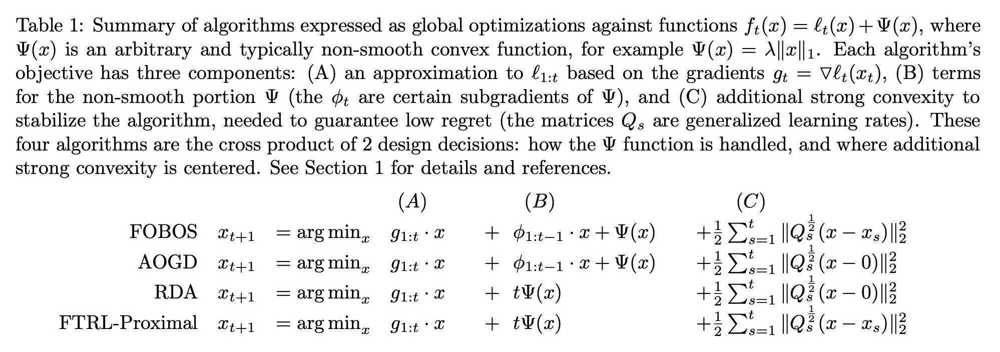

目录

<!-- TOC -->

- [背景](#%e8%83%8c%e6%99%af)
  - [问题描述](#%e9%97%ae%e9%a2%98%e6%8f%8f%e8%bf%b0)
- [google的几篇重要paper](#google%e7%9a%84%e5%87%a0%e7%af%87%e9%87%8d%e8%a6%81paper)
  - [Adaptive Bound Optimization for Online Convex Optimization](#adaptive-bound-optimization-for-online-convex-optimization)
  - [A Unified View of Regularized Dual Averaging and Mirror Descent with Implicit Updates](#a-unified-view-of-regularized-dual-averaging-and-mirror-descent-with-implicit-updates)
  - [Follow-the-Regularized-Leader and Mirror Descent: Equivalence Theorems and L1 Regularization](#follow-the-regularized-leader-and-mirror-descent-equivalence-theorems-and-l1-regularization)
  - [Ad Click Prediction: a View from the Trenches](#ad-click-prediction-a-view-from-the-trenches)

<!-- /TOC -->

参考[http://www.cnblogs.com/EE-NovRain/p/3810737.html](http://www.cnblogs.com/EE-NovRain/p/3810737.html)

## 背景

传统的批量（batch）算法无法有效地处理超大规模的数据集和在线数据流，FTRL（Follow-the-regularized-Leader）在处理诸如逻辑回归之类的带非光滑正则化项（例如1范数，做模型复杂度控制和稀疏化）的凸优化问题上性能非常出色。

### 问题描述

对于loss函数+正则化的结构风险最小化的优化问题（逻辑回归也是这种形式）有两种等价的描述形式，以1范数为例

+ 无约束优化形式的soft regularization formulation

`\[
\hat{w}=\underset{w}{\textrm{argmin}}\sum_{i=1}^{n}L(w,z_i)+g||w||_1
\]`

+ 带约束项的凸优化问题convex constraint formulation：

`\[
\hat{w}=\underset{w}{\textrm{argmin}}\sum_{i=1}^{n}L(w,z_i), s.t.||w||_1\leq s
\]`

## google的几篇重要paper

这个讲得不错：[https://zhuanlan.zhihu.com/p/36410780](https://zhuanlan.zhihu.com/p/36410780)

### Adaptive Bound Optimization for Online Convex Optimization

[Adaptive Bound Optimization for Online Convex Optimization](https://static.googleusercontent.com/media/research.google.com/zh-CN//pubs/archive/36483.pdf)

2010年的理论性的paper，但未显式地支持正则化项迭代。

### A Unified View of Regularized Dual Averaging and Mirror Descent with Implicit Updates

[A Unified View of Regularized Dual Averaging and Mirror Descent with Implicit Updates](https://pdfs.semanticscholar.org/50eb/06a0e58962715393d7adc26318b54521db9b.pdf)

11年的paper，证明了regret bound以及引入通用的正则化项

### Follow-the-Regularized-Leader and Mirror Descent: Equivalence Theorems and L1 Regularization

[Follow-the-Regularized-Leader and Mirror Descent: Equivalence Theorems and L1 Regularization](https://static.googleusercontent.com/media/research.google.com/zh-CN//pubs/archive/37013.pdf)

11年，FOBOS、RDA、FTRL等各种方法对比的paper

高度概括呢（参考开篇说到的那篇博客），就是最小化的loss有三项：

<html>
 

 
</html>

+ 第一项：梯度或累积梯度；
+ 第二项：L1正则化项的处理(注：`\(\Psi(x)\)`是一个任意的非平滑的凸函数，例如，`\(\Psi(x)=\lambda \|x\|_{1}\)`)；
+ 第三项：这个累积加和限定了新的迭代结果x**不要离已迭代过的解太远**（也即FTRL-Proximal中**proximal**的含义），或者**离0太远（central）**，这一项其实也是**low regret**的需求

### Ad Click Prediction: a View from the Trenches

把ftrl用在ctr预估上的工程性的论文：[Ad Click Prediction: a View from the Trenches](http://www.eecs.tufts.edu/~dsculley/papers/ad-click-prediction.pdf)

如最开始提到的那篇博客的作者所说，这里的per-coordinate，其意思是FTRL是**对w每一维分开训练更新的**，**每一维**使用的是**不同的学习速率**，也是上面代码中`\(\lambda_2\)`之前的那一项。与w所有特征维度使用统一的学习速率相比，这种方法考虑了**训练样本本身在不同特征上分布的不均匀性**，如果包含w某一个维度特征的训练样本很少，每一个样本都很珍贵，那么该特征维度对应的训练速率可以独自保持比较大的值，每来一个包含该特征的样本，就可以在该样本的梯度上前进一大步，而**不需要与其他特征维度的前进步调强行保持一致**。
