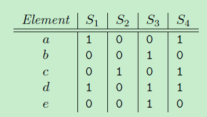
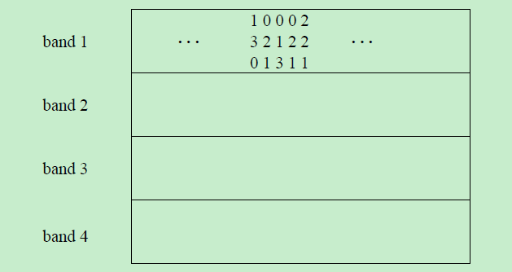
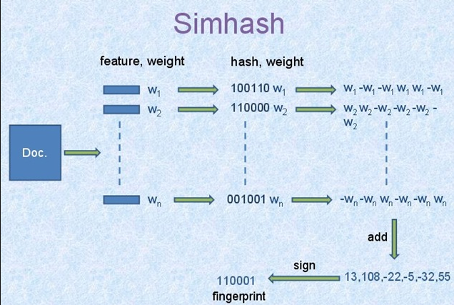
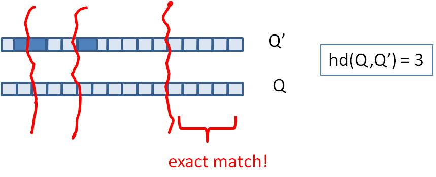
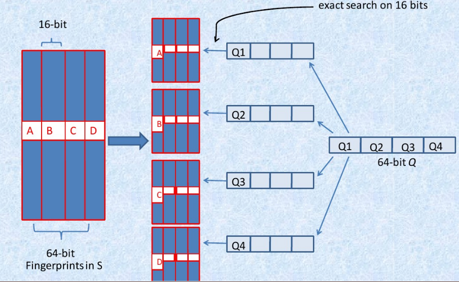
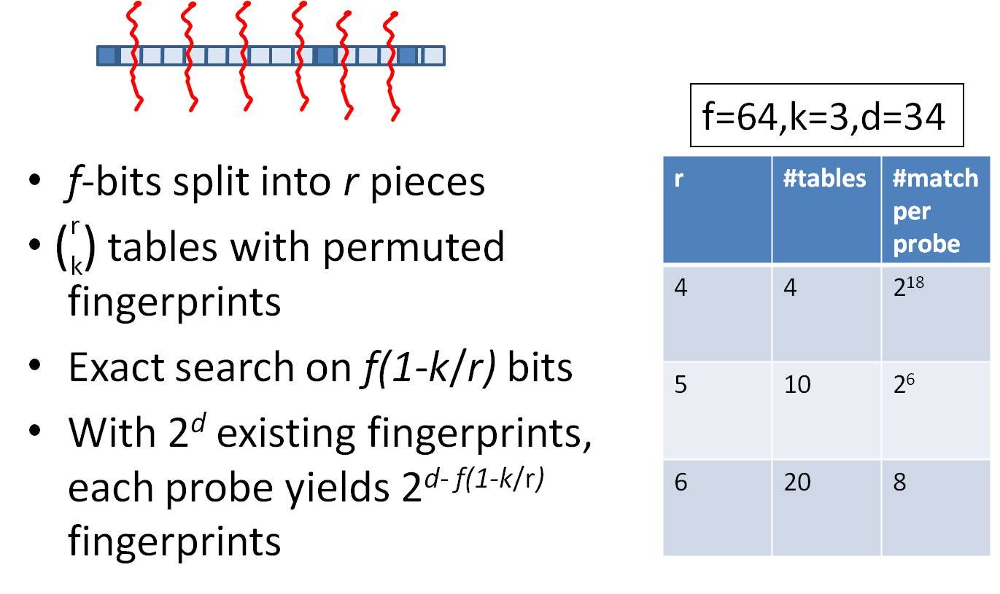
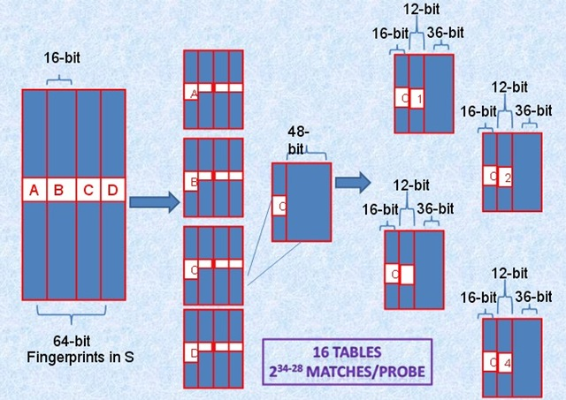
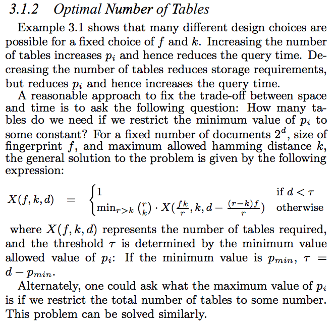

目录

<!-- TOC -->

- [高维稀疏向量的相似查找——minhash, lsh, simhash](#高维稀疏向量的相似查找minhash-lsh-simhash)
    - [minhash](#minhash)
    - [LSH（Locality-Sensitive Hashing）](#lshlocality-sensitive-hashing)
    - [simhash](#simhash)
        - [simhash算法](#simhash算法)
        - [减少遍历次数](#减少遍历次数)
            - [一次拆分多份table并exact match](#一次拆分多份table并exact-match)
            - [k!=3时的一般化方法](#k3时的一般化方法)
- [稠密向量的相似查找——Annoy](#稠密向量的相似查找annoy)
    - [建树过程](#建树过程)
    - [查询过程](#查询过程)
    - [查询中的问题与解决方法](#查询中的问题与解决方法)
    - [返回最终近邻节点](#返回最终近邻节点)
    - [性能对比](#性能对比)

<!-- /TOC -->

参考[海量数据相似查找系列1 -- Minhashing & LSH & Simhash 技术汇总](http://blog.csdn.net/hero_fantao/article/details/70245284)

[海量数据相似查找系列2 -- Annoy算法](http://blog.csdn.net/hero_fantao/article/details/70245387)


主要分为**高维稀疏向量**和**稠密向量**两大方向。

## 高维稀疏向量的相似查找——minhash, lsh, simhash

针对高维稀疏数据情况，如何通过哈希技术进行快速进行相似查找。

例如，推荐系统中item-user矩阵。如果你有item数量是百万级别，user是千万级别，这个矩阵是十分稀疏的。你如何计算每一个item的Top N相似item呢？ 

同样海量文本场景，文本集合可以看成doc-word 稀疏矩阵，如何求解每个文档的Top N相似文档？

如果采用两两比较的话，至少有两个问题：
+ **O(n^2) 遍历**时间复杂度；
+ 两个高维向量之间**计算相似度**，比如jaccard相似度，时间很耗时。

常见的解决方法如下：
+ 正排是doc-words，倒排是word-docs
+ 对正排里doc1的所有words,拉出对应的倒排docs，归并
+ 对正排里doc2的所有words，拉出对应的倒排docs，归并
+ 对上述两个向量求相似度

问题：虽然时间复杂度可以减小，但高频词可能导致倒排的拉链长度太长，导致效率下降。

### minhash

例如，小写字母代表词，大写字母代表文档：

S1={a, d}, S2={c}, S3={b, d, e}, S4={a, c, d}

<html>
<br/>


<br/>

</html>

然后，把原来的词典{a, b, c, d, e} 顺序**随机重排**，例如得到{b, e, a, d, c}，

<html>
<br/>


<br/>

</html>

定义一个函数h：计算集合S最小的minhash值，就是在这种顺序下最先出现1的元素。那么，

h(S1) = a, h(S2)=c, h(S3)=b, h(S4)=a

类似地，如果进行**n次重排**的话，就会有**n个minhash函数**，**{h1(S), h2(S)..., hn(S)}**,  那原来每个高维集合，就会被降到n维空间，比如**S1->{h1(S1), h2(S1)..., hn(S1)}**。

但是实际中因为重排比较耗时，会用若干**随机哈希函数**替代。比如设定一个哈希函数: h(x) = (i+1) % 5.

以{a, b, c, d, e}顺序，“i”表示各个索引，比如a的“i”值为,1， b的“i”值为2等。

+ 对集合S1，计算**各个元素哈希值**为{2，0}，其中h(a->i) = 2, h(d->i) = 0, 
+ 再计算**最小哈希值对应的元素** minhash (h(S1))= d。

同样可以定义**n个哈希函数**【不需要重排，每个hash计算对应的值就行】，进行上述操作，那每个集合S就被降维到n维空间的签名。

### LSH（Locality-Sensitive Hashing）

minhash解决了文章一开始提到的第二个问题，**高维向量间计算复杂度问题**(通过minhash 机制把高维降低到n维低纬空间)

但是还没解决第一个问题：两两比较，时间复杂度O(n^2)。

LSH 就是这样的机制，通过哈希机制，让**相似向量尽可能出现一个桶中，而不相似的向量出现在不同的桶中**。相似度计算只在么个桶中进行，每个桶彼此之间不做相似度计算。

在minhashing 签名的基础上做LSH分析。

+ 一个高维向量通过minhashing处理后变成**n维低维向量的签名**，现在把这n维签名分成b组，每组r个元素。
+ 每组通过一个哈希函数，把这组的**r个元素**组成**r维向量**哈希到一个桶中。
+ 每组可以使用同一个哈希函数，但是**每组桶没交集，即使哈希值一样**。桶名可以类似：组名+哈希值。
+ **在一个桶中的向量才进行相似度计算**，**相似度计算**的向量是**minhash的n维向量**（不是r维向量）。

例如：
minhash签名维度是12，分成4组，每组3个元素。

拿band1来说，第二列和第四列向量是一样的(第二列是（0, 2, 1）, 第四列是（0, 2, 1）)，一定会哈希到相同的桶中（band1名下的桶），而第一列和第二列有可能不会在一个桶中（band1名下的桶）。

这里就是重点设置分多少个组，每组多少个元素问题。这个可以根据实际情况和一些经验case来定。

<html>
<br/>


<br/>

</html>

### simhash

#### simhash算法

simhash在工业界引起很大注意力是因为google 07那篇文章，把Simhash技术引入到海量文本去重领域。

[Detecting Near-Duplicates for Web Crawling](http://citeseerx.ist.psu.edu/viewdoc/download?doi=10.1.1.78.7794&rep=rep1&type=pdf)

google 通过Simhash把**一篇文本**映射成**64bits的二进制串**。

+ 文档每个**词**有个**权重**。
+ 文档每个**词**哈希成一个**二进制串**。
+ 文档最终的签名是各个**词和签名的加权和(如果该位是1则+weight，如果是0，则-weight)**，再**求签名[>0则变成1，反之变成0]**得到一个64位二进制数。
+ 如果两篇文档相同，则他们simhash签名汉明距离小于等于3。

**【注：汉明距离就是a和b两个二进制串算xor，然后看有多少个1】**

c++中快速计算1的个数：
[https://stackoverflow.com/questions/14682641/count-number-of-1s-in-binary-format-of-decimal-number/14682688#14682688](https://stackoverflow.com/questions/14682641/count-number-of-1s-in-binary-format-of-decimal-number/14682688#14682688)

```c++
#include <bitset>
#include <iostream>
#include <climits>

size_t popcount(size_t n) {
    std::bitset<sizeof(size_t) * CHAR_BIT> b(n);
    return b.count();
}

int main() {
    std::cout << popcount(1000000);
}
```

因为simhash本质上是局部敏感hash，所以可以使用海明距离来衡量simhash值的相似度。

<html>
<br/>


<br/>

</html>

#### 减少遍历次数

##### 一次拆分多份table并exact match

试想所有文档都用64bits代表，如果想要找到汉明距离小于等于3得文档，也有需要两两比较的问题，那这样又回到时间复杂度是O(n^2)这个问题。

参考：[我的数学之美系列二 —— simhash与重复信息识别](http://grunt1223.iteye.com/blog/964564)

**!!!!!!思想!!!!!!**

**假设我们要寻找海明距离3以内的数值，根据抽屉原理，只要我们将整个64位的二进制串划分为4块，无论如何，匹配的两个simhash code之间至少有一块区域是完全相同的。**

<html>
<br/>


<br/>

</html>

由于我们无法事先得知完全相同的是哪一块区域，因此我们必须采用存储**多份table**的方式。

1. 将64位的二进制串等分成**四块**
2. 调整上述64位二进制，**将任意一块作为前16位**，总共有四种组合，**生成四份table** 
3. 采用**精确匹配**的方式查找**前16位**
4. 如果样本库中存有**2^34（差不多10亿）**的哈希指纹，则**每个table**返回**2^(34-16)=262144个候选**结果**【这里的16是前16位的16！！下面16张表的28同理！！！】**，大大减少了汉明距离的计算成本 

<html>
<br/>


<br/>

</html>

我们可以将这种方法拓展成多种配置，不过，请记住，table的数量与每个table返回的结果呈此消彼长的关系，也就是说，**时间效率与空间效率不可兼得**，参看下图： 

<html>
<br/>


<br/>

</html>

##### k!=3时的一般化方法

参考[simhash与Google的网页去重](http://leoncom.org/?p=650607)

问题：一个80亿的**64-bit指纹组成的集合Q**，对于一个**给定64-bit的指纹F**，如何在a few millionseconds中找到Q中和F至多只有**k(k=3)位**差别的指纹。

思想：

1. 对于一个具有2^d个记录的集合，只需要考虑d-bit hash。
2. 选取一个d’使得|d’-d|十分小，因此如果两fingerprint在d’-bits上都相同，那么在d-bits也很可能相同。
3. 然后在这些d-bit match的结果中寻找整个f-bit的Hamming Distance小于k的fingerprint。 

简单的说，就是利用fingerprint**少量特征位数比较**从而**首先缩小范围**，然后再去确定是否差异小于k个bit。

算法：

建表：

+ 首先对于集合Q**构建多个表T1，T2…Tt**，每一个表都是采用对应的置换函数`\(\pi _i\)`将64-bit的fingerprint中的某`\(p_i\)`位序列置换换到整个序列的**最前面**。即每个表存储都是整个Q的fingerprint的复制置换。

查询：

+ step1: 对于给定的F，在**每个Ti中进行匹配**，寻找**所有前`\(p_i\)`位**与**`\(\pi _i(F)\)`的前`\(p_i)`位相同**的fingerprint。
+ step2: 对于所有在step 1中匹配到的置换后的fingerprint，计算其是否与`\(\pi _i(F)\)`至多有k-bit不同。

算法的重点在于对于集合Q的**分表**以及**每个表所对应的置换函数**，假设对于64-bit的fingerprint，k=3，存储16个table，划分参考下图:

<html>
<br/>


<br/>

</html>

将64-bit按照16位划分为4个区间，每个区间剩余的48-bit再按照**每个12-bit**划分为4个区间，因此总共16个table并行查找，即使三个不同的k-bit落在A、B、C、D中三个不同的区块，此划分方法也不会导致遗漏。

而真正需要比较的是前16+12=28位，所以，如果有2^34个指纹，那么候选将变为2^(34-28)个结果。

最优table数的选取：

<html>
<br/>


<br/>

</html>

## 稠密向量的相似查找——Annoy

github: [https://github.com/spotify/annoy](https://github.com/spotify/annoy)

Annoy的目标是建立一个数据结构，使得**查询一个点的最近邻点的时间复杂度是次线性。**Annoy 通过建立一个二叉树来使得每个点查找时间复杂度是O(log n)。 

### 建树过程

+ 随机选择两个点，以这两个节点为初始中心节点，执行聚类数为2的kmeans过程，最终产生收敛后两个聚类中心点。
+ 这两个聚类中心点之间连一条线段（灰色短线），建立一条垂直于这条灰线，并且通过灰线中心点的线（黑色粗线）。这条黑色粗线把数据空间分成两部分。在多维空间的话，这条黑色粗线可以看成等距垂直超平面。
+ 在划分的子空间内进行不停的递归迭代继续划分，知道每个子空间最多只剩下K个数据节点。
+ 通过多次递归迭代划分的话，最终原始数据会形成类似下面这样一个二叉树结构。二叉树底层是叶子节点记录原始数据节点，其他中间节点记录的是分割超平面的信息。Annoy建立这样的二叉树结构是希望满足这样的一个假设:  相似的数据节点应该在二叉树上位置更接近，一个分割超平面不应该把相似的数据节点分割二叉树的不同分支上。

### 查询过程

查找的过程就是不断看他在分割超平面的哪一边。从二叉树索引结构来看，就是从根节点不停的往叶子节点遍历的过程。通过对二叉树每个中间节点（分割超平面相关信息）和查询数据节点进行相关计算来确定二叉树遍历过程是往这个中间节点左孩子节点走还是右孩子节点走。通过以上方式完成查询过程。

### 查询中的问题与解决方法

+ 问题1：查询过程最终落到叶子节点的数据节点数小于 我们需要的Top N相似邻居节点数目怎么办？
+ 问题2：两个相近的数据节点划分到二叉树不同分支上怎么办？

解决方法：

+ 如果分割超平面的两边都很相似，那可以两边都遍历。
+ 建立多棵二叉树树，构成一个森林，每个树建立机制都如上面所述那样。
+ 采用优先队列机制：采用一个优先队列来遍历二叉树，从根节点往下的路径，根据查询节点与当前分割超平面距离（margin）进行排序。

### 返回最终近邻节点

每棵树都返回一堆近邻点后，如何得到最终的Top N相似集合呢？
首先所有树返回近邻点都插入到优先队列中，求并集去重, 然后计算和查询点距离， 最终根据距离值从近距离到远距离排序， 返回Top N近邻节点集合。


### 性能对比

<html>
<br/>


<br/>

</html>


