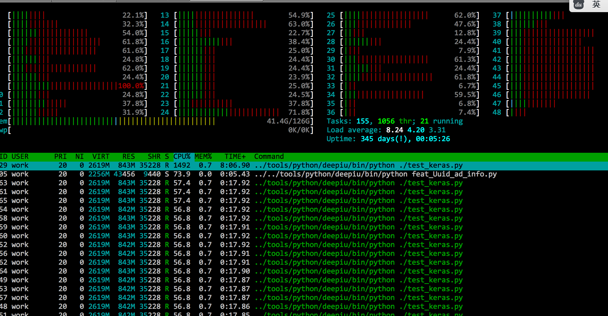

目录

<!-- TOC -->

- [使用theano后端](#使用theano后端)
    - [开启theano后端](#开启theano后端)
    - [打开openmp的flag](#打开openmp的flag)
    - [确保gcc版本](#确保gcc版本)
    - [设置环境变量并运行](#设置环境变量并运行)
- [使用tensorflow后端](#使用tensorflow后端)
- [用htop查看进程情况](#用htop查看进程情况)

<!-- /TOC -->

## 使用theano后端

### 开启theano后端

vim ``` ~/.keras/keras.json ```，修改为
```
{
    "epsilon": 1e-07,
    "floatx": "float32",
    "image_data_format": "channels_last",
    "backend": "theano"
}
```

### 打开openmp的flag

```python
import theano
theano.config.openmp = True
```

### 确保gcc版本

至少要是482的

```
export PATH=/opt/compiler/gcc-4.8.2/bin/:$PATH
```
### 设置环境变量并运行

```
OMP_NUM_THREADS=20 python xxx.py
```
## 使用tensorflow后端
参考：[Tensorflow并行：多核(multicore)，多线程(multi-thread)](http://www.deepnlp.org/blog/tensorflow-parallelism/)

## 用htop查看进程情况

```
jumbo install htop
```

htop样例如下：


