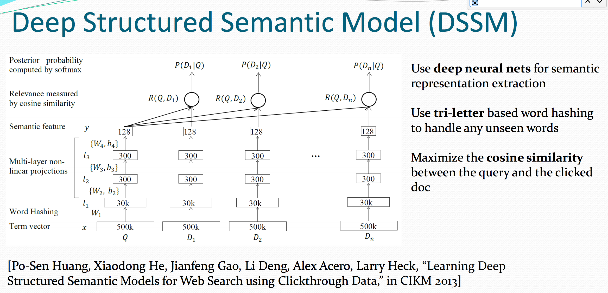

目录

<!-- TOC -->

- [2013年CIKM的dssm](#2013年cikm的dssm)
- [2014年CIKM的dssm: 引入cnn](#2014年cikm的dssm-引入cnn)
- [2014年的dssm](#2014年的dssm)

<!-- /TOC -->

参考[Modeling Interestingness with Deep Neural Networks](https://www.microsoft.com/en-us/research/wp-content/uploads/2014/10/604_Paper.pdf)

对应的ppt：
[ppt](../assets/Modeling Interestingness with Deep Neural Networks_ppt.pdf)

## 2013年CIKM的dssm

[Learning Deep Structured Semantic Models for Web Search using Clickthrough Data](https://www.microsoft.com/en-us/research/wp-content/uploads/2016/02/cikm2013_DSSM_fullversion.pdf)

相当于一个q，和每个d分别算cos。

<html>
 

 

</html>

## 2014年CIKM的dssm: 引入cnn

[A Latent Semantic Model with Convolutional-Pooling Structure for Information Retrieval](http://www.iro.umontreal.ca/~lisa/pointeurs/ir0895-he-2.pdf)

## 2014年的dssm

为用户的『兴趣』建模：
+ 自动高亮
+ 上下文实体检索

[Modeling Interestingness with Deep Neural Networks](https://www.microsoft.com/en-us/research/wp-content/uploads/2014/10/604_Paper.pdf)

paddle上，基于dssm，做了支持pairwise rank和分类/回归的一个通用模型：
[https://github.com/PaddlePaddle/models/blob/develop/dssm/README.cn.md](https://github.com/PaddlePaddle/models/blob/develop/dssm/README.cn.md)
