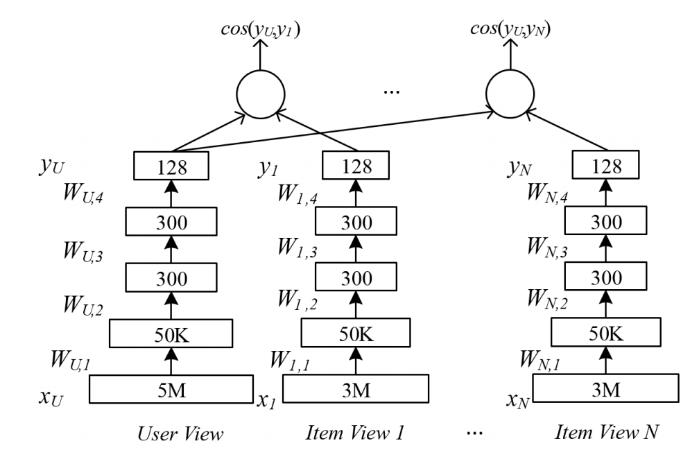
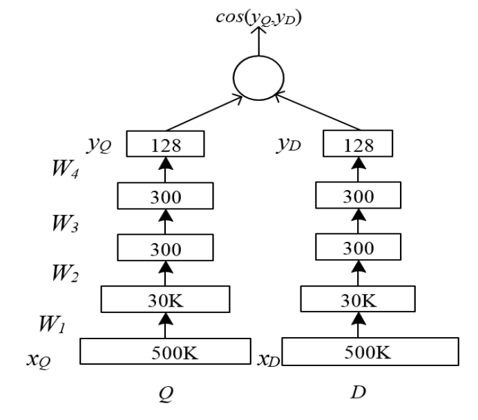

目录

<!-- TOC -->

- [2013年CIKM的dssm](#2013年cikm的dssm)
- [2014年CIKM的dssm: 引入cnn](#2014年cikm的dssm-引入cnn)
- [2014年的dssm](#2014年的dssm)
- [语义匹配](#语义匹配)
- [multiview dssm](#multiview-dssm)

<!-- /TOC -->

参考[Modeling Interestingness with Deep Neural Networks](https://www.microsoft.com/en-us/research/wp-content/uploads/2014/10/604_Paper.pdf)

对应的ppt：
[ppt](../assets/Modeling Interestingness with Deep Neural Networks_ppt.pdf)

## 2013年CIKM的dssm

[Learning Deep Structured Semantic Models for Web Search using Clickthrough Data](https://www.microsoft.com/en-us/research/wp-content/uploads/2016/02/cikm2013_DSSM_fullversion.pdf)

相当于一个q，和每个d分别算cos。

<html>
<br/>


<br/>

</html>

## 2014年CIKM的dssm: 引入cnn

[A Latent Semantic Model with Convolutional-Pooling Structure for Information Retrieval](http://www.iro.umontreal.ca/~lisa/pointeurs/ir0895-he-2.pdf)

## 2014年的dssm

为用户的『兴趣』建模：
+ 自动高亮
+ 上下文实体检索

[Modeling Interestingness with Deep Neural Networks](https://www.microsoft.com/en-us/research/wp-content/uploads/2014/10/604_Paper.pdf)


paddle上，基于dssm，做了支持pairwise rank和分类/回归的一个通用模型：
[https://github.com/PaddlePaddle/models/blob/develop/dssm/README.cn.md](https://github.com/PaddlePaddle/models/blob/develop/dssm/README.cn.md)


## 语义匹配

[https://blog.csdn.net/zjrn1027/article/details/80170966](https://blog.csdn.net/zjrn1027/article/details/80170966)

相似度衡量可以使用cos，而最终的loss可以用hinge loss：

设置一个margin `\(m\)`，query `\(V_Q\)`，正样本`\(V_{A^+}\)`，负样本`\(V_{A^-}\)`，如果**正负样本的相似度之差**小于边界值，那就还需要优化，如果**已经大于等于边界值**了，说明**模型已经能区分**了，所以用hinge loss：

`\[
L=max(0, m - (cos(V_Q,V_{A^+} - cos(V_Q, V_{A^-}))))
\]`

tf算cos

```python
    def getCosineSimilarity(q, a):
        q1 = tf.sqrt(tf.reduce_sum(tf.multiply(q, q), 1))
        a1 = tf.sqrt(tf.reduce_sum(tf.multiply(a, a), 1))
        mul = tf.reduce_sum(tf.multiply(q, a), 1)
        cosSim = tf.div(mul, tf.multiply(q1, a1))
        return cosSim
```

tf算hinge

```python
    def getLoss(trueCosSim, falseCosSim, margin):
        zero = tf.fill(tf.shape(trueCosSim), 0.0)
        tfMargin = tf.fill(tf.shape(trueCosSim), margin)
        with tf.name_scope("loss"):
            losses = tf.maximum(zero, tf.subtract(tfMargin, tf.subtract(trueCosSim, falseCosSim)))
            loss = tf.reduce_sum(losses)
        return loss
```

使用

```python
        self.trueCosSim = self.getCosineSimilarity(question2, trueAnswer2)
        self.falseCosSim = self.getCosineSimilarity(question2, falseAnswer2)
        self.loss = self.getLoss(self.trueCosSim, self.falseCosSim, self.margin)
```

## multiview dssm

[A Multi-View Deep Learning Approach for Cross Domain User Modeling in Recommendation Systems](https://www.microsoft.com/en-us/research/wp-content/uploads/2016/02/frp1159-songA.pdf)

[https://blog.csdn.net/shine19930820/article/details/78810984](https://blog.csdn.net/shine19930820/article/details/78810984)

现在很多公司都不仅仅只有一个产品，而是有**多个产品线**。比如微软可能就有搜索、新闻、appstore、xbox等产品，如果将用户在这些产品上的行为（反馈）统一在一起训练一个深度学习网络，就能很好的解决**单个产品上**（用户）**冷启动、稀疏**等问题。

<html>
<br/>


<br/>

</html>

一个产品线就是一个view，一条训练样本只有user+1个view，其他view置0。

对于其中一个塔，其实就是dssm:

<html>
<br/>


<br/>

</html>

其中：

`\[
R(Q,D)=cosine(y_Q,y_D)=\frac{y_Q^Ty_D}{\left \| y_Q \right \|\left \| y_D \right \|}
\]`

所以given Q点击D的概率就是：

`\[
P(D|Q)=\frac{exp(\gamma R(Q,D))}{\sum _{D'\in \textbf{D}}exp(\gamma R(Q,D'))}
\]`

这里的`\(\textbf{D}\)`是需要rank的Documents的集合，理想情况肯定是全集了。实际上定义`\((Q,D^+)\)`为一个query和点击文档的pair对，通过一个`\(D+\)`和N个随机选的未点击的文档`\(D_j^-,j=1,...,N\)`近似。

所以训练时，在训练集上，给定query，有点击doc的概率最大化就是我们的目标(其中的`\(\Lambda\)`是网络参数)：

`\[
L(\Lambda)=-\log \prod _{(Q,D^+)}P(D^+|Q)
\]`

回到mv-dnn，训练流程如下：

>1. 输入：`\(N\)`：view的pair数，`\(M\)`：训练迭代轮数
>         `\(U_A\)`：用户view的架构
>         `\(I_A=\{I_{A1},...,I_{AN}\}\)`

