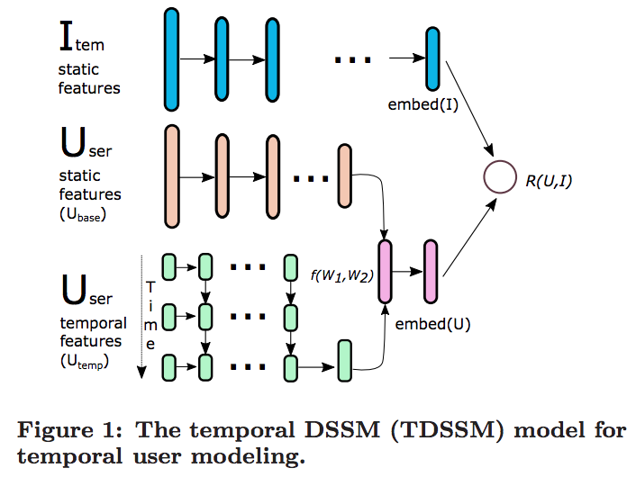

目录

<!-- TOC -->

- [2013年CIKM的dssm](#2013年cikm的dssm)
- [2014年CIKM的dssm: 引入cnn](#2014年cikm的dssm-引入cnn)
- [2014年的dssm](#2014年的dssm)
- [语义匹配](#语义匹配)
- [multiview dssm](#multiview-dssm)
    - [概述](#概述)
    - [降维](#降维)
        - [top features](#top-features)
        - [k means](#k-means)
        - [Local sensitive Hashing](#local-sensitive-hashing)
        - [减少训练样本数](#减少训练样本数)
- [TDSSM](#tdssm)

<!-- /TOC -->

参考[Modeling Interestingness with Deep Neural Networks](https://www.microsoft.com/en-us/research/wp-content/uploads/2014/10/604_Paper.pdf)

对应的ppt：
[ppt](../assets/Modeling Interestingness with Deep Neural Networks_ppt.pdf)

## 2013年CIKM的dssm

[Learning Deep Structured Semantic Models for Web Search using Clickthrough Data](https://www.microsoft.com/en-us/research/wp-content/uploads/2016/02/cikm2013_DSSM_fullversion.pdf)

相当于一个q，和每个d分别算cos。

<html>
<br/>


<br/>

</html>

## 2014年CIKM的dssm: 引入cnn

[A Latent Semantic Model with Convolutional-Pooling Structure for Information Retrieval](http://www.iro.umontreal.ca/~lisa/pointeurs/ir0895-he-2.pdf)

## 2014年的dssm

为用户的『兴趣』建模：
+ 自动高亮
+ 上下文实体检索

[Modeling Interestingness with Deep Neural Networks](https://www.microsoft.com/en-us/research/wp-content/uploads/2014/10/604_Paper.pdf)


paddle上，基于dssm，做了支持pairwise rank和分类/回归的一个通用模型：
[https://github.com/PaddlePaddle/models/blob/develop/dssm/README.cn.md](https://github.com/PaddlePaddle/models/blob/develop/dssm/README.cn.md)


## 语义匹配

[https://blog.csdn.net/zjrn1027/article/details/80170966](https://blog.csdn.net/zjrn1027/article/details/80170966)

相似度衡量可以使用cos，而最终的loss可以用hinge loss：

设置一个margin `\(m\)`，query `\(V_Q\)`，正样本`\(V_{A^+}\)`，负样本`\(V_{A^-}\)`，如果**正负样本的相似度之差**小于边界值，那就还需要优化，如果**已经大于等于边界值**了，说明**模型已经能区分**了，所以用hinge loss：

`\[
L=max(0, m - (cos(V_Q,V_{A^+} - cos(V_Q, V_{A^-}))))
\]`

tf算cos

```python
    def getCosineSimilarity(q, a):
        q1 = tf.sqrt(tf.reduce_sum(tf.multiply(q, q), 1))
        a1 = tf.sqrt(tf.reduce_sum(tf.multiply(a, a), 1))
        mul = tf.reduce_sum(tf.multiply(q, a), 1)
        cosSim = tf.div(mul, tf.multiply(q1, a1))
        return cosSim
```

tf算hinge

```python
    def getLoss(trueCosSim, falseCosSim, margin):
        zero = tf.fill(tf.shape(trueCosSim), 0.0)
        tfMargin = tf.fill(tf.shape(trueCosSim), margin)
        with tf.name_scope("loss"):
            losses = tf.maximum(zero, tf.subtract(tfMargin, tf.subtract(trueCosSim, falseCosSim)))
            loss = tf.reduce_sum(losses)
        return loss
```

使用

```python
        self.trueCosSim = self.getCosineSimilarity(question2, trueAnswer2)
        self.falseCosSim = self.getCosineSimilarity(question2, falseAnswer2)
        self.loss = self.getLoss(self.trueCosSim, self.falseCosSim, self.margin)
```

## multiview dssm

[A Multi-View Deep Learning Approach for Cross Domain User Modeling in Recommendation Systems](https://www.microsoft.com/en-us/research/wp-content/uploads/2016/02/frp1159-songA.pdf)

[https://blog.csdn.net/shine19930820/article/details/78810984](https://blog.csdn.net/shine19930820/article/details/78810984)

现在很多公司都不仅仅只有一个产品，而是有**多个产品线**。比如微软可能就有搜索、新闻、appstore、xbox等产品，如果将用户在这些产品上的行为（反馈）统一在一起训练一个深度学习网络，就能很好的解决**单个产品上**（用户）**冷启动、稀疏**等问题。

### 概述

<html>
<br/>


<br/>

</html>

一个产品线就是一个view，一条训练样本只有user+1个view，其他view置0。

对于其中一个塔，其实就是dssm:

<html>
<br/>


<br/>

</html>

其中：

`\[
R(Q,D)=cosine(y_Q,y_D)=\frac{y_Q^Ty_D}{\left \| y_Q \right \|\left \| y_D \right \|}
\]`

所以given Q点击D的概率就是：

`\[
P(D|Q)=\frac{exp(\gamma R(Q,D))}{\sum _{D'\in \textbf{D}}exp(\gamma R(Q,D'))}
\]`

其中的`\(\gamma\)`是平滑因子。这里的`\(\textbf{D}\)`是需要rank的Documents的集合，理想情况肯定是全集了。实际上定义`\((Q,D^+)\)`为一个query和点击文档的pair对，通过一个`\(D^+\)`和N个随机选的未点击的文档`\(D_j^-,j=1,...,N\)`近似。

所以训练时，在训练集上，给定query，有点击doc的概率最大化就是我们的目标(其中的`\(\Lambda\)`是网络参数)：

`\[
L(\Lambda)=-\log \prod _{(Q,D^+)}P(D^+|Q)
\]`

回到mv-dnn，训练流程如下：

> 1. 输入：
>      1. `\(N\)`：view的pair数，
>      1. `\(M\)`：训练迭代轮数
>      1. `\(U_A\)`：用户view的架构
>      1. `\(I_A=\{I_{A1},...,I_{AN}\}\)`：item view的架构
>      1. `\(U_D=\{U_{D1},...,U_{DN}\}\)`：用户输入文件
>      1. `\(U_D=\{U_{D1},...,U_{DN}\}\)`：item输入文件
>      1. `\(W_U\)`：user view的权重矩阵
>      1. `\(W_I=\{W_{I1},...,W_{IN}\}\)`：item view的权重矩阵
> 1. 使用`\(U_A\)`和`\(I_A\)`来初始化`\(W_U\)`和`\(W_I\)`
> 1. for m=1 to N
>       1. for v=1 to N
>            1. `\(T_U\leftarrow U_{D_v}\)`
>            1. `\(T_U\leftarrow U_{D_v}\)`
>       1. end for
> 1. end for
> 1. 输出：
>       1. `\(W_U\)`：final的user view的权重矩阵
>       1. `\(W_I\)`：final的item view的权重矩阵们

总体的优化目标是保证在所有视图上user和正向反馈的item的相似度大于随机选取的无反馈或者负向反馈的相似度，并且越大越好。

`\[
p=\underset{W_u,W_1,...W_v}{argmax}\sum ^N_{j=1}\frac{exp(\alpha _a cos(Y_u,Y_{a,j})}{\sum _{X'\in R^{d_a}}exp(\alpha cos(Y_u,f_a(X',W_a)))}
\]`

其中的`\(f_i(X_i,W_i)\)`是`\(X_i\)`到`\(Y_i\)`的变换。有一个用户view，加上`\(v\)`个辅助(auxiliary)的item view。`\(X_i\in R^{d_i}\)`，即每个view有自己的特征空间。对于第`\(j\)`条样本，它只有第`\(i\)`个auxiliary view是有值的，其他view都是0。

tf代码：[https://github.com/InsaneLife/dssm/blob/master/multi_view_dssm_v3.py](https://github.com/InsaneLife/dssm/blob/master/multi_view_dssm_v3.py)

### 降维

#### top features

对于user features，选取top-k最频繁的features。并通过TF-IDF过滤掉最常用的特征。

#### k means

kmeans的公式如下：

`\[
\underset{C_1,...,C_k}{argmin}\sum ^N _{i=1} \min _{C_j\in \{C_1,...,C_k\}}distance(X_i,C_j)
\]`

通过K-means对相似的特征群分组为同一个cluster并生成新的特征，共生成k个新特征。生成的特征向量`\(Y_i\)`是一个`\(K\)`维的向量，第`\(i\)`维是第`\(i\)`个cluster中features的出现数。

具体地，使用一个长度为`\(U\)`的vector `\(f_i\)`，`\(U\)`是训练集中的用户数，`\(f_i(j)\)`表示用户`\(i\)`有feature `\(j\)`的次数。将每个`\(f_i\)`进行归一化。这样，对于每一个用户向量`\(f_i\)`，可以产生它的降维了的用户向量`\(Y_i\)`（假设feature `\(a\)`分配给了cluster `\(Cls(a)\)`，`\(1\le Cls(a)\le K\)`）：

`\[
Y_i(j)=\sum _{a:X_i(a)>0 & Cls(a) = j}f_i(a)
\]`

想要抽出reasonable的feature数目，需要比较大的cluster数`\(K\)`。因为如果cluster数比较少，那一个cluster里就会有非常多的用户feature，很难学到有用的pattern。在本文中，设置`\(K=10000\)`，平均每个cluster里大概有350个feature。因为cluster数比较大，所以用mr版的kmeans。

#### Local sensitive Hashing

通过一个随机的矩阵将数据映射到低维向量空间上，并且**保持原始空间上的pairwis cos距离**在**新的空间上**仍然获得**保留**。

原始矩阵`\(d\)`维，降到`\(k\)`维，所以对应的矩阵是`\(A\in R^{d\times k}\)`。所以`\(A\)`中有`\(k\)`个映射，每个映射`\(A_i\)`都将`\(X\)`映射到`\(Y_i\)`，输出的`\(Y_i\in R^k\)`。计算方式如下：

`\[
Y_i=\left\{\begin{matrix}
1,&if\ A_iX\ge 0\\ 
0,&else
\end{matrix}\right.
\]`

计算`\(X_1\)`，`\(X_2\)`的cos相似度是`\(cos(\frac{H(Y_1,Y_2)}{k}\pi)\)`，其中，`\(X_1,X_2\in R^d\)`。`\(H(Y_1,Y_2)\)`是LSH输出向量的汉明距离。为了保持cos相似度的高准确率，需要把`\(k\)`设得比较大，这里和k-means一样，`\(k=10000\)`。

因为对每个向量算LSH是相互独立的，所以这一步是可以高度并行化的。但是，在我们的case里，有10000的`\(k\)`，有3.5M的`\(d\)`，所以相当于要把包括了`\(3.5M\times 10^4\)`个服从`\(N(0,1)\)`浮点数的`\(A\)`存到每个节点的内存里，也就是300G的内存消耗，这是肯定不行的。有很多解决方法，大部分方法是生成一个sparse的矩阵`\(A\)`【kdd06的[Very sparse random projections](https://web.stanford.edu/~hastie/Papers/Ping/KDD06_rp.pdf)】。

而本文用了[Online Generation of Locality Sensitive Hash Signatures](https://pdfs.semanticscholar.org/db21/730d2e0e2aa1f148a5411ea23ae7ceea574a.pdf)里提到的pooling trick。

保存一个size是`\(m\)`的pool `\(B\)`，每个元素是从`\(N(0,1)\)`中随机出来的浮点数，m远小于transition matrix `\(A\)`的size。要获取`\(A_{ij}\)`的一条记录，就是使用关于`\(i,j\)`的一致性hash的方法在`\(B\)`中找到一个index，然后查出它的值。在本文中，设置`\(m=1000000\)`，将单节点的内存损耗从100G缩减到10M，可以直接用mr搞啦。

#### 减少训练样本数

每个用户在每个域都有大量的日志数据，将每个用户在每个域只选取一个user-item对，具体为用户特征-用户在**此域**喜欢的所有item的**平均分数**。

## TDSSM

[Multi-Rate Deep Learning for Temporal Recommendation](http://sonyis.me/paperpdf/spr209-song_sigir16.pdf)

<html>
<br/>


<br/>

</html>