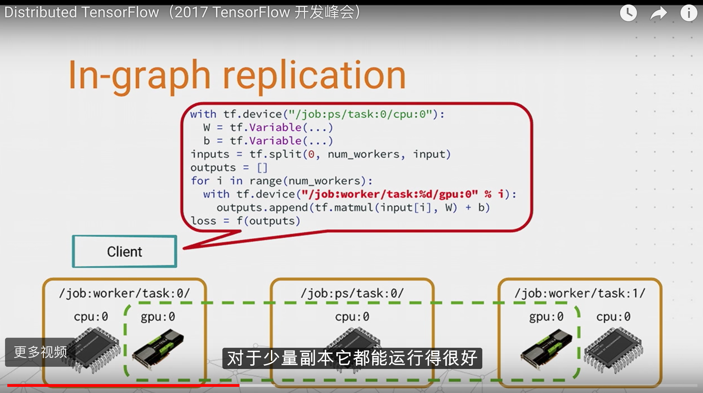
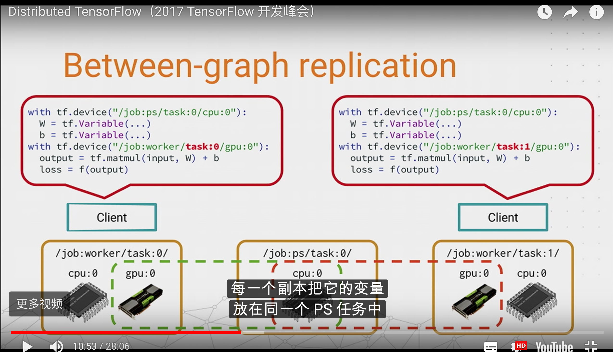
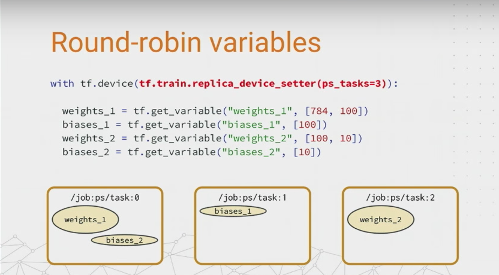
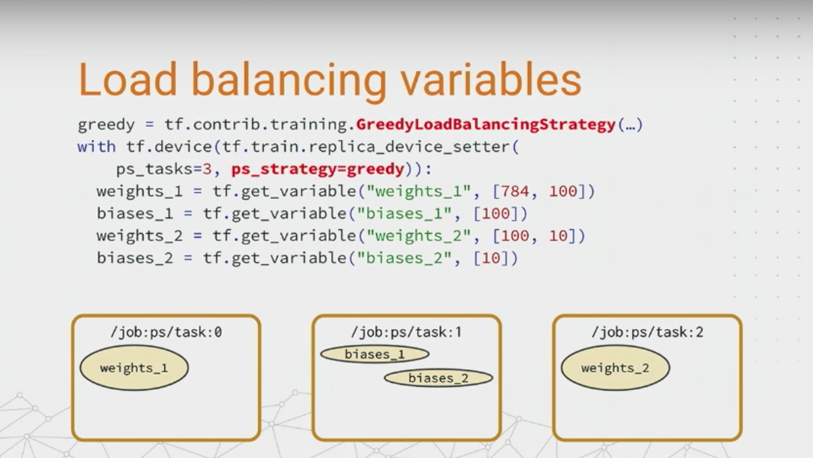
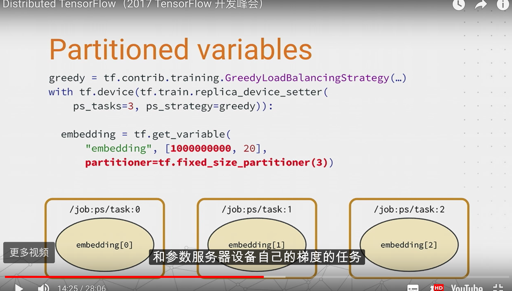
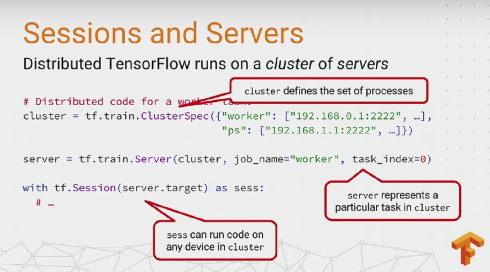
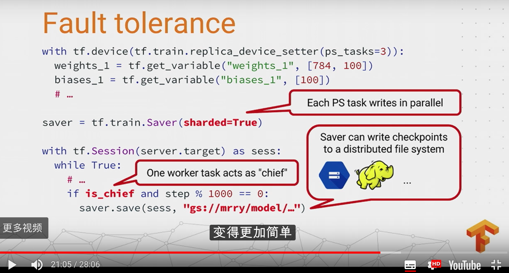
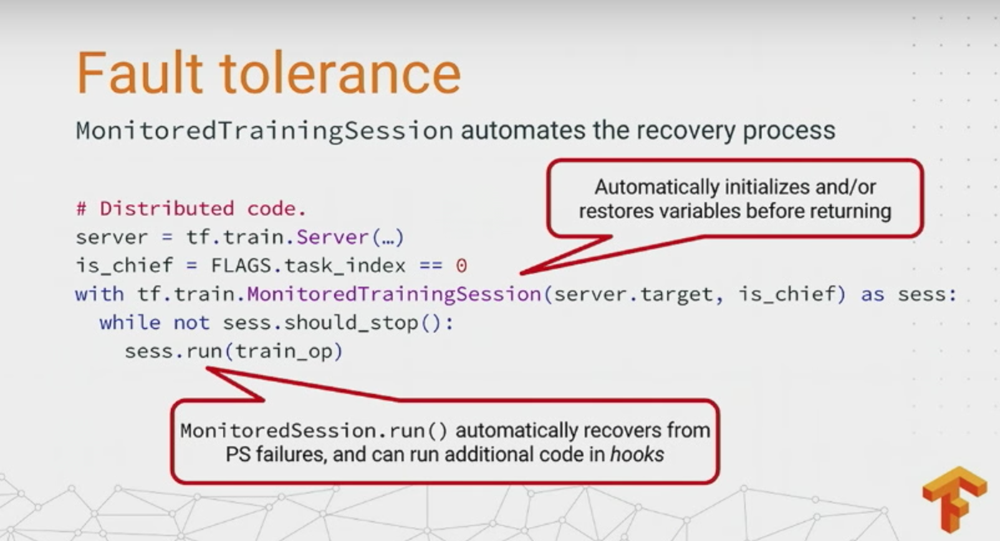
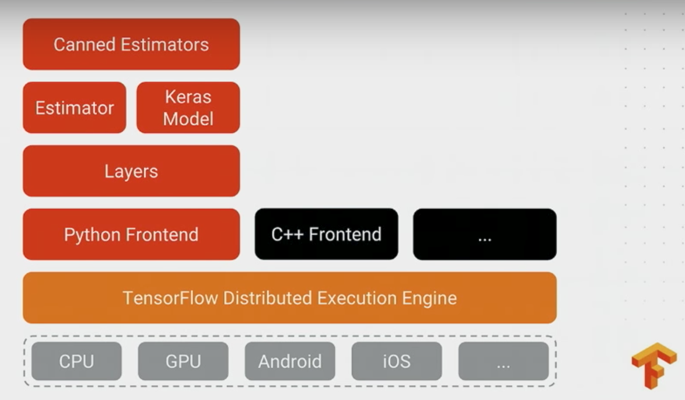
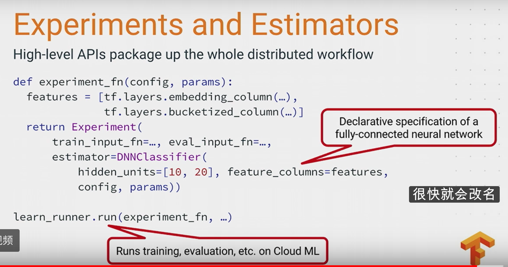

目录

<!-- TOC -->

- [单机多gpu](#单机多gpu)
- [分布式多机多GPU训练](#分布式多机多gpu训练)
    - [参数服务器](#参数服务器)
    - [tensorflow的分布式](#tensorflow的分布式)
        - [in-graph 模式](#in-graph-模式)
        - [between-graph模式](#between-graph模式)
    - [同步更新和异步更新](#同步更新和异步更新)
- [replica_device_setter](#replica_device_setter)
    - [round-robin模式：](#round-robin模式)
    - [greedystrategy](#greedystrategy)
    - [partition](#partition)
- [Sessionis and servers](#sessionis-and-servers)
- [fault tolerance](#fault-tolerance)
    - [故障恢复](#故障恢复)

<!-- /TOC -->

参考[白话tensorflow分布式部署和开发](http://blog.csdn.net/luodongri/article/details/52596780)

## 单机多gpu

官方demo参考：[models/tutorials/image/cifar10/](https://github.com/tensorflow/models/blob/master/tutorials/image/cifar10/cifar10_multi_gpu_train.py)

+ 假设你的机器上有3个GPU;
+ 在单机单GPU的训练中，数据是一个batch一个batch的训练。在单机多GPU中，**数据一次处理3个batch(假设是3个GPU训练），每个GPU处理一个batch的数据计算。**
+ 变量，或者说参数，保存在CPU上
+ 刚开始的时候数据由CPU分发给3个GPU，在GPU上完成了计算，得到每个batch要更新的梯度。
+ 然后在CPU上收集完了3个GPU上的要更新的梯度，计算一下**平均梯度**，然后更新参数。
+ 然后继续循环这个过程。

处理的速度取决于最慢的那个GPU的速度。如果3个GPU的处理速度差不多的话，处理速度就相当于单机单GPU的速度的3倍减去数据在CPU和GPU之间传输的开销，实际的效率提升看CPU和GPU之间数据的速度和处理数据的大小。

##  分布式多机多GPU训练

随着设计的模型越来越复杂，模型参数越来越多，越来越大，如果每次计算一轮，都要计算梯度、更新参数，当参数的量级上升到百亿量级甚至更大之后，参数的更新的性能都是问题。如果是单机16个GPU，一个step最多也是处理16个batch，这对于上TB级别的数据来说，不知道要训练到什么时候。于是就有了分布式的深度学习训练方法，或者说框架。

### 参数服务器

前面说道，当你的模型越来越大，模型的参数越来越多，多到模型参数的更新，一台机器的性能都不够的时候，很自然的我们就会想到把参数分开放到不同的机器去存储和更新。

因为碰到上面提到的那些问题，所有参数服务器就被单独拧出来，于是就有了参数服务器的概念。参数服务器可以是多台机器组成的集群，这个就有点类似分布式的存储架构了，涉及到数据的同步，一致性等等，一般是key-value的形式，可以理解为一个分布式的key-value内存数据库，然后再加上一些参数更新的操作。反正就是当性能不够的时候，几百亿的参数分散到不同的机器上去保存和更新，解决参数存储和更新的性能问题。

### tensorflow的分布式

#### in-graph 模式

<html>
 

 
</html>

一个client(显示调用tf::Session的进程),将里面的参数和ops指定给对应的job去完成.数据分发只由一个client完成.

in-graph模式和单机多GPU模型有点类似。in-graph模式，把计算已经从单机多GPU，已经扩展到了多机多GPU了，不过数据分发还是在一个节点。这样的好处是配置简单，其他多机多GPU的计算节点，只要起个join操作，暴露一个网络接口，等在那里接受任务就好了。这些计算节点暴露出来的网络接口，使用起来就跟本机的一个GPU的使用一样，只要在操作的时候指定tf.device("/job:worker/task:n")，就可以向指定GPU一样，把操作指定到一个计算节点上计算，使用起来和多GPU的类似。**但是这样的坏处是训练数据的分发依然在一个节点上，要把训练数据分发到不同的机器上，严重影响并发训练速度。**在大数据训练的情况下，不推荐使用这种模式。

#### between-graph模式

<html>
 

 
</html>

有很多独立的client,各个client构建了相同的graph(包含参数,通过使用tf.train.replica_device_setter,将这些参数映射到ps_server上.)

between-graph模式下，训练的参数保存在参数服务器，**数据不用分发，数据分片的保存在各个计算节点，各个计算节点自己算自己的，**算完了之后，把要更新的参数告诉参数服务器，参数服务器更新参数。这种模式的优点是不用训练数据的分发了，尤其是在数据量在TB级的时候，节省了大量的时间，所以大数据深度学习还是推荐使用between-graph模式。

### 同步更新和异步更新

**in-graph模式和between-graph模式都支持同步和异步更新**

在同步更新的时候，每次梯度更新，要等所有分发出去的数据计算完成后，返回回来结果之后，把梯度累加算了均值之后，再更新参数。这样的好处是loss的下降比较稳定，但是这个的坏处也很明显，处理的速度取决于最慢的那个分片计算的时间。

在异步更新的时候，所有的计算节点，各自算自己的，更新参数也是自己更新自己计算的结果，这样的优点就是计算速度快，计算资源能得到充分利用，但是缺点是loss的下降不稳定，抖动大。

在数据量小的情况下，各个节点的计算能力比较均衡的情况下，推荐使用同步模式；数据量很大，各个机器的计算性能掺差不齐的情况下，推荐使用异步的方式。

官方分布式文档：[https://www.tensorflow.org/deploy/distributed](https://www.tensorflow.org/deploy/distributed)

## replica_device_setter

### round-robin模式：

什么参数都不传，默认是round-robin

<html>
 

 
</html>

但如果只有两个ps任务，可能会把weight都给一个，bias都给另一个，这样就很不利。

### greedystrategy

<html>
 

 
</html>

依据变量占用的内存，会相对负载均衡。

### partition

<html>
 

 
</html>

如果embedding需要lookup的表非常大，可以直接指定partition，这样在查表的时候，也只会去相应的partition查。

## Sessionis and servers

<html>
 

 
</html>

ClusterSpec是一个字典，每个节点都存同一份（如果是K8s之类的，会有集群管理者）

ps代码：

<html>
 

 
</html>

## fault tolerance

<html>
 

 
</html>

设置saver的sharded=True，因为例如有3个ps，那么每个的saver就会保存它自己的全部变量。

<html>
 

 
</html>

save的条件是，只有是chief(完成初始化参数、写检查点、写结果给tensorboard等)的时候才写。另外，写文件的地址可以是hdfs、google cloud等。

### 故障恢复

如果一个非chief的worker挂了，问题不大，重新启动一个就行了

如果一个ps挂了,chief会暂停所有worker的作业，并在上一个检查点恢复所有ps任务

如果chief挂了，类似ps挂，全部暂停，等故障修复后，把chief恢复到上一个检查点的状态。当然，也可以用zookeeper，用选举的机制，选出一个新的chief，而不用全部暂停。

<html>
 

 
</html>

MonitoredTrainingSession每10min都随着编写检查点的hook出现一次，每100个steps会写一次summary

<html>
 

 
</html>

高level的api:experiment:

<html>
 

 
</html>

详见：

[https://www.tensorflow.org/deploy/distributed](https://www.tensorflow.org/deploy/distributed)

[https://www.tensorflow.org/extend/architecture](https://www.tensorflow.org/extend/architecture)

[https://www.tensorflow.org/extend/estimators](https://www.tensorflow.org/extend/estimators)

简单的demo:

[https://github.com/thewintersun/distributeTensorflowExample](https://github.com/thewintersun/distributeTensorflowExample)

