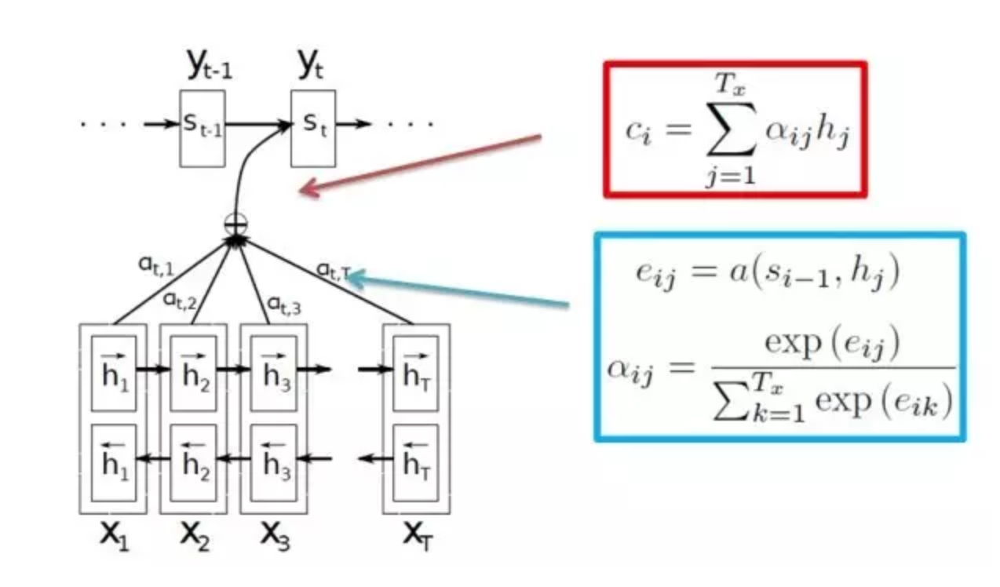
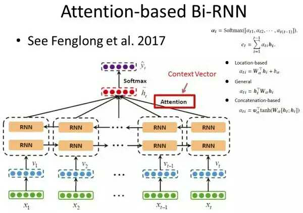
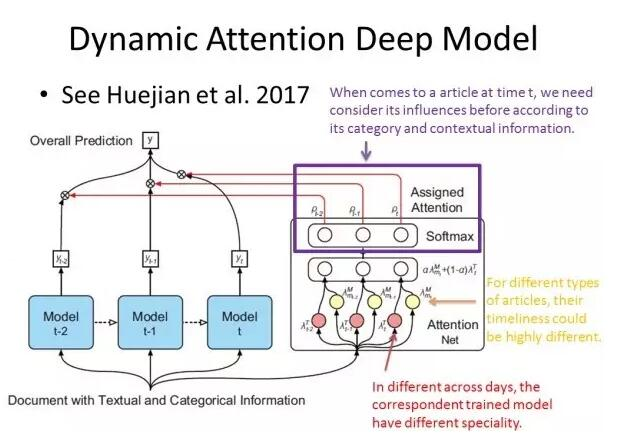
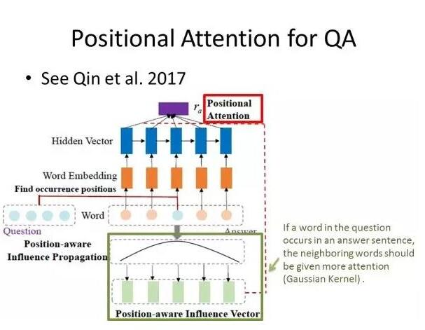
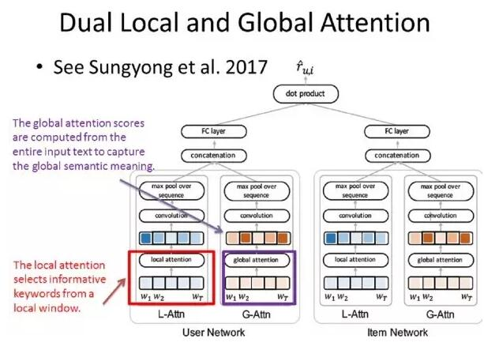
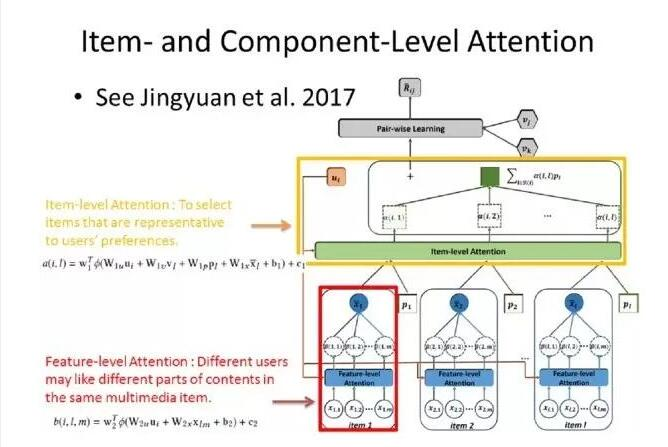
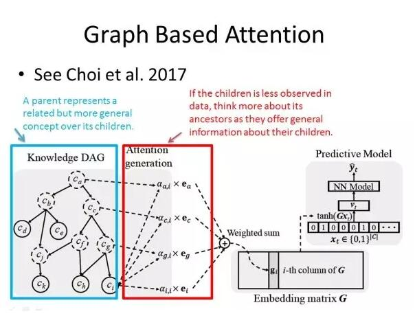

参考[从2017年顶会论文看Attention Model - PaperWeekly 第50期](https://mp.weixin.qq.com/s/R59A_qviCMjklIlmTE-qww)

目录

<!-- TOC -->

- [引言](#引言)
- [单层Attention Model](#单层attention-model)
- [多注意力机制（Hierarchical Attention & Dual Attention）](#多注意力机制hierarchical-attention--dual-attention)
- [基于知识图谱或者领域知识的注意力机制（Knowledge-base Attention）](#基于知识图谱或者领域知识的注意力机制knowledge-base-attention)
- [参考文献](#参考文献)

<!-- /TOC -->

## 引言

Attention Model 在 Image Caption、Machine Translation、Speech Recognition 等领域上有着不错的结果。那么什么是 Attention Model 呢？

举个例子，给下面这张图片加字幕（Image Caption）：一只黄色的小猫带着一个鹿角帽子趴在沙发上。可以发现在翻译的过程中我们的注意力由小猫到鹿角帽子再到沙发（小猫→鹿角帽子→沙发）。其实在很多和时序有关的事情上，人类的注意力都不是一成不变的，随着事情（时间）发展，我们的注意力不断改变。 

这篇文章的预备知识是 Decoder-Encoder 模型。本文主要做一个介绍，基本不会有公式推导，旨在让大家对 Attention Model 的变型和应用有一个大概的印象。

## 单层Attention Model

2014 年发表的文章 Neural Machine Translation by Jointly Learning to Align and Translate 使用了单层 Attention Model 解决机器翻译中不同长度的源语言对齐问题。使用 Attention Model 的基本思想是目标语言端的词往往只与源语言端部分词相关。而这个相关度通常用概率的形式表示。

这个过程基本为：首先计算当前上下文的环境与每个源语言词语的相关度（一个得分），然后使用 softmax 公式，将这个相关度转化为概率的形式，最后用得到的概率乘以对应源语言端词的隐含表示作为该词对预测目标的贡献，将所有源语言端的词贡献加起来作为预测下一个词的部分输入。

其中计算上下文环境与源语言词语的相关得分，是根据语言特性设计的一个对齐模型（Alignment Model）。通常情况下，单层 Attention Model 的不同之处主要在于相关分数计算方式的不同，接下来我们介绍三种通用的计算方式。同时在后文中，不再重复叙述 Attention Model 中根据相关分数计算输出向量的过程。

<html>
 

 

</html>

论文 Dipole: Diagnosis Prediction in Healthcare via Attention-based Bidirectional Recurrent Neural Networks，介绍了单个 Attention Model 在医疗诊断预测中的应用。

这个模型的输入是用户前 t 次的医疗代码（每次的医疗代码用 one-hot 的形式表示），输出是用户下一时刻的医疗诊断类型。使用 Attention Model 的思想是：用户下一时刻被诊断的疾病类型可能更与前面某一次或某几次的医疗诊断相关。论文模型框架如下。 

<html>
 

 

</html>

论文 Dynamic Attention Deep Model for Article Recommendation by Learning Human Editors’ Demonstration 介绍了单个 Attention Model 在新闻推荐/筛选领域的应用。该模型的输入是一个文章的文本和种类信息，输出是0/1，表示输入的新闻是否被选中（二分类问题）。

下图展示的是该模型的 Attention Model 部分，未展示的部分是处理输入数据的过程，该过程是通过 CNN 等模型将文本和种类特征处理成固定维度的隐含向量表示。

论文的整体思路为：根据新闻的文本信息和种类信息，考虑新闻的时效性和时间特征。它主要是基于两个假设：第一，用户在不同的日子可能会有不同的喜好，比如用户在周一更喜欢金融类的新闻，而在周五可能更喜欢娱乐相关的论文；第二，不同类型的新闻时效性也不同，金融相关的新闻时效性短，而娱乐类的新闻时效性长。

该论文中 Attention Model 的作用是，在第 t 时刻，给定新闻的文本和种类信息，不仅仅考虑第 t 时刻的模型（假设考虑一周中不同日子的影响，则有 7 个模型），我们也考虑该新闻在其他时刻的影响，然后根据新闻在各个时刻下的影响度随着时间的变化，综合考虑该新闻被选择的概率。 但是这个模型人工干涉的部分太多，随着假设的增加，模型会越来越复杂。

<html>
 

 

</html>

论文 Enhancing Recurrent Neural Networks with Positional Attention for Question Answering 将 Attention Model 变形，然后应用于问答系统（Question Answer）。该模型输入为“问题”句子中所有词语的词向量，输出“回答”句子中所有词语的词向量。

该论文使用 Attention Model 的假设为：如果“问题”句子中某个单词出现在“回答”句子中，则在“回答”句子中该单词周围的词语影响度更大，且该影响度随距离变化呈高斯分布。

通过拟合高斯分布得到所有输入词的影响概率，然后将影响概率作为权重，和输入向量加权求和得到基于位置的影响向量，最后将得到的影响向量作为指定向量，计算所有输入单词的隐含向量与该指定向量的相关度，通过 Attention Model 计算得到的向量作为输入帮助完成预测。

这篇论文中，相关度的计算并没有使用上面提到的三种方法，而是根据问题的实际情况以及模型的前提假设进行变型。

<html>
 

 

</html>

论文 Video Question Answering via Attribute-Augmented Attention Network Learning 使用基于属性扩展的 Attention Model 来解决以给定视频作为背景材料的问题。

本文的基本思路是根据问题发现哪一部分视频和这个问题相关，从而能生成更加相关答案。本文的输入包括，多帧视频信息（视频每一帧通过 CNN 等模型得到固定维度的隐含向量表示）以及处理问题（文本信息）得到隐含向量表示，输出为回答中的多个单词。

其实这篇论文只简单地将每一帧视频处理成一个固定向量，且 multi-modal 部分的求和取平均有些过于简单。如果能更精确地分析每一帧画面相关的重点信息，结果应该会更加优化。

而接下来，我们要介绍多注意力机制（Hierarchical Attention 以及 Dual Attention）是如何更加精确地完成任务。

## 多注意力机制（Hierarchical Attention & Dual Attention）

论文 A Context-aware Attention Network for Interactive Interactive Question Answering 介绍了如何用 Hierarchical Attention Model 完成 QA 任务。

该任务的输入是：给定文档（多个句子，每个句子由多个单词组成）的所有词向量，以及给定问题的隐含向量表示；输出是：回答句子中的一个个单词。

本文 Attention Model 部分的基本思路为：首先在给定的文档集中的每一个句子中，计算该句子中每一个单词和给定问题的相关度，通过这一层的 Attention Model 计算得到的向量作为每个句子的隐含向量表示；然后在给定的文档集中，计算每一个句子和给定问题的相关度，然后利用第二层 Attention Model 计算得到的向量作为 Context vector，用以生成回答。

论文 Leveraging Contextual Sentence Relations for Extractive Summarization Using a Neural Attention Model 介绍了如何使用 Hierarchical Attention Model 完成文章的摘要提取。

摘要提取这类任务的输入是一个文档中所有词向量，输出是 0/1，表示每一个句子是否作为摘要。摘要提取的一个关键是判断哪些词语或者哪些句子更具有代表性，更能代表其他词语或者句子，而通常的做法就是对于句子 t ，计算 [1,t-1] 以及 [t+1,] 与 t 的cosine相似度，作为判断 t 是否作为摘要的依据。

首先，对每一个词计算其对该句子的贡献率（影响概率），通过单词级别（word-level）的 Attention Model 计算生成的向量作为句子的隐含向量；而在句子级别计算每个句子和其前面 t-1 个句子的相似度，利用第二层 Attention 生成的上文相关向量，同时计算每个句子和其后面所有句子的相似度，利用第二层 Attention 生成的下文相关向量；最后将上文下文相关向量作为最终预测的一部分输入。

上述文章中的 Attention Model 与前一篇论文类似，都是用了单词级别（word-level）和句子级别（sentence-level）的 Hierarchical Attention Model。

当然，这种 Hierarchical Attention Model 不仅可以使用在 NLP 领域，它在很多领域都有不错的发展。接下来这篇文章就介绍了 Hierarchical Attention Model 在医疗领域的应用。

论文 Learning to Generate Rock Descriptions from Multivariate Well Logs with Hierarchical Attention 介绍了如何利用 Hierarchical Attention Model 帮助生成岩石描述。

该模型的输入是钻井得到的多类数据（每类数据的数值随时间或者其他维度不断变化）以及词典集中所有单词的词向量，输出为岩石描述的文本。它第一层 Attention Model 是为了判断，在预测下一个描述词时，每类数据中具体哪个数值与该描述词相关；而第二层 Attention Model 的意义在于判断在预测下一个描述词时，哪一类数据与该描述词相关。

<html>
 

 

</html>

前三篇论文都是关于 Hierarchical Attention Model，接下来介绍一篇关于 Dual Attention 的论文。论文 Interpretable Convolutional Neural Networks with Dual Local and Global Attention for Review Rating Prediction 介绍了如何将 Dual Attention Model 用于推荐系统。

这个模型有两个输入：User Network 的输入是该用户给出的所有评论；Item Network 的输入是该产品收到的所有评论。输出是该用户对给定产品的评分。

本文有一个假设：不同用户对喜爱或者厌恶情感的表达是不同的，比如一个用户喜欢打高分，不喜欢的产品他可能打 4 分，但是另一个用户喜欢打低分，他喜欢的产品也仅仅给 4 分，因此要根据用户真正的喜好来推荐，而不能仅仅把用户的评分作为依据。

本文的 Dual Attention Model，是一个平行的模型，不同于前三篇文章第一层 Attention Model 的输出是第二层 Attention Model 的输入。这个 Dual Attention 由一个 Local-Attention（L-Attn）和一个 Global-Attention（G-Attn）组成。L-Attn 旨在在滑动窗口中发掘出一些有意义的关键词（可以根据这些关键词发掘用户的喜好，比如“喜欢”、“裙子”）；而 G-Attn 旨在抓住用户的整体情感表达情况（假设中提到的）。

同理，在 Item Network 中也使用 L- 和 G-Attn 用来抓住一些和该产品有关的关键词以及其他用户对这个产品的一个整体喜好情况。然后将 Dual Attention Model 得到的输出拼接起来作为完成最终任务的输入。

<html>
 

 

</html>

## 基于知识图谱或者领域知识的注意力机制（Knowledge-base Attention）

论文 Attentive Collaborative Filtering: Multimedia Recommendation with Item- and Component-Level Attention 介绍了基于领域知识的注意力机制如何用于推荐系统的。其中的 Attention Model 框架和上一节中介绍的 Hierarchical Attention Model 十分类似，唯一的不同就是它的输入使用了其他领域信息。

不同于传统的 CF 推荐模型，本文有如下假设：两个用户同时喜欢一件衣服，有人因为它的颜色，有人因为它的裁剪，在实际推荐中，精准分析将提升推荐准确性。因此某一个产品的隐含向量表示不再是固定不变的了，它会根据用户的喜好有不同的表现。模型的输入是用户之前购买的所有产品以及每个产品的多个特征表示，输出是用户喜欢该产品的可能性。

首先，对于每一个输入的产品，计算用户特征向量和该产品每一个特征的相关度，通过第一层 Attention Model 计算得到的向量作为该产品的隐含表示；然后计算用户特征向量和所有输入产品的相关度，通过第二层 Attention Model 计算得到的向量作为用户的喜好特征，从而完成最终的推荐任务。

<html>
 

 

</html>

当我们要引入知识图谱或者领域知识时，并不代表模型会十分复杂，也不是说 Attention 的层数越高，模型越好。论文 GRAM: Graph-based Attention Model For Healthcare Representation Learning 就用了一个简单漂亮的模型完成了预测任务。

和小节 2 中提到的 Dipole 模型一样，这是一个医疗诊断预测问题。这个模型的输入是用户前 t 次的医疗代码（每次的医疗代码用 one-hot 的形式表示），输出是用户下一时刻的医疗诊断类型。但是有很多医疗代码数据稀疏甚至缺失，导致该医疗代码的隐含向量表示不能很好地完成预测任务。本文通过引入知识图谱信息一定程度地改善了这种情况。

首先引入外部知识图谱，这个知识图谱是一个有向无环图，每个节点的父节点表示了一种相关但更宽泛的定义/概念。当医疗代码 c_i 信息稀少或者缺失时，可以考虑使用更加宽泛的定义。而 Attention Model 就是用来判断 c_i,c_g,c_c,c_a（从叶子节点到根结点上所有节点）对预测任务的贡献度。

<html>
 

 

</html>

## 参考文献

+ KDD-2017 
[1] Dipole: Diagnosis Prediction in Healthcare via Attention-based Bidirectional Recurrent Neural Networks
[2] A Context-aware Attention Network for Interactive Interactive Question Answering
[3] Dynamic Attention Deep Model for Article Recommendation by Learning Human Editors’ Demonstration
[4] GRAM: Graph-based Attention Model For Healthcare Representation Learning
[5] Learning to Generate Rock Descriptions from Multivariate Well Logs with Hierarchical Attention

+ SIGIR-2017 
[6] Enhancing Recurrent Neural Networks with Positional Attention for Question Answering
[7] Attentive Collaborative Filtering: Multimedia Recommendation with Item- and Component-Level Attention
[8] Video Question Answering via Attribute-Augmented Attention Network Learning
[9] Leveraging Contextual Sentence Relations for Extractive Summarization Using a Neural Attention Model

+ Recsys-2017 
[10] Interpretable Convolutional Neural Networks with Dual Local and Global Attention for Review Rating Prediction
