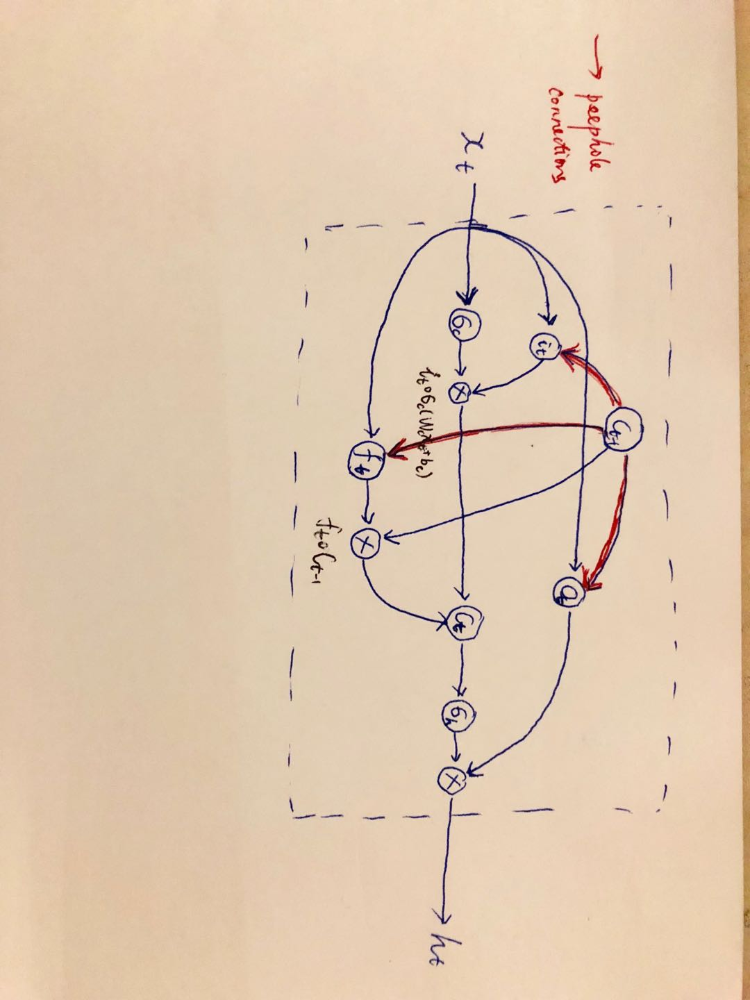
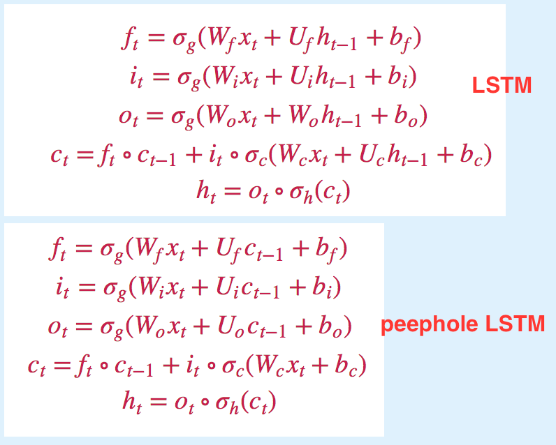
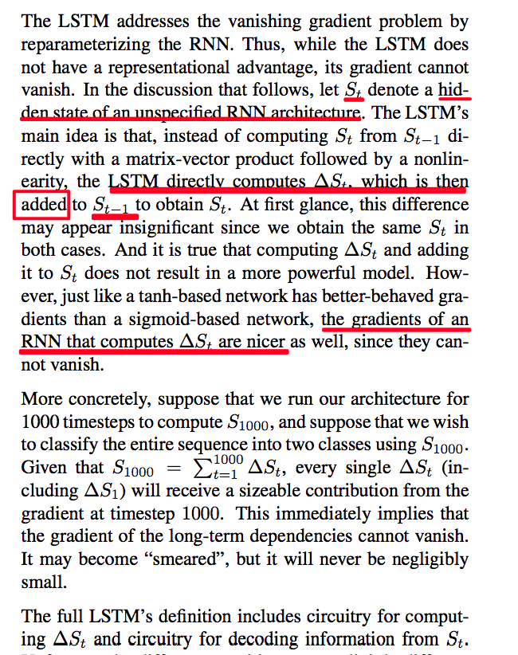
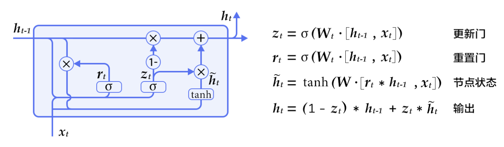
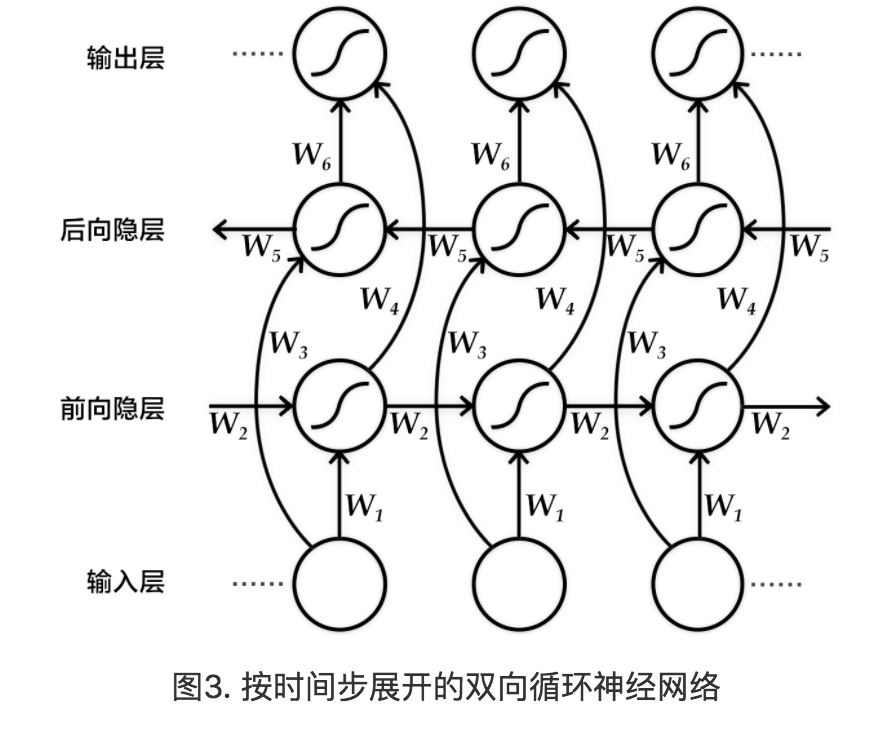
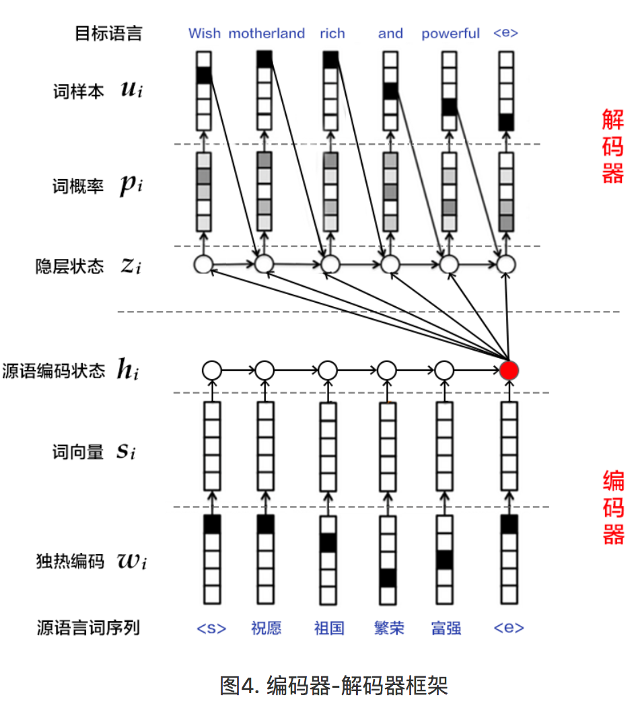
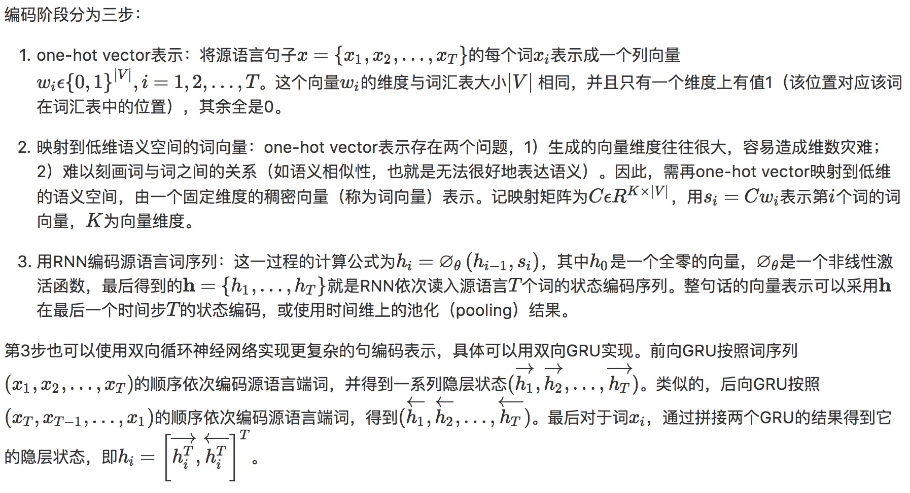
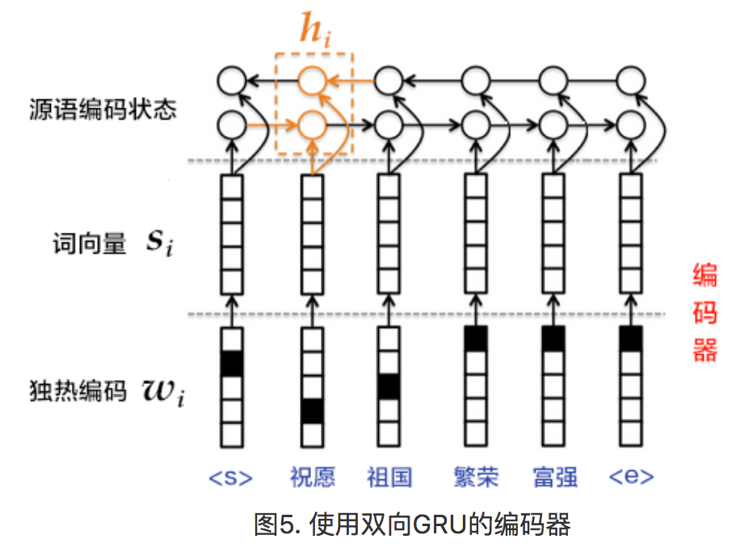
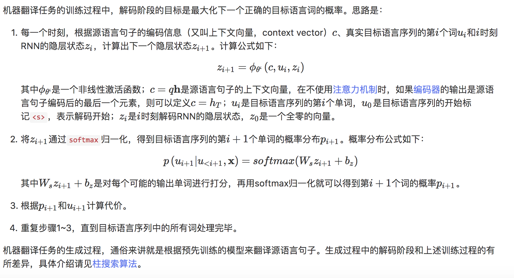

目录

<!-- TOC -->

- [1. LSTM & GRU](#1-lstm--gru)
    - [1.1 LSTM](#11-lstm)
        - [1.1.1 lstm为何可以缓解梯度消失](#111-lstm为何可以缓解梯度消失)
    - [1.2 GRU](#12-gru)
- [2. 双向GRU](#2-双向gru)
- [3. encoder-decoder框架](#3-encoder-decoder框架)
    - [3.1 encoder](#31-encoder)
    - [3.2 decoder](#32-decoder)
- [4. 注意力机制](#4-注意力机制)
- [5. beam search](#5-beam-search)
- [6. paddle demo](#6-paddle-demo)
    - [6.1 模型结构](#61-模型结构)
        - [6.1.1 编码器](#611-编码器)
        - [6.1.2 解码器](#612-解码器)
            - [6.1.2.1 得到对齐模型](#6121-得到对齐模型)
            - [6.1.2.2 构造解码器RNN的初始状态](#6122-构造解码器rnn的初始状态)
            - [6.1.2.3 定义解码阶段每一个时间步的RNN行为](#6123-定义解码阶段每一个时间步的rnn行为)
            - [6.1.2.4 定义解码器框架名字及gru\_decoder\_with\_attention的前两个输入](#6124-定义解码器框架名字及gru\_decoder\_with\_attention的前两个输入)
    - [6.2 训练模式的decoder](#62-训练模式的decoder)
    - [6.3 生成模型的解码器](#63-生成模型的解码器)
    - [6.4 attention的可视化](#64-attention的可视化)
- [7. 应用](#7-应用)
    - [7.1 Backbone模型](#71-backbone模型)
    - [7.2 其他一些尝试](#72-其他一些尝试)
    - [7.3 上述模型存在的问题](#73-上述模型存在的问题)
    - [7.4 采用增强学习进行优化](#74-采用增强学习进行优化)
    - [7.5 reranking](#75-reranking)
    - [7.6 rl进一步改进的方向](#76-rl进一步改进的方向)
    - [7.7 模型融合](#77-模型融合)
- [8. 其他](#8-其他)

<!-- /TOC -->

paddle rnn系列文档：
[https://github.com/PaddlePaddle/Paddle/tree/develop/doc/howto/deep_model/rnn ](https://github.com/PaddlePaddle/Paddle/tree/develop/doc/howto/deep_model/rnn )

## 1. LSTM & GRU

### 1.1 LSTM

参考[https://en.wikipedia.org/wiki/Long_short-term_memory](https://en.wikipedia.org/wiki/Long_short-term_memory)

最开始的lstm只有inputgate和outputgate[Long short-term memory, 1997](http://www.bioinf.jku.at/publications/older/2604.pdf)。


后来在[Learning to Forget: Continual Prediction with LSTM, 2000](https://pdfs.semanticscholar.org/1154/0131eae85b2e11d53df7f1360eeb6476e7f4.pdf)引入了forgetgate。

公式如下，其中，`\(\circ \)`表示element-wise的乘积：

`\[
\\ f_t=\sigma _g(W_fx_t+U_fh_{t-1}+b_f)    
\\ i_t=\sigma _g(W_ix_t+U_ih_{t-1}+b_i)    
\\ o_t=\sigma _g(W_ox_t+W_oh_{t-1}+b_o)    
\\ c_t=f_t \circ c_{t-1}+i_t \circ \sigma _c(W_cx_t+U_ch_{t-1}+b_c)
\\ h_t=o_t \circ \sigma _h(c_t)    
\]`

其中，初始值`\(c_0=0\)`，`\(h_0=0\)`，`\(\circ \)`表示element-wise的乘积，也就是图中的`\(\otimes \)`

**变量**：
+ `\(x_t \in R^d\)`：LSTM block的input vector
+ `\(f_t \in R^h\)`：forgetgate的activation vector
+ `\(i_t \in R^h\)`：inputgate的activation vector
+ `\(o_t \in R^h\)`：outputgate的activation vector
+ `\(h_t \in R^h\)`：LSTM block的output vector
+ `\(c_t \in R^h\)`：cell state vector
+ `\(W \in R^{h \times d}\)`，`\(U \in R^{h \times h}\)`和`\(b \in R^{h}\)`：需要学习的权重和bias

**激活函数**：
+ `\(\sigma _g\)`: sigmoid
+ `\(\sigma _c\)`: tanh
+ `\(\sigma _h\)`: tanh，但在peephole LSTM中，这个是`\(\sigma _h(x)=x\)`

在[LSTM Recurrent Networks Learn Simple Context Free and Context Sensitive Languages, 2001](ftp://ftp.idsia.ch/pub/juergen/L-IEEE.pdf)以及[Learning Precise Timing with LSTM Recurrent Networks](http://www.jmlr.org/papers/volume3/gers02a/gers02a.pdf)引入peephole conneciton：

和lstm基本一样，区别在于不用`\(h_{t-1}\)`了，大部分都换成了`\(c_{t-1}\)`。。

`\[
\\ f_t=\sigma _g(W_fx_t+U_fc_{t-1}+b_f)
\\ i_t=\sigma _g(W_ix_t+U_ic_{t-1}+b_i)    
\\ o_t=\sigma _g(W_ox_t+U_oc_{t-1}+b_o)    
\\ c_t=f_t \circ c_{t-1}+i_t \circ \sigma _c(W_cx_t+b_c)
\\ h_t=o_t\circ \sigma _h(c_t) 
\]`

<html>
<br/>


<br/>

</html>

直观对比如下：

<html>
<br/>


<br/>

</html>

#### 1.1.1 lstm为何可以缓解梯度消失


参考[知乎](https://www.zhihu.com/question/34878706)：

[An Empirical Exploration of Recurrent Network Architectures](http://proceedings.mlr.press/v37/jozefowicz15.pdf)的第2节

<html>
<br/>


<br/>

</html>

[Empirical Evaluation of Gated Recurrent Neural Networks on Sequence Modeling](https://pdfs.semanticscholar.org/2d9e/3f53fcdb548b0b3c4d4efb197f164fe0c381.pdf)的第3.3节

<html>
<br/>


<br/>

</html>

+ 传统的RNN总是用“覆写”的方式计算状态，`\(S_t=f(S_{t-1},x_t)\)`，f是仿射运算后再套sigmoid。所以根据求导的链式法则，梯度会变成连积形式。多个小于1的连乘就会很快接近0，导致梯度消失。
+ 引入门控单元的rnn，使用的是"累加"的方式，`\(S_t=\sum_{\tau=1}^{t}\Delta S_{\tau}\)`，这种累加形式导致导数也是累加形式，因此可以缓解梯度消失。

也就是说，传统的rnn是对`\(\sigma _c(xxxh_{t-1})\)`【其中`\(\sigma _c\)`是tanh】乘以w，然后再算sigmoid。而lstm对这项只是乘了一个(0,1)的系数(`\(i_t\)`)，然后加上`\(f_t \dot c_{t-1}\)`，再求tanh再乘一个(0,1)的系数（`\(o_t\)`），也就是说，并没有乘w，只是和一堆（0,1）的系数进行了线性变换，然后求和。。。

### 1.2 GRU

GRU是Cho等人在LSTM上提出的简化版本，也是RNN的一种扩展，如下图所示。GRU单元只有两个门：

+ 重置门（reset gate）：如果重置门关闭，会忽略掉历史信息，即历史不相干的信息不会影响未来的输出。
+ 更新门（update gate）：将LSTM的输入门和遗忘门合并，用于控制历史信息对当前时刻隐层输出的影响。如果更新门接近1，会把历史信息传递下去。

`\(z_t\)`【更新门】和`\(r_t\)`【重置门】都作用(sigmoid)于`\([h_{t-1},x_t]\)`【即上一时刻的隐层状态`\(h_{t-1}\)`和这一时刻的输入`\(x_t\)`】。

而重置门作用于`\(h_{t-1}\)`得到`\(r_t*h_{t-1}\)`【注意，是element-wise乘积】再与`\(x_t\)`一起经过tanh得到节点状态。

最终的输出是更新门与节点状态相乘，再加上`\(1-z_t\)`与上一时刻的隐层状态`\(h_{t-1}\)`的乘积。

总结一下：

+ 更新门和重置门都作用于上一时刻的隐层状态和这一时刻的输入。
+ 节点状态是本时刻的输入与经过重置门作用了的上一时刻的输出一起决定的。
+ 最终输出是更新门作用于节点状态，1-更新门作用于上一时刻隐层状态。

<html>
<br/>


<br/>

</html>

## 2. 双向GRU

我们已经在语义角色标注一章中介绍了一种双向循环神经网络，这里介绍Bengio团队在论文【Bahdanau等人[Neural Machine Translation by Jointly Learning to Align and Translate, ICLR, 2015](https://arxiv.org/pdf/1409.0473.pdf)】中提出的另一种结构。该结构的目的是输入一个序列，得到其在每个时刻的特征表示，即输出的每个时刻都用定长向量表示到该时刻的上下文语义信息。

具体来说，该双向循环神经网络分别在时间维以顺序和逆序——即前向（forward）和后向（backward）——依次处理输入序列，并将每个时间步RNN的输出拼接成为最终的输出层。这样每个时间步的输出节点，都包含了输入序列中当前时刻完整的过去和未来的上下文信息。下图展示的是一个按时间步展开的双向循环神经网络。该网络包含一个前向和一个后向RNN，其中有六个权重矩阵：输入到前向隐层和后向隐层的权重矩阵（W1,W3），隐层到隐层自己的权重矩阵（W2,W5），前向隐层和后向隐层到输出层的权重矩阵（W4,W6）。注意，该网络的前向隐层和后向隐层之间没有连接。

<html>
<br/>


<br/>

</html>

## 3. encoder-decoder框架

编码器-解码器（Encoder-Decoder）([Learning phrase representations using RNN encoder-decoder for statistical machine translation](http://www.aclweb.org/anthology/D/D14/D14-1179.pdf))框架用于解决由一个任意长度的源序列到另一个任意长度的目标序列的变换问题。即编码阶段将整个源序列编码成一个向量，解码阶段通过最大化预测序列概率，从中解码出整个目标序列。编码和解码的过程通常都使用RNN实现。

<html>
<br/>


<br/>

</html>

### 3.1 encoder

总体流程如下：
<html>
<br/>


<br/>

</html>

重点在于：
最后对于词xi，通过拼接两个GRU的结果得到它的隐层状态。

<html>
<br/>


<br/>

</html>

### 3.2 decoder

<html>
<br/>


<br/>

</html>

关键在于，预测的`\(z_{i+1}\)`由以下三部分经过**非线性激活**产生：
+ 源语言句子的**编码信息**`\(c\)`(`\(c=qh\)`，如果不用注意力，可以直接取最后一个时间步的编码`\(c=h_T\)`，也可以用时间维上的pooling的结果)。
+ **真实目标语言序列**的第i个词`\(u_i\)`。`\(u_0\)`是开始标志```<s>```。
+ i时刻的RNN**隐层状态**`\(z_i\)`, `\(z_0\)`是全零向量。

## 4. 注意力机制

如果在编码阶段的输出是一个固定维度的向量，会有以下两个问题：

+ 不论源语言序列长度是5个词还是50个词，如果都用固定长度的向量去编码其中的语义和句法信息，对模型来讲，**是一个非常高的要求，特别对长句子而言。**
+ 直觉上，当人类翻译一句话时，会对**与【当前】译文更相关的源语言片段给予更多关注，且关注点会随翻译的进行而改变。**

而固定维度的向量相当于，任何时刻都对源语言所有信息给予同等程度的关注，Bahdanau等人[Neural Machine Translation by Jointly Learning to Align and Translate, ICLR, 2015](https://arxiv.org/pdf/1409.0473.pdf)引入注意力机制，对编码后的上下文片段进行解码，以此解决长句子的特征学习问题。

和简单的编码器不同之处在于，前面生成`\(z_{i+1}\)`用的是`\(c\)`，而这里用的是`\(c_i\)`，也就是，对每个真实目标语言序列中的词`\(u_i\)`【注意！！是目标语言的i，不是源语言的！！】，都有一个特定的`\(c_i\)`与之对应。

`\[
z_{i+1}=\phi _{\theta }(c_i, u_i, z_i)
\]`

`\[
c_i=\sum ^T_{j=1}a_{ij}h_j, a_i=[a_{i1}, a_{i2}, ..., a_{iT}]
\]`

可见，注意力机制是通过**对编码器中各时刻的RNN状态**`\(h_j\)`进行加权平均实现的。权重`\(a_{ij}\)`计算方法如下：

`\[
c_i=\sum ^T_{j=1}a_{ij}h_j, a_i=[a_{i1}, a_{i2}, ..., a_{iT}]
\]`

`\[
a_{ij}=\frac {exp(e_{ij})}{\sum _{k=1}^Texp(e_{ik})}
\]`

`\[\
e_{ij}=align(z_i,h_j)
\]`

其中，align可以看作一个对齐模型，用于衡量**目标语言第i个词**（第i个隐层状态`\(z_i\)`）和**源语言第j个词**（第j个词的上下文片段`\(h_j\)`）的匹配程度。

传统的对齐模型中，目标语言的每个词明确对应源语言的一个词或多个词（hard alignment）；而这里用的是soft alignment，即**任何两个目标语言和源语言词间**均存在一定的关联（模型计算出的实数值）。

<html>
<br/>


<br/>

</html>

## 5. beam search

柱搜索（beam search）算法是一种启发式图搜索算法，用于在图或树中搜索有限集合中的最优扩展节点。通常用在**解空间非常大**的系统（如机器翻译、语音识别）中，因为内存无法存下图或权中所有展开的解。

beam search使用广度优先策略建立搜索树，在树的每一层，按照启发代价（heuristic cost, **例如本例中的生成词的log概率之和**）对节点进行排序，然后仅留下预先确定的个数(即beam width/beam size/柱宽度)的节点。只有这些节点会在下一层继续进行扩展，其他节点被裁剪掉了。可以减少搜索所占用的时间和空间，但无法保证一定获得最优解。

使用beam search的解码阶段，目标是最大化生成序列的概率，具体思路如下：

+ 每个时刻，根据源语言句子的编码信息c、生成的第i个真实目标语言序列单词`\(u_i\)`，和i时刻RNN的隐层状态`\(z_i\)`，计算出下一个隐层状态`\(z_{i+1}\)`
+ 将`\(z_{i+1}\)`通过softmax【只针对beamsearch得到的可能的解做处理】归一化，得到的目标语言序列的第i+1个单词的概率分布`\(p_{i+1}\)`
`\[
p(u_{i+1}|u_{\lt i+1}, x)=softmax(W_sz_{i+1}+b_z)
\]`
其中，`\(W_sz_{i+1}+b_z\)`是**对每个可能的输出单词进行打分**
+ 根据`\(p_{i+1}\)`采样出单词`u_{i+1}`
+ 重复前三个步骤，直到**获得句子的结束标记```<e>```或者超过句子的最大生成长度为止。**

## 6. paddle demo

### 6.1 模型结构

一些全局变量

```python
dict_size = 30000 # 字典维度
source_dict_dim = dict_size # 源语言字典维度
target_dict_dim = dict_size # 目标语言字典维度
word_vector_dim = 512 # 词向量维度
encoder_size = 512 # 编码器中的GRU隐层大小
decoder_size = 512 # 解码器中的GRU隐层大小
beam_size = 3 # 柱宽度
max_length = 250 # 生成句子的最大长度
```

#### 6.1.1 编码器

输入是一个文字序列，被表示成整型的序列。序列中每个元素是文字在字典中的索引。

```python
src_word_id = paddle.layer.data(
        name='source_language_word',
        type=paddle.data_type.integer_value_sequence(source_dict_dim))
```

然后映射成词向量```src_embedding```：

```python
src_embedding = paddle.layer.embedding(
     input=src_word_id, size=word_vector_dim)
```

然后使用双向gru进行编码，然后拼接两个gru的输出得到`\(h\)`【解码器中的`\(h_j\)`】即```encoded_vector```：

```python
src_forward = paddle.networks.simple_gru(
     input=src_embedding, size=encoder_size)
src_backward = paddle.networks.simple_gru(
     input=src_embedding, size=encoder_size, reverse=True)
encoded_vector = paddle.layer.concat(input=[src_forward, src_backward])
```

#### 6.1.2 解码器

##### 6.1.2.1 得到对齐模型

首先，对源语言序列编码后的结果【`\(h_j\)`】过一个fc，得到其映射```encoded_proj```【即，`\(h_j\)`和`\(z_i\)`的映射，也就是对齐模型`\(e_{ij}\)`】。

```python
encoded_proj = paddle.layer.fc(
      act=paddle.activation.Linear(),
      size=decoder_size,
      bias_attr=False,
      input=encoded_vector)
```

##### 6.1.2.2 构造解码器RNN的初始状态

由于解码器需要预测时序目标序列，但在0时刻并没有初始值，所以我们希望对其进行初始化。

这里采用的是将源语言序列逆序编码后（```src_backward```）的最后一个状态(```backward_first```)进行非线性映射fc，作为源语言上下文向量`\(c_i\)`的初始值（```decoder_boot```），即`\(c_0=h_T\)`

```python
backward_first = paddle.layer.first_seq(input=src_backward)
decoder_boot = paddle.layer.fc(
      size=decoder_size,
      act=paddle.activation.Tanh(),
      bias_attr=False,
      input=backward_first)
```

##### 6.1.2.3 定义解码阶段每一个时间步的RNN行为

根据三个输入【当前时刻的源语言上下文向量`\(c_i\)`、解码器隐层状态`\(z_i\)`、真实目标语言中的第i个词`\(u_i\)`】，来预测第i+1个词的概率`\(p_{i+1}\)`。

主要过程（输入`\(h_j\)`【即```enc_vec```】、`\(e_{ij}\)`【即```enc_proj```】和`\(u_i\)`【即```current_word```】：
+ 通过`\(c_0\)`的初始化，得到解码器隐层状态`\(z_i\)`【即```decoder_mem```】
+ 然后通过`\(e_{ij}\)`生成attention`\(a_{ij}\)`
+ 再将`\(a_{ij}\)`和`\(h_j\)`一起得到`\(c_i\)`【和上一步一起，封装在simple_attention函数中，得到```context```】
+ 接下来，通过`\(c_i\)`、`\(u_i\)`和`\(z_i\)`得到`\(z_{i+1}\)`【先```context```和```current_word```一起经过一个fc，得到```decoder_inputs```，然后和```decoder_mem```一起给```gru_step```做输入，得到```gru_step```】
+ 最后，对使用softmax归一化计算单词的概率，即通过```full_matrix_projection```+softmax，得到```out```【即公式：`\(p(u_{i+1}|u_{\lt i+1})=softmax(W_sz_{i+1}+b_z)\)`】

```python
def gru_decoder_with_attention(enc_vec, enc_proj, current_word):
    """
    enc_vec: h_j
    enc_proj: e_{ij}
    current_word: u_i
    """
     decoder_mem = paddle.layer.memory(
         name='gru_decoder', size=decoder_size, boot_layer=decoder_boot)

     context = paddle.networks.simple_attention(
         encoded_sequence=enc_vec,
         encoded_proj=enc_proj,
         decoder_state=decoder_mem)

     decoder_inputs = paddle.layer.fc(
         act=paddle.activation.Linear(),
         size=decoder_size * 3,
         bias_attr=False,
         input=[context, current_word],
         layer_attr=paddle.attr.ExtraLayerAttribute(
             error_clipping_threshold=100.0))

     gru_step = paddle.layer.gru_step(
         name='gru_decoder',
         input=decoder_inputs,
         output_mem=decoder_mem,
         size=decoder_size)

     out = paddle.layer.mixed(
         size=target_dict_dim,
         bias_attr=True,
         act=paddle.activation.Softmax(),
         input=paddle.layer.full_matrix_projection(input=gru_step))
     return out
```

##### 6.1.2.4 定义解码器框架名字及gru\_decoder\_with\_attention的前两个输入

也就是说，`\(h_j\)`和`\(e_{ij}\)`需要分别通过```StaticInput```进行包装一下。

参考[recurrent_group教程](https://github.com/PaddlePaddle/Paddle/blob/develop/doc/howto/deep_model/rnn/recurrent_group_cn.md#输入)

recurrent_group处理的输入序列主要分为以下三种类型：

+ **数据输入**：一个双层序列进入recurrent_group**会被拆解为一个单层序列**，一个单层序列进入recurrent_group**会被拆解为非序列**，然后交给step函数，这一过程对用户是完全透明的。可以有以下两种：1）通过data_layer拿到的用户输入；2）其它layer的输出。
+ **只读Memory输入**：StaticInput 定义了一个**只读**的Memory，由StaticInput指定的输入**不会被recurrent\_group拆解**，recurrent_group 循环展开的每个时间步总是能够引用所有输入，可以是一个非序列，或者一个单层序列。
+ **序列生成任务的输入**：GeneratedInput只用于在**序列生成任务中**指定输入数据。

```python
decoder_group_name = "decoder_group"
group_input1 = paddle.layer.StaticInput(input=encoded_vector)
group_input2 = paddle.layer.StaticInput(input=encoded_proj)
group_inputs = [group_input1, group_input2]
```

### 6.2 训练模式的decoder

注意，wmt14的reader(paddle/v2/dataset/wmt14.py中)如下：

```python
def reader_creator(tar_file, file_name, dict_size):
    def reader():
        src_dict, trg_dict = __read_to_dict__(tar_file, dict_size)
        with tarfile.open(tar_file, mode='r') as f:
            names = [
                each_item.name for each_item in f
                if each_item.name.endswith(file_name)
            ]
            for name in names:
                for line in f.extractfile(name):
                    line_split = line.strip().split('\t')
                    if len(line_split) != 2:
                        continue
                    src_seq = line_split[0]  # one source sequence
                    src_words = src_seq.split()
                    src_ids = [
                        src_dict.get(w, UNK_IDX)
                        for w in [START] + src_words + [END]
                    ]

                    trg_seq = line_split[1]  # one target sequence
                    trg_words = trg_seq.split()
                    trg_ids = [trg_dict.get(w, UNK_IDX) for w in trg_words]

                    # remove sequence whose length > 80 in training mode
                    if len(src_ids) > 80 or len(trg_ids) > 80:
                        continue
                    trg_ids_next = trg_ids + [trg_dict[END]]
                    trg_ids = [trg_dict[START]] + trg_ids

                    yield src_ids, trg_ids, trg_ids_next

    return reader
```

+ 首先，对目标语言计算embedding，得到```trg_embedding```，作为```current_word```，即`\(u_i\)`，放到```group_inputs```中
+ 然后使用```recurrent_group```，step指定为```gru_decoder_with_attention```，input为```group_inputs```
+ 使用目标语言的下一个词序列```target_language_next_word```作为label
+ 对decoder的输出与label做多分类的交叉熵算cost

```python
if not is_generating:
    trg_embedding = paddle.layer.embedding(
        input=paddle.layer.data(
            name='target_language_word',
            type=paddle.data_type.integer_value_sequence(target_dict_dim)),
        size=word_vector_dim,
        param_attr=paddle.attr.ParamAttr(name='_target_language_embedding'))
    group_inputs.append(trg_embedding)

    # For decoder equipped with attention mechanism, in training,
    # target embeding (the groudtruth) is the data input,
    # while encoded source sequence is accessed to as an unbounded memory.
    # Here, the StaticInput defines a read-only memory
    # for the recurrent_group.
    decoder = paddle.layer.recurrent_group(
        name=decoder_group_name,
        step=gru_decoder_with_attention,
        input=group_inputs)

    lbl = paddle.layer.data(
        name='target_language_next_word',
        type=paddle.data_type.integer_value_sequence(target_dict_dim))
    cost = paddle.layer.classification_cost(input=decoder, label=lbl)
```

### 6.3 生成模型的解码器

+ 首先，在序列生成任务中，由于解码阶段的RNN总是引用上一时刻生成出的词的词向量，作为当前时刻的输入，因此，使用**GeneratedInput**来自动完成这一过程。
+ 然后，使用```beam_search```函数循环调用```gru_decoder_with_attention```函数，生成出序列id。

和训练的区别：
+ group_inputs的前两个输入一样，都是`\(h_j\)`和`\(e_{ij}\)`的StaticInput，第三个输入有区别：训练是目标语言序列的embedding，而生成使用的是GeneratedInput
+ 使用```beam_search```，而训练使用的是```recurrent_group```。

```python
if is_generating:
    # In generation, the decoder predicts a next target word based on
    # the encoded source sequence and the previous generated target word.

    # The encoded source sequence (encoder's output) must be specified by
    # StaticInput, which is a read-only memory.
    # Embedding of the previous generated word is automatically retrieved
    # by GeneratedInputs initialized by a start mark <s>.

    trg_embedding = paddle.layer.GeneratedInput(
        size=target_dict_dim,
        embedding_name='_target_language_embedding',
        embedding_size=word_vector_dim)
    group_inputs.append(trg_embedding)

    beam_gen = paddle.layer.beam_search(
        name=decoder_group_name,
        step=gru_decoder_with_attention,
        input=group_inputs,
        bos_id=0,
        eos_id=1,
        beam_size=beam_size,
        max_length=max_length)
```

### 6.4 attention的可视化
[https://github.com/PaddlePaddle/Paddle/issues/1269](https://github.com/PaddlePaddle/Paddle/issues/1269)


## 7. 应用

在[AI Challenger比赛的机器翻译赛题](https://challenger.ai/competition/translation/subject)中，冠军的做法如下：

用pytorch（轻量，且实现Deliberation networks相对容易），8卡titan xp，一次训练将近一周。

### 7.1 Backbone模型

基于encoder-decoder+attention，其中，rnn使用3层lstm，dim(h)=1024。

对于处理未登录词：

参考[Neural Machine Translation of Rare Words with Subword Units](http://www.aclweb.org/anthology/P16-1162)【NMT中的OOV（集外词）和罕见词（Rare Words）问题通常用back-off 词典的方式来解决，本文尝试用一种更简单有效的方式（Subword Units）来表示开放词表。 本文从命名实体、同根词、外来语、组合词（罕见词有相当大比例是上述几种）的翻译策略中得到启发，认为把这些罕见词拆分为“子词单元”(subword units)的组合，可以有效的缓解NMT的OOV和罕见词翻译的问题。子词单元的拆分策略，则是借鉴了一种数据压缩算法[Byte Pair Encoding(BPE)](https://en.wikipedia.org/wiki/Byte_pair_encoding)，这里的压缩算法不是针对于词做变长编码，而是对于子词来操作。这样，即使是训练语料里未见过的新词，也可以通过子词的拼接来生成翻译。本文还探讨了BPE的两种编码方式：一种是源语言词汇和目标语言词汇分别编码，另一种是双语词汇联合编码。前者的优势是让词表和文本的表示更紧凑，后者则可以尽可能保证原文和译文的子词切分方式统一。从实验结果来看，在音译或简单复制较多的情形下（比如英德）翻译，联合编码的效果更佳。github:[https://github.com/rsennrich/subword-nmt](https://github.com/rsennrich/subword-nmt)】
解决低频词问题，相比Char/Word混合编码更为高效。源和目标的vocabulary size大约都是3.5w。

### 7.2 其他一些尝试

+ 结合语法信息的特征：
part-of-speech信息的tagging的信息做为sub-word的一个额外的embedding信息，相当于拿词语的词性来做额外的信息辅助。在200w-400w的小数据集上，使用这个方法，可以提升bleu 0.3左右。part-of-speech可以用nltk，而stanford的nlp的库在英文上的效果会更好。
+ 解码的方向：
左->右 or 右->左其实是两种条件概率，同时做两个方向的解码并且取最优（平均/max之类的都可以试试），bleu也可以提升0.4左右。最终的模型融合中暂未使用，因为就需要16个模型，而不是8个了。
+ 基于非rnn的encoder-decoder：
facebook的conv-seq2seq，单模型比lstm略有提升，但性能相对差一点。t2t效果也略好于baseline。但不太方便扩展（如，加上deliberation network，加入词性信息）。
+ 迭代编码：
传统encoder-decoder模型中，一旦decoder output了一个字符，就固定不可修改，希望可以继续迭代，进一步调整。所以，可以先训一个encoder-decoder，然后把output再作为输入，再搞一次encoder-decoder。【msra的nips2017有尝试：[Deliberation Networks: Sequence Generation Beyond One-Pass Decoding](http://papers.nips.cc/paper/6775-deliberation-networks-sequence-generation-beyond-one-pass-decoding.pdf)】【编码器-解码器框架在许多序列生成任务中都实现了非常好的性能，包括机器翻译、自动文本摘要、对话系统和图像描述等。这样的框架在解码和生成序列的过程中只采用一次（one-pass）正向传播过程，因此缺乏推敲（deliberation）的过程：即生成的序列直接作为最终的输出而没有进一步打磨的过程。然而推敲是人们在日常生活中的一种常见行为，正如我们在阅读新闻和写论文/文章/书籍一样。在该研究中，我们将推敲过程加入到了编码器-解码器框架中，并提出了用于序列生成的推敲网络（Deliberation networks）。推敲网络具有两阶段解码器，其中第一阶段解码器用于解码生成原始序列，第二阶段解码器通过推敲的过程打磨和润色原始语句。由于第二阶段推敲解码器具有应该生成什么样的语句这一全局信息，因此它能通过从第一阶段的原始语句中观察未来的单词而产生更好的序列。神经机器翻译和自动文本摘要的实验证明了我们所提出推敲网络的有效性。在 WMT 2014 英语到法语间的翻译任务中，我们的模型实现了 41.5 的 BLEU 分值，即当前最优的 BLEU 分值。】

### 7.3 上述模型存在的问题

+ 曝光偏差（Exposure Bias）
训练采用teacher forcing原则，永远假设以正确的答案作为结果进行训练，即output的前缀都是在正确的基础上输出下一个字符，和真实的decoding不太一样。即中间如果有个错了，会不会越错越远。
+ 训练与测试失配（loss-evaluation mismatch）
训练使用cross-entropy，但测试的目标却是bleu

### 7.4 采用增强学习进行优化

目标：
`\[
max_\theta E_{\tau \sim  \pi _\theta }[R(\tau )] 
\]`

先用cross-entropy训出一个基本可用的，再用增强学习，以bleu为目标，使用梯度上升的方法去改进`\(\theta \)`。

`\[
g=E_{\tau \sim  \pi _\theta }[\nabla _\theta log\pi _\theta (\tau)R(\tau ))] 
\]`

其中，
+ `\(\pi _\theta (\cdot )\)`为现有的翻译模型
+ `\tau`为根据现有模型所生成的一个翻译结果
+ `R(\tau)`采用句子级别BLEU进行计算


### 7.5 reranking

假设模型基本正确，生成k个可能正确的翻译结果，即，采用beamsearch，得到源语言x的多个翻译结果`\(\{t_i\}^K_{i=1}\)`，然后根据bleu score计算平均值：

`\[
\bar{b}=\frac{1}{K}\sum_iR(t_i)    
\]`

然后估算梯度：

`\[
\hat{g}=\frac{1}{K}\sum_i\nabla _\theta log\pi _\theta (t_i)[R(t_i)-\bar{b})
\]`

有0.3bleu的提升

### 7.6 rl进一步改进的方向

+ MIXER：第一步用cross-entropy，后面直接用bleu，有gap，
[sequence level traing with Recurrent neural networks]
+ learning rate的设置：Trust Region Policy Optimization，[Proximal Polocy Optimization Algorithms](https://arxiv.org/pdf/1707.06347.pdf)解决学习率难以调整的问题。

`\[
L^{clip}(\theta)=E_\tau [min(r(\theta )R(\tau),clip(r(\theta),1-\epsilon,1+\epsilon)R(\tau))]    
\]`

其中，`\(r(\theta)=\frac{\pi_\theta(\tau)}{\pi_{\theta_{old}}(\tau)}\)`

### 7.7 模型融合

计算算数平均值

`\[
\bar{\pi_\theta}(a;s)=\frac{1}{M}\sum_{j=1}^M\pi^j_\theta(a;s)
\]`

然后采用上述结果`\(\bar{\pi_\theta}(a;s)\)`进行beam search，得到最终结果
M=8个模型融合，相比单模型，+1.1 bleu

beamsearch时，除了max-likelihood外，还加入了对coverage的penalty和对句子长度的normalization计算。

## 8. 其他

注意：
cnn的卷积操作参考[https://daiwk.github.io/posts/image-classical-cnns.html](https://daiwk.github.io/posts/image-classical-cnns.html)

所以，推荐系统里面cnn的例子里，原矩阵是nxk，卷积核是hxk，所以得到的结果是(n-h+1)x(k-k+1)=(n-h+1)x1.所谓的时间维度上的maxpooling，就是对着这(n-h+1)个数字取max.

如果有多个(例如，xx个)卷积核，那就有多个(n-h+1)个序列，h和每个卷积核相关，那取pooling就是每个(n-h+1)里取max，最后得到xx个max值。

在sequence_conv_pool中，本质是```Text input => Context Projection => FC Layer => Pooling => Output.```，

```python
    with mixed_layer(
            name=context_proj_layer_name,
            size=input.size * context_len,
            act=LinearActivation(),
            layer_attr=context_attr) as m:
        m += context_projection(
            input,
            context_len=context_len,
            context_start=context_start,
            padding_attr=context_proj_param_attr)
    ### 打平成一个input.size*context_len的了？假设输入是一个序列，那么输出不是序列的序列了？而是一个单层序列？另外注意，这里的输入实际上是embedding，也就是序列的序列.
    fc_layer_name = "%s_conv_fc" % name \
        if fc_layer_name is None else fc_layer_name
    fl = fc_layer(
        name=fc_layer_name,
        input=m,
        size=hidden_size,
        act=fc_act,
        layer_attr=fc_attr,
        param_attr=fc_param_attr,
        bias_attr=fc_bias_attr)

    return pooling_layer(
        name=name,
        input=fl,
        pooling_type=pool_type,
        bias_attr=pool_bias_attr,
        layer_attr=pool_attr)
```

而其中的context_projection如下：

```
    For example, origin sequence is [A B C D E F G], context len is 3, then
    after context projection and not set padding_attr, sequence will
    be [ 0AB ABC BCD CDE DEF EFG FG0 ].
```

在stacked_lstm的例子中：
```python
    fc_last = paddle.layer.pooling(
        input=inputs[0], pooling_type=paddle.pooling.Max())
    lstm_last = paddle.layer.pooling(
        input=inputs[1], pooling_type=paddle.pooling.Max())
    output = paddle.layer.fc(
        input=[fc_last, lstm_last],
        size=class_dim,
        act=paddle.activation.Softmax(),
        bias_attr=bias_attr,
        param_attr=para_attr)
```
另外，

lstmemory的输出大小固定是输入大小的1/4
```python
size=input.size / 4,
```
agg_level=AggregateLevel.TO_NO_SEQUENCE pooling 默认把一个单层序列变成一个0层序列，默认是maxpooling，也就是整个序列取一个最大值当做输出。


