目录

<!-- TOC -->

- [1. Step](#1-step)
- [2. Identity](#2-identity)
- [3. ReLU](#3-relu)
- [4. Sigmoid](#4-sigmoid)
- [5. Tanh](#5-tanh)
- [6. Leaky Relu](#6-leaky-relu)
- [7. PReLU](#7-prelu)
- [8. RReLU](#8-rrelu)
- [9. ELU](#9-elu)
- [10. SELU](#10-selu)
- [11. SReLU](#11-srelu)
- [12. Hard Sigmoid](#12-hard-sigmoid)
- [13. Hard Tanh](#13-hard-tanh)
- [14. LeCun Tanh](#14-lecun-tanh)
- [15. ArcTan](#15-arctan)
- [16. SoftSign](#16-softsign)
- [17. SoftPlus](#17-softplus)
- [18. Signum](#18-signum)
- [19. Bent Identity](#19-bent-identity)
- [20. Symmetrical Sigmoid](#20-symmetrical-sigmoid)
- [21. Log Log](#21-log-log)
- [22. Gaussian](#22-gaussian)
- [23. Absolute](#23-absolute)
- [24. Sinusoid](#24-sinusoid)
- [25. Cos](#25-cos)
- [26. Sinc](#26-sinc)

<!-- /TOC -->

参考[26种神经网络激活函数可视化](https://www.jiqizhixin.com/articles/2017-10-10-3)，原文[Visualising Activation Functions in Neural Networks](https://dashee87.github.io/data%20science/deep%20learning/visualising-activation-functions-in-neural-networks/)【可以在里面选择不同的激活函数，看图】

## 1. Step

激活函数 Step 更倾向于理论而不是实际，它模仿了生物神经元要么全有要么全无的属性。它无法应用于神经网络，因为其导数是 0（除了零点导数无定义以外），这意味着基于梯度的优化方法并不可行。

`\[
f(x) =\begin{cases}1 & \text{for } x\geq0\\0 & \text{for } x<0\end{cases}  
\]`

`\[
f'(x) =\begin{cases}0 & \text{for } x\neq0\\? & \text{for } x=0\end{cases}  
\]`

## 2. Identity 

通过激活函数 Identity，节点的输入等于输出。它完美适合于潜在行为是线性（与线性回归相似）的任务。当存在非线性，单独使用该激活函数是不够的，但它依然可以在最终输出节点上作为激活函数用于回归任务。

`\[
\begin{align*}f(x) = x\end{align*}  
\]`

`\[
\begin{align*}f'(x) = 1\end{align*}
\]`

## 3. ReLU

修正线性单元（Rectified linear unit，ReLU）是神经网络中最常用的激活函数。它保留了 step 函数的生物学启发（只有输入超出阈值时神经元才激活），不过当输入为正的时候，导数不为零，从而允许基于梯度的学习（尽管在 x=0 的时候，导数是未定义的）。使用这个函数能使计算变得很快，因为无论是函数还是其导数都不包含复杂的数学运算。然而，当输入为负值的时候，ReLU 的学习速度可能会变得很慢，甚至使神经元直接无效，因为此时输入小于零而梯度为零，从而其权重无法得到更新，在剩下的训练过程中会一直保持静默。

`\[
f(x) =\begin{cases}x & \text{for } x\geq0\\0 & \text{for } x<0\end{cases}
\]`

`\[
f'(x) =\begin{cases}1 & \text{for } x\geq0\\0 & \text{for } x<0\end{cases}
\]`

<html>
<br/>
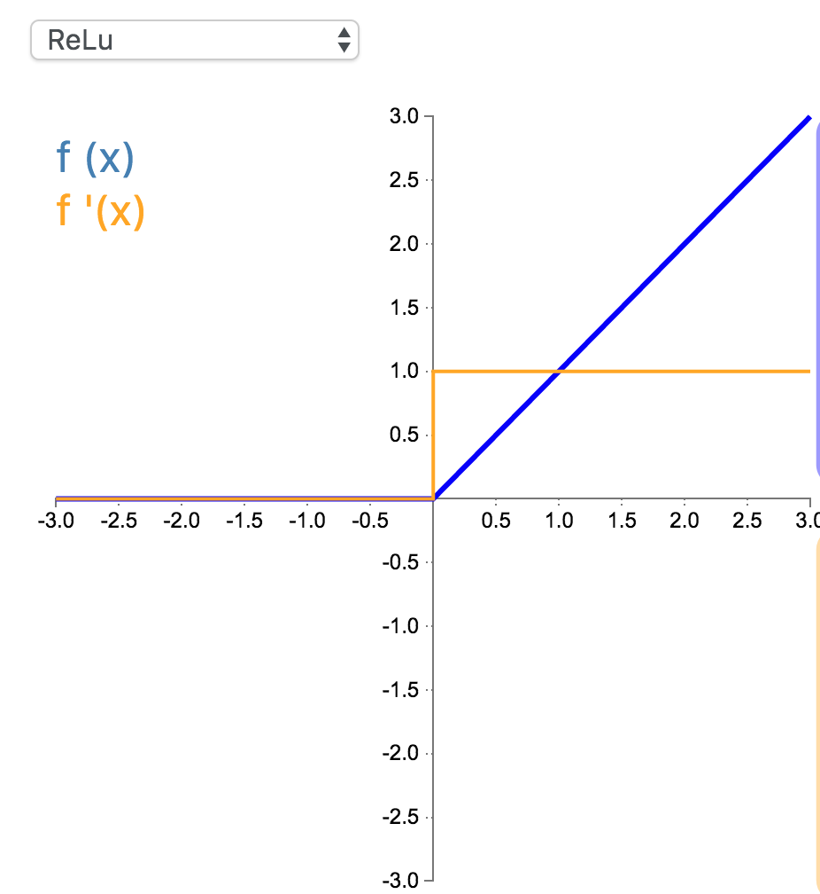
<br/>
</html>

## 4. Sigmoid

Sigmoid 因其在 logistic 回归中的重要地位而被人熟知，值域在 0 到 1 之间。Logistic Sigmoid（或者按通常的叫法，Sigmoid）激活函数给神经网络引进了概率的概念。它的导数是非零的，并且很容易计算（是其初始输出的函数）。然而，在分类任务中，sigmoid 正逐渐被 Tanh 函数取代作为标准的激活函数，因为后者为奇函数（关于原点对称）。

`\[
\begin{align*}f(x) = \frac{1}{1 + e^{-x}} \end{align*}  
\]`

`\[
\begin{align*}f'(x) &= \frac{e^{-x}}{(1+e^{-x})^2} \\&= f(x)(1-f(x)) \end{align*}  
\]`

<html>
<br/>
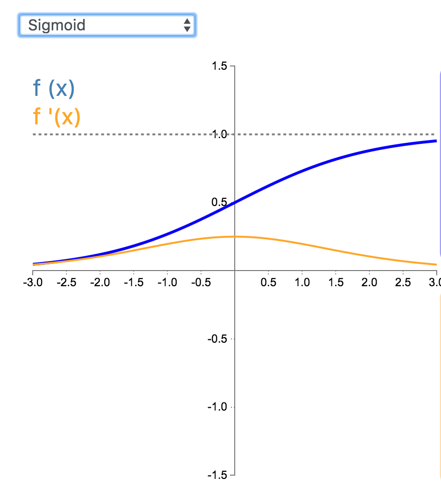
<br/>
</html>

## 5. Tanh

在分类任务中，双曲正切函数（Tanh）逐渐取代 Sigmoid 函数作为标准的激活函数，其具有很多神经网络所钟爱的特征。它是完全可微分的，反对称，对称中心在原点。为了解决学习缓慢和/或梯度消失问题，可以使用这个函数的更加平缓的变体（log-log、softsign、symmetrical sigmoid 等等）。

`\[
\begin{align*}f(x)&=\tanh(x)\\&=\frac{2}{1+e^{-2x}}-1\end{align*}  
\]`

`\[
\begin{align*}f'(x)&=1-\tanh^2(x)\\&=1-f(x)^2\end{align*}
\]`

<html>
<br/>
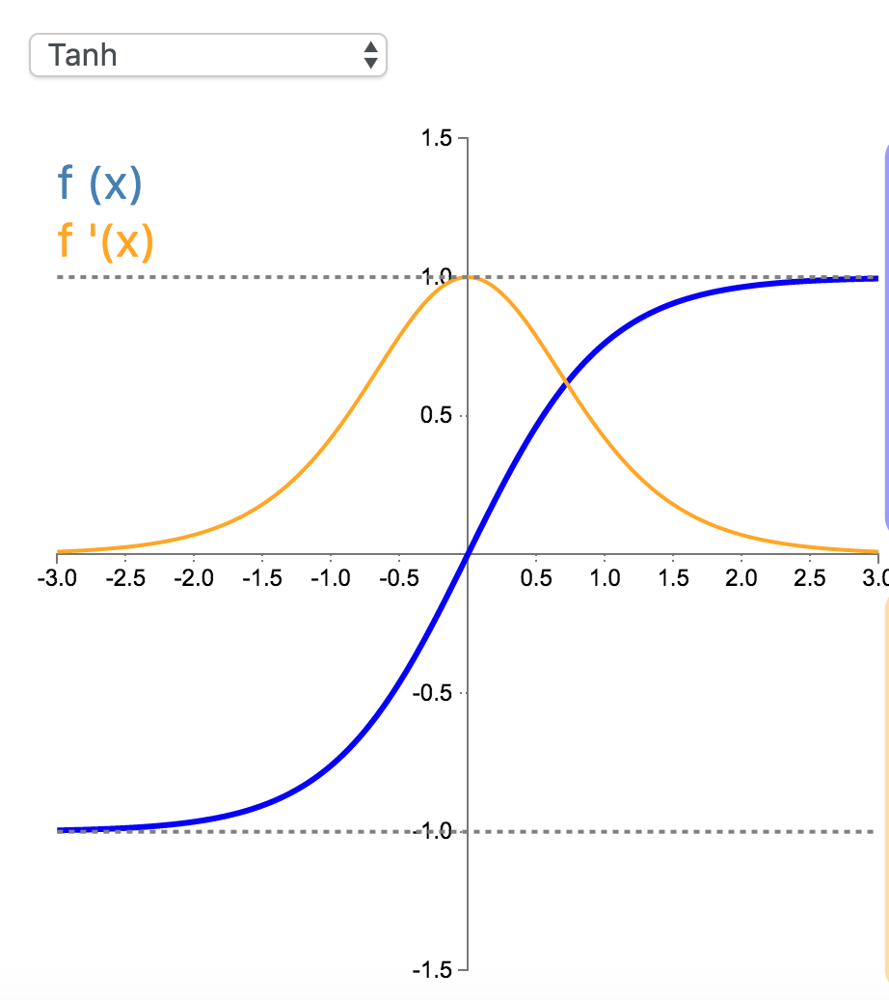
<br/>
</html>

## 6. Leaky Relu

经典（以及广泛使用的）ReLU 激活函数的变体，带泄露修正线性单元（Leaky ReLU）的输出对负值输入有很小的坡度。由于导数总是不为零，这能减少静默神经元的出现，允许基于梯度的学习（虽然会很慢）。

`\[
f(x) =\begin{cases}x & \text{for } x\geq0\\0.01x & \text{for } x<0\end{cases}
\]`

`\[
f'(x) =\begin{cases}1 & \text{for } x\geq0\\0.01 & \text{for } x<0\end{cases}
\]`

<html>
<br/>

<br/>
</html>

## 7. PReLU

参数化修正线性单元（Parameteric Rectified Linear Unit，PReLU）属于 ReLU 修正类激活函数的一员。它和 RReLU 以及 Leaky ReLU 有一些共同点，即为负值输入添加了一个线性项。而最关键的区别是，这个线性项的斜率实际上是在模型训练中学习到的。

`\[
f_{\alpha}(x) =\begin{cases}x & \text{for } x\geq0\\\alpha x & \text{for } x<0\end{cases}\]`

`\[
f'_{\alpha}(x) =\begin{cases}1 & \text{for } x\geq0\\\alpha & \text{for } x<0\end{cases}
\]`

<html>
<br/>
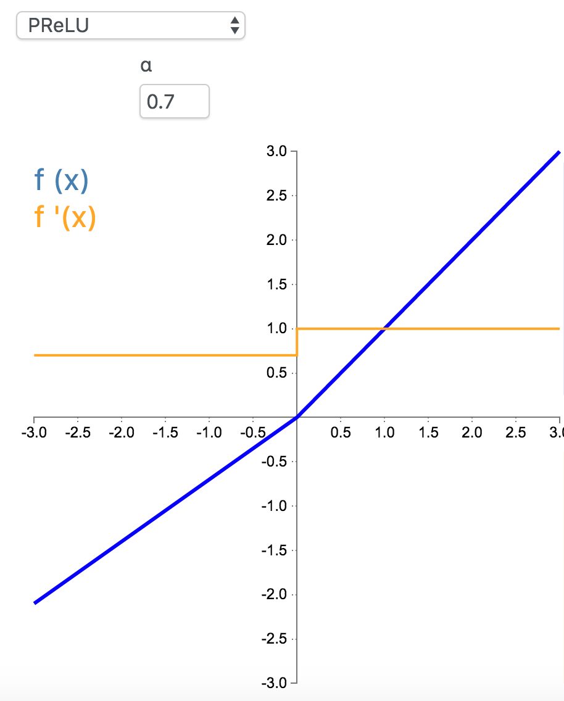
<br/>
</html>

## 8. RReLU

随机带泄露的修正线性单元（Randomized Leaky Rectified Linear Unit，RReLU）也属于 ReLU 修正类激活函数的一员。和 Leaky ReLU 以及 PReLU 很相似，为负值输入添加了一个线性项。而最关键的区别是，这个线性项的斜率在每一个节点上都是**随机分配**的（通常服从均匀分布）。

`\[
f(x) =\begin{cases}x & \text{for } x\geq0\\\alpha x & \text{for } x<0\end{cases}\]`

`\[
f'(x) =\begin{cases}1 & \text{for } x\geq0\\\alpha & \text{for } x<0\end{cases}  
\]`

<html>
<br/>
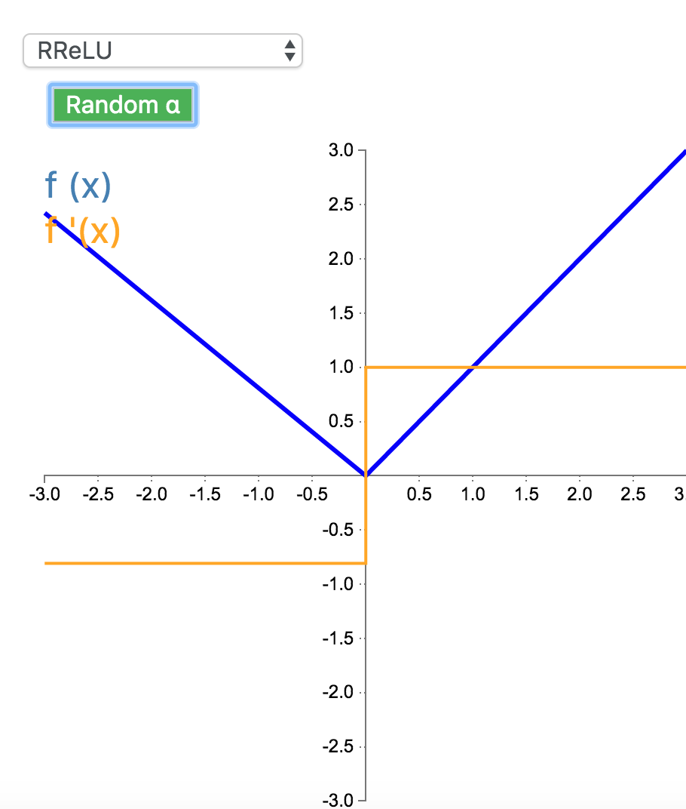
<br/>
</html>

## 9. ELU

指数线性单元（Exponential Linear Unit，ELU）也属于 ReLU 修正类激活函数的一员。和 PReLU 以及 RReLU 类似，为负值输入添加了一个非零输出。和其它修正类激活函数不同的是，它包括一个负指数项，从而防止静默神经元出现，导数收敛为零，从而提高学习效率。

`\[
f(x) = \begin{cases}\alpha(e^x - 1) & \text{for } x < 0\\x & \text{for } x \ge 0\end{cases}  
\]`

`\[
f'(x) = \begin{cases} \alpha e^{x} = f(x) + \alpha & \text{for } x < 0\\1 & \text{for } x \ge 0\end{cases}    
\]`

`\(\alpha = 0.7\)`：

<html>
<br/>
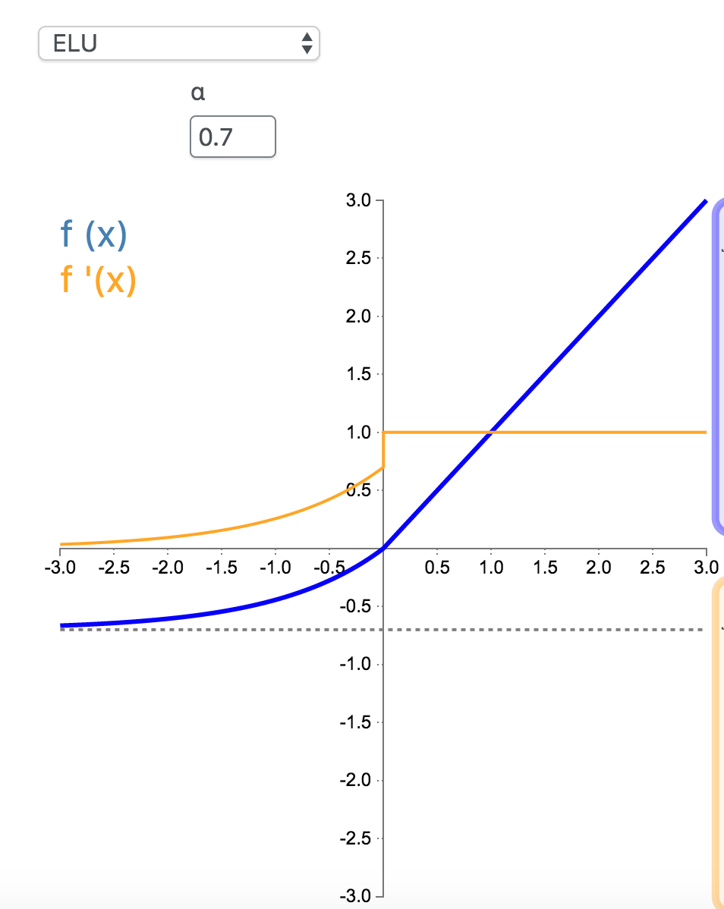
<br/>
</html>

`\(\alpha = 1\)`：

<html>
<br/>
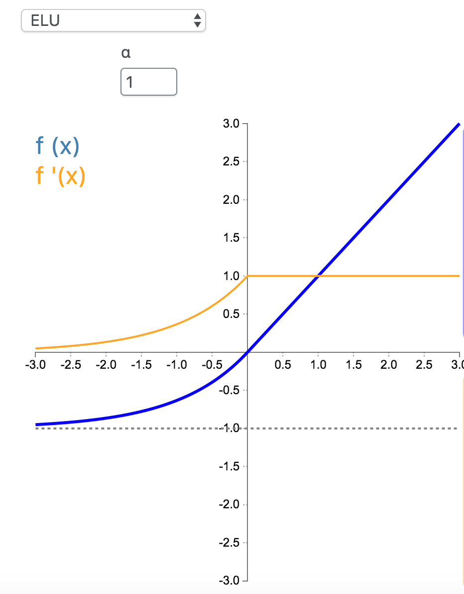
<br/>
</html>

注：
tensorflow中的实现就是`\(\alpha = 1\)`的版本```tensorflow/tensorflow/core/kernels/relu_op_functor.h```：

```c++
// Functor used by EluOp to do the computations.
template <typename Device, typename T>
struct Elu {
  // Computes Elu activation.
  //
  // features: any shape.
  // activations: same shape as "features".
  void operator()(const Device& d, typename TTypes<T>::ConstTensor features,
                  typename TTypes<T>::Tensor activations) {
    // features.constant(?)
    activations.device(d) =
        (features < static_cast<T>(0))
            .select(features.exp() - features.constant(static_cast<T>(1)),
                    features);
  }
};

// Functor used by EluGradOp to do the computations.
template <typename Device, typename T>
struct EluGrad {
  // Computes EluGrad backprops.
  //
  // gradients: gradients backpropagated to the Elu op.
  // activations: outputs of the Elu op.
  // backprops: gradients to backpropagate to the Elu inputs.
  void operator()(const Device& d, typename TTypes<T>::ConstTensor gradients,
                  typename TTypes<T>::ConstTensor activations,
                  typename TTypes<T>::Tensor backprops) {
    backprops.device(d) =
        (activations < static_cast<T>(0))
            .select((activations + static_cast<T>(1)) * gradients, gradients);
  }
};
```

## 10. SELU

参考
[引爆机器学习圈：「自归一化神经网络」提出新型激活函数SELU](https://zhuanlan.zhihu.com/p/27362891)
[加速网络收敛——BN、LN、WN与selu](http://skyhigh233.com/blog/2017/07/21/norm/)
[如何评价 Self-Normalizing Neural Networks 这篇论文?](https://www.zhihu.com/question/60910412)

paper: [Self-Normalizing Neural Networks](https://arxiv.org/abs/1706.02515)

其实就是ELU乘了个lambda，关键在于这个lambda是大于1的。以前relu，prelu，elu这些激活函数，都是在负半轴坡度平缓，这样在activation的方差过大的时候可以让它减小，防止了梯度爆炸，但是正半轴坡度简单的设成了1。而selu的正半轴大于1，在方差过小的的时候可以让它增大，同时防止了梯度消失。这样激活函数就有一个不动点，网络深了以后每一层的输出都是均值为0方差为1。

`\[
f(x) = \lambda \begin{cases}\alpha(e^x - 1) & \text{for } x < 0\\x & \text{for } x \ge 0 \end{cases}\\\text{ with } \lambda = 1.0507, \alpha = 1.67326
\]`

`\[
f'(x) = \begin{cases}\lambda\alpha e^{x} = (f(x) + \lambda \alpha) & \text{for } x < 0\\\lambda & \text{for } x \ge 0\end{cases}
\]`


tensorflow中的实现```tensorflow/tensorflow/core/kernels/relu_op_functor.h```：
```c++
// Functor used by SeluOp to do the computations.
template <typename Device, typename T>
struct Selu {
  // Computes Selu activation.
  //
  // features: any shape.
  // activations: same shape as "features".
  void operator()(const Device& d, typename TTypes<T>::ConstTensor features,
                  typename TTypes<T>::Tensor activations) {
    // features.constant(?)
    const auto scale = static_cast<T>(1.0507009873554804934193349852946);
    const auto scale_alpha = static_cast<T>(1.7580993408473768599402175208123);
    const auto one = static_cast<T>(1);
    const auto zero = static_cast<T>(0);
    activations.device(d) =
        (features < zero)
            .select(scale_alpha * (features.exp() - features.constant(one)),
                    scale * features);
  }
};

// Functor used by SeluGradOp to do the computations.
template <typename Device, typename T>
struct SeluGrad {
  // Computes SeluGrad backprops.
  //
  // gradients: gradients backpropagated to the Selu op.
  // activations: outputs of the Selu op.
  // backprops: gradients to backpropagate to the Selu inputs.
  void operator()(const Device& d, typename TTypes<T>::ConstTensor gradients,
                  typename TTypes<T>::ConstTensor activations,
                  typename TTypes<T>::Tensor backprops) {
    const auto scale = static_cast<T>(1.0507009873554804934193349852946);
    const auto scale_alpha = static_cast<T>(1.7580993408473768599402175208123);
    backprops.device(d) =
        (activations < static_cast<T>(0)).select(
            gradients * (activations + scale_alpha), gradients * scale);
  }
};
```

## 11. SReLU

S 型整流线性激活单元（S-shaped Rectified Linear Activation Unit，SReLU）属于以 ReLU 为代表的整流激活函数族。它由三个分段线性函数组成。其中两种函数的斜度，以及函数相交的位置会在模型训练中被学习。

`\[
f_{t_l,a_l,t_r,a_r}(x) = \begin{cases}t_l + a_l (x - t_l) & \text{for } x \le t_l\\x & \text{for } t_l < x < t_r\\t_r + a_r (x - t_r) & \text{for } x \ge t_r\end{cases}
\]`

`\[
f'_{t_l,a_l,t_r,a_r}(x) = \begin{cases}a_l & \text{for } x \le t_l\\1   & \text{for } t_l < x < t_r\\a_r & \text{for } x \ge t_r\end{cases}
\]`

<html>
<br/>
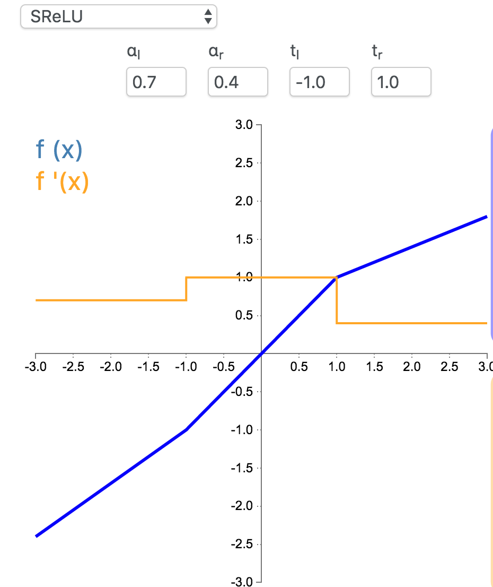
<br/>
</html>

## 12. Hard Sigmoid

Hard Sigmoid 是 Logistic Sigmoid 激活函数的分段线性近似。它更易计算，这使得学习计算的速度更快，尽管首次派生值为零可能导致静默神经元/过慢的学习速率（详见 ReLU）。

`\[
f(x) =\begin{cases}0 & \text{for } x<-2.5\\0.2x + 0.5 & \text{for } -2.5\geq x\leq 2.5 \\1 & \text{for } x>2.5\end{cases}
\]`

`\[
f(x) =\begin{cases}0 & \text{for } x<-2.5\\0.2 & \text{for } -2.5\geq x\leq 2.5 \\0 & \text{for } x>2.5\end{cases}  
\]`

<html>
<br/>
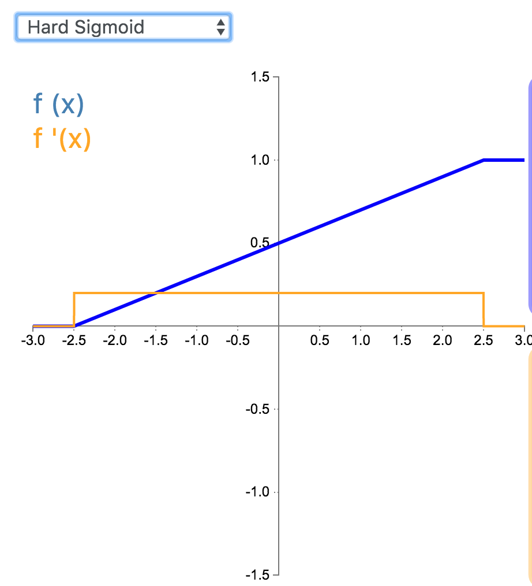
<br/>
</html>


## 13. Hard Tanh

Hard Tanh 是 Tanh 激活函数的线性分段近似。相较而言，它更易计算，这使得学习计算的速度更快，尽管首次派生值为零可能导致静默神经元/过慢的学习速率（详见 ReLU）。

`\[
f(x) =\begin{cases}-1 & \text{for } x<-1\\x & \text{for } -1\geq x\leq 1 \\1 & \text{for } x>1\end{cases}  
\]`

`\[
f(x) =\begin{cases}0 & \text{for } x<-1\\1 & \text{for } -1\geq x\leq 1 \\0 & \text{for } x>1\end{cases}  
\]`

<html>
<br/>
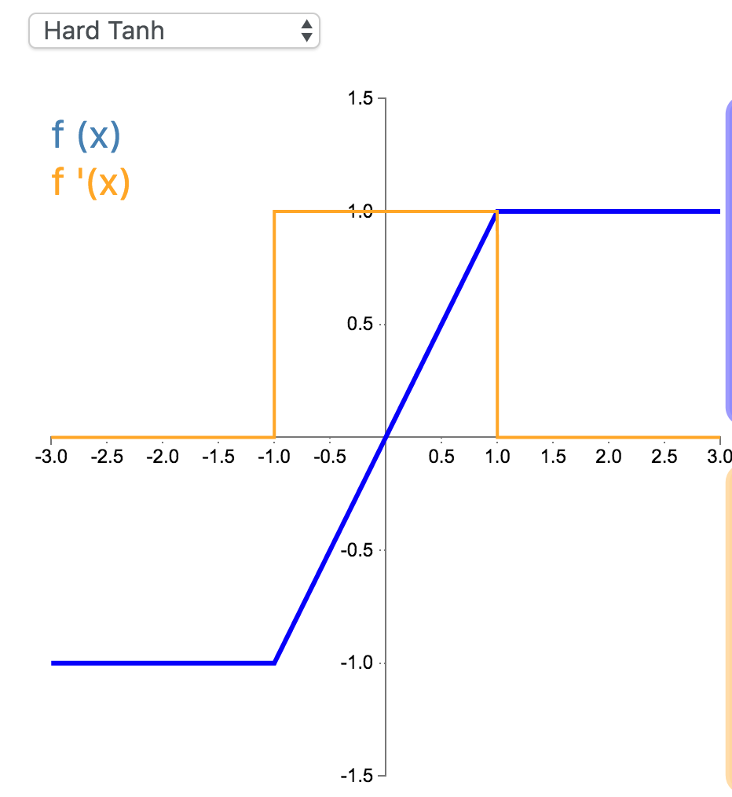
<br/>
</html>

## 14. LeCun Tanh

LeCun Tanh（也被称作 Scaled Tanh）是 Tanh 激活函数的扩展版本。它具有以下几个可以改善学习的属性：f(± 1) = ±1；二阶导数在 x=1 最大化；且有效增益接近 1。

`\[
\begin{align*}f(x)&=1.7519\tanh(\frac{2}{3}x)\end{align*}  
\]`

`\[
\begin{align*}f'(x)&=1.7519*\frac{2}{3}(1-\tanh^2(\frac{2}{3}x))\\&=1.7519*\frac{2}{3}-\frac{2}{3*1.7519}f(x)^2\end{align*}
\]`

<html>
<br/>
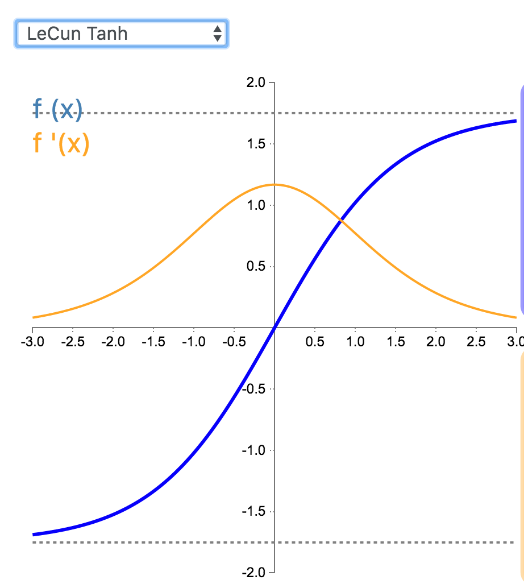
<br/>
</html>

## 15. ArcTan

## 16. SoftSign

Softsign 是 Tanh 激活函数的另一个替代选择。就像 Tanh 一样，Softsign 是反对称、去中心、可微分，并返回-1 和 1 之间的值。其更平坦的曲线与更慢的下降导数表明它可以更高效地学习。

`\[
f(x)=\frac{x}{1+|x|}, f(x) \in (-1,1)
\]`

`\[
f'(x)=\frac{1}{(1+|x|)^2}, f'(x) \in (0,1]
\]`

<html>
<br/>
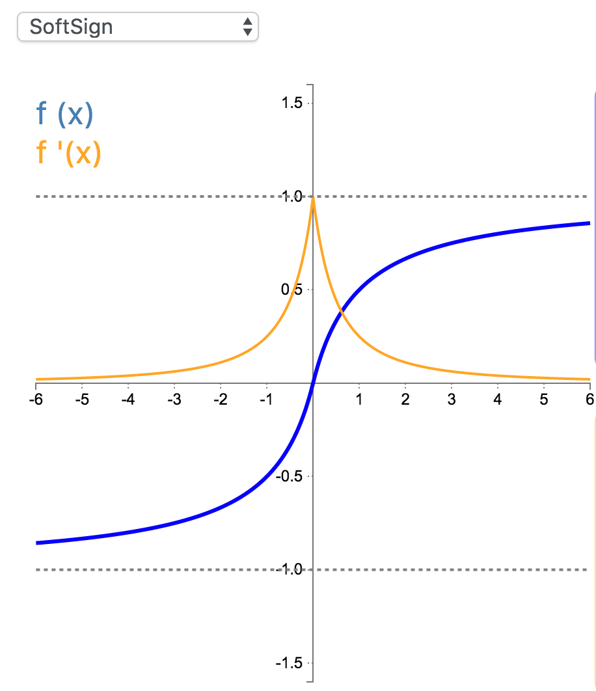
<br/>
</html>

tensorflow实现```tensorflow/tensorflow/core/kernels/softsign_op.h```：

```c++
// Functor used by SoftsignOp to do the computations.
template <typename Device, typename T>
struct Softsign {
  // Computes Softsign activation.
  //
  // features: any shape.
  // activations: same shape as "features".
  void operator()(const Device& d, typename TTypes<T>::ConstTensor features,
                  typename TTypes<T>::Tensor activations) {
    activations.device(d) =
        features / (features.abs() + features.constant(T(1)));
  }
};

// Functor used by SoftsignGradOp to do the computations.
template <typename Device, typename T>
struct SoftsignGrad {
  // Computes SoftsignGrad backprops.
  //
  // gradients: gradients backpropagated to the Softsign op.
  // features: inputs that were passed to the Softsign op.
  // backprops: gradients to backpropagate to the Softsign inputs.
  void operator()(const Device& d, typename TTypes<T>::ConstTensor gradients,
                  typename TTypes<T>::ConstTensor features,
                  typename TTypes<T>::Tensor backprops) {
    backprops.device(d) =
        gradients / (features.abs() + features.constant(T(1))).square();
  }
};
```

## 17. SoftPlus

## 18. Signum

## 19. Bent Identity

## 20. Symmetrical Sigmoid

## 21. Log Log

## 22. Gaussian

## 23. Absolute

## 24. Sinusoid

## 25. Cos

注意区分：**两个向量的cos相似度（例如作为loss_layer）**的求导：
[https://math.stackexchange.com/questions/1923613/partial-derivative-of-cosine-similarity](https://math.stackexchange.com/questions/1923613/partial-derivative-of-cosine-similarity)

## 26. Sinc

