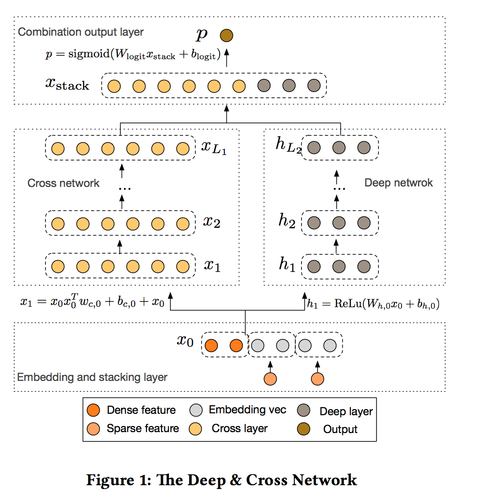
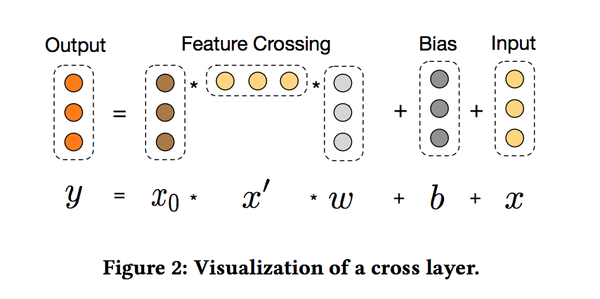

目录

<!-- TOC -->

- [概述](#%E6%A6%82%E8%BF%B0)
- [related work](#related-work)
    - [embedding方法](#embedding%E6%96%B9%E6%B3%95)
        - [Factorization machines(FMs)](#factorization-machinesfms)
        - [Field-aware Factorization Machines(FFMs)](#field-aware-factorization-machinesffms)
    - [神经网络](#%E7%A5%9E%E7%BB%8F%E7%BD%91%E7%BB%9C)
- [贡献](#%E8%B4%A1%E7%8C%AE)
- [网络结构](#%E7%BD%91%E7%BB%9C%E7%BB%93%E6%9E%84)
    - [Embedding and Stacking Layer](#embedding-and-stacking-layer)
    - [Cross Network](#cross-network)
        - [复杂度分析](#%E5%A4%8D%E6%9D%82%E5%BA%A6%E5%88%86%E6%9E%90)
    - [Deep Network](#deep-network)
        - [复杂度分析](#%E5%A4%8D%E6%9D%82%E5%BA%A6%E5%88%86%E6%9E%90)
    - [Combination Layer](#combination-layer)
- [代码](#%E4%BB%A3%E7%A0%81)

<!-- /TOC -->

## 概述

简称DCN。

论文地址：[deep & cross network for ad click predictions](https://arxiv.org/abs/1708.05123)

在ctr预估这种场景中，有大量的离散和类别特征，所以特征空间非常大且稀疏。线性模型，例如logistic regression，简单，有可解释性，易扩展性，而交叉特征可以显著增加模型的表示能力。但这些组合徨需要人工的特征工程，或者exhaustive searching，而且，产生unseen的特征interactions非常困难。

本文提出了cross network，可以使用自动的方式实现显式的特征交叉。cross network包括了多种层，其中最高度的interactions是由层的深度决定的。每一层会基于已有的部分产出高阶interactions，并保持前层的interactions。**本文实现了cross network和dnn的联合训练。dnn能捕捉特征间非常复杂的interactions，但相比cross network而言，需要更多参数（几乎差一个数量级？an order of），而且难以显式地产出交叉特征，并且可能难以高效地学习特征的interactions。**

## related work

为了避免extensive task-specific特征工程，主要有两类方法：embedding方法和神经网络。

### embedding方法

#### Factorization machines(FMs)

将离散特征映射到低维的稠密vector，然后通过vector的内积学习特征交互。

#### Field-aware Factorization Machines(FFMs)

让每个feature可以学习更多的vectors，而每个vector与一个field有关。

### 神经网络

如果有足够的隐层及隐单元，DNN能够近似任意函数。而现实问题所对应的函数往往不是『任意』的。

## 贡献

+ 在cross network中，每一层都有feature crossing，能够学习交叉特征，并不需要人为设计的特征工程。
+ cross network简单有效。多项式度（polynomial degree）随着网络层数增加而增加
+ 十分节约内存，且易于使用
+ DCN相比于其他模型有更出色的效果，与DNN模型相比，较少的参数却取得了较好的效果。

## 网络结构

<html>
<br/>

<br/>
</html>

### Embedding and Stacking Layer

将sparse特征（例如类别型的特征，输入就是一个二进制的one-hot，如[0,1,0,0]）embedding成稠密向量：

`\[
x_{embed,i}=W_{embed,i}x_i
\]`

其中，`\(x_{embed,i}\)`是embedding后的向量，`\(x_i\)`是第i个类目的二进制输入，`\(W_{embed,i}\in R^{n_e\times n_v}\)`是一个embedding矩阵，`\(n_e\)`是embedding的size，`\(n_v\)`是词典的size。

然后将embedding向量和归一化后的dense特征拼接成一个向量：

`\[
x_0=[x^T_{embed,1},...x^T_{embed,k},x^T_{dense}]
\]`

### Cross Network

显式地进行feature crossing，每一个cross layer的公式如下：

`\[
x_{l+1}=x_0x^T_lw_l+b_l+x_l=f(x_l,w_l,b_l)+x_l
\]`

其中，

+ `\(x_l,x_{l+1}\in R^d\)`是第l和第l+1层的cross layer输出的列向量
+ `\(w_l,b_l\in R^d\)`是第l层的权重和bias
+ 每一层的cross layer在进行完feature crossing的`\(f\)`之后，又把input加回来
+ 借鉴residual network的思想，映射函数`\(f:R^d \mapsto R^d\)`拟合残差`\(x_{l+1}-x_{l}\)`

<html>
<br/>

<br/>
</html>

可见，维数分别是dx1,1xd,dx1，最终输出得到的就是一个dx1的向量。所以第二项需要对上一层的输出转置成1xd。

相当于考虑了从1到l+1阶的所有特征组合。

#### 复杂度分析

假设cross layer有`\(L_c\)`层，`\(d\)`是input的维数，那么，整个cross network的参数数量就是：

`\[
d\times L_c \times 2
\]`

这里乘了2，因为有w和b两个参数，每个参数在每一层里都是d维。时间和空间复杂度都是线性的。

### Deep Network

dnn部分就是正常的dnn：

`\[
h_{l+1}=f(W_lh_l+b_l)
\]`

+ `\(h_l \in R^{n_l},h_{l+1}\in R^{n_{l+1}}\)`
+ `\(W_l\in R^{n_{l+1}\times n_l},b_l\in R^{n_{l+1}}\)`
+ `\(f\)`是ReLU

#### 复杂度分析

假设所有层的size一样大，都是`\(m\)`。假设层数是`\(L_d\)`，总参数数量为：

`\[
d\times m+m+(m^2+m)\times (L_d-1)
\]`

其中，第一层是和embedding的`\(x_0\)`相连的，所以是`\(d\times m+m\)`

### Combination Layer

combination layer如下：

`\[
p=\sigma ([x^T_{L_1},h^T_{L_2}]w_{logits})
\]`

其中，`\(x_{L_1}\in R^d\)`是cross network的输出，`\(h_{L_2}\in R^m\)`是dnn的输出。`\(w_{logits}\in R^{(d+m)}\)`是权重，`\(\sigma (x)=1/(1+exp(-x))\)`。

损失函数是log loss加上l2正则：

`\[
loss=-\frac{1}{N}\sum ^N_{i=1}y_ilog(p_i)+(1-y_i)log(1-p_i)+\lambda \sum _l\parallel w_l \parallel ^2
\]`

## 代码

看看网友用keras实现的版本[https://github.com/Nirvanada/Deep-and-Cross-Keras](https://github.com/Nirvanada/Deep-and-Cross-Keras)：

```python
import numpy as np
import pandas as pd
import keras.backend as K
from keras import layers
from keras.layers import Dense
from keras.optimizers import Adam
from keras.layers import Input, Embedding, Reshape, Add
from keras.layers import Flatten, merge, Lambda
from keras.models import Model
from keras.utils.vis_utils import plot_model
from sklearn.preprocessing import OneHotEncoder, StandardScaler
from sklearn.metrics import accuracy_score
import random

# similar to https://github.com/jrzaurin/Wide-and-Deep-Keras/blob/master/wide_and_deep_keras.py
def feature_generate(data):
    data, label, cate_columns, cont_columns = preprocessing(data)
    embeddings_tensors = []
    continuous_tensors = []
    for ec in cate_columns:
        layer_name = ec + '_inp'
        # For categorical features, we em-bed the features in dense vectors of dimension 6×(category cardinality)**(1/4)
        embed_dim = data[ec].nunique() if int(6 * np.power(data[ec].nunique(), 1/4)) > data[ec].nunique() \
            else int(6 * np.power(data[ec].nunique(), 1/4))
        t_inp, t_build = embedding_input(layer_name, data[ec].nunique(), embed_dim)
        embeddings_tensors.append((t_inp, t_build))
        del(t_inp, t_build)
    for cc in cont_columns:
        layer_name = cc + '_in'
        t_inp, t_build = continous_input(layer_name)
        continuous_tensors.append((t_inp, t_build))
        del(t_inp, t_build)
    inp_layer =  [et[0] for et in embeddings_tensors]
    inp_layer += [ct[0] for ct in continuous_tensors]
    inp_embed =  [et[1] for et in embeddings_tensors]
    inp_embed += [ct[1] for ct in continuous_tensors]
    return data, label, inp_layer, inp_embed

def embedding_input(name, n_in, n_out):
    inp = Input(shape = (1, ), dtype = 'int64', name = name)
    return inp, Embedding(n_in, n_out, input_length = 1)(inp)

def continous_input(name):
    inp = Input(shape=(1, ), dtype = 'float32', name = name)
    return inp, Reshape((1, 1))(inp)


# The optimal hyperparameter settings were 8 cross layers of size 54 and 6 deep layers of size 292 for DCN
# Embed "Soil_Type" column (embedding dim == 15), we have 8 cross layers of size 29   
def fit(inp_layer, inp_embed, X, y):
    #inp_layer, inp_embed = feature_generate(X, cate_columns, cont_columns)
    input = merge(inp_embed, mode = 'concat')
    # deep layer
    for i in range(6):
        if i == 0:
            deep = Dense(272, activation='relu')(Flatten()(input))
        else:
            deep = Dense(272, activation='relu')(deep)

    # cross layer
    cross = CrossLayer(output_dim = input.shape[2].value, num_layer = 8, name = "cross_layer")(input)

    #concat both layers
    output = merge([deep, cross], mode = 'concat')
    output = Dense(y.shape[1], activation = 'softmax')(output)
    model = Model(inp_layer, output) 
    print(model.summary())
    plot_model(model, to_file = 'model.png', show_shapes = True)
    model.compile(Adam(0.01), loss = 'categorical_crossentropy', metrics = ["accuracy"])
    model.fit([X[c] for c in X.columns], y, batch_size = 256, epochs = 10)
    return model


def evaluate(X, y, model):
    y_pred = model.predict([X[c] for c in X.columns])
    acc = np.sum(np.argmax(y_pred, 1) == np.argmax(y, 1)) / y.shape[0]
    print("Accuracy: ", acc)


# https://keras.io/layers/writing-your-own-keras-layers/
class CrossLayer(layers.Layer):
    def __init__(self, output_dim, num_layer, **kwargs):
        self.output_dim = output_dim
        self.num_layer = num_layer
        super(CrossLayer, self).__init__(**kwargs)

    def build(self, input_shape):
        self.input_dim = input_shape[2]
        self.W = []
        self.bias = []
        for i in range(self.num_layer):
            self.W.append(self.add_weight(shape = [1, self.input_dim], initializer = 'glorot_uniform', name = 'w_' + str(i), trainable = True))
            self.bias.append(self.add_weight(shape = [1, self.input_dim], initializer = 'zeros', name = 'b_' + str(i), trainable = True))
        self.built = True

    def call(self, input):
        for i in range(self.num_layer):
            if i == 0:
                cross = Lambda(lambda x: Add()([K.sum(self.W[i] * K.batch_dot(K.reshape(x, (-1, self.input_dim, 1)), x), 1, keepdims = True), self.bias[i], x]))(input)
            else:
                cross = Lambda(lambda x: Add()([K.sum(self.W[i] * K.batch_dot(K.reshape(x, (-1, self.input_dim, 1)), input), 1, keepdims = True), self.bias[i], input]))(cross)
        return Flatten()(cross)

    def compute_output_shape(self, input_shape):
        return (None, self.output_dim)


# modify the embedding columns here
def preprocessing(data):
    # inverse transform one-hot to continuous column
    df_onehot = data[[col for col in data.columns.tolist() if "Soil_Type" in col]]
    #for i in df_onehot.columns.tolist():
    #    if df_onehot[i].sum() == 0:
    #        del df_onehot[i]
    data["Soil"] = df_onehot.dot(np.array(range(df_onehot.columns.size))).astype(int)
    data.drop([col for col in data.columns.tolist() if "Soil_Type" in col], axis = 1, inplace = True)
    label = np.array(OneHotEncoder().fit_transform(data["Cover_Type"].reshape(-1, 1)).todense())
    del data["Cover_Type"]
    cate_columns = ["Soil"]
    cont_columns = [col for col in data.columns if col != "Soil"]
    # Feature normilization
    scaler = StandardScaler()
    data_cont = pd.DataFrame(scaler.fit_transform(data[cont_columns]), columns = cont_columns)
    data_cate = data[cate_columns]
    data = pd.concat([data_cate, data_cont], axis = 1)
    return data, label, cate_columns, cont_columns


if __name__ == "__main__":
    # data download from https://www.kaggle.com/uciml/forest-cover-type-dataset/data
    data = pd.read_csv("./data/covtype.csv")
    X, y, inp_layer, inp_embed = feature_generate(data)
    
    #random split train and test by 9:1
    train_index = random.sample(range(X.shape[0]), int(X.shape[0] * 0.9))
    test_index = list(set(range(X.shape[0])) - set(train_index))

    model = fit(inp_layer, inp_embed, X.iloc[train_index], y[train_index, :])
    evaluate(X.iloc[test_index], y[test_index, :], model)
```

其中:

+ Lambda是把一个表达式转换成一个Layer：[https://keras.io/layers/core/#lambda](https://keras.io/layers/core/#lambda)
+ batch_dot是有两组vectors，每组有batch个vector,对他们进行点积[https://keras.io/backend/#backend-functions](https://keras.io/backend/#backend-functions)

简单示例：

```x = [[1, 2], [3, 4]]```，```y = [[5, 6], [7, 8]]```那么，```batch_dot(x, y, axes=1) = [[17], [53]]```，也就是说一个2x2和一个2x2，对axes=1进行sum，得到的是一个2x1。如果是3维的，就比较复杂了：

```python
>>> x_batch = K.ones(shape=(32, 20, 1))
>>> y_batch = K.ones(shape=(32, 30, 20))
>>> xy_batch_dot = K.batch_dot(x_batch, y_batch, axes=[1, 2])
>>> K.int_shape(xy_batch_dot)
(32, 1, 30)
```

因为：

+ x.shape[0] : 32 : append to output shape
+ x.shape[1] : 20 : do not append to output shape, dimension 1 of x has been summed over. (dot_axes[0] = 1)
+ x.shape[2] : 1 : 为啥被ignore了呢 
+ y.shape[0] : 32 : do not append to output shape, always ignore first dimension of y
+ y.shape[1] : 30 : append to output shape
+ y.shape[2] : 20 : do not append to output shape, dimension 2 of y has been summed over. (dot_axes[1] = 2) output_shape = (100, 30)

