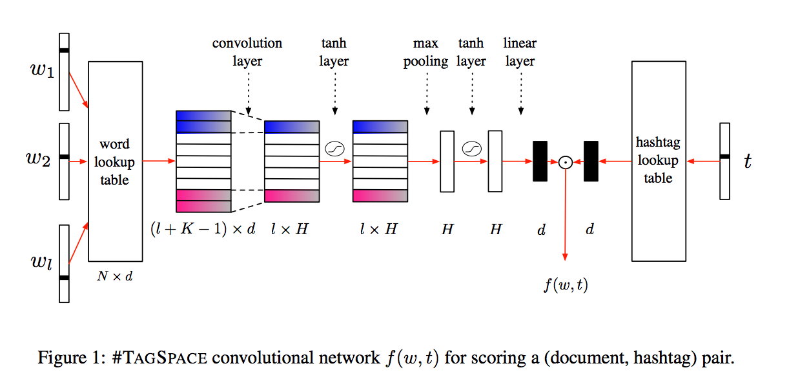

目录

<!-- TOC -->

- [概述](#概述)

<!-- /TOC -->

## 概述

[#TagSpace: Semantic Embeddings from Hashtags](https://research.fb.com/wp-content/uploads/2014/09/tagspace-semantic-embeddings-from-hashtags.pdf)
[https://research.fb.com/publications/tagspace-semantic-embeddings-from-hashtags/](https://research.fb.com/publications/tagspace-semantic-embeddings-from-hashtags/)

<html>
 

 

</html>
