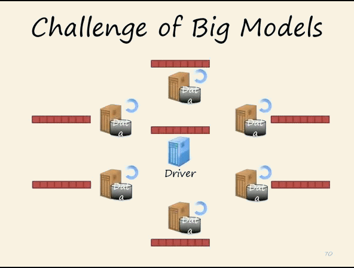
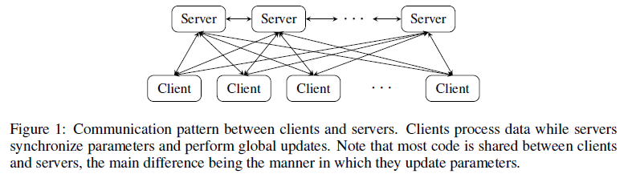
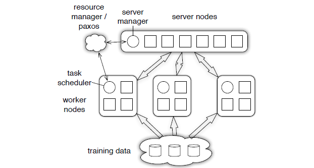
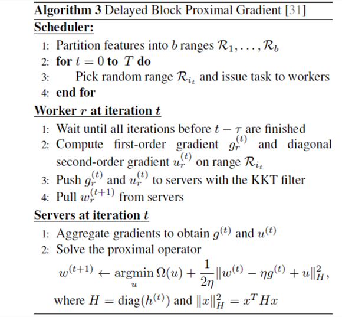
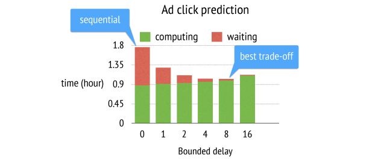
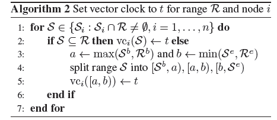
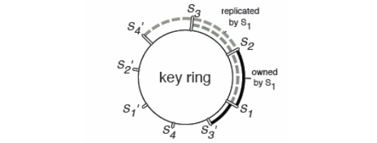

目录

<!-- TOC -->

- [1. 背景](#1-背景)
- [2. 发展历程](#2-发展历程)
- [3. 对比parameter server与通用分布式系统](#3-对比parameter-server与通用分布式系统)
- [4. parameter server的优势](#4-parameter-server的优势)
- [5. parameter server系统架构](#5-parameter-server系统架构)
    - [5.1 总体架构](#51-总体架构)
- [5.2 (k,v), range push & pull](#52-kv-range-push--pull)
- [5.3 Asynchronous Tasks and Dependency](#53-asynchronous-tasks-and-dependency)
- [6. Implementation](#6-implementation)
    - [6.1 Vector Clock](#61-vector-clock)
    - [6.2 Messages](#62-messages)
    - [6.3 Consistent Hashing](#63-consistent-hashing)
    - [6.4 Replication and Consistency](#64-replication-and-consistency)
        - [6.4.1 默认的复制方式: **Chain replication (强一致性, 可靠)**：](#641-默认的复制方式-chain-replication-强一致性-可靠)
        - [6.4.2 Replication after Aggregation](#642-replication-after-aggregation)
- [6.5 Server Management](#65-server-management)

<!-- /TOC -->

[Parameter Server 详解](http://blog.csdn.net/cyh_24/article/details/50545780)

参考论文：
[Scaling Distributed Machine Learning with the Parameter Server](https://www.cs.cmu.edu/~muli/file/parameter_server_osdi14.pdf)

## 1. 背景

现实中，训练数据的数量可能达到1TB到1PB之间，而训练过程中的参数可能会达到`\(10^9\)`（十亿）到`\(10^12\)`（千亿）。而往往这些模型的参数需要被所有的worker节点频繁的访问，就有如下问题与挑战：

+ 需要大量的网络带宽支持
+ 很多机器学习算法都是连续型的，**只有上一次迭代完成（各个worker都完成）之后，才能进行下一次迭代，**这就导致了如果机器之间性能差距大（木桶理论），就会造成性能的极大损失；
+ 在分布式中，**容错能力**是非常重要的。很多情况下，算法都是部署到云环境中的（这种环境下，机器是不可靠的，并且job也是有可能被抢占的）

## 2. 发展历程

+ 第一代 parameter server：缺少灵活性和性能 —— 仅使**用memcached(key, value) 键值对存储作为同步机制。**YahooLDA 通过改进这个机制，增加了一个专门的服务器，提供用户能够自定义的更新操作(set, get, update)。 
+ 第二代 parameter server：用**bounded delay模型**来改进YahooLDA，但是却进一步限制了worker线程模型。 
+ 第三代 parameter server 能够解决这些局限性。

## 3. 对比parameter server与通用分布式系统

通用的分布式系统通常都是：每次迭代都**强制同步**，通常在几十个节点上，它们的性能可以表现的很好，但是在**大规模集群中，这样的每次迭代强制同步的机制会因为木桶效应变得很慢。**

**Mahout 基于 Hadoop，MLI 基于 Spark，**它们（Spark与MLI）采用的都是 **Iterative MapReduce 的架构**。它们能够保持迭代之间的状态，并且执行策略也更加优化了。但是，由于这两种方法都采用**同步迭代的通信方式**，使得它们很容易因为个别机器的低性能导致全局性能的降低。

为了解决这个问题，**Graphlab 采用图形抽象的方式进行异步调度通信。**但是它**缺少了以 MapReduce 为基础架构的弹性扩展性**，并且它使用**粗粒度的snapshots来进行恢复，这两点都会阻碍到可扩展性。**parameter server 正是吸取Graphlab异步机制的优势，并且解决了其在可扩展性方面的劣势。

## 4. parameter server的优势

+ Efficient communication
由于是**异步的通信**，因此，不需要停下来等一些机器执行完一个iteration（除非有必要），这大大减少了延时。为机器学习任务做了一些优化(后续会细讲)，能够大大减少网络流量和开销
+ Flexible consistency models
**宽松的一致性要求**进一步减少了同步的成本和延时。parameter server 允许算法设计者根据自身的情况来做算法收敛速度和系统性能之间的trade-off。
+ Elastic Scalability
使用了一个**分布式hash表**使得**新的server节点可以随时动态的插入到集合中**；因此，**新增一个节点不需要重新运行系统。**
+ Fault Tolerance and Durability
节点故障是不可避免的，特别是在大规模商用服务器集群中。**从非灾难性机器故障中恢复，只需要1秒，而且不需要中断计算**。**Vector clocks**保证了经历故障之后还是能运行良好
+ Ease of Use
**全局共享的参数**可以被表示成各种形式：vector，matrices 或者相应的sparse类型，这大大方便了机器学习算法的开发。并且提供的线性代数的数据类型都具有高性能的多线程库。

## 5. parameter server系统架构

### 5.1 总体架构

在parameter server中，每个 server 实际上都只负责分到的**部分参数**（servers共同维持一个全局的共享参数），而每个 work 也只分到**部分数据**和处理任务。

<html>
 

 
</html>

上图中，每个子节点都只维护自己分配到的参数（黑色），**自己部分更新之后**，将计算结果（例如，参数）传回到主节点，进行**全局的更新**（比如平均操作之类的），主节点再向子节点传送新的参数。

servers 与 workers 之间的通信如下：

<html>
 

 
</html>

<html>
 

 
</html>

+ **server 节点：**可以跟其他 server 节点通信，每个server负责自己分到的参数，**server group 共同维持所有参数的更新。** 
+ **server manager node：**负责维护一些**元数据的一致性**，比如各个**节点的状态**，**参数的分配**情况等
+ **worker 节点：**worker之间没有通信，**只跟自己对应的server进行通信。**每个**worker group**有一个**task scheduler**，负责向worker**分配任务**，并且**监控worker的运行情况**。当有新的worker加入或者退出，task scheduler 负责**重新分配任务**。

## 5.2 (k,v), range push & pull

parameter server 中，**参数都是可以被表示成(key, value)的集合**，比如一个最小化损失函数的问题，**key就是feature ID，而value就是它的权值。**对于**稀疏参数，不存在的key，就可以认为是0。**

workers 跟 servers 之间通过 push 跟 pull 来通信。
**worker 通过 push 将计算好的梯度发送到server，然后通过 pull 从server更新参数。**
为了提高计算性能和带宽效率，parameter server 允许用户使用**Range Push 跟 Range Pull**操作。

range push/pull：发送和接收特定Range中的参数。

## 5.3 Asynchronous Tasks and Dependency

如果 iter1 需要在 iter0 computation，push 跟 pull 都完成后才能开始，那么就是Synchronous，反之就是Asynchronous.

<html>
 

 
</html>

Asynchronous Task：能够提高系统的效率（因为节省了很多等待的过程），但是，它的缺点就是容易降低算法的收敛速率。

系统性能和算法收敛速率的trade-off需要考虑的因素：
+ 算法对于参数非一致性的敏感度；
+ 训练数据特征之间的关联度；
+ 硬盘的存储容量

考虑到用户使用的时候会有不同的情况，parameter server 为用户提供了多种任务依赖方式：

<html>
 

 
</html>

+ **Sequential**： 这里其实是 synchronous task，任务之间是有顺序的，只有上一个任务完成，才能开始下一个任务； 
+ **Eventual**： 跟 sequential 相反，所有任务之间没有顺序，各自独立完成自己的任务， 
+ **Bounded Delay**： 这是sequential 跟 eventual 之间的trade-off，可以设置一个`\(\tau \)`作为最大的延时时间。也就是说，只有`\(>\tau \)`之前的任务都被完成了，才能开始一个新的任务。极端的情况：
+ `\(\tau = 0\)`情况就是 Sequential； 
+ `\(\tau = \infty \)`情况就是 Sequential； 

一个bounded delay 的 PGD (proximal gradient descent)算法的系统运行流程：

<html>
 

 
</html>

如何选择`\(\tau \)`

<html>
 

 
</html>

## 6. Implementation

### 6.1 Vector Clock

parameter server 使用 vector clock 来记录**每个节点中参数的时间戳**，能够用来**跟踪状态**或**避免数据的重复发送**。但是，假设有n个节点，m个参数，那么vector clock的空间复杂度就是`\(O(n*m)\)`。当有几千个节点和几十亿的参数时，对于内存和带宽来说都是不可实现的。

parameter server 在push跟pull的时候，都是**rang-based**，这就带来了一个好处：**这个range里面的参数共享的是同一个时间戳**，这显然可以大大降低空间复杂度。

<html>
 

 
</html>

每次从一个range里再提取一个range，最多会生成3个新的 vector clocks（一分为三）。假设总共m个参数，`\(k\)`是算法中产生的所有的range，那么空间复杂度就变成了`\(O(k*m)\)`。

### 6.2 Messages

一条 message 包括：时间戳，len(range)对k-v：

`\[
[vc(R), (k_1, v_1), . . . , (k_p, v_p)] k_j \in R \; \; and\;\; j \in \{1, . . . p\}
\]`

这是parameter server 中**最基本的通信格式**，不仅仅是**共享的参数**才有，**task 的message**也是这样的格式，只要把这里的(key, value) 改成 **(task ID, 参数/返回值)**。

由于机器学习问题通常都需要很高的网络带宽，因此**信息的压缩**是必须的。

+ **key的压缩：** 
    因为训练数据通常在分配之后都不会发生改变，因此
    + worker没有必要每次都发送相同的key，只需要**接收方在第一次接收的时候缓存**起来就行了。
    + **第二次**，worker不再需要同时发送key和value，**只需要发送value 和 key list的hash就行**。这样瞬间减少了一半的通信量。 
+ **value的压缩：** 假设参数是稀疏的，那么就会有大量的0存在。因此，为了进一步压缩，我们**只需要发送非0值。**parameter server使用**Snappy快速压缩库来压缩数据、高效去除0值。**【Snappy 是一个 C++ 的用来压缩和解压缩的开发包。其目标不是最大限度压缩或者兼容其他压缩格式，而是旨在提供**高速压缩速度和合理的压缩率**。 Snappy在 Google 内部被广泛的使用，从 BigTable 到 MapReduce 以及内部的 RPC 系统[https://code.google.com/p/snappy/]( https://code.google.com/p/snappy/)】

**另外，key 的压缩和 value 的压缩可以同时进行。**

另外，还有**用户自定义过滤**：
对于机器学习优化问题比如梯度下降来说，并不是每次计算的梯度对于最终优化都是有价值的，用户可以通过**自定义的规则过滤一些不必要的传送，再进一步压缩带宽cost**：
+ 发送**很小的梯度值**是低效的
+ **更新接近最优情况的值**是低效的 
因此，只在非最优的情况下发送，可通过**KKT**来判断
 
### 6.3 Consistent Hashing

parameter server 在数据一致性上，使用的是传统的**一致性哈希**算法，**参数key与server node id被插入到一个hash ring中**。在分布式系统中，**动态增加和移除节点**的同时还能**保证系统存储与key分配的性能效率**。

<html>
 

 
</html>

每个节点都复制了它逆时钟方向的k个节点中的key。图中，k=2，`\(S_1\)`复制了`\(S_2\)`和`\(S_3\)`内的key。

### 6.4 Replication and Consistency

两种方式保证slave跟master之间的数据一致性：

#### 6.4.1 默认的复制方式: **Chain replication (强一致性, 可靠)**：

<html>
 

 
</html>

+ **更新**：**只能发生在数据头节点**,然后更新逐步后移，直到更新到达尾节点，并由尾节点向客户确认更新成功； 
+ **查询**：为保证强一致性，客户查询**只能在尾节点进行**

#### 6.4.2 Replication after Aggregation

<html>
 

 
</html>

两个worker 节点分别向server传送x和y。server 首先通过一定方式（如：`\(f(x+y)\)` ）**进行aggregate**，然后**再进行复制操作**；
当有n个worker的时候，复制只需要`\(k/n\)`的带宽。通常来说，**k（复制次数）是一个很小的常数**，而**n的值大概是几百到几千**；

## 6.5 Server Management 

要想实现系统的容错以及动态的扩展系统规模，必须要求系统能够支持**动态添加和移除节点。**

当有一个 server节点添加进来时： 
1. server manager 会对新的节点分配一些range 的key，这会造成其他server节点的key的变化； 
2. 新节点会获取数据做为训练用，另外会复制k份到slave。 
3. server manager 将节点的变化情况广播出去。接收方可能会移除不再属于自己的数据，并且将未完成的任务提交给新来的节点

当有一个worker节点W添加进来时：
1. task scheduler 为W分配数据； 
2. 这个 worker 节点通过网络或者文件系统得到分配到的训练数据。接着，W会从服务器pull参数； 
3. task scheduler 会广播节点的变化情况，可能会使一些节点释放一部分训练数据

