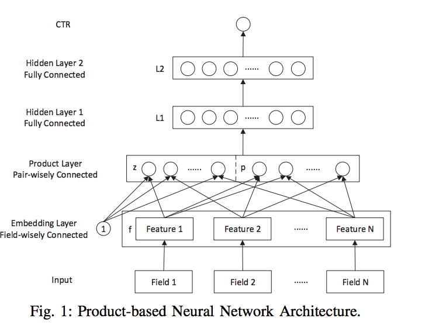
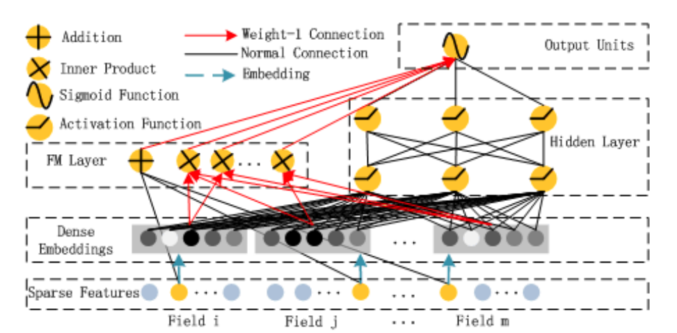
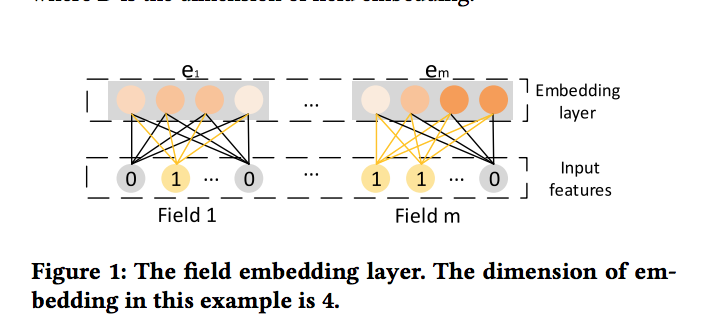
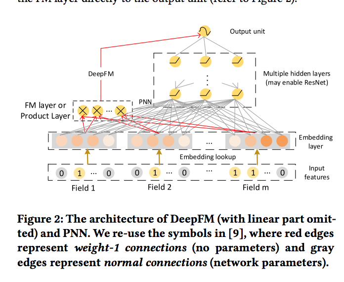
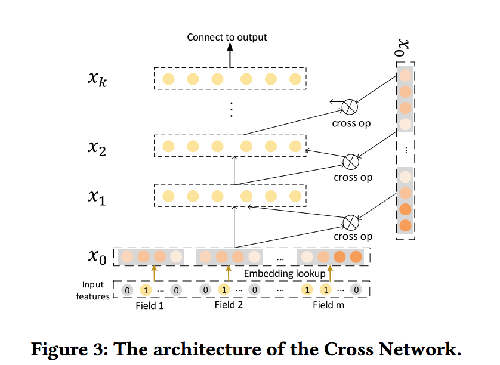
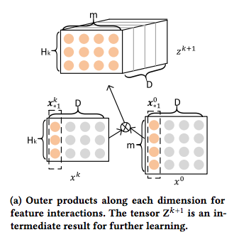
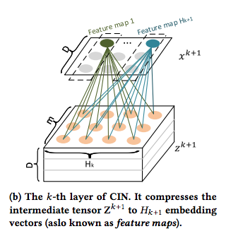
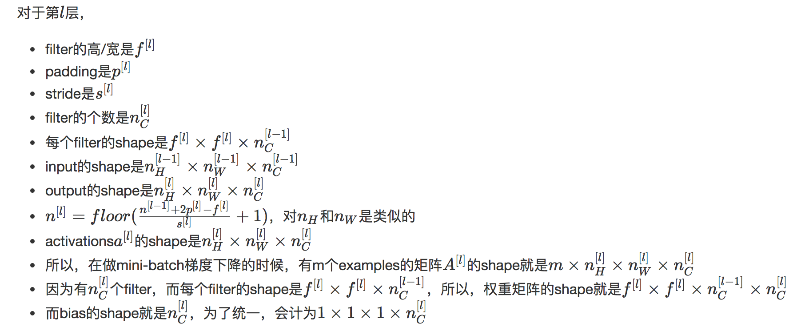
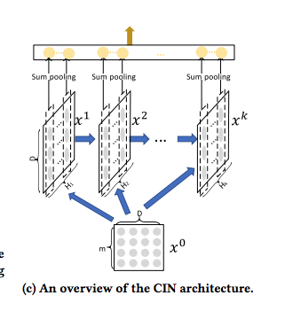
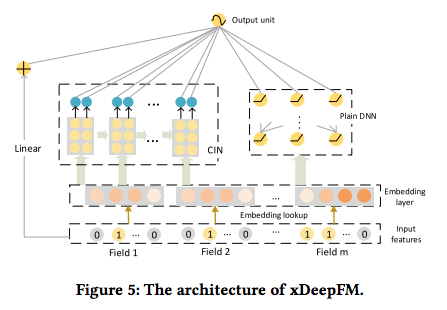

目录

<!-- TOC -->

- [FM](#fm)
- [FFM](#ffm)
- [FNN, SNN](#fnn-snn)
    - [FNN](#fnn)
    - [SNN](#snn)
- [CCPM](#ccpm)
- [PNN](#pnn)
    - [IPNN](#ipnn)
    - [OPNN](#opnn)
- [Wide & Deep](#wide--deep)
- [DeepFM](#deepfm)
- [Deep & Cross](#deep--cross)
- [NFM](#nfm)
- [AFM](#afm)
- [xDeepFM](#xdeepfm)
    - [背景](#%E8%83%8C%E6%99%AF)
    - [预备知识](#%E9%A2%84%E5%A4%87%E7%9F%A5%E8%AF%86)
        - [embedding](#embedding)
        - [隐式的高阶特征交互](#%E9%9A%90%E5%BC%8F%E7%9A%84%E9%AB%98%E9%98%B6%E7%89%B9%E5%BE%81%E4%BA%A4%E4%BA%92)
        - [显式的高阶特征交互](#%E6%98%BE%E5%BC%8F%E7%9A%84%E9%AB%98%E9%98%B6%E7%89%B9%E5%BE%81%E4%BA%A4%E4%BA%92)
    - [CIN](#cin)
    - [xDeepFM](#xdeepfm)

<!-- /TOC -->

参考：
[深度学习在 CTR 中应用](http://www.mamicode.com/info-detail-1990002.html)

[ctr模型汇总](https://zhuanlan.zhihu.com/p/32523455)

基于lr和gbdt的可以参考[传统ctr预估模型](https://daiwk.github.io/posts/dl-traditional-ctr-models.html)

## FM

二阶多项式模型：


`\[
\phi(x) = w_0+\sum _{i}w_ix_i+\sum_{i}\sum_{j<i}w_{ij}x_ix_j
\]`

多项式模型的问题在于二阶项的参数过多，假设特征个数为n，那么二阶项的参数数目为n(n+1)/2，参数太多，而却只有少数模式在样本中能找到，因此模型无法学出对应的权重。

FM模型：

`\[
\hat{y} = w_0+\sum _{i=1}^nw_ix_i+\sum_{i=1}^{n-1}\sum_{j=i+1}^{n}\left \langle \mathbf{v}_i,\mathbf{v}_j  \right \rangle x_ix_j
\]`

其中，
+ `\(w_0\in \mathbb{R}\)`
+ `\(\mathbf{w}\in \mathbb{R}^n\)`
+ `\(\mathbf{V}\in \mathbb{R}^{n\times k}\)`
+ `\(\hat{w_{ij}}=\mathbf{v}_i\mathbf{v}_j^T=\sum _{l=1}^kv_{il}v_{jl}\)`
所以上式中的`\(\mathbf{v}_i\)`就表示`\(\mathbf{V}\)`这个矩阵的第i行（有k列），而`\(\left \langle \mathbf{v}_i,\mathbf{v}_j  \right \rangle\)`就表示第i行和和j行这两个向量的内积（得到一个数），而得到的正好就是权重矩阵的第i行第j列的元素`\(\hat{w}_{ij}\)`，而`\(\hat{w}\)`这个矩阵是`\((n-1)\times(n-1)\)`维的矩阵，刻画的是相邻两个x【`\(x_i\)`和`\(x_{i+1}\)`】之间的系数。因此，可以理解为，将这个`\((n-1)\times(n-1)\)`维的矩阵用一个`\(n\times k\)`维的低秩矩阵来表示。

## FFM

## FNN, SNN

[Deep Learning over Multi-field Categorical Data - A Case Study on User Response Prediction in Display Ads](https://arxiv.org/pdf/1601.02376.pdf)

### FNN

### SNN

## CCPM

[A Convolutional Click Prediction Model](https://dl.acm.org/citation.cfm?id=2806603)

## PNN

[Product-based Neural Networks for User Response Prediction](https://arxiv.org/pdf/1611.00144.pdf)

<html>
<br/>


<br/>

</html>

+ 首先对输入数据进行embedding处理，得到一个low-dimensional vector层
+ 对该层的任意两个feature进行内积或是外积处理就得到上图的蓝色节点，
+ 是把这些Feature直接和1相乘复制到上一层的Z中，
+ 然后把Z和P接在一起就可以作为神经网络的输入层，
+ 在此基础上我们就可以应用神经网络去模型了。

假设有N个field，每个field是M维的embedding。

### IPNN

field之间使用内积。左边的z就是一个NxM维的，而对于p来讲，p是NxN的。所以对p来讲，使用矩阵分解来简化问题：

任意的 N×N 实对称矩阵都有 N 个线性无关的特征向量。并且这些特征向量都可以正交单位化而得到一组正交且模为1的向量。故实对称矩阵A可被分解成 `\(A=Q\Lambda Q^T\)`。其中，Q为正交矩阵，`\(\Lambda\)`为实对角矩阵。

由于weight matrix是一个对称方阵，所以，如果进行一阶低秩矩阵分解，那么可以分解为`\(W^n_p=\theta ^n(\theta ^n)^T\)`，`\(\theta ^N\in R^N\)`。

而如果进行K阶低秩矩阵分解，就有：

`\[
W^n_p\odot p=\sum ^N_{i=1}\sum ^N_{j=1}\left \langle \theta ^i_n,\theta ^j_n \right \rangle \left \langle f_i,f_j \right \rangle
\]`

其中，`\(\theta ^i_n\in R^K\)`。

### OPNN

## Wide & Deep

[Wide & deep learning for recommender systems](https://arxiv.org/pdf/1606.07792.pdf)

LR 对于 DNN 模型的优势是对大规模稀疏特征的容纳能力，包括内存和计算量等方面，工业界都有非常成熟的优化方法； 而 DNN 模型具有自己学习新特征的能力，一定程度上能够提升特征使用的效率， 这使得 DNN 模型在同样规模特征的情况下，更有可能达到更好的学习效果。

模型结构如下：

<html>
<br/>


<br/>

</html>

模型左边的 Wide 部分，可以容纳大规模系数特征，并且对一些特定的信息（比如 ID）有一定的记忆能力； 而模型右边的 Deep 部分，能够学习特征间的隐含关系，在相同数量的特征下有更好的学习和推导能力。

用于ctr预估[https://github.com/PaddlePaddle/models/tree/develop/ctr](https://github.com/PaddlePaddle/models/tree/develop/ctr)

特征的生成：[https://github.com/PaddlePaddle/models/blob/develop/ctr/dataset.md](https://github.com/PaddlePaddle/models/blob/develop/ctr/dataset.md)

## DeepFM

[DeepFM: A Factorization-Machine based Neural Network for CTR Prediction](https://www.ijcai.org/proceedings/2017/0239.pdf)

DeepFM和之前模型相比优势在于两点:

+ 相对于Wide&Deep不再需要手工构建wide部分
+ 另一个相对于FNN，FNN把FM的隐向量参数直接作为网络参数学习。而DeepFM将embedding层结果输入给FM和MLP，两者输出叠加，达到捕捉了低阶和高阶特征交叉的目的。

<html>
<br/>


<br/>

</html>

## Deep & Cross

论文地址：[deep & cross network for ad click predictions](https://arxiv.org/abs/1708.05123)

参考：[https://daiwk.github.io/posts/dl-deep-cross-network.html](https://daiwk.github.io/posts/dl-deep-cross-network.html)

## NFM

[Neural Factorization Machines for Sparse Predictive Analytics](https://arxiv.org/pdf/1708.05027.pdf)

## AFM

[Attentional Factorization Machines:Learning theWeight of Feature Interactions via Attention Networks](https://arxiv.org/pdf/1708.04617.pdf)

## xDeepFM

参考[KDD 2018 \| 推荐系统特征构建新进展：极深因子分解机模型
](https://mp.weixin.qq.com/s?__biz=MzAwMTA3MzM4Nw==&mid=2649444578&idx=1&sn=13330325d99eabfb1266bcf59ea21dd3&chksm=82c0b966b5b73070784dd6e4e64cfaf8dbb8e3d700a70e170521e5e36b40e53ac09194968d48&mpshare=1&scene=1&srcid=0822TT1RCK4m3zivGMktMqTt&pass_ticket=Iv7tDFrzxp8iL9atPI0PT3qolxBV3HKdG%2FbQlgIvIJXhk29gJ1G3SogZR0Se77o2#rd)

[xDeepFM: Combining Explicit and Implicit Feature Interactions for Recommender Systems](https://arxiv.org/abs/1803.05170)

代码：[https://github.com/Leavingseason/xDeepFM](https://github.com/Leavingseason/xDeepFM)

传统的推荐系统中，**高阶交叉特征**通常是由工程师手工提取的，这种做法主要有三种缺点：

+ 重要的特征都是**与应用场景息息相关**的，针对每一种应用场景，工程师们都需要首先花费大量时间和精力深入了解数据的规律之后才能设计、提取出高效的高阶交叉特征，因此人力成本高昂
+ 原始数据中往往包含**大量稀疏的特征**，例如用户和物品的ID，交叉特征的维度空间是原始特征维度的乘积，因此很容易带来维度灾难的问题
+ 人工提取的交叉特征无法泛化到**未曾在训练样本中出现过的模式**中。

目前大部分相关的研究工作是**基于因子分解机**的框架，利用多层全连接神经网络去自动学习特征间的高阶交互关系，例如FNN、PNN和DeepFM等。其缺点是模型学习出的是**隐式的交互特征**，其形式是未知的、不可控的；同时它们的特征交互是发生在**元素级bit-wise**而不是**特征向量之间vector-wise**，这一点违背了因子分解机的初衷。

同时以显式和隐式的方式自动学习高阶的特征交互，使特征交互发生在向量级，还兼具记忆与泛化的学习能力。

### 背景

FM将每个feature映射成一个D维的隐向量`\(v_i=[v_{i1},v_{i2},...,v_{iD}]\)`，然后将pairwise的特征交叉建模为隐向量的内积`\(f^{(2)}(i,j)=\left \langle v_i,v_j \right \rangle x_i x_j\)`，本文中**将隐向量`\(v_i\)`的一个元素（例如`\(v_{i1}\)`）称作『bit』。**。传统FM能扩展到任意高阶的特征交互，但同时对有用和无用的组合都建模了。而这些无用的组合可能会引入噪音并降低精度。

FNN（ Factorisation-machine supported Neural Network）在使用DNN之前，为field embedding使用pre-trained的FM。

PNN为embedding layer和DNN layer引入了product layer，从而不需要对pretrained FM的依赖。

FNN和PNN的缺点是，**他们更多地关注高阶特征组合，而忽视了低阶的特征组合。**

wide&deep和deepFM使用混合架构，在网络中有shallow part和deep part，保证memorization和generalization，从而克服了这个问题。

而并没有理论上的结论来证明，DNN能够支持的最高阶的特征交互到底有多少。而且，DNN是bit-wise的交互，与FM的vector-wise交互是不同的。

本文与DCN类似，但把cross network替换成了CIN。

### 预备知识

#### embedding

假设有m个field，每个field都从原始特征映射成了一个D维的embedding向量`\(e_i\in R^D\)`，那么embedding就是一个concat到一起的vector：

`\[
e=[e_1,e_2,...,e_m]
\]`

如下图，就是D=4的embedding layer：

<html>
<br/>


<br/>

</html>

#### 隐式的高阶特征交互

FNN，Deep crossing，wide&deep的deep部分都是直接用DNN来隐式地进行高阶特征交互。这里的交互是bit-wise的，也就是说，**即使是同一个field里的feature，也会互相影响**。

而PNN和DeepFM做的改进就是，加入了vector-wise的交互，区别如下：

+ PNN将product layer的输出直接做为DNN的输入
+ DeepFM将FM layer直接连到了output unit

<html>
<br/>


<br/>

</html>

#### 显式的高阶特征交互

cross network使用如下公式进行高阶特征组合：

`\[
x_k=x_0x^T_{k-1}w_k+b_k+x_{k-1}
\]`

其中，`\(w_k,x_k,b_k\in R^{m\times D}\)`，假设`\(d=m\times D\)`。可以通过证明发现，cross network其实是一种特殊的高阶特征交互，每一个hidden layer其实是`\(x_0\)`乘了一个scalar。。

证明：

k=1时，

`\[
\begin{align*}
x_1 &= x_0(x_0)^Tw_1+x_0 \\ 
 &=x_0(x_0^Tw_1+1) \\ 
 &=\alpha ^1x_0
\end{align*}
\]`

scalar`\(\alpha ^1\)`是`\(x_0\)`的一个线性变换(`\(x_0\)`是dx1，所以`\(x_0^T\)`是1xd，而`\(w_1\)`是dx1，所以`\(x_0^Tw_1\)`是一个标量。。然后假设k=i成立，即`\(x_i=\alpha ^i x_0\)`。对于k=i+1，

`\[
\begin{align*}
x_{i+1} &= x_0(x_i)^Tw_{i+1}+x_i \\ 
 &=x_0((\alpha ^ix_0)^Tw_1)+ \alpha ^ix_0 \\ 
 &=\alpha ^{i+1}x_0
\end{align*}
\]`

其中`\(\alpha ^{i+1}=\alpha ^i(x^T_0w_{i+1}+1)\)`同样是一个scalar。。

当然了，这并不意味着`\(x_k\)`就是`\(x_0\)`的一个线性变换。`\(\alpha ^{i+1}\)`对`\(x_0\)`是敏感的。

因此，cross network有两个缺点：

+ 每一层变成了`\(x_0\)`与一个标量相乘
+ 高阶的特征交互变成了bit-wise，而不是FM所期待的vector-wise

<html>
<br/>


<br/>

</html>

### CIN

假设总共有`\(m\)`个field，每个field的embedding是一个`\(D\)`维向量。

压缩交互网络（Compressed Interaction Network， 简称CIN）隐向量是一个单元对象，因此我们将输入的原特征和神经网络中的隐层都分别组织成一个矩阵，记为`\(X^0\)`和`\(X^k\)`，CIN中每一层的神经元都是根据**前一层的隐层**以及**原特征向量**推算而来，其计算公式如下：

`\[
X^k_{h,*}=\sum ^{H_{k-1}}_{i=1}\sum ^{m}_{j=1}W^{k,h}_{ij}(X^{k-1}_{i,*}\circ X^{0}_{j,*})
\]`

其中，第k层隐层含有`\(H_k\)`条神经元向量。`\(\circ \)`是Hadamard product，即element-wise product，即，`\(\left \langle a_1,a_2,a_3\right \rangle\circ \left \langle b_1,b_2,b_3\right \rangle=\left \langle a_1b_1,a_2b_2,a_3b_3 \right \rangle\)`。

隐层的计算可以分成两个步骤：

+ 根据前一层隐层的状态`\(X^k\)`和原特征矩阵`\(X^0\)`，计算出一个中间结果`\(Z^{k+1}\)`，它是一个三维的张量。注意图中的`\(\bigotimes \)`是outer product，其实就是矩阵乘法咯，也就是一个mx1和一个nx1的向量的外积是一个mxn的矩阵：

`\[
u\bigotimes v=uv^T=\begin{bmatrix}
u_1\\ 
u_2\\ 
u_3\\
u_4
\end{bmatrix}\begin{bmatrix}
v_1 & v_2  & v_3  
\end{bmatrix}=\begin{bmatrix}
u_1v_1 &  u_1v_2& u_1v_3 \\ 
u_2v_1 & u_2v_2 & u_2v_3\\ 
u_3v_1 & u_3v_2 & u_3v_3\\ 
u_4v_1 & u_4v_2 & u_4v_3
\end{bmatrix}
\]`

<html>
<br/>


<br/>

</html>

而图中的`\(D\)`维，其实就是左边的一行和右边的一行对应相乘，

+ 接下来，如下图所示：

<html>
<br/>


<br/>

</html>

也就是说，这个时候把`\(Z^{k+1}\)`看成一个channel数是`\(D\)`的image，而把`\(W^{k,h}\)`看成一个`\(H^k*m\)`的卷积核（filter），这个卷积核大小和image一样，沿着embedding dimension(`\(D\)`)进行slide，一个卷积核处理后就映射成一个1x1xD的向量。使用`\(H^{k+1}\)`个的卷积核，就生成一个`\(H^{k+1}*D\)`的矩阵。

可以复习一下卷积的那些公式：

<html>
<br/>


<br/>

</html>


大致逻辑[https://github.com/Leavingseason/xDeepFM/blob/master/exdeepfm/src/CIN.py#L295](https://github.com/Leavingseason/xDeepFM/blob/master/exdeepfm/src/CIN.py#L295)：

```python
                split_tensor = tf.split(hidden_nn_layers[-1], hparams.dim * [1], 2)
                dot_result_m = tf.matmul(split_tensor0, split_tensor, transpose_b=True)
                dot_result_o = tf.reshape(dot_result_m, shape=[hparams.dim, -1, field_nums[0]*field_nums[-1]])
                dot_result = tf.transpose(dot_result_o, perm=[1, 0, 2])

                filters = tf.get_variable(name="f_"+str(idx),
                                         shape=[1, field_nums[-1]*field_nums[0], layer_size],
                                         dtype=tf.float32)
                # dot_result = tf.transpose(dot_result, perm=[0, 2, 1])
                curr_out = tf.nn.conv1d(dot_result, filters=filters, stride=1, padding='VALID')
```

CIN的总体框架如下图：

<html>
<br/>


<br/>

</html>

最终学习出的特征交互的阶数是由网络的层数决定的，每一层隐层都通过一个pooling操作连接到输出层，从而保证了输出单元可以见到不同阶数的特征交互模式。

CIN的结构与RNN是很类似的，即每一层的状态是由前一层隐层的值与一个额外的输入数据计算所得。不同的是，

+ CIN中不同层的参数是不一样的，而在RNN中是相同的；
+ RNN中每次额外的输入数据是不一样的，而CIN中额外的输入数据是固定的，始终是`\(X^0\)`。

### xDeepFM

CIN+DNN+linear

<html>
<br/>


<br/>

</html>

集成的CIN和DNN两个模块能够帮助模型同时以显式和隐式的方式学习高阶的特征交互，而集成的线性模块和深度神经模块也让模型兼具记忆与泛化的学习能力。值得一提的是，为了提高模型的通用性，**xDeepFM中不同的模块共享相同的输入数据**。而在具体的应用场景下，不同的模块**也可以接入各自不同的输入数据**，例如，线性模块中依旧可以接入很多根据先验知识提取的交叉特征来提高记忆能力，而在CIN或者DNN中，为了减少模型的计算复杂度，可以只导入一部分稀疏的特征子集。

