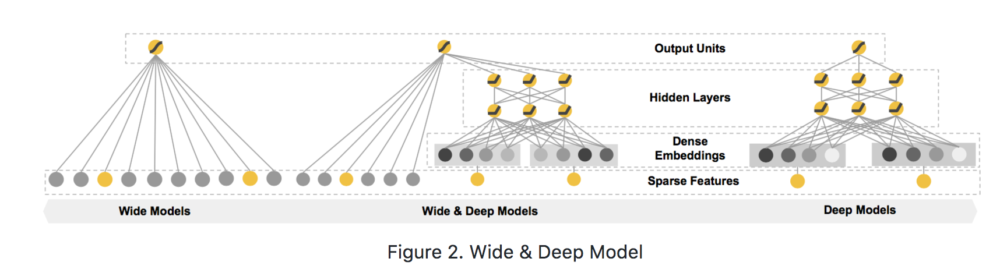

目录

<!-- TOC -->

- [FM](#fm)
- [FFM](#ffm)
- [FNN, SNN](#fnn-snn)
    - [FNN](#fnn)
    - [SNN](#snn)
- [CCPM](#ccpm)
- [PNN](#pnn)
    - [IPNN](#ipnn)
    - [OPNN](#opnn)
- [Wide & Deep](#wide--deep)
- [DeepFM](#deepfm)
- [Deep & Cross](#deep--cross)
- [NFM](#nfm)
- [AFM](#afm)

<!-- /TOC -->

参考：
[深度学习在 CTR 中应用](http://www.mamicode.com/info-detail-1990002.html)

[ctr模型汇总](https://zhuanlan.zhihu.com/p/32523455)

基于lr和gbdt的可以参考[传统ctr预估模型](https://daiwk.github.io/posts/dl-traditional-ctr-models.html)

## FM

二阶多项式模型：

`\[
\phi(x) = w_0+\sum _{i}w_ix_i+\sum_{i}\sum_{j<i}w_{ij}x_ix_j
\]`

多项式模型的问题在于二阶项的参数过多，假设特征个数为n，那么二阶项的参数数目为n(n+1)/2，参数太多，而却只有少数模式在样本中能找到，因此模型无法学出对应的权重。

FM模型：

`\[
\hat{y} = w_0+\sum _{i=1}^nw_ix_i+\sum_{i=1}^{n-1}\sum_{j=i+1}^{n}\left \langle \mathbf{v}_i,\mathbf{v}_j  \right \rangle x_ix_j
\]`

其中，
+ `\(w_0\in \mathbb{R}\)`
+ `\(\mathbf{w}\in \mathbb{R}^n\)`
+ `\(\mathbf{V}\in \mathbb{R}^{n\times k}\)`
+ `\(\hat{w_{ij}}=\mathbf{v}_i\mathbf{v}_j^T=\sum _{l=1}^kv_{il}v_{jl}\)`
所以上式中的`\(\mathbf{v}_i\)`就表示`\(\mathbf{V}\)`这个矩阵的第i行（有k列），而`\(\left \langle \mathbf{v}_i,\mathbf{v}_j  \right \rangle\)`就表示第i行和和j行这两个向量的内积（得到一个数），而得到的正好就是权重矩阵的第i行第j列的元素`\(\hat{w}_{ij}\)`，而`\(\hat{w}\)`这个矩阵是`\((n-1)\times(n-1)\)`维的矩阵，刻画的是相邻两个x【`\(x_i\)`和`\(x_{i+1}\)`】之间的系数。因此，可以理解为，将这个`\((n-1)\times(n-1)\)`维的矩阵用一个`\(n\times k\)`维的低秩矩阵来表示。

## FFM

## FNN, SNN

[Deep Learning over Multi-field Categorical Data - A Case Study on User Response Prediction in Display Ads](https://arxiv.org/pdf/1601.02376.pdf)

### FNN

### SNN

## CCPM

[A Convolutional Click Prediction Model](https://dl.acm.org/citation.cfm?id=2806603)

## PNN

[Product-based Neural Networks for User Response Prediction](https://arxiv.org/pdf/1611.00144.pdf)

### IPNN

### OPNN

## Wide & Deep

[Wide & deep learning for recommender systems](https://arxiv.org/pdf/1606.07792.pdf)

LR 对于 DNN 模型的优势是对大规模稀疏特征的容纳能力，包括内存和计算量等方面，工业界都有非常成熟的优化方法； 而 DNN 模型具有自己学习新特征的能力，一定程度上能够提升特征使用的效率， 这使得 DNN 模型在同样规模特征的情况下，更有可能达到更好的学习效果。

模型结构如下：

<html>
 

 

</html>

模型左边的 Wide 部分，可以容纳大规模系数特征，并且对一些特定的信息（比如 ID）有一定的记忆能力； 而模型右边的 Deep 部分，能够学习特征间的隐含关系，在相同数量的特征下有更好的学习和推导能力。

用于ctr预估[https://github.com/PaddlePaddle/models/tree/develop/ctr](https://github.com/PaddlePaddle/models/tree/develop/ctr)

特征的生成：[https://github.com/PaddlePaddle/models/blob/develop/ctr/dataset.md](https://github.com/PaddlePaddle/models/blob/develop/ctr/dataset.md)

## DeepFM

[DeepFM: A Factorization-Machine based Neural Network for CTR Prediction](https://www.ijcai.org/proceedings/2017/0239.pdf)

## Deep & Cross

论文地址：[deep & cross network for ad click predictions](https://arxiv.org/abs/1708.05123)

参考：[https://daiwk.github.io/posts/dl-deep-cross-network.html](https://daiwk.github.io/posts/dl-deep-cross-network.html)

## NFM

[Neural Factorization Machines for Sparse Predictive Analytics](https://arxiv.org/pdf/1708.05027.pdf)

## AFM

[Attentional Factorization Machines:Learning theWeight of Feature Interactions via Attention Networks](https://arxiv.org/pdf/1708.04617.pdf)
