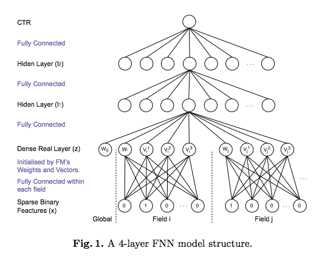
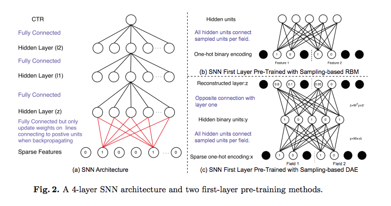
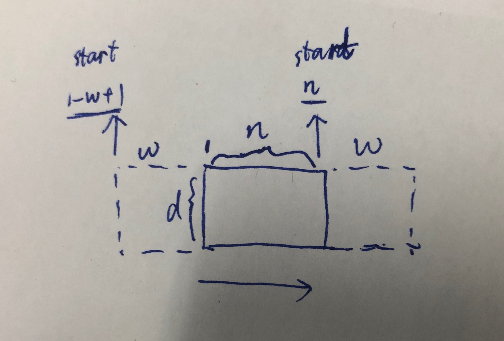
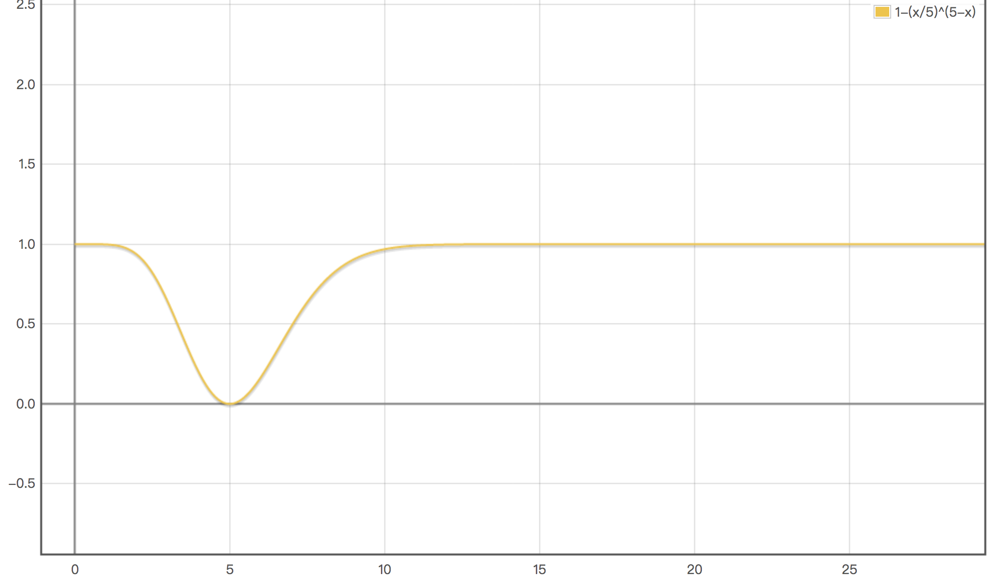
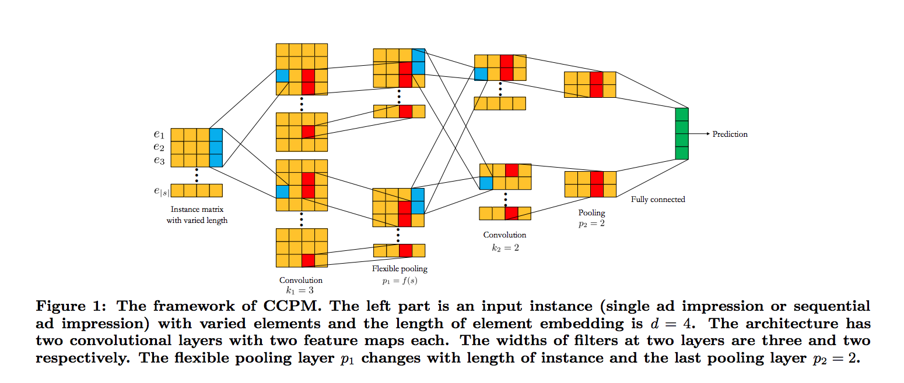
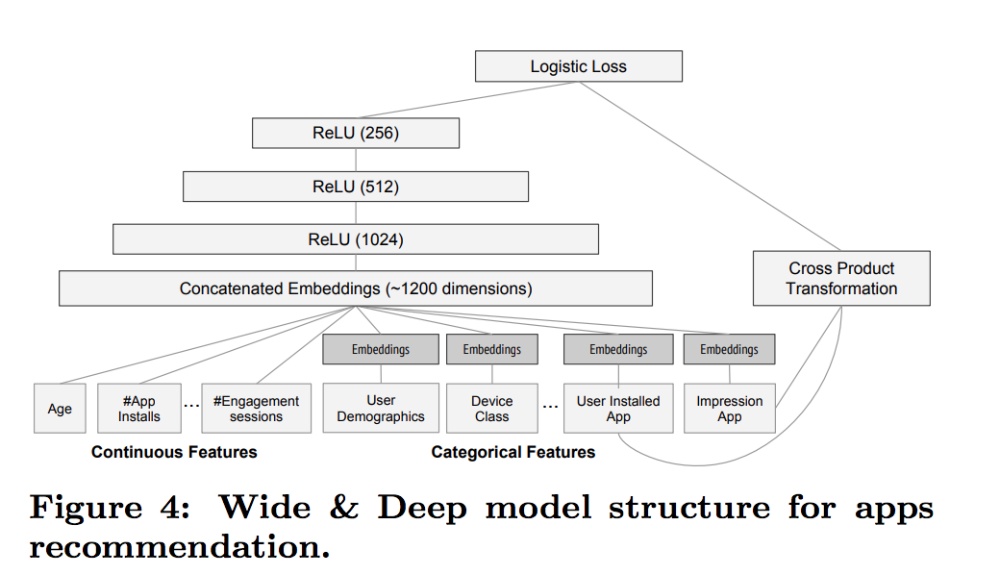
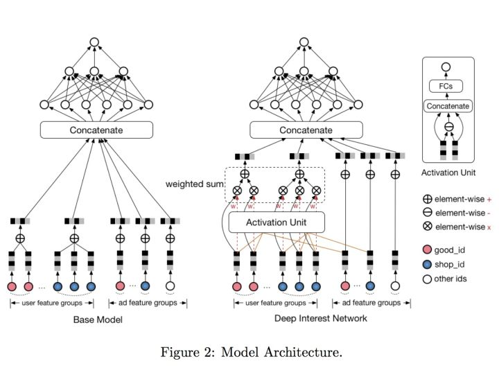
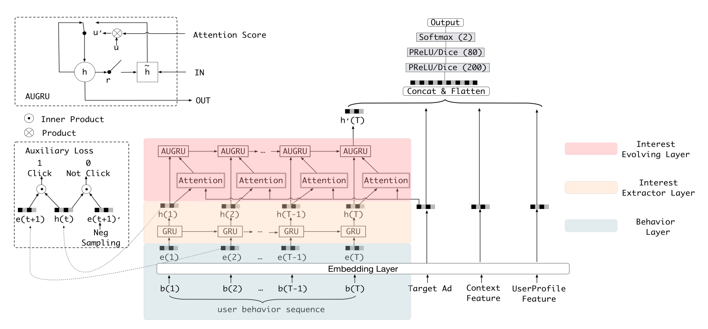
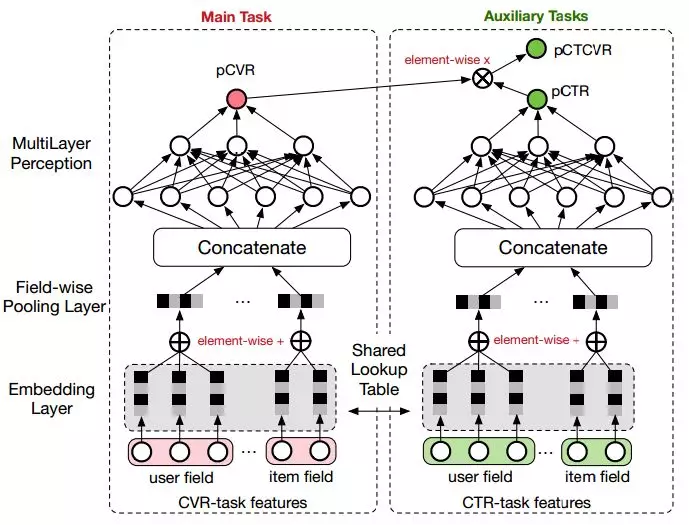

目录

<!-- TOC -->

- [FM](#fm)
- [FFM](#ffm)
- [embedding + mlp](#embedding--mlp)
- [FNN, SNN](#fnn-snn)
  - [FNN](#fnn)
  - [SNN](#snn)
- [NFM](#nfm)
- [AFM](#afm)
- [PNN](#pnn)
  - [IPNN](#ipnn)
  - [OPNN](#opnn)
  - [PNN小结](#pnn%e5%b0%8f%e7%bb%93)
- [CCPM](#ccpm)
  - [Convolution Layer](#convolution-layer)
  - [Flexible p-Max Pooling](#flexible-p-max-pooling)
  - [feature maps](#feature-maps)
  - [ccpm小结](#ccpm%e5%b0%8f%e7%bb%93)
- [Wide & Deep](#wide--deep)
- [DeepFM](#deepfm)
- [Deep & Cross](#deep--cross)
- [xDeepFM](#xdeepfm)
  - [背景](#%e8%83%8c%e6%99%af)
  - [预备知识](#%e9%a2%84%e5%a4%87%e7%9f%a5%e8%af%86)
    - [embedding](#embedding)
    - [隐式的高阶特征交互](#%e9%9a%90%e5%bc%8f%e7%9a%84%e9%ab%98%e9%98%b6%e7%89%b9%e5%be%81%e4%ba%a4%e4%ba%92)
    - [显式的高阶特征交互](#%e6%98%be%e5%bc%8f%e7%9a%84%e9%ab%98%e9%98%b6%e7%89%b9%e5%be%81%e4%ba%a4%e4%ba%92)
  - [CIN](#cin)
  - [xDeepFM](#xdeepfm-1)
- [DIN](#din)
- [DIEN](#dien)
  - [兴趣提取](#%e5%85%b4%e8%b6%a3%e6%8f%90%e5%8f%96)
  - [兴趣演化](#%e5%85%b4%e8%b6%a3%e6%bc%94%e5%8c%96)
- [ESMM](#esmm)
- [TDM](#tdm)
- [DeepGBM](#deepgbm)
- [各种比赛](#%e5%90%84%e7%a7%8d%e6%af%94%e8%b5%9b)

<!-- /TOC -->

参考：

[深度学习在 CTR 中应用](http://www.mamicode.com/info-detail-1990002.html)

[ctr模型汇总](https://zhuanlan.zhihu.com/p/32523455)

基于lr和gbdt的可以参考[传统ctr预估模型](https://daiwk.github.io/posts/dl-traditional-ctr-models.html)

参考：[从FM推演各深度CTR预估模型(附代码)](https://www.jiqizhixin.com/articles/2018-07-16-17)

发现一个不错的合集。。[https://www.jianshu.com/p/2b1246858e6f](https://www.jianshu.com/p/2b1246858e6f)

## FM

二阶多项式模型：

`\[
\phi(x) = w_0+\sum _{i}w_ix_i+\sum_{i}\sum_{j<i}w_{ij}x_ix_j
\]`

多项式模型的问题在于二阶项的参数过多，假设特征个数为n，那么二阶项的参数数目为n(n+1)/2，参数太多，而却只有少数模式在样本中能找到，因此模型无法学出对应的权重。

FM模型：

`\[
\hat{y} = w_0+\sum _{i=1}^nw_ix_i+\sum_{i=1}^{n-1}\sum_{j=i+1}^{n}\left \langle \mathbf{v}_i,\mathbf{v}_j  \right \rangle x_ix_j
\]`

其中，
+ `\(w_0\in \mathbb{R}\)`
+ `\(\mathbf{w}\in \mathbb{R}^n\)`
+ `\(\mathbf{V}\in \mathbb{R}^{n\times k}\)`
+ `\(\hat{w_{ij}}=\mathbf{v}_i\mathbf{v}_j^T=\sum _{l=1}^kv_{il}v_{jl}\)`
所以上式中的`\(\mathbf{v}_i\)`就表示`\(\mathbf{V}\)`这个矩阵的第i行（有k列），而`\(\left \langle \mathbf{v}_i,\mathbf{v}_j  \right \rangle\)`就表示第i行和和j行这两个向量的内积（得到一个数），而得到的正好就是权重矩阵的第i行第j列的元素`\(\hat{w}_{ij}\)`，而`\(\hat{w}\)`这个矩阵是`\((n-1)\times(n-1)\)`维的矩阵，刻画的是相邻两个x【`\(x_i\)`和`\(x_{i+1}\)`】之间的系数。因此，可以理解为，将这个`\((n-1)\times(n-1)\)`维的矩阵用一个`\(n\times k\)`维的低秩矩阵来表示。

在计算特征组合的时候，会用如下一个小trick：

因为`\((ax+by)^2=a^2x^2+b^2y^2+2axby\)`，所以，

`\[
\sum ^n_{i=1}\sum ^n_{j=i+1}x_ix_j=\frac{1}{2}[(\sum ^n_{i=1}x_i)^2-\sum^n_{i=1}x_i^2]
\]`

考虑了v，其实就是：

`\[
\sum xxv=\frac{1}{2}[\sum (xv)^2-\sum x^2v^2]
\]`

tf实现：

```python
class FM(Model):
    def __init__(self, input_dim=None, output_dim=1, factor_order=10, init_path=None, opt_algo='gd', learning_rate=1e-2,
                 l2_w=0, l2_v=0, random_seed=None):
        Model.__init__(self)
        # 一次、二次交叉、偏置项
        init_vars = [('w', [input_dim, output_dim], 'xavier', dtype),
                     ('v', [input_dim, factor_order], 'xavier', dtype),
                     ('b', [output_dim], 'zero', dtype)]
        self.graph = tf.Graph()
        with self.graph.as_default():
            if random_seed is not None:
                tf.set_random_seed(random_seed)
            self.X = tf.sparse_placeholder(dtype)
            self.y = tf.placeholder(dtype)
            self.vars = init_var_map(init_vars, init_path)

            w = self.vars['w']
            v = self.vars['v']
            b = self.vars['b']

            # [(x1+x2+x3)^2 - (x1^2+x2^2+x3^2)]/2
            # 先计算所有的交叉项，再减去平方项(自己和自己相乘)
            X_square = tf.SparseTensor(self.X.indices, tf.square(self.X.values), tf.to_int64(tf.shape(self.X)))
            xv = tf.square(tf.sparse_tensor_dense_matmul(self.X, v))
            p = 0.5 * tf.reshape(
                tf.reduce_sum(xv - tf.sparse_tensor_dense_matmul(X_square, tf.square(v)), 1),
                [-1, output_dim])
            xw = tf.sparse_tensor_dense_matmul(self.X, w)
            logits = tf.reshape(xw + b + p, [-1])
            self.y_prob = tf.sigmoid(logits)

            self.loss = tf.reduce_mean(
                tf.nn.sigmoid_cross_entropy_with_logits(logits=logits, labels=self.y)) + \
                        l2_w * tf.nn.l2_loss(xw) + \
                        l2_v * tf.nn.l2_loss(xv)
            self.optimizer = get_optimizer(opt_algo, learning_rate, self.loss)

            #GPU设定
            config = tf.ConfigProto()
            config.gpu_options.allow_growth = True
            self.sess = tf.Session(config=config)
            # 图中所有variable初始化
            tf.global_variables_initializer().run(session=self.sess)
```

将FM的公式稍微变形，写成内积形式，可以发现：

`\[
\hat{y} = w_0+\left \langle w,x \right  \rangle + \left \langle xV,xV \right  \rangle
\]`

发现，`\(xV\)`就是将离散稀疏特征`\(x\)`降维成一个低维稠密向量，所以**其实就是一种embedding**。

所以，其实FM就是：

+ 先对离散特征进行embedding
+ 然后对embedding后的向量进行内积来做二阶特征组合

## FFM

[Field-aware Factorization Machines for CTR Prediction](https://www.csie.ntu.edu.tw/~cjlin/papers/ffm.pdf)

参考[https://blog.csdn.net/john_xyz/article/details/78933253#field-aware-factorization-machinesffm](https://blog.csdn.net/john_xyz/article/details/78933253#field-aware-factorization-machinesffm)

FFM把**相同性质的特征**归于**同一个field**。每一维特征`\(x_i\)`，针对**其他特征**的每一种field `\(f_j\)`，都会学习一个隐向量`\(V_{i,f_j}\)`。所以隐向量不仅与特征有关，也与field相关。假设有`\(n\)`个特征，`\(f\)`个field，那么FFM的二次项总共有`\(nf\)`个隐向量，而FM中，每一维特征的隐向量只有一个。公式如下：

`\[
y=w_0+\sum^n_{i=1}w_ix_i+\sum^n_{i=1}\sum ^n_{j=i+1} \left \langle V_{i,f_j}, V_{j,f_i} \right  \rangle x_i x_j
\]`

如果隐向量的长度是`\(k\)`，那么FFM的二次参数有`\(nfk\)`个，远多于FM的`\(nk\)`个，二次项并不能化简，所以时间复杂度是`\(O(kn^2)\)`。由于FFM中的latent vector只需要学习特定的field，所以通常要求`\(k_{FFM}<< k_{FM}\)`

FFM做召回可以参考：[推荐系统召回四模型之二：沉重的FFM模型](https://mp.weixin.qq.com/s/4YWId4hRun8z9ACuYeUThA)

主要思想就是把item侧的emb做一下转置，然后就可以各自concat，拼出user的大向量和item的大向量，然后做个内积就是了。要加一阶项或者user内部组合特征或者item内部组合特征，就往对应的大向量后面加，然后另一个大向量对应位置写1，再去搞内积就是了。

"微博在业务中的实践表明，如果采取FM召回模型，对于有些应用来说，一阶项对于最终效果有明显影响，所以在用FM/FFM做召回的时候，是需要将一阶项考虑进去的，这可能是个别一阶特征比较重要导致的。我们在Criteo数据集合的实验结果也证明：如果是FM模型，一阶项是有用的，去掉一阶项，只保留二阶项，AUC大约会掉1个绝对百分点，对于CTR来说，这个差距还是很明显的；而如果是采用DeepFM模型，则FM部分是否保留一阶项对最终结果没有什么影响，这说明DNN的隐层有效地将一阶项的作用吸收掉了。"

加场景特征C的时候，先在取用户特征U的时候算出每个域的<U,C>，记为score1。然后把C拼到U的长向量里去，I的长向量后面也拼上I给C准备的emb，然后内积算出score2，score1+score2就是了。

这样就可能出现向量太长的问题，所以需要提速：

方法1：U的emb切分成k段，I的emb也切分成k段，U的每一段去annoy找topk的I的那段出来，然后k个子集merge，有交集的item把k段的内积加起来，就是它的score

方案2：作者提出了一种奇怪的想法，当然得出的结果不是FFM，是变种的FM+FFM：比如I有3个域，U有两个域，那U有2组向量，每组向量里有3个向量，记为(U11,U12,U13), (U21,U22,U23)，同理，I有3组向量，每组向量有2个向量，记为(I11,I12), (I21,I22), (I31,I32)，然后U跨域相加，得到(U11+U21),(U12+U22),(U31+U23)，而I进行域内相加，得到(I11+I12), (I21+I22), (I31+I32)，然后U和I就可以做内积啦。。同理，也可以对I跨域相加，对U域内相加。。

## embedding + mlp

是ctr预估的通用框架，各种field的特征进行emb，然后concat到一起，然后堆一堆mlp。

缺点：只学习高阶特征组合，对于**低阶**或者**手动的特征组合**不够兼容，而且参数较多，学习较困难

## FNN, SNN

[Deep Learning over Multi-field Categorical Data - A Case Study on User Response Prediction in Display Ads](https://arxiv.org/pdf/1601.02376.pdf)

这篇文章里提出了FNN和SNN。

### FNN

将**FM与MLP**进行了结合。它有着十分显著的特点：

+ 采用**FM预训练**得到的隐含层及其权重作为神经网络的**第一层的初始值**，之后再不断堆叠全连接层，最终输出预测的点击率。
+ 可以将FNN理解成一种特殊的embedding+MLP，其要求第一层嵌入后的**各领域特征维度一致**，并且emb权重的初始化是FM预训练好的。
+ 不是一个端到端的训练过程，有**贪心预训练**的思路。而且如果不考虑预训练过程，模型网络结构也没有考虑低阶特征组合。 

<html>
<br/>


<br/>

</html>

tf代码：

```python
class FNN(Model):
    def __init__(self, field_sizes=None, embed_size=10, layer_sizes=None, layer_acts=None, drop_out=None,
                 embed_l2=None, layer_l2=None, init_path=None, opt_algo='gd', learning_rate=1e-2, random_seed=None):
        Model.__init__(self)
        init_vars = []
        num_inputs = len(field_sizes)
        for i in range(num_inputs):
            init_vars.append(('embed_%d' % i, [field_sizes[i], embed_size], 'xavier', dtype))
        node_in = num_inputs * embed_size
        for i in range(len(layer_sizes)):
            init_vars.append(('w%d' % i, [node_in, layer_sizes[i]], 'xavier', dtype))
            init_vars.append(('b%d' % i, [layer_sizes[i]], 'zero', dtype))
            node_in = layer_sizes[i]
        self.graph = tf.Graph()
        with self.graph.as_default():
            if random_seed is not None:
                tf.set_random_seed(random_seed)
            self.X = [tf.sparse_placeholder(dtype) for i in range(num_inputs)]
            self.y = tf.placeholder(dtype)
            self.keep_prob_train = 1 - np.array(drop_out)
            self.keep_prob_test = np.ones_like(drop_out)
            self.layer_keeps = tf.placeholder(dtype)
            self.vars = init_var_map(init_vars, init_path)
            w0 = [self.vars['embed_%d' % i] for i in range(num_inputs)]
            xw = tf.concat([tf.sparse_tensor_dense_matmul(self.X[i], w0[i]) for i in range(num_inputs)], 1)
            l = xw

            #全连接部分
            for i in range(len(layer_sizes)):
                wi = self.vars['w%d' % i]
                bi = self.vars['b%d' % i]
                print(l.shape, wi.shape, bi.shape)
                l = tf.nn.dropout(
                    activate(
                        tf.matmul(l, wi) + bi,
                        layer_acts[i]),
                    self.layer_keeps[i])

            l = tf.squeeze(l)
            self.y_prob = tf.sigmoid(l)

            self.loss = tf.reduce_mean(
                tf.nn.sigmoid_cross_entropy_with_logits(logits=l, labels=self.y))
            if layer_l2 is not None:
                self.loss += embed_l2 * tf.nn.l2_loss(xw)
                for i in range(len(layer_sizes)):
                    wi = self.vars['w%d' % i]
                    self.loss += layer_l2[i] * tf.nn.l2_loss(wi)
            self.optimizer = get_optimizer(opt_algo, learning_rate, self.loss)

            config = tf.ConfigProto()
            config.gpu_options.allow_growth = True
            self.sess = tf.Session(config=config)
            tf.global_variables_initializer().run(session=self.sess)
```


### SNN

和FNN的不同就是最底层的结构和预训练方式。**其最底层是全连接的**，用**RBM和DAE预训练**。预训练的时候，因为特征数量太多，为了减少计算量，**每个field**里**值为0的特征**抽取**m个**，没有抽中的特征在该次权重更新就会被完全忽略。

<html>
<br/>


<br/>

</html>

FNN比SNN-DAE和SNN-RBM好，两种SNN结果总是差不多，但都比LR和FM好。

文章还指出一点，钻石型网络结构比常数型结构好，常数型又比增加型，减少型结构好

## NFM

[Neural Factorization Machines for Sparse Predictive Analytics](https://arxiv.org/pdf/1708.05027.pdf)

NFM的基本特点：

+ 利用**二阶交互池化层**（Bi-Interaction Pooling）对FM嵌入后的向量**两两进行元素级别的乘法**，形成**同维度的向量求和**后作为前馈神经网络的输入。
+ NFM与DeepFM的区别是**没有单独的FM的浅层网络**进行联合训练，而是将其整合后**直接输出给前馈神经网络**。
+ 当MLP的全连接层都是恒等变换且最后一层参数全为1时，NFM就退化成了FM。可见，NFM是FM的推广，它推迟了FM的实现过程，并在其中加入了更多非线性运算。
+ NFM与FNN非常相似。它们的主要区别是NFM在embedding之后对特征进行了两两逐元素乘法。因为逐元素相乘的向量维数不变，之后对这些向量求和的维数仍然与embedding的维数一致。因此**输入到MLP的参数比起直接concatenate的FNN更少。**

tf实现：

```python
def model_fn(features, labels, mode, params):
    """Bulid Model function f(x) for Estimator."""
    #------hyperparameters----
    field_size = params["field_size"]
    feature_size = params["feature_size"]
    embedding_size = params["embedding_size"]
    l2_reg = params["l2_reg"]
    learning_rate = params["learning_rate"]
    #optimizer = params["optimizer"]
    layers = map(int, params["deep_layers"].split(','))
    dropout = map(float, params["dropout"].split(','))

    #------bulid weights------
    Global_Bias = tf.get_variable(name='bias', shape=[1], initializer=tf.constant_initializer(0.0))
    Feat_Bias = tf.get_variable(name='linear', shape=[feature_size], initializer=tf.glorot_normal_initializer())
    Feat_Emb = tf.get_variable(name='emb', shape=[feature_size,embedding_size], initializer=tf.glorot_normal_initializer())

    #------build feaure-------
    feat_ids  = features['feat_ids']
    feat_ids = tf.reshape(feat_ids,shape=[-1,field_size])
    feat_vals = features['feat_vals']
    feat_vals = tf.reshape(feat_vals,shape=[-1,field_size])

    #------build f(x)------
    with tf.variable_scope("Linear-part"):
        feat_wgts = tf.nn.embedding_lookup(Feat_Bias, feat_ids)         # None * F * 1
        y_linear = tf.reduce_sum(tf.multiply(feat_wgts, feat_vals),1)

    with tf.variable_scope("BiInter-part"):
        embeddings = tf.nn.embedding_lookup(Feat_Emb, feat_ids)         # None * F * K
        feat_vals = tf.reshape(feat_vals, shape=[-1, field_size, 1])
        embeddings = tf.multiply(embeddings, feat_vals)                 # vij * xi
        sum_square_emb = tf.square(tf.reduce_sum(embeddings,1))
        square_sum_emb = tf.reduce_sum(tf.square(embeddings),1)
        deep_inputs = 0.5*tf.subtract(sum_square_emb, square_sum_emb)   # None * K

    with tf.variable_scope("Deep-part"):
        if mode == tf.estimator.ModeKeys.TRAIN:
            train_phase = True
        else:
            train_phase = False

        if mode == tf.estimator.ModeKeys.TRAIN:
            deep_inputs = tf.nn.dropout(deep_inputs, keep_prob=dropout[0])                      # None * K
        for i in range(len(layers)):
            deep_inputs = tf.contrib.layers.fully_connected(inputs=deep_inputs, num_outputs=layers[i], \
                weights_regularizer=tf.contrib.layers.l2_regularizer(l2_reg), scope='mlp%d' % i)

            if FLAGS.batch_norm:
                deep_inputs = batch_norm_layer(deep_inputs, train_phase=train_phase, scope_bn='bn_%d' %i)   #放在RELU之后 https://github.com/ducha-aiki/caffenet-benchmark/blob/master/batchnorm.md#bn----before-or-after-relu
            if mode == tf.estimator.ModeKeys.TRAIN:
                deep_inputs = tf.nn.dropout(deep_inputs, keep_prob=dropout[i])                              #Apply Dropout after all BN layers and set dropout=0.8(drop_ratio=0.2)
                #deep_inputs = tf.layers.dropout(inputs=deep_inputs, rate=dropout[i], training=mode == tf.estimator.ModeKeys.TRAIN)

        y_deep = tf.contrib.layers.fully_connected(inputs=deep_inputs, num_outputs=1, activation_fn=tf.identity, \
            weights_regularizer=tf.contrib.layers.l2_regularizer(l2_reg), scope='deep_out')
        y_d = tf.reshape(y_deep,shape=[-1])

    with tf.variable_scope("NFM-out"):
        #y_bias = Global_Bias * tf.ones_like(labels, dtype=tf.float32)  # None * 1  warning;这里不能用label，否则调用predict/export函数会出错，train/evaluate正常；初步判断estimator做了优化，用不到label时不传
        y_bias = Global_Bias * tf.ones_like(y_d, dtype=tf.float32)      # None * 1
        y = y_bias + y_linear + y_d
        pred = tf.sigmoid(y)

    predictions={"prob": pred}
    export_outputs = {tf.saved_model.signature_constants.DEFAULT_SERVING_SIGNATURE_DEF_KEY: tf.estimator.export.PredictOutput(predictions)}
    # Provide an estimator spec for `ModeKeys.PREDICT`
    if mode == tf.estimator.ModeKeys.PREDICT:
        return tf.estimator.EstimatorSpec(
                mode=mode,
                predictions=predictions,
                export_outputs=export_outputs)

    #------bulid loss------
    loss = tf.reduce_mean(tf.nn.sigmoid_cross_entropy_with_logits(logits=y, labels=labels)) + \
        l2_reg * tf.nn.l2_loss(Feat_Bias) + l2_reg * tf.nn.l2_loss(Feat_Emb)

    # Provide an estimator spec for `ModeKeys.EVAL`
    eval_metric_ops = {
        "auc": tf.metrics.auc(labels, pred)
    }
    if mode == tf.estimator.ModeKeys.EVAL:
        return tf.estimator.EstimatorSpec(
                mode=mode,
                predictions=predictions,
                loss=loss,
                eval_metric_ops=eval_metric_ops)

    #------bulid optimizer------
    if FLAGS.optimizer == 'Adam':
        optimizer = tf.train.AdamOptimizer(learning_rate=learning_rate, beta1=0.9, beta2=0.999, epsilon=1e-8)
    elif FLAGS.optimizer == 'Adagrad':
        optimizer = tf.train.AdagradOptimizer(learning_rate=learning_rate, initial_accumulator_value=1e-8)
    elif FLAGS.optimizer == 'Momentum':
        optimizer = tf.train.MomentumOptimizer(learning_rate=learning_rate, momentum=0.95)
    elif FLAGS.optimizer == 'ftrl':
        optimizer = tf.train.FtrlOptimizer(learning_rate)

    train_op = optimizer.minimize(loss, global_step=tf.train.get_global_step())

    # Provide an estimator spec for `ModeKeys.TRAIN` modes
    if mode == tf.estimator.ModeKeys.TRAIN:
        return tf.estimator.EstimatorSpec(
                mode=mode,
                predictions=predictions,
                loss=loss,
                train_op=train_op)
```

## AFM

[Attentional Factorization Machines:Learning theWeight of Feature Interactions via Attention Networks](https://arxiv.org/pdf/1708.04617.pdf)

NFM的主要创新点是在FM过程中添加了逐元素相乘的运算来增加模型的复杂度。但没有在此基础上添加更复杂的运算过程，比如对加权求和。

AFM的特点是：

+ AFM与NFM都是致力于充分利用二阶特征组合的信息，对嵌入后的向量两两进行逐元素乘法，形成同维度的向量。而且**AFM没有MLP部分**。
+ AFM通过在**逐元素乘法之后**形成的向量进行**加权求和**，而且权重是基于网络自身来产生的。其方法是引入一个注意力子网络（Attention Net）。
+ 当**权重都相等**时，AFM退化成**无全连接层的NFM**。
+ “注意力子网络”的主要操作是进行矩阵乘法，其最终输出结果为softmax，以保证各分量的权重本身是一个概率分布。

## PNN

[Product-based Neural Networks for User Response Prediction](https://arxiv.org/pdf/1611.00144.pdf)

<html>
<br/>


<br/>

</html>

+ 首先对输入数据进行embedding处理，得到一个low-dimensional vector层
+ 对该层的任意两个feature进行内积或是外积处理就得到上图的蓝色节点，
+ 是把这些Feature直接和1相乘复制到上一层的Z中，
+ 然后把Z和P接在一起就可以作为神经网络的输入层，
+ 在此基础上我们就可以应用神经网络去模型了。

假设有N个field，每个field是M维的embedding。

### IPNN

field之间使用内积。左边的z就是一个NxM维的，而对于p来讲，p是NxN的。所以对p来讲，使用矩阵分解来简化问题：

任意的 N×N 实对称矩阵都有 N 个线性无关的特征向量。并且这些特征向量都可以正交单位化而得到一组正交且模为1的向量。故实对称矩阵A可被分解成 `\(A=Q\Lambda Q^T\)`。其中，Q为正交矩阵，`\(\Lambda\)`为实对角矩阵。

由于weight matrix是一个对称方阵，所以，如果进行一阶低秩矩阵分解，那么可以分解为`\(W^n_p=\theta ^n(\theta ^n)^T\)`，`\(\theta ^N\in R^N\)`。

而如果进行K阶低秩矩阵分解，就有：

`\[
W^n_p\odot p=\sum ^N_{i=1}\sum ^N_{j=1}\left \langle \theta ^i_n,\theta ^j_n \right \rangle \left \langle f_i,f_j \right \rangle
\]`

其中，`\(\theta ^i_n\in R^K\)`。

### OPNN

和IPNN唯一不同的是构造交叉项的方式：


### PNN小结

+ 利用二阶向量积层（Pair-wisely Connected Product Layer）对FM嵌入后的向量两两进行向量积，形成的结果作为之后MLP的输入。PNN采用的向量积有内积与外积两种形式。
+ PNN中向量与常数1进行的乘法运算其实与FNN类似，不是PNN的主要创新点。
+ 对于内积形式的PNN，因为两个向量相乘的结果为标量，可以直接把各个标量“拼接”成一个大向量，就可以作为MLP的输入了。
+ 当MLP的全连接层都是恒等变换且最后一层参数全为1时，内积形式的PNN就退化成了FM。
+ 对于外积形式的PNN，因为两个向量相乘相当于列向量与行向量进行矩阵相乘，得到的结果为一个矩阵。各个矩阵向之前内积形式的操作一样直接拼接起来维数太多，论文的简化方案是直接对各个矩阵进行求和，得到的新矩阵（可以理解成之后对其拉长成向量）就直接作为MLP的输入。
+ 观察计算图发现外积形式的PNN与**NFM**很像，其实就是PNN把NFM的逐元素乘法换成了外积。

## CCPM

CIKM2015的文章[A Convolutional Click Prediction Model](http://nlpr-web.ia.ac.cn/english/irds/People/sw/Liu2015CCPM.pdf)

为了充分利用**历史的顺序点击**的信息，可以有基于RNN的预测模型，把用户所浏览的历史记录作为序列，通过用户在**不同的时间间隔**内来划分用户的历史点击序列。然而在**真实的场景**下，用户对商品的**兴趣会随时间而改变**，RNN模型在此刻的场景下就受到限制。本文用cnn来解决。

+ 在单条广告展示中（single ad impression），包括许多元素：```element = (user, query, ad, impression time, site category, device type, etc)```。用户是否点击一个广告与用户的历史ad impression有关。
+ 一系列的ad impression组成sequential ad impression。

基于以上两种情况来预测点击概率。

ccpm包括convolutional layers和flexible p-max pooling layers两种layer：

### Convolution Layer

每个样本有`\(n\)`个特征，对每个特征使用embeding得到定长为`\(d\)`的向量`\(e_i\in R^d\)`。构成矩阵`\(s\in R^{d\times n}\)`(一列是一个`\(d\)`维的向量`\(e_i\)`)：

`\[
\begin{bmatrix}
\vdots & \vdots  &\vdots \\
e_1 & ... & e_n \\
\vdots & \vdots & \vdots
\end{bmatrix}
\]`

然后就可以用cnn了：

搞一个`\(w\in R^{d\times \omega}\)`的权重矩阵进行卷积，卷积完得到的矩阵`\(r\in R^{d\times (n+\omega -1)}\)`。给定各矩阵的第`\(i\)`行：`\(w_i\in R^{\omega}\)`，和`\(s_i\in R^n\)`，还有`\(r_i\in R^{(n+\omega -1)}\)`。那么：

`\[
r_i=w_i^Ts_{i,j-\omega +1:j}
\]`

其中`\(j=1,...,n+\omega -1\)`。将out-of-range的值`\(s_{i,k}\)`，即`\(k<1\ or\ k>n\)`全部置为0(即不要padding)。

解释一下下：`\(w\in R^{d\times \omega}\)`，所以，`\(w^T\in R^{\omega \times d}\)`，`\(w_i^T\)`就是这个矩阵的第`\(i\)`行这个长度为`\(d\)`的向量。`\(s_{i,j-\omega +1:j}\)`指的是`\(s\)`中的大小为`\(d\times \omega\)`的小矩阵的第`\(i\)`行（因为卷积是**element-wise的乘积**再相加，也就是两个相同维度的向量做内积，所以这里也是**『行』！**）,这行有`\(\omega\)`个元素（`\(j-(j-\omega+1)+1=\omega\)`），而start的范围是`\(1-w+1,...,n\)`，也就是`\(1-\omega+1\le j-\omega -1 \le n\)`，所以，`\(1\le j \le n+\omega -1\)`：

<html>
<br/>


<br/>

</html>

### Flexible p-Max Pooling

由于**输入的长度是可变**的，为了降低这种影响，对应的池化层的参数应该也是灵活可变的。给定一个vector `\(r_i\in R^n\)`，所谓的p-max pooling就是取出一个sub-vector `\(s^p_i\in R^p\)`，取出原vector里最大的p个值。因为输入的instance是变长的，所以卷积层输出的长度也会随着变化，所以pooling层需要足够灵活地平滑地取出这p个数。因此，定义p为一个与输入数据长度及网络深度有关的参数：

`\[
p_i=\left\{\begin{matrix}
(1-(i/l)^{l-i})n, & i = 1,...,l-1 \\
3, & i=l
\end{matrix}\right.
\]`

其中，`\(l\)`代表卷积层的层数，`\(n\)`表示输入的长度（特征数），`\(p_i\)`表示第`\(i\)`个池化层的参数。例如，`\(n=18\)`，有3个卷积层，那么`\(p_1=16,p_2=6,p_3=3\)`。好处：

+ 最后一个pooling层输出固定是3，不论输入长度怎么变化，都是固定的
+ 这是一个power-exponential函数，与线性函数相比，一开始变化很慢，避免了一开始损失太多重要特征

我们看一下图像就一目了然了，假设有5层，我们看`\(n\)`前面的系数，也就是把层数`\(i\)`当成变量`\(x\)`。可以看到，一开始系数很接近1，所以变化很慢，后面就衰减得比较快，在5的时候衰减到0，所以我们要手动把最后一层设成一个固定的数：

<html>
<br/>


<br/>

</html>

### feature maps

pooling完了后，接的是tanh。本文里把经过了卷积、pooling和tanh的结果叫1阶feature map。定义第`\(i\)`阶feature map为`\(F^i\)`。对于中间的某一层，里面其实有很多个feature map，完全可以并行计算。例如，定义`\(F^i_j\)`是`\(i\)`阶feature maps里的第`\(j\)`个feature map，是通过如下方式计算的：将distinct的权重矩阵`\(w^i_{j,k}\)`和低阶`\(i-1\)`的每个feature map `\(F^{i-1}_k\)`的卷积结果加起来：

`\[
F^i_j=\sum ^{m_i}_{k=1}w^i_{j,k}* F^{i-1}_j
\]`

其中，`\(m_i\)`是第`\(i\)`阶的feature map数，`\(*\)`是卷积。类似地，`\(F^i_j\)`后面可以接pooling。最后接fc再接softmax得到最终输出。

### ccpm小结

<html>
<br/>


<br/>

</html>

如上图，embed的维数`\(d=4\)`，有2个卷积层，每个卷积层分别生成了2个feature map。第一个卷积层的filter的宽度即`\(\omega _1=k_1=3\)`，也就是图中左边的蓝色部分，长度为3，第二个卷积层的filter的宽度即`\(w_2=k_2=2\)`，也就是图中中间的蓝色部分长度为2。这里把最后一个pooling层的`\(p_2\)`设成固定的2。

## Wide & Deep

[Wide & deep learning for recommender systems](https://arxiv.org/pdf/1606.07792.pdf)

LR 对于 DNN 模型的优势是对大规模稀疏特征的容纳能力，包括内存和计算量等方面，工业界都有非常成熟的优化方法； 而 DNN 模型具有自己学习新特征的能力，一定程度上能够提升特征使用的效率， 这使得 DNN 模型在同样规模特征的情况下，更有可能达到更好的学习效果。

模型结构如下：

<html>
<br/>


<br/>

</html>

模型左边的 Wide 部分，可以容纳大规模系数特征，并且对一些特定的信息（比如 ID）有一定的记忆能力； 而模型右边的 Deep 部分，能够学习特征间的隐含关系，在相同数量的特征下有更好的学习和推导能力。

用于apps推荐：

<html>
<br/>


<br/>

</html>

+ wide侧：用户安装的app和浏览过的app的cross-product
+ deep侧：每个categorical产出一个32维的emb，然后concate到一起，再和连续值特征concate到一起得到一个约1200维的vec，再接3层fc和relu(1024->512->256)
+ wide和deep的输出加起来（如果是2分类问题，wide和deep的输出就都是一维，如果是n分类问题，那就是n维），加完的结果再丢给sigmoid或者softmax，去和label算交叉熵

用于ctr预估[https://github.com/PaddlePaddle/models/tree/develop/ctr](https://github.com/PaddlePaddle/models/tree/develop/ctr)

特征的生成：[https://github.com/PaddlePaddle/models/blob/develop/ctr/dataset.md](https://github.com/PaddlePaddle/models/blob/develop/ctr/dataset.md)

tf代码：

```python
def get_model(model_type, model_dir):
    print("Model directory = %s" % model_dir)

    # 对checkpoint去做设定
    runconfig = tf.contrib.learn.RunConfig(
        save_checkpoints_secs=None,
        save_checkpoints_steps = 100,
    )

    m = None

    # 宽模型
    if model_type == 'WIDE':
        m = tf.contrib.learn.LinearClassifier(
            model_dir=model_dir, 
            feature_columns=wide_columns)

    # 深度模型
    if model_type == 'DEEP':
        m = tf.contrib.learn.DNNClassifier(
            model_dir=model_dir,
            feature_columns=deep_columns,
            hidden_units=[100, 50, 25])

    # 宽度深度模型
    if model_type == 'WIDE_AND_DEEP':
        m = tf.contrib.learn.DNNLinearCombinedClassifier(
            model_dir=model_dir,
            linear_feature_columns=wide_columns,
            dnn_feature_columns=deep_columns,
            dnn_hidden_units=[100, 70, 50, 25],
            config=runconfig)

    print('estimator built')

    return m
```


注意：wide deep在wide侧和deep侧用的是两个优化方法：

[https://www.tensorflow.org/api_docs/python/tf/estimator/DNNLinearCombinedClassifier](https://www.tensorflow.org/api_docs/python/tf/estimator/DNNLinearCombinedClassifier)

```python
linear_optimizer='Ftrl',
dnn_optimizer='Adagrad',
```

可以通过如下方式对不同参数指定不同的优化方法~

[https://stackoverflow.com/questions/34945554/how-to-set-layer-wise-learning-rate-in-tensorflow](https://stackoverflow.com/questions/34945554/how-to-set-layer-wise-learning-rate-in-tensorflow)

## DeepFM

[DeepFM: A Factorization-Machine based Neural Network for CTR Prediction](https://www.ijcai.org/proceedings/2017/0239.pdf)

DeepFM和之前模型相比优势在于两点:

+ 相对于Wide&Deep不再需要手工构建wide部分
+ 另一个相对于FNN，FNN把FM的隐向量参数直接作为网络参数学习。而DeepFM将embedding层结果输入给FM和MLP，两者输出叠加，达到捕捉了低阶和高阶特征交叉的目的。

<html>
<br/>


<br/>

</html>

## Deep & Cross

论文地址：[deep & cross network for ad click predictions](https://arxiv.org/abs/1708.05123)

参考：[https://daiwk.github.io/posts/dl-deep-cross-network.html](https://daiwk.github.io/posts/dl-deep-cross-network.html)

DCN的特点如下：

+ Deep部分就是普通的MLP网络，主要是全连接。
+ 与DeepFM类似，DCN是由embedding+MLP部分与cross部分进行联合训练的。Cross部分是对FM部分的推广。
+ 可以证明，cross网络是**FM**的过程在**高阶特征组合**的**推广**。
+ 只有两层，且**第一层**与**最后一层权重参数相**等时的Cross网络与**简化版FM等价**。
+ 简化版的FM指的是，将拼接好的稠密向量作为输入向量，且不做领域方面的区分（但产生这些稠密向量的过程是考虑领域信息的，相对全特征维度的全连接层减少了大量参数，可以视作稀疏链接思想的体现）。而且之后进行embedding权重矩阵W只有一列——是退化成列向量的情形
+ 与MLP网络相比，Cross部分在增加高阶特征组合的同时减少了参数的个数，并省去了非线性激活函数。

## xDeepFM

参考[KDD 2018 \| 推荐系统特征构建新进展：极深因子分解机模型
](https://mp.weixin.qq.com/s?__biz=MzAwMTA3MzM4Nw==&mid=2649444578&idx=1&sn=13330325d99eabfb1266bcf59ea21dd3&chksm=82c0b966b5b73070784dd6e4e64cfaf8dbb8e3d700a70e170521e5e36b40e53ac09194968d48&mpshare=1&scene=1&srcid=0822TT1RCK4m3zivGMktMqTt&pass_ticket=Iv7tDFrzxp8iL9atPI0PT3qolxBV3HKdG%2FbQlgIvIJXhk29gJ1G3SogZR0Se77o2#rd)

[xDeepFM: Combining Explicit and Implicit Feature Interactions for Recommender Systems](https://arxiv.org/abs/1803.05170)

代码：[https://github.com/Leavingseason/xDeepFM](https://github.com/Leavingseason/xDeepFM)

传统的推荐系统中，**高阶交叉特征**通常是由工程师手工提取的，这种做法主要有三种缺点：

+ 重要的特征都是**与应用场景息息相关**的，针对每一种应用场景，工程师们都需要首先花费大量时间和精力深入了解数据的规律之后才能设计、提取出高效的高阶交叉特征，因此人力成本高昂
+ 原始数据中往往包含**大量稀疏的特征**，例如用户和物品的ID，交叉特征的维度空间是原始特征维度的乘积，因此很容易带来维度灾难的问题
+ 人工提取的交叉特征无法泛化到**未曾在训练样本中出现过的模式**中。

目前大部分相关的研究工作是**基于因子分解机**的框架，利用多层全连接神经网络去自动学习特征间的高阶交互关系，例如FNN、PNN和DeepFM等。其缺点是模型学习出的是**隐式的交互特征**，其形式是未知的、不可控的；同时它们的特征交互是发生在**元素级bit-wise**而不是**特征向量之间vector-wise**，这一点违背了因子分解机的初衷。

同时以显式和隐式的方式自动学习高阶的特征交互，使特征交互发生在向量级，还兼具记忆与泛化的学习能力。

### 背景

FM将每个feature映射成一个D维的隐向量`\(v_i=[v_{i1},v_{i2},...,v_{iD}]\)`，然后将pairwise的特征交叉建模为隐向量的内积`\(f^{(2)}(i,j)=\left \langle v_i,v_j \right \rangle x_i x_j\)`，本文中**将隐向量`\(v_i\)`的一个元素（例如`\(v_{i1}\)`）称作『bit』。**。传统FM能扩展到任意高阶的特征交互，但同时对有用和无用的组合都建模了。而这些无用的组合可能会引入噪音并降低精度。

FNN（ Factorisation-machine supported Neural Network）在使用DNN之前，为field embedding使用pre-trained的FM。

PNN为embedding layer和DNN layer引入了product layer，从而不需要对pretrained FM的依赖。

FNN和PNN的缺点是，**他们更多地关注高阶特征组合，而忽视了低阶的特征组合。**

wide&deep和deepFM使用混合架构，在网络中有shallow part和deep part，保证memorization和generalization，从而克服了这个问题。

而并没有理论上的结论来证明，DNN能够支持的最高阶的特征交互到底有多少。而且，DNN是bit-wise的交互，与FM的vector-wise交互是不同的。

本文与DCN类似，但把cross network替换成了CIN。

### 预备知识

#### embedding

假设有m个field，每个field都从原始特征映射成了一个D维的embedding向量`\(e_i\in R^D\)`，那么embedding就是一个concat到一起的vector：

`\[
e=[e_1,e_2,...,e_m]
\]`

如下图，就是D=4的embedding layer：

<html>
<br/>


<br/>

</html>

#### 隐式的高阶特征交互

FNN，Deep crossing，wide&deep的deep部分都是直接用DNN来隐式地进行高阶特征交互。这里的交互是bit-wise的，也就是说，**即使是同一个field里的feature，也会互相影响**。

而PNN和DeepFM做的改进就是，加入了vector-wise的交互，区别如下：

+ PNN将product layer的输出直接做为DNN的输入
+ DeepFM将FM layer直接连到了output unit

<html>
<br/>


<br/>

</html>

#### 显式的高阶特征交互

cross network使用如下公式进行高阶特征组合：

`\[
x_k=x_0x^T_{k-1}w_k+b_k+x_{k-1}
\]`

其中，`\(w_k,x_k,b_k\in R^{m\times D}\)`，假设`\(d=m\times D\)`。可以通过证明发现，cross network其实是一种特殊的高阶特征交互，每一个hidden layer其实是`\(x_0\)`乘了一个scalar。。

证明：

k=1时，

`\[
\begin{align*}
x_1 &= x_0(x_0)^Tw_1+x_0 \\ 
 &=x_0(x_0^Tw_1+1) \\ 
 &=\alpha ^1x_0
\end{align*}
\]`

scalar`\(\alpha ^1\)`是`\(x_0\)`的一个线性变换(`\(x_0\)`是dx1，所以`\(x_0^T\)`是1xd，而`\(w_1\)`是dx1，所以`\(x_0^Tw_1\)`是一个标量。。然后假设k=i成立，即`\(x_i=\alpha ^i x_0\)`。对于k=i+1，

`\[
\begin{align*}
x_{i+1} &= x_0(x_i)^Tw_{i+1}+x_i \\ 
 &=x_0((\alpha ^ix_0)^Tw_1)+ \alpha ^ix_0 \\ 
 &=\alpha ^{i+1}x_0
\end{align*}
\]`

其中`\(\alpha ^{i+1}=\alpha ^i(x^T_0w_{i+1}+1)\)`同样是一个scalar。。

当然了，这并不意味着`\(x_k\)`就是`\(x_0\)`的一个线性变换。`\(\alpha ^{i+1}\)`对`\(x_0\)`是敏感的。

因此，cross network有两个缺点：

+ 每一层变成了`\(x_0\)`与一个标量相乘
+ 高阶的特征交互变成了bit-wise，而不是FM所期待的vector-wise

<html>
<br/>


<br/>

</html>

### CIN

假设总共有`\(m\)`个field，每个field的embedding是一个`\(D\)`维向量。

压缩交互网络（Compressed Interaction Network， 简称CIN）隐向量是一个单元对象，因此我们将输入的原特征和神经网络中的隐层都分别组织成一个矩阵，记为`\(X^0\)`和`\(X^k\)`，CIN中每一层的神经元都是根据**前一层的隐层**以及**原特征向量**推算而来，其计算公式如下：

`\[
X^k_{h,*}=\sum ^{H_{k-1}}_{i=1}\sum ^{m}_{j=1}W^{k,h}_{ij}(X^{k-1}_{i,*}\circ X^{0}_{j,*})
\]`

其中，第k层隐层含有`\(H_k\)`条神经元向量。`\(\circ \)`是Hadamard product，即element-wise product，即，`\(\left \langle a_1,a_2,a_3\right \rangle\circ \left \langle b_1,b_2,b_3\right \rangle=\left \langle a_1b_1,a_2b_2,a_3b_3 \right \rangle\)`。

隐层的计算可以分成两个步骤：

+ 根据前一层隐层的状态`\(X^k\)`和原特征矩阵`\(X^0\)`，计算出一个中间结果`\(Z^{k+1}\)`，它是一个三维的张量。注意图中的`\(\bigotimes \)`是outer product，其实就是矩阵乘法咯，也就是一个mx1和一个nx1的向量的外积是一个mxn的矩阵：

`\[
u\bigotimes v=uv^T=\begin{bmatrix}
u_1\\ 
u_2\\ 
u_3\\
u_4
\end{bmatrix}\begin{bmatrix}
v_1 & v_2  & v_3  
\end{bmatrix}=\begin{bmatrix}
u_1v_1 &  u_1v_2& u_1v_3 \\ 
u_2v_1 & u_2v_2 & u_2v_3\\ 
u_3v_1 & u_3v_2 & u_3v_3\\ 
u_4v_1 & u_4v_2 & u_4v_3
\end{bmatrix}
\]`

<html>
<br/>


<br/>

</html>

而图中的`\(D\)`维，其实就是左边的一行和右边的一行对应相乘，

+ 接下来，如下图所示：

<html>
<br/>


<br/>

</html>

也就是说，这个时候把`\(Z^{k+1}\)`看成一个channel数是`\(D\)`的image，而把`\(W^{k,h}\)`看成一个`\(H^k*m\)`的卷积核（filter），这个卷积核大小和image一样，沿着embedding dimension(`\(D\)`)进行slide，一个卷积核处理后就映射成一个1x1xD的向量。使用`\(H^{k+1}\)`个的卷积核，就生成一个`\(H^{k+1}*D\)`的矩阵。

可以复习一下卷积的那些公式：

<html>
<br/>


<br/>

</html>


大致逻辑[https://github.com/Leavingseason/xDeepFM/blob/master/exdeepfm/src/CIN.py#L295](https://github.com/Leavingseason/xDeepFM/blob/master/exdeepfm/src/CIN.py#L295)：

```python
                split_tensor = tf.split(hidden_nn_layers[-1], hparams.dim * [1], 2)
                dot_result_m = tf.matmul(split_tensor0, split_tensor, transpose_b=True)
                dot_result_o = tf.reshape(dot_result_m, shape=[hparams.dim, -1, field_nums[0]*field_nums[-1]])
                dot_result = tf.transpose(dot_result_o, perm=[1, 0, 2])

                filters = tf.get_variable(name="f_"+str(idx),
                                         shape=[1, field_nums[-1]*field_nums[0], layer_size],
                                         dtype=tf.float32)
                # dot_result = tf.transpose(dot_result, perm=[0, 2, 1])
                curr_out = tf.nn.conv1d(dot_result, filters=filters, stride=1, padding='VALID')
```

CIN的总体框架如下图：

<html>
<br/>


<br/>

</html>

最终学习出的特征交互的阶数是由网络的层数决定的，每一层隐层都通过一个pooling操作连接到输出层，从而保证了输出单元可以见到不同阶数的特征交互模式。

CIN的结构与RNN是很类似的，即每一层的状态是由前一层隐层的值与一个额外的输入数据计算所得。不同的是，

+ CIN中不同层的参数是不一样的，而在RNN中是相同的；
+ RNN中每次额外的输入数据是不一样的，而CIN中额外的输入数据是固定的，始终是`\(X^0\)`。

### xDeepFM

CIN+DNN+linear

<html>
<br/>


<br/>

</html>

集成的CIN和DNN两个模块能够帮助模型同时以显式和隐式的方式学习高阶的特征交互，而集成的线性模块和深度神经模块也让模型兼具记忆与泛化的学习能力。值得一提的是，为了提高模型的通用性，**xDeepFM中不同的模块共享相同的输入数据**。而在具体的应用场景下，不同的模块**也可以接入各自不同的输入数据**，例如，线性模块中依旧可以接入很多根据先验知识提取的交叉特征来提高记忆能力，而在CIN或者DNN中，为了减少模型的计算复杂度，可以只导入一部分稀疏的特征子集。

一些基本知识可以参考：[一镜到底：FM们的原理及在贝壳搜索的实践](https://mp.weixin.qq.com/s?__biz=MzU3OTY2MjQ2NQ==&mid=2247484047&idx=1&sn=93027663ed80d795d705ec06e196e5d5&chksm=fd63e561ca146c7798edbefa7f6b3ed8cc47083e7ed66db9b519cf11e5a11a3ecb2e822fba90&mpshare=1&scene=1&srcid=&pass_ticket=8wChBZeeRNV5mWLFKMXfVyWjwTb94XookbbSJiYpmEClqUrpybiGPpfilXkL5UQN#rd)

## DIN

[Deep Interest Network for Click-Through Rate Prediction](https://arxiv.org/abs/1706.06978)

以上神经网络对同领域离散特征的处理基本是将其**嵌入后直接求和**，这在一般情况下没太大问题。但其实可以做得更加精细。比如对于历史统计类特征。

以用户历史浏览的商户id为例，假设用户历史浏览了**10个商户**，这些商户id的常规处理方法是**作为同一个领域的特征**嵌入后**直接求和**得到一个嵌入向量。但这10个商户**只有一两个商户**与**当前被预测的**广告所在的**商户相似**，其他商户关系不大。**增加这两个商户**在求和过程中的**权重**，应该能够更好地提高模型的表现力。而增加求和权重的思路就是典型的注意力机制思路。DIN主要关注用户在**同一领域**的**历史行为特征**，如浏览了多个商家、多个商品等。DIN可以对这些特征分配不同的权重进行求和。

+ 用户的每个领域的历史特征权重则由该历史特征及其对应备选广告特征通过一个子网络得到。即用户**历史浏览的商户特征**与**当前浏览商户特征**对应，**历史浏览的商品特征**与**当前浏览商品特征**对应。
+ 权重子网络主要包括特征之间的元素级别的乘法、加法和全连接等操作。
+ AFM也引入了注意力机制。但是AFM是将注意力机制与FM同领域特征**求和之后**进行结合，DIN直接是将注意力机制与同领域特征**求和之前**进行结合。

<html>
<br/>


<br/>

</html>

## DIEN

参考[https://github.com/alibaba/x-deeplearning/wiki/%E7%94%A8%E6%88%B7%E5%85%B4%E8%B6%A3%E6%BC%94%E5%8C%96%E6%A8%A1%E5%9E%8B(DIEN)](https://github.com/alibaba/x-deeplearning/wiki/%E7%94%A8%E6%88%B7%E5%85%B4%E8%B6%A3%E6%BC%94%E5%8C%96%E6%A8%A1%E5%9E%8B(DIEN))

这篇工作中我们提出用户的兴趣是一个抽象的概念，用户的**历史行为**只是**抽象的兴趣**的**一个具体的体现**。 在DIEN中我们提出了**兴趣抽取**和**兴趣演化**两个模块共同组成的CTR预估模型。

<html>
<br/>


<br/>

</html>

### 兴趣提取

传统的算法**直接**将**用户的历史行为**当做用户的兴趣。同时整个建模过程中的**监督**信息**全部集中**于广告**点击样本**上。而单纯的广告点击样本只能体现用户在决策**是否点击广告时的兴趣**，**很难**建模好用户**历史每个行为时刻**的兴趣。

本文提出了**auxiliary loss**用于兴趣提取模块，约束模型在对用户**每一个历史行为时刻**的隐层表达能够**推测出后续的行为**，我们希望这样的隐层表达能更好的体现用户在每一个行为时刻的兴趣。

兴趣提取层部分我们主要采用GRU结构来对用户行为序列进行建模，获取得到用户在不同时刻的兴趣表达。同时我们在**每个时间点**约束**当前兴趣表达**可以**预测**下一个时刻的**点击**以及用户下时刻**采样的不点击**行为。我们将这样的约束方式作为模型的辅助loss的方式引入学习。通过加入辅助loss的方式不仅能够**引入用户的反馈信息**并且还能够帮助长序列的学习，降低梯度回传难度，同时还能够提供更多的语义信息帮助embedding部分的学习。

看着是不是有点晕，不急，我们来看上面那个图。。其实就是一个gru，然后比如说现在是时间步`\(t\)`，那么这个时刻的输出`\(h(t)\)`：

+ 一方面需要和**下一个时间步**的**输入**的**用户点击历史里**的**点击样本**`\(e(t+1)\)`去算一个**点击的loss**
+ 另一方面，需要和**下一个时间步**的**输入**的**负采样样本**`\(e'(t+1)\)`去算另一个**不点击的loss**

然后，**每一个时间步**的`\(h(t)\)`还要再和**所有的目标广告**去算**attention**，作为下面的AUGRU的输入。

### 兴趣演化

传统的RNN类似的方法只能建模**一个单一的序列**，然而在电商场景 用户**不同的兴趣**其实有**不同的演化过程**。本文中提出了AUGRU（Activation Unit GRU），让GRU的**update门**和**预估的商品相关**。在建模用户的兴趣演化过程中，AUGRU会**根据不同的预估目标商品**构建**不同的兴趣演化路径**，推断出用户和此商品相关的兴趣。

用户的兴趣是多种多样的，其同时存在多个兴趣轨迹，我们在预测**当前AD**时，只需要关心和**这个目标AD相关的兴趣的演化状态**。在DIN算法里我们采用的是attention的方式得到用户和当前ad相关的兴趣状态，但是没有考虑到用户兴趣间的演化关系。所以我们在兴趣演化层部分首先将和**当前ad相关的子兴趣**提取出来，然后把这些**子兴趣进行序列建模**，从而能够获取得到和当前ad相关的兴趣演化信息。 在这里我们将GRU结构进行了改进，将**ad和兴趣的相关信息**引入了门更新，实现了对不同的目标AD，用户都有一条独有的兴趣演化轨迹。

`\[
\begin{matrix}
r_t=\sigma(W^ri_t+U^rh_{t-1}+b^r) \\ 
u_t=\sigma(W^ui_t+U^uh_{t-1}+b^u) \\ 
u'_t=u_t*a_t \\ 
\hat{h_t}=tanh(W^hi_t+r_t\circ U^hh_{t-1}+b^h)\\ 
h_t=(1-u'_t)\circ h_{t-1}+u'_t\circ \hat{h_t}
\end{matrix}
\]`

是不是有点晕。。没事，我们对比一下正常gru的公式。。[https://daiwk.github.io/posts/nlp-nmt.html#12-gru](https://daiwk.github.io/posts/nlp-nmt.html#12-gru)

`\[
\\ z_t=\sigma(W_zx_t+U_zh_{t-1}+b_z)
\\ r_t=\sigma(W_rx_t+U_rh_{t-1}+b_r)
\\ h_t=z_t \circ h_{t-1}+(1-z_t) \circ tanh(W_hx_t+ U_h(r_t \circ h_{t-1}) + b_h)
\]`

就会发现其实一毛一样。。只是把更新门多乘了一个attention权重而已。。。

`\(a_t\)`是ad和**当前时间点兴趣**(由兴趣提取层提取得到)的**相关度权重**

`\[
a_i=\frac{exp(h_iWe_{ad})}{\sum^T_{i=0}exp(h_jWe_{ad})}
\]`

然后，将兴趣演化层的最后一个时刻的兴趣表达`\(h'(T)\)`作为用户兴趣，因为它捕捉了用户兴趣的演化信息，并且是和**ad相关的子兴趣表达**。最后将`\(h'(T)\)`和ad特征、上下文特征、用户静态信息特征一起拼接在一起，输出多层dnn进行预测。

代码实现：[https://github.com/alibaba/x-deeplearning/blob/master/xdl-algorithm-solution/DIEN/script/model.py](https://github.com/alibaba/x-deeplearning/blob/master/xdl-algorithm-solution/DIEN/script/model.py)

其中augru的实现如下：

[https://github.com/alibaba/x-deeplearning/blob/master/xdl-algorithm-solution/DIEN/script/utils.py#L139](https://github.com/alibaba/x-deeplearning/blob/master/xdl-algorithm-solution/DIEN/script/utils.py#L139)

## ESMM

[Entire Space Multi-Task Model: An Effective Approach for Estimating Post-Click Conversion Rate](https://arxiv.org/abs/1804.07931)

传统CVR预估模型会有比较明显的样本选择偏差（sample selection bias）和训练数据过于稀疏（data sparsity ）的问题，而ESMM模型利用**用户行为序列数据**，在完整的样本数据空间**同时学习点击率和转化率**（post-view clickthrough&conversion rate，CTCVR），在一定程度上解决了这个问题。

定义：`\(pctcvr=pctr*pcvr\)`

<html>
<br/>


<br/>

</html>

主任务是pCVR。引入两个辅助任务，分别拟合pCTR和pCTCVR，把pCVR当做一个中间变量。

`\[
L(\theta_{cvr},\theta_{ctr})=\sum ^N_{i=1}l(y_i,f(x_i;\theta_{ctr}))+\sum ^N_{i=1}l(y_i\&z_i,f(x_i;\theta_{ctr})\times f(x_i;\theta_{cvr}))
\]`

其中，`\(l\)`是交叉熵。可以参考[https://github.com/alibaba/x-deeplearning/blob/master/xdl-algorithm-solution/ESMM/script/esmm.py#L269](https://github.com/alibaba/x-deeplearning/blob/master/xdl-algorithm-solution/ESMM/script/esmm.py#L269)

实际操作中，由于pCTR通常很小，pCTCVR除这个很小的数，容易溢出。故ESMM采用了乘法的形式，避免了除法。且能够使pCVR的值在```[0,1]```区间。

ESMM模型是在整个样本空间建模，而不像传统CVR预估模型那样只在点击样本空间建模。

创新点其实是，一方面在**特征间**传统mtl的**隐式共享**，另一方面，在**label间**找到了**显式的关联**（在此模型中，就是**连乘关系**）

代码：[https://github.com/alibaba/x-deeplearning/blob/master/xdl-algorithm-solution/ESMM/script/esmm.py#L228](https://github.com/alibaba/x-deeplearning/blob/master/xdl-algorithm-solution/ESMM/script/esmm.py#L228)

## TDM

严格来说，tdm是个召回模型，这里一起看一看

## DeepGBM

KDD2019上，[DeepGBM: A Deep Learning Framework Distilled by GBDT for Online Prediction Tasks](http://delivery.acm.org/10.1145/3340000/3330858/p384-ke.pdf?ip=123.116.98.90&id=3330858&acc=OPENTOC&key=4D4702B0C3E38B35%2E4D4702B0C3E38B35%2E4D4702B0C3E38B35%2E9F04A3A78F7D3B8D&__acm__=1567230572_d9273c6128be4b62d2932d75d61e6af9)


而目前广泛用于这些任务的机器学习模型都没有完美适配这两个重要的特性。常用的机器学习模型大致可分为三类：梯度提升树（GBDT）、神经网络（NN）和二者（GBDT+NN）结合的模型。其中 GBDT 可以很好地处理连续的数值特征，但很难处理好稀疏的类别特征，并且 GBDT 是利用全量数据学习的，很难高效地进行在线更新；而 NN（如Wide&Deep、DeepFM等）虽然可以用 embedding 技术处理好稀疏类别特征，且可以高效地在线更新，但其难以很好地处理数值特征；常见的 GBDT+NN 方法会单独使用 GBDT 再使用 NN，但同样由于 GBDT 的缘故，难以在线更新。

DeepGBM 主要包含两个子模块——面向类别特征的 CatNN 和面向数值特征的 GBDT2NN。CatNN 主要继承了 NN 中对类别特征友好的 Deep 模块和 FM 模块；GBDT2NN 是文章最主要的贡献之一，其基于 GBDT 进行知识蒸馏构造了一个 NN 模块，可以有效地处理类别特征并可以在线更新。综上，DeepGBM 既支持含有类别特征和数值特征的表格型数据输入，还能利用实时产生的数据进行学习和更新。


## 各种比赛

2019腾讯广告大赛：

冠军方案：[https://zhuanlan.zhihu.com/p/72762888](https://zhuanlan.zhihu.com/p/72762888)

[https://zhuanlan.zhihu.com/p/73062485](https://zhuanlan.zhihu.com/p/73062485)

初赛代码：[https://github.com/guoday/Tencent2019_Preliminary_Rank1st](https://github.com/guoday/Tencent2019_Preliminary_Rank1st)

包括deepwalk/CIN/key-value memory network等

[Key-Value Memory Networks for Directly Reading Documents](https://arxiv.org/pdf/1606.03126.pdf)
