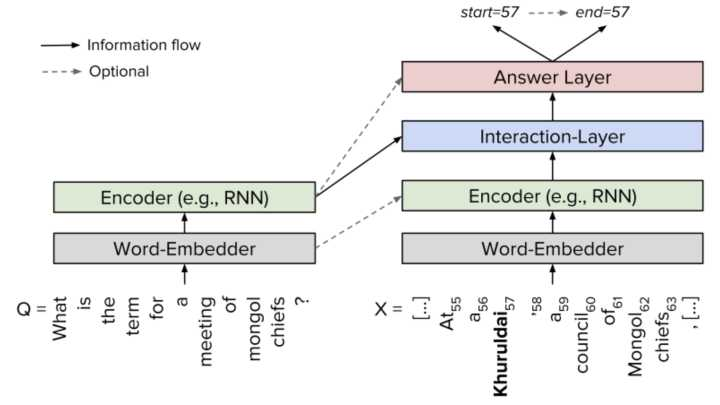
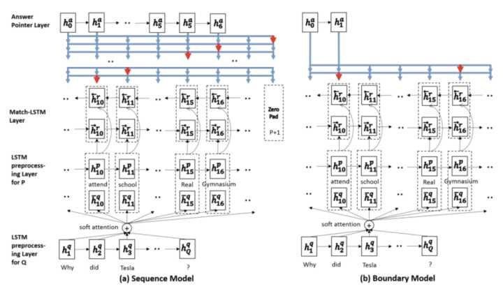
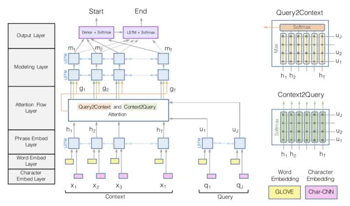
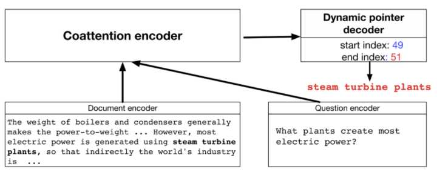
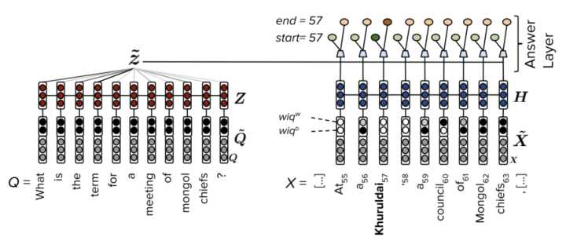
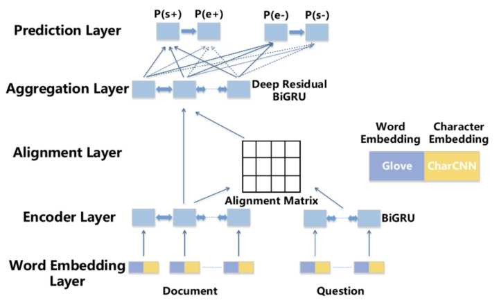
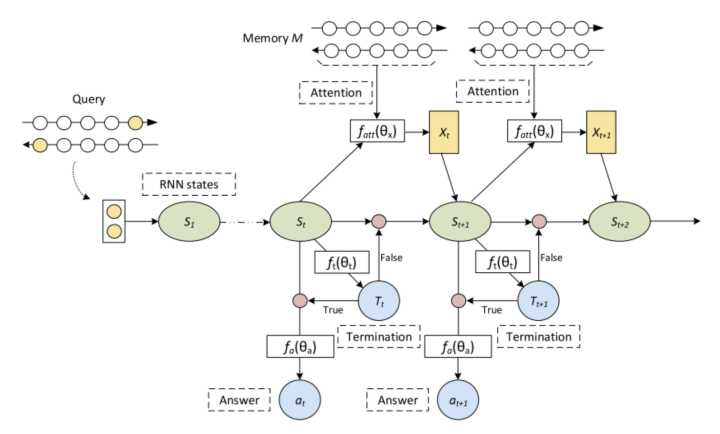
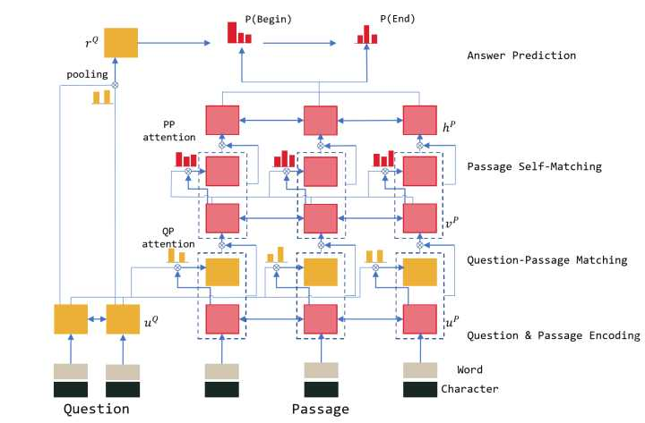

目录

<!-- TOC -->

- [1. SLQA](#1-slqa)
    - [1.1 整体思路](#11-整体思路)
    - [1.2 SLQA架构](#12-slqa架构)
- [2. 相关模型](#2-相关模型)
    - [2.1 基本模型](#21-基本模型)
    - [2.2 Match-LSTM[4]](#22-match-lstm4)
    - [2.3 BiDAF[5]](#23-bidaf5)
    - [2.4 Dynamic Coattention Network[6]](#24-dynamic-coattention-network6)
    - [2.5 Multi-Perspective Matching[7]](#25-multi-perspective-matching7)
    - [2.6 FastQAExt[8]](#26-fastqaext8)
    - [2.7 jNet[9]](#27-jnet9)
    - [2.8 Ruminating Reader[10]](#28-ruminating-reader10)
    - [2.9 ReasoNet[11]](#29-reasonet11)
    - [2.10 r-net[13]](#210-r-net13)
    - [2.11 Mnemonic Reader[14]](#211-mnemonic-reader14)
- [3. 小结](#3-小结)
- [4. 参考文献](#4-参考文献)

<!-- /TOC -->

参考 [机器阅读理解打破人类记录，解读阿里iDST SLQA技术](https://mp.weixin.qq.com/s?__biz=MzA3MzI4MjgzMw==&mid=2650736188&idx=2&sn=03793343fabba546cafd9540be0f8277&chksm=871ac242b06d4b54283e7926a91dd4aff8a9480acd4f79a57785822c080dc8e027da96b1d04f&mpshare=1&scene=1&srcid=0114a1kagAyjzKDjM5D8be80&pass_ticket=maZ8vJqYz24CXvI%2FR2qg58OsViKCicnkKXyOdUjO2Iy11TDgRJHxroNhcwnQ9Lne#rd)

SQuAD 数据集是行业内公认的机器阅读理解标准水平测试，也是该领域顶级赛事，被誉为机器阅读理解界的 ImageNet（图像识别领域的顶级赛事）。

SQuAD 是由 Rajpurkar 等人[1]提出的一个最新的阅读理解数据集。该数据集包含 10 万个（问题，原文，答案）三元组，原文来自于 536 篇维基百科文章，而问题和答案的构建主要是通过众包的方式，让标注人员提出最多 5 个基于文章内容的问题并提供正确答案，且答案出现在原文中。SQuAD 和之前的完形填空类阅读理解数据集如 CNN/DM[2]，CBT[3]等最大的区别在于：**SQuAD 中的答案不在是单个实体或单词，而可能是一段短语**，这使得其答案更难预测。SQuAD 包含公开的训练集和开发集，以及一个隐藏的测试集，其采用了与 ImageNet 类似的封闭评测的方式，研究人员需提交算法到一个开放平台，并由 SQuAD 官方人员进行测试并公布结果。

机器阅读理解的评测维度分为 EM（Exact Match，精准匹配分数）和 F1（精确率和召回率的平均，模糊匹配分数）。

## 1. SLQA

本次阿里巴巴参与测评的系统名为 SLQA，Semantic Learning for Question Answering，是 iDST NLP 团队提出的「基于分层融合注意力机制」的深度神经网络系统。评测证明，相比传统方法，SLQA 的效果取得了显著的提升。

采用传统方法解决机器阅读理解问题，一般会将该过程分为以下几个步骤：

+ 对问题、篇章分别进行词法、句法分析，针对分析结果进行特征提取：
+ 基于特征采用诸如 LR、CRF 等模型进行答案边界预测；
+ 采用梯度下降类算法在训练集上进行优化，拟合数据分布。

在此过程中，基础语言模型、依存分析等模块的准确率在一定程度上会影响训练效果，特征工程的优劣也同样左右着是否能训练得到可用的模型。

### 1.1 整体思路

人类在进行阅读理解时，常见思维顺序如下：

1. 通读篇章，理解文章主题和大体内容；读题，了解提问内容及关注点。
2. 带着问题找答案，将问题同篇章做关联，并结合篇章主题，理解问题重点。
3. 定位可能的答案范围，并再次重点阅读附近文字。
4. 为避免忘记问题，再次审题，并结合 3. 中重点区域进行答案圈选。
5. 针对挑出的答案候选进行精筛，确定最正确的答案。

因此，构建模型的主要思想是在捕捉**问题和文章中特定区域关联**的同时，借助分层策略，**逐步集中注意力**，使答案边界清晰。

同时，为了避免过于关注细节，**采用融合方式将全局信息加入注意力机制**，进行适度纠正，确保关注点正确。这种逐步聚焦并兼顾全局的方式与其他参赛者已经公布的的做法不太相同，也是团队此次刷榜登顶的关键所在。

### 1.2 SLQA架构

<html>
 

 
</html>

目前业界主流的基于 End2End 学习的机器阅读理解模型主要为**Encode-Interaction-Pointer框架**。

SLQA 系统包含如下基本结构：**Encoder Layer（文本表征）**，**Attention Layer（注意力机制）**，**Match Layer（问题篇章匹配）**以及 **Output Layer（答案预测）**。

+ **Encoder Layer**: 用于表示学习，可以理解为语言模型层，用以将篇章及问题从离散字符转变为蕴含语义的表征向量。团队采用了**多层双向 LSTM** 并分别对篇章和问题进行主题和重点词关注。
+ **Attention Layer**: 得到有效的问题及篇章表征后，为表达依据问题定位答案过程，缩小备选答案查找范围，将搜索空间通过注意力机制约束，主要进行**多层融合注意力表示**，对问题和篇章进行相关性对齐（Align），并不断补充全局信息（Fusion），每一次对齐都基于下层信息并在此基础上更加细化（paragraph→sentence→phrase→word），采用的方式分别为 **Co-Attention（篇章到问题，问题到篇章）**，**Self-Attention（问题自身，篇章自身）**。
+ **Match Layer**: 用于做融合信息后的问题和篇章匹配，团队采用**双线性矩阵**来学习经过多层信息过滤后的篇章和问题匹配参数，由于在前一阶段无关信息已经被过滤，最后的匹配可完成答案的定位工作。
+ **Output Layer**: 结合匹配信息对篇章中词汇进行标注，预测相应词汇是答案开始位置或结束位置的概率。之后，模型会抽取可能性最高的一段连续文本作为答案。

重点探索和研究的Layer是第三层（Hierarchical Attention Fusion Network）。

## 2. 相关模型

参考[PaperWeekly 第38期 \| SQuAD综述](https://zhuanlan.zhihu.com/p/27015318)

### 2.1 基本模型

由于 SQuAD 的答案限定于来自原文，模型只需要判断原文中哪些词是答案即可，因此是一种抽取式的 QA 任务而不是生成式任务。

几乎所有做 SQuAD 的模型都可以概括为同一种框架：Embed 层，Encode 层，Interaction 层和 Answer 层。
+ Embed 层负责将原文和问题中的 tokens 映射为向量表示；
+ Encode 层主要使用 RNN 来对原文和问题进行编码，这样编码后每个 token 的向量表示就蕴含了上下文的语义信息；
+ Interaction 层是大多数研究工作聚焦的重点，该层主要负责捕捉问题和原文之间的交互关系，并输出编码了问题语义信息的原文表示，即 query-aware 的原文表示；
+ 最后 Answer 层则基于 query-aware 的原文表示来预测答案范围。

<html>
 

 
</html>

### 2.2 Match-LSTM[4]

<html>
 

 
</html>

Match-LSTM 的 Answer 层包含了两种预测答案的模式，分别为 **Sequence Model** 和 **Boundary Model**。

+ Sequence Model 将答案看做是一个整数组成的序列，**每个整数表示选中的 token 在原文中的位置**，因此模型按顺序产生一系列条件概率，每个条件概率表示基于上轮预测的 token 产生的下个 token 的位置概率，**最后答案总概率等于所有条件概率的乘积。**
+ Boundary Model 简化了整个预测答案的过程，**只预测答案开始和答案结束位置**，相比于 Sequence Model 极大地缩小了搜索答案的空间，最后的实验也显示简化的 Boundary Model 相比于复杂的 Sequence Model 效果更好，因此 Boundary Model 也成为后来的模型用来预测答案范围的标配。

主要步骤如下：

1. Embed 层使用词向量表示原文和问题；
2. Encode 层使用单向 LSTM 编码原文和问题 embedding；
3. Interaction 层对**原文中每个词，计算其关于问题的注意力分布**，并使用该注意力分布汇总问题表示，将原文该词表示和对应问题表示输入另一个 LSTM 编码，得到该词的 query-aware 表示；
4. 在反方向重复步骤 2，获得双向 query-aware 表示；
5. Answer 层基于双向 query-aware 表示使用 Sequence Model 或 Boundary Model 预测答案范围。

### 2.3 BiDAF[5]

<html>
 

 
</html>

相比于之前工作，BiDAF（Bi-Directional Attention Flow）最大的改进在于 Interaction 层中引入了双向注意力机制，即首先计算一个**原文和问题的 Alignment matrix**，然后基于该矩阵计算 **Query2Context 和 Context2Query 两种注意力**，并基于注意力计算 **query-aware 的原文表示**，接着使用双向 LSTM 进行语义信息的聚合。另外，其 Embed 层中混合了**词级 embedding 和字符级 embedding**，词级 embedding 使用预训练的词向量进行初始化，而**字符级 embedding 使用 CNN 进一步编码**，两种 embedding 共同经过 2 层 Highway Network 作为 Encode 层输入。最后，BiDAF 同样使用 **Boundary Model** 来预测答案开始和结束位置。

代码：[https://github.com/allenai/bi-att-flow](https://github.com/allenai/bi-att-flow)

### 2.4 Dynamic Coattention Network[6]

<html>
 

 
</html>

DCN 最大的特点在于 Answer 层，其 **Answer 层使用了一种多轮迭代 pointing 机制**，**每轮迭代都会产生对答案开始和结束位置的预测**，并**基于这两个预测使用 LSTM 和 Highway Maxout Network 来更新下一轮的答案范围预测**。而在 Interaction 层，DCN 使用和 BiDAF 类似的**双向注意力机制计算 query-aware 的原文表示**。

### 2.5 Multi-Perspective Matching[7]

<html>
 

 
</html>

Multi-Perspective Matching 在 Encode 层同样使用 char, word 两个 embedding，只不过 char embedding 使用 LSTM 进行编码。在 Encode 层之前，该模型使用一个过滤操作，作用是**过滤掉那些和问题相关度低的原文词。**该模型最大的特点在 Interaction 层，该层针对**每个原文词使用一种 multi-perspective 的匹配函数计算其和问题的匹配向量**，并**使用 BiLSTM 来进一步聚合这些匹配向量**。匹配的形式包括**每个原文词和整个问题的表示匹配**，**每个原文词和每个问题词匹配后进行最大池化**，和**每个原文词和每个问题词匹配后进行平均池化**。最后在 Answer 层，基于匹配向量聚合表示使用两个前馈网络来预测答案开始和结束位置。

### 2.6 FastQAExt[8]

<html>
 

 
</html>

FastQAExt 使用了一种轻量级的架构，其 Embed 层除了 word 和 char 两种 embeeding 作为输入以外，还额外使用了两个特征：

1. binary 特征表示**原文词是否出现在问题中**；
2. weighted 特征表示**原文词对于问题中所有词的相似度。**

并且这两个特征**同样用在了问题词上**。

在 Interaction 层，FastQAExt 使用了两种轻量级的信息 fusion 策略：

1. **Intra-Fusion**，即**每个原文词**和**其他原文词**计算相似度，并汇总得到**原文总表示**，接着将**该原文词**和**对应原文总表示**输入 **Highway Networks** 进行聚合，聚合后原文词表示进一步和上下文词表示进行类似的聚合；
2. **Inter-Fusion**，即对**每个原文词**计算和**问题词**的相似度，并汇总得到**问题总表示**，接着将**该原文词**和**对应问题总表示**输入 **Highway Networks** 进行聚合，得到 **query-aware** 原文表示。

此外，在 Answer 层，FastQAExt 首先计算了一个**问题的总表示**，接着将 **query-aware 原文表示**和**问题总表示**共同输入两个前馈网络产生答案**开始和结束位置概率**。在确定答案范围时，FastQAExt 使用了 Beam-search。

### 2.7 jNet[9]

<html>
 

 
</html>

jNet 的 baseline 模型和 BiDAF 类似，其在 Interaction 层除了对每个原文词计算一个对应的问题表示以外，还将 **Alignment Matrix** 按**原文所在维度进行池化（最大池化和平均池化）**，池化后的值表示原文各词的重要程度，因此**基于该值对原文表示进行过滤**，剔除不重要的原文词。在 Answer 层，jNet 不仅先预测答案开始位置再预测答案结束位置，还**反向地先预测答案结束位置再预测答案开始位置**。最后**对两方向概率求平均后作为总概率输出。**

jNet 的最大创新在于对问题的理解和适应。为了在编码问题表示时**考虑句法信息**，jNet 使用 **TreeLSTM** 对问题进行编码，并将编码后表示作为 Interaction 层的输入。为了对不同问题进行适应，jNet **首先使用了问题类型的 embedding**，将该 embeeding 作为 Interaction 层输入。

另外，jNet 定义了**K 个 cluster 的中心向量，每个 cluster model 了一个特定的问题类型**比如"when","where"等，接下来的适应算法分为两步：adapting 和 updating。
+ Adapting 指**根据问题总表示和 K 个 cluster 的相似度来更新出一个新的问题表示**，并输入 Interaction 层；
+ Updating 层旨在**修改 K 个 cluster 的中心以令每个 cluster 可以 model 不同类型的问题**。

### 2.8 Ruminating Reader[10]

<html>
 

 
</html>

Ruminating Reader 是 BiDAF 的改进和扩展，它将之前的单 Interaction 层扩展为了**双 Interaction 层**。

+ **第一个 Interaction 层**和 BiDAF 的 Interaction 层相同，**输出 query-aware 的原文表示**。query-aware 原文表示经过一个**双向 LSTM** 编码，其输出的**最后一位隐层状态**作为 **query-aware 原文表示的总结**。接着，该**总结向量**依次与**各原文词表示**和**各问题词表示**经过一个 **Highway Network** 处理，以将总结向量的信息**重新融入原文和问题表示**当中。
+ 最后，基于更新后的原文和问题表示，使用**第二个 Interaction** 层来捕捉它们之间的交互，并生成**新的 query-aware 的原文表示**。Ruminating Reader 的 Embed 层，Encode 层和 Answer 层和 BiDAF 相同。

### 2.9 ReasoNet[11]

<html>
 

 
</html>

**【使用强化学习进行训练】**

和之前介绍的 Embed-Encode-Interaction-Answer 框架不同，ReasoNet 使用了 **Memory Networks** 的框架[12]。在使用 BiRNN 编码问题和原文后，**问题**的**最后一位隐层状态**初始化为一个**中间状态 s**，而**原文和问题表示**作为 **Memory**。接下来是一个**多轮迭代**的过程，在每一轮迭代中，**中间状态 s** 首先经过一个**逻辑回归函数**来输出一个 **binary random variable t**，**t 为真，那么 ReasoNet 停止**，并且**用当前中间状态 s 输出到 Answer 模块产生对答案的预测**；否则，**中间状态 s** 会和 **Memory（原文和问题）**中**每一位表示**计算**注意力**，并**基于注意力**求**原文**和**问题**的**加权表示** x，x 和 s 共同作为一个 RNN 的输入，**产生新的中间状态 s 并进入下一轮迭代**。由于出现了 binary random variable，ReasoNet **使用了强化学习的方法**进行训练。

### 2.10 r-net[13]

<html>
 

 
</html>

r-net 同样使用了**双 Interaction 层**架构，其第一 Interaction 层负责捕捉**原文和问题之间的交互信息**，而第二 Interaction 层负责捕捉**原文内部各词之间的交互信息**。具体来说，

+ 在第一 Interaction 层，r-net 首先使用了**类似于 Match-LSTM 的方法**，即对**原文中每个词**，计算其**关于问题**的**注意力分布**，并使用该注意力分布**汇总问题表示**，将**原文该词表示**和**对应问题表示**输入 **RNN** 编码，得到**该词的 query-aware 表示**。不同的是，在原文词表示和对应问题表示输入 RNN 之前，r-net **使用了一个额外的门来过滤不重要的信息**。
+ 接着，在第二 Interaction 层，r-net 使用了同样的策略来将 **query-aware 表示**进一步**和自身进行匹配**，将**回答答案所需的证据和问题信息进行语义上的融合**，得到**最终的原文表示**。

在其他方面，r-net 的 Embed 层同样使用了 **word 和 char 两种 embedding** 以丰富输入特征。在 Answer 层，r-net 首先使用一个 **attention-pooling 的问题向量**作为一个 RNN 的初始状态，该 RNN 的状态和**最终的原文表示**共同输入一个 **pointer networks** 以产生答案开始概率，接着**基于开始概率**和**原文表示**产生**另一个 attention-pooling 向量**，该向量和 **RNN 状态**共同经过一次 **RNN 更新后得到 RNN 的新状态**，并**基于新状态来预测答案结束概率**。

### 2.11 Mnemonic Reader[14]

<html>
 

 
</html>

相比于之前的工作，Mnemonic Reader 同样使用了类似于 r-net 和 Ruminating Reader 的**两层 Interaction 层**设计。其中第一个 Interaction 层负责**捕捉原文和问题之间**的交互信息，第二 Interaction 层负责**捕捉原文内部的长时依赖**信息。不同于 r-net 的是，**r-net 使用了单向注意力+门机制**来编码这些交互信息，而 Mnemonic Reader **使用了双向注意力机制来编码**交互信息，因此能够捕捉更加细粒度的语义信息。

在 Answer 层，我们使用**对问题敏感**的表示方法，具体来说，问题表示分为两种：**显式的问题类型 embedding** 和**隐式的问题向量**表示。

进一步地，我们使用了 **Memory Network**[12] 的框架来预测答案范围，将**问题表示**作为一个**可更新的记忆向量**，在每次预测答案概率后**将候选答案信息更新至记忆向量中**。该过程**可以持续多轮**，因此可以**根据之前预测信息来不断修正当前预测，直到产生正确的答案范围。**

## 3. 小结

+ **大规模语料集**的构建是推进机器阅读理解发展的重要前提。从 15 年提出的 CNN/DM 完形填空数据集，到近期的 SQuAD 数据集，再到之后的若干新数据集，每一个新数据集都提出了当前方法无法有效解决的新问题，从而促使研究人员不断探索新的模型，促进了该领域的发展。
+ 针对**抽取式阅读理解任务**，可以看到有如下几个技术创新点: 
    + 建立在单向或双向注意力机制上的 Interaction 层对于模型理解原文和问题至关重要，而[10]，[13]和[14]中**更复杂的双 Interaction 层设计**无疑要优于之前的单 Interaction 层设计，原因是在**问题-原文交互层**之上的**原文自交互层**使得更多的语义信息能在原文中流动，因此在某种程度上部分解决了长文本中存在的长时依赖问题。
    + **多轮推理机制**如[6]，[11]和[14]对于回答复杂问题具备一定帮助，尤其是针对 SQuAD 中的答案不是一个单词而可能是一个短语的情况，多轮推理机制可以不断缩小预测范围，最终确定正确答案位置。
    + **对问题敏感的问题表示方法**[9]，[14]能够更好地 model **各类型问题**，并根据问题类型聚焦于原文中的特定单词，比如 when 类问题更加聚焦于原文中的时间信息，而 where 类问题更关注空间信息。

## 4. 参考文献

[1] Pranav Rajpurkar, Jian Zhang, Konstantin Lopyrev, and Percy Liang. 2016. Squad: 100,000+ questions for machine comprehension of text. In Proceedings of EMNLP.

[2] Karl Moritz Hermann, Tomas Kocisky, Edward Grefenstette, Lasse Espeholt, Will Kay, Mustafa Suleyman, , and Phil Blunsom. 2015. Teaching ma- chines to read and comprehend. In Proceedings of NIPS.

[3] Felix Hill, Antoine Bordes, Sumit Chopra, and Jason Weston. 2016. The goldilocks principle: Reading childrens books with explicit memory representa- tions. In Proceedings of ICLR.

[4] Shuohang Wang and Jing Jiang. 2017. Machine comprehension using match-lstm and answer pointer. In Proceedings of ICLR.

[5] Minjoon Seo, Aniruddha Kembhavi, Ali Farhadi, and Hananneh Hajishirzi. 2017. Bidirectional attention flow for machine comprehension. In Proceedings of ICLR.

[6] Caiming Xiong, Victor Zhong, and Richard Socher. 2017. Dynamic coattention networks for question answering. In Proceedings of ICLR.

[7] Zhiguo Wang, Haitao Mi, Wael Hamza, and Radu Florian. 2016. Multi-perspective context matching for machine comprehension. arXiv preprint arXiv:1612.04211 .

[8] Dirk Weissenborn, Georg Wiese, and Laura Seiffe. 2017. Fastqa: A simple and efficient neural architecture for question answering. arXiv preprint arXiv:1703.04816 .

[9] Junbei Zhang, Xiaodan Zhu, Qian Chen, Lirong Dai, Si Wei, and Hui Jiang. 2017. Exploring question understanding and adaptation in neural- network-based question answering. arXiv preprint arXiv:1703.04617 .

[10] Yichen Gong and Samuel R. Bowman. 2017. Ruminating reader: Reasoning with gated multi-hop attention. arXiv preprint arXiv:1704.07415 .

[11] Yelong Shen, Po-Sen Huang, Jianfeng Gao, and Weizhu Chen. 2016. Reasonet: Learning to stop reading in machine comprehension. arXiv preprint arXiv:1609.05284 .

[12] Sainbayar Sukhbaatar, Arthur Szlam, Jason Weston, and Rob Fergus. 2015. End-to-end memory networks. In Proceedings of NIPS.

[13] Microsoft Research Asia. 2017. R-NET: MACHINE READING COMPREHENSION WITH SELF-MATCHING NETWORKS. In Proceedings of ACL.

[14] Minghao Hu, Yuxing Peng, and Xipeng Qiu. 2017. Mnemonic Reader for Machine Comprehension. arXiv preprint arXiv:1705.02798 .