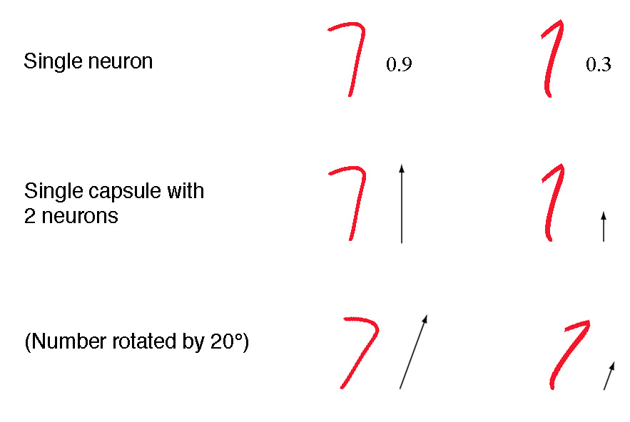
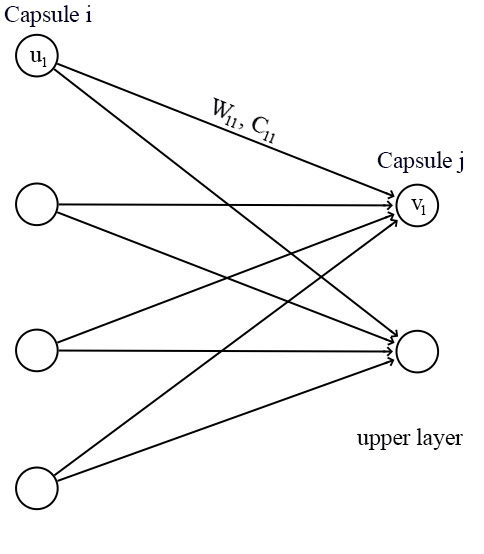
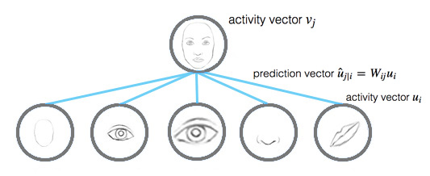
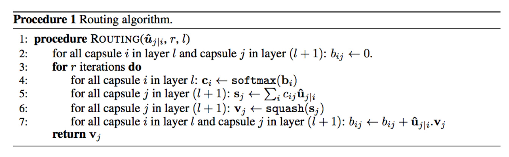
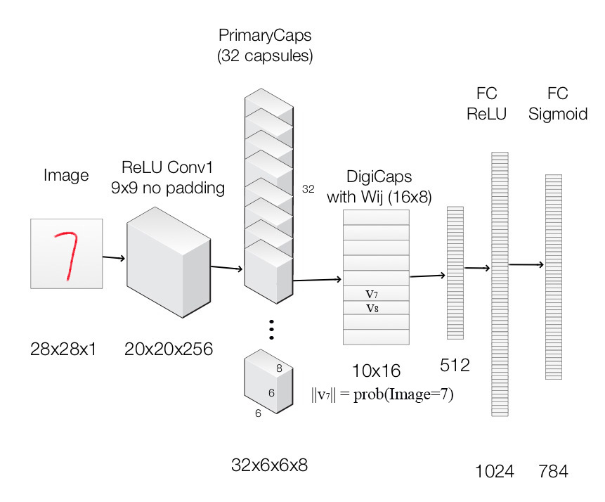

目录

<!-- TOC -->

- [1. cnn-challenges](#1-cnn-challenges)
- [2. equivariance](#2-equivariance)
- [3. capsule](#3-capsule)
- [4. dynamic-routing](#4-dynamic-routing)
    - [4.1 intuition](#41-intuition)
    - [4.2 calculating-a-capsule-output](#42-calculating-a-capsule-output)
- [5. iterative-dynamic-routing](#5-iterative-dynamic-routing)
- [6. max-pooling-shortcoming](#6-max-pooling-shortcoming)
- [7. significant-of-routing-by-agreement-with-capsules](#7-significant-of-routing-by-agreement-with-capsules)
- [8. capsnet-architecture](#8-capsnet-architecture)
- [9. loss-function-margin-loss](#9-loss-function-margin-loss)
- [10. capsnet-model](#10-capsnet-model)
    - [10.1 primarycapsules](#101-primarycapsules)
    - [10.2 squash-function](#102-squash-function)
    - [10.3 digicaps-with-dynamic-routing](#103-digicaps-with-dynamic-routing)
    - [10.4 image-reconstruction](#104-image-reconstruction)
    - [10.5 reconstruction-loss](#105-reconstruction-loss)
- [11. what-capsule-is-learning](#11-what-capsule-is-learning)
- [12. sarasra的代码](#12-sarasra的代码)
    - [12.1 Quick mnist test results：](#121-quick-mnist-test-results)
    - [12.2 Quick CIFAR10 ensemble test results](#122-quick-cifar10-ensemble-test-results)
    - [12.3 训练](#123-训练)
    - [12.4 训练+验证](#124-训练验证)
- [13. 源码解析](#13-源码解析)

<!-- /TOC -->

**代码**：
[https://github.com/Sarasra/models/tree/master/research/capsules](https://github.com/Sarasra/models/tree/master/research/capsules)

paper:
[Dynamic Routing Between Capsules](https://arxiv.org/pdf/1710.09829.pdf)

参考 [Hinton胶囊网络代码正式开源，5天GitHub fork超1.4万](https://mp.weixin.qq.com/s?__biz=MzI3MTA0MTk1MA==&mid=2652012657&idx=1&sn=6e7c8bb25d41e7c73682fc6e539c0e1c&chksm=f121f480c6567d969b1e48f649665d8c5d5122559641b944f37535846c77f645e9f435189b3d&mpshare=1&scene=1&srcid=0201iw6QfDNUP6ejcN6Cp4L5&pass_ticket=qs99iMGY1jAAqC7Y%2F5bWFAKdSVWrNCDdPaLjWTEyZ612ZoU1cwNmbIOusMI23vOr#rd)


本文主要参考jhui的博客：
[https://jhui.github.io/2017/11/03/Dynamic-Routing-Between-Capsules/](https://jhui.github.io/2017/11/03/Dynamic-Routing-Between-Capsules/)

## 1. cnn-challenges

**神经元的激活水平**通常被解释为**检测特定特征**的可能性【例如，如果图中蓝色的比例很高，可能某个神经元的激活值就特别大】。

CNN善于**检测特征**，却在探索**特征（视角，大小，方位）之间**的**空间关系**方面效果较差。(一个简单的CNN模型可以正确提取鼻子、眼睛和嘴巴的特征，但如果一张图里，鼻子和眼睛错位了，或者一只眼睛倾斜了一定的角度，那这张图仍然有可能错误地激活神经元导致认为这张图就是人脸)

假设每个神经元都包含特征的**可能性**和**属性**【**这里就叫做胶囊(capsule)了，也就是说，里面包含的不是一个值(a single scaler value)，而是一个向量(vector)**】。例如，神经元输出的是一个包含**[可能性，方向，大小]**的向量。利用这种空间信息，就可以检测鼻子、眼睛和耳朵特征之间的方向和大小的一致性。此时，上面那张图对于人脸检测的激活输出就会低很多。

## 2. equivariance

为了CNN能够处理不同的视角或变体，我们添加了**更多**的神经元和层。尽管如此，这种方法倾向于记忆数据集，而不是得出一个比较通用的解决方案，它需要**大量的训练数据来覆盖不同的变体，并避免过拟合**。MNIST数据集包含55,000个训练数据，也即每个数字都有5,500个样本。但是，儿童看过几次就能记住数字。现有的包括CNN在内的深度学习模式在**利用数据方面效率十分低下**。

胶囊网络不是训练来捕捉特定变体的特征，而是捕捉特征及其变体的可能性。所以胶囊的目的不仅在于**检测特征**，还在于**训练模型**来**学习变体**。

这样，**相同的胶囊**就可以检测**不同方向**的**同一个物体类别**。

+ **Invariance**对应**特征检测**，特征是不变的。例如，**检测鼻子的神经元不管什么方向，都检测鼻子**。但是，神经元空间定向的损失最终会损害这种invariance模型的有效性。
+ **Equivariance**对应**变体检测**，也即可以相互转换的对象（例如检测不同方向的人脸）。直观地说，胶囊网络**检测到脸部旋转了20°**，而不是实现与旋转了20°的变体相匹配的脸。通过强制模型学习胶囊中的特征变体，我们可以**用较少的训练数据**，**更有效地推断可能的变体**。此外，也可以更有效地**防止对抗攻击**。

## 3. capsule

胶囊是**一组**神经元，不仅捕捉**特征的可能性**，还捕捉**具体特征的参数**。

<html>
<br/>

<br/>
</html>

第一行表示神经元检测到数字“7”的概率。2-D胶囊是组合了2个神经元的网络。这个胶囊在检测数字“7”时输出2-D向量。

第二行中的第一个图像，它输出一个向量`\(v = (0, 0.9)\)`，向量的模是`\(\| v \| = \sqrt{ 0^2 + 0.9^2 } = 0.9\)`。

在第三行，旋转图像20°。胶囊将产生具有**相同幅度**但**不同方向**的矢量。这里，矢量的角度表示数字“7”的旋转角度。

最后，还可以添加2个神经元来捕捉大小和笔画的宽度(如下图)。

<html>
<br/>

<br/>
</html>

我们称胶囊的**输出向量**为活动向量(**activity vector**) ，其**幅度(模)**代表**检测特征的概率**，其**方向**代表其**参数**（属性）。

## 4. dynamic-routing

### 4.1 intuition

假设有3张类似但大小、方向不同的人脸图，嘴巴和眼睛的capsule分别记录了嘴巴和眼睛的水平方向的宽度（当然，也可以加上别的，例如高度、颜色等）。在dynamic routing中，将input capsules的vectors通过一个变换矩阵**（transformation matrix）**转换成一个**vote**，并且将**相似vote**的capsules分为**同一组**。这些**votes**最终成为**parent capsule**的**output vector**。

### 4.2 calculating-a-capsule-output

对于capsule网络，一个capsule的输入`\(u_i\)`和`\(v_j\)`都是向量。

<html>
<br/>

<br/>
</html>

我们将一个变换矩阵（transformation matrix）`\(W_{ij}\)`应用到前一层的输出`\(u_i\)`上，例如，使用一个`\(m\times k\)`的矩阵，将`\(k\times D\)`的`\(u_i\)`变成一个`\(m\times D\)`的`\(\hat u_{j|i}\)`。

然后计算`\(c_{ij}\)`和`\(\hat u_{j|i}\)`的加权和，得到`\(s_j\)`：

`\[
\\ \hat u_{j|i}=W_{ij}u_i
\\ s_j=\sum_i c_{ij}\hat u_{j|i}
\]`

其中，`\(c_{ij}\)`是迭代动态路由过程（iterative dynamic routing process）训练的**耦合系数**（coupling coefficients），而且`\(\sum_jc_{ij}=1\)`。

这里不适用ReLU，而使用一个**挤压函数（squashing function）**，来缩短0和单位长度之间的向量：

`\[
v_j=\frac{||s_j||^2}{1+||s_j||^2}\frac{s_j}{||s_j||}
\]`

挤压函数能够**将短向量缩小到接近0**，**将长向量缩小为接近单位向量**。因此，每个capsule的似然性在**0到1之间**。

`\[
\\ v_j\approx ||s_j||s_j,\ for\ s_j\ is\ short
\\ v_j\approx \frac{s_j}{||s_j||},\ for\ s_j\ is\ long
\]`

## 5. iterative-dynamic-routing

在深度学习中，我们使用反向传播来训练模型参数。转换矩阵`\(W_{ij}\)`在胶囊中仍然用**反向传播**训练。不过，耦合系数`\(c_{ij}\)` 用新的**迭代动态路由方法**进行计算。

<html>
<br/>

<br/>
</html>

伪代码如下：

<html>
<br/>

<br/>
</html>

在深度学习中，我们使用反向传播来训练基于成本函数的模型参数。这些参数（权重）控制信号从一层到另一层的路由。如果两个神经元之间的权重为零，则神经元的激活不会传播到该神经元。

迭代动态路由提供了如何**根据特征参数**来**路由信号**的替代方案。通过利用特征参数，理论上，可以**更好地将胶囊分组**，形成一个**高层次的结构**。例如，胶囊层可能最终表现为**探索“部分-整体”关系的分析树**。例如，脸部由眼睛、鼻子和嘴组成。迭代动态路由利用变换矩阵、可能性和特征的性质，控制向上传播到上面胶囊的信号的多少。


## 6. max-pooling-shortcoming

## 7. significant-of-routing-by-agreement-with-capsules

## 8. capsnet-architecture

使用CapsNet进行mnist任务

<html>
<br/>

<br/>
</html>

每一层的说明(capsule层使用convolution kernel来explore locality information)：

<html>
<center>
<table border="2" cellspacing="0" cellpadding="6" rules="all" frame="border">

<thead>
<tr>
<th scope="col" class="left">Layer Name</th>
<th scope="col" class="left">Apply</th>
<th scope="col" class="left">Output shape</th>
</tr>
</thead>

<tbody>
<tr>
<td class="left">Image</td>
<td class="left">Raw image array</td>
<td class="left">28x28x1</td>
</tr>

<tr>
<td class="left">ReLU Conv1</td>
<td class="left">Convolution layer with 9x9 kernels output 256 channels, stride 1, no padding with ReLU	</td>
<td class="left">20x20x256</td>
</tr>

<tr>
<td class="left">PrimaryCapsules</td>
<td class="left">Convolution capsule layer with 9x9 kernel output 32x6x6 8-D capsule, stride 2, no padding</td>
<td class="left">6x6x32x8</td>
</tr>

<tr>
<td class="left">DigiCaps</td>
<td class="left">Capsule output computed from a (16x8 matrix) between and ( from 1 to 32x6x6 and from 1 to 10).</td>
<td class="left">10x16</td>
</tr>

<tr>
<td class="left">FC1</td>
<td class="left">Fully connected with ReLU</td>
<td class="left">512</td>
</tr>

<tr>
<td class="left">FC2</td>
<td class="left">Fully connected with ReLU</td>
<td class="left">1024</td>
</tr>

<tr>
<td class="left">Output image</td>
<td class="left">Fully connected with sigmoid</td>
<td class="left">784(28x28)</td>
</tr>

</tbody>
</table></center>
</html>

## 9. loss-function-margin-loss

## 10. capsnet-model

### 10.1 primarycapsules

### 10.2 squash-function

### 10.3 digicaps-with-dynamic-routing

### 10.4 image-reconstruction

### 10.5 reconstruction-loss

## 11. what-capsule-is-learning

## 12. sarasra的代码

要求：tf/numpy/gpu

测试：

```shell
python layers_test.py
```

### 12.1 Quick mnist test results：

+ 下载tfrecords，并解压到```$DATA_DIR/```

```shell
wget https://storage.googleapis.com/capsule_toronto/mnist_data.tar.gz
```

+ 下载model checkpoint，并解压到```$CKPT_DIR```

```shell
wget https://storage.googleapis.com/capsule_toronto/mnist_checkpoints.tar.gz
```

+ 测试

```shell
python experiment.py --data_dir=$DATA_DIR/mnist_data/ --train=false \
--summary_dir=/tmp/ --checkpoint=$CKPT_DIR/mnist_checkpoint/model.ckpt-1
```

### 12.2 Quick CIFAR10 ensemble test results

+ 下载cifar10 binary version，并解压到```$DATA_DIR/```

```shell
wget  https://www.cs.toronto.edu/~kriz/cifar.html
```

+ 下载cifar10 model checkpoints，并解压到```$CKPT_DIR```

```shell
wget https://storage.googleapis.com/capsule_toronto/cifar_checkpoints.tar.gz
```

+ 测试

```shell
python experiment.py --data_dir=$DATA_DIR --train=false --dataset=cifar10 \
--hparams_override=num_prime_capsules=64,padding=SAME,leaky=true,remake=false \
--summary_dir=/tmp/ --checkpoint=$CKPT_DIR/cifar/cifar{}/model.ckpt-600000 \
--num_trials=7
```

### 12.3 训练

+ mnist

```shell
python experiment.py --data_dir=$DATA_DIR --dataset=cifar10 --max_steps=600000\
--hparams_override=num_prime_capsules=64,padding=SAME,leaky=true,remake=false \
--summary_dir=/tmp/
```

+ mnist baseline

```shell
python experiment.py --data_dir=$DATA_DIR/mnist_data/ --max_steps=300000\
--summary_dir=/tmp/attempt1/ --model=baseline
```

+ cifar

```shell
python experiment.py --ata_dir=$DATA_DIR/mnist_data/ --max_steps=300000\
--summary_dir=/tmp/attempt0/
```

### 12.4 训练+验证

训练时在验证集上验证：

+ ```--validate=true```
+ 需要两个gpu：一个训练；一个验证
+ 如果两个job都在同一台机器，需要限制每个job的RAM大小，因为 TensorFlow will fill all your RAM for the session of your first job and your second job will fail

```shell
python experiment.py --data_dir=$DATA_DIR/mnist_data/ --max_steps=300000\
--summary_dir=/tmp/attempt0/ --train=false --validate=true
```

测试/训练 MultiMNIST:

```shell
--num_targets=2
--data_dir=$DATA_DIR/multitest_6shifted_mnist.tfrecords@10
```

生成multiMNIST/MNIST records的代码：

```shell
input_data/mnist/mnist_shift.py
```

generate multiMNIST test split的代码：

```shell
python mnist_shift.py --data_dir=$DATA_DIR/mnist_data/ --split=test --shift=6 
--pad=4 --num_pairs=1000 --max_shard=100000 --multi_targets=true
```

build expanded_mnist for affNIST generalizability：

```shell
--shift=6 --pad=6
```

## 13. 源码解析

参考[Capsule官方代码开源之后，机器之心做了份核心代码解读](https://mp.weixin.qq.com/s?__biz=MzA3MzI4MjgzMw==&mid=2650737203&idx=1&sn=43c2b6f0e62f8c4aa3f913aa8b9c9620&chksm=871ace4db06d475be8366969d74c4b2250602f5e262a3f97a5faf2183e53474d3f9fd6763308&mpshare=1&scene=1&srcid=0206E7CpxZFlD3UayCkIu2Pk&pass_ticket=eOgGMWWl1n%2B%2FqN%2BBmdlJBRG9MYce7eTK6SlPMr8UGO1IWGU8J0lq%2Bggu9PIzKO2r#rd)