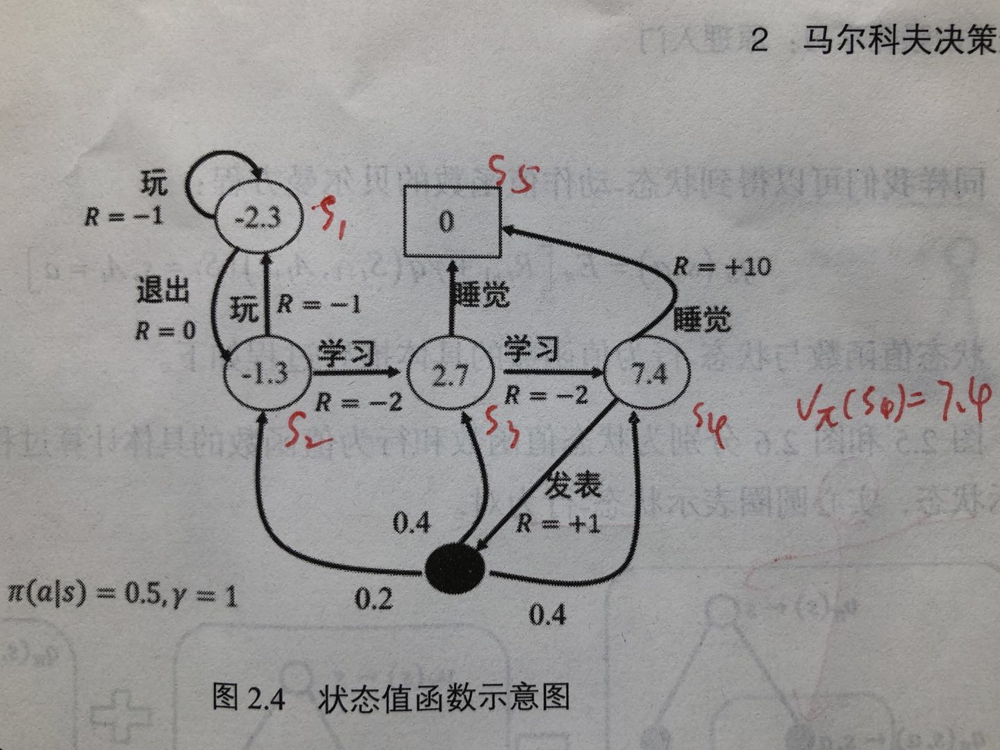

目录

<!-- TOC -->

- [1. 马尔科夫决策过程理论](#1-马尔科夫决策过程理论)
    - [1.1 马尔科夫性](#11-马尔科夫性)
    - [1.2 马尔科夫过程](#12-马尔科夫过程)
    - [1.3 马尔科夫决策过程](#13-马尔科夫决策过程)
    - [1.4 状态值函数与状态-行为值函数](#14-状态值函数与状态-行为值函数)
    - [1.5 状态值函数与状态-行为值函数的贝尔曼方程](#15-状态值函数与状态-行为值函数的贝尔曼方程)
    - [1.6 最优状态值函数与最优状态-行为值函数及其贝尔曼最优方程](#16-最优状态值函数与最优状态-行为值函数及其贝尔曼最优方程)
    - [1.7 强化学习形式化描述](#17-强化学习形式化描述)
- [2. MDP中的概率学基础](#2-mdp中的概率学基础)
    - [2.1 期望与方差](#21-期望与方差)
        - [期望](#期望)
        - [方差](#方差)
    - [2.2 随机策略](#22-随机策略)
        - [2.2.1 贪婪策略](#221-贪婪策略)
        - [2.2.2 `\(\varepsilon -greedy\)`策略](#222-\\varepsilon--greedy\策略)
        - [2.2.3 高斯策略](#223-高斯策略)
        - [2.2.4 玻尔兹曼分布](#224-玻尔兹曼分布)
- [3. 基于gym的MDP实例](#3-基于gym的mdp实例)

<!-- /TOC -->

参考**《深入浅出强化学习》**

## 1. 马尔科夫决策过程理论

### 1.1 马尔科夫性

系统的下一个状态`\(s_{t+1}\)`**仅与当前状态`\(s_t\)`有关**，与之前的状态无关。

定义：状态`\(s_t\)`是马尔科夫的，当且仅当`\(P[s_{t+1}|s_t]=P[s_{t+1}|s_1,...,s_t]\)`。

随机过程就是随机变量序列。如果随机变量序列的**每个状态**都是**马尔科夫**的，那么此随机过程就是**马尔科夫随机过程**。

### 1.2 马尔科夫过程

马尔科夫过程是一个二元组`\((S,P)\)`，且满足：`\(S\)`是有限状态集合，`\(P\)`是状态转移概率。状态转移概率矩阵如下：

`\[
P=\begin{bmatrix}
P_{11} & ... & P_{1n} \\ 
\vdots  & \vdots  & \vdots \\ 
P_{n1} & ... & P_{nn}
\end{bmatrix}
\]`

由若干个状态组成的序列称为马尔科夫链。当给定状态转移概率时，从某个状态出发存在多条马尔科夫链。

### 1.3 马尔科夫决策过程

马尔科夫决策过程由元组`\((S,A,P,R,\gamma)\)`描述，其中：

+ `\(S\)`为有限的状态集
+ `\(A\)`为有限的动作集
+ `\(P\)`为状态转移概率
+ `\(R\)`为回报函数
+ `\(\gamma\)`为**折扣因子**，用于计算**累积回报**

区别于马尔科夫过程，马尔科夫决策过程的**态转移概率**是**包含动作**的，即`\(P^a_{ss'}=P[S_{t+1}=s'|S_t=s,A_t=a]\)`。

强化学习的目标是给定一个马尔科夫决策过程，寻找最优策略。**策略**指的是，**状态到动作的映射**，用符号`\(\pi\)`表示，给定状态`\(s\)`时，动作集上的一个分布，即：

`\[
\pi (a|s)=p[A_i=a|S_t=s]
\]`

含义是，策略`\(\pi\)`在每个状态`\(s\)`指定一个动作概率。如果给出的策略`\(\pi\)`是确定性的，那么策略`\(\pi\)`在每个状态`\(s\)`指定一个确定的动作。注，`\(\sum _{a\in A}\pi(s,a)=1\)`

概率在强化学习中的作用：

+ 强化学习的策略往往是随机策略。可以将**探索**耦合到**采样**的过程中。**探索，指机器人尝试其他动作以便找到更好的策略**。
+ 实际应用中，存在各种噪声，这些噪声大都服从正态分布，可以用概率的知识**去掉噪声**。

**给定一个策略`\(\pi\)`**时，可以计算**累积回报**：

`\[
G_t=R_{t+1}+\gamma R_{t+2}+...=\sum _{k=0}^{\infty }\gamma ^kR_{i+k+1}
\]`

当给定策略`\(\pi\)`时，假设从状态`\(s_t\)`出发，可能有很多个状态序列，所以对应的`\(G_t\)`也有多个可能值。为了评价状态`\(s_t\)`的价值，需要一个确定的量来描述。而**累积回报`\(G_t\)`是一个随机变量**，不是确定值，但其**期望**是一个**确定值**，因此可以做为状态值函数的定义。

### 1.4 状态值函数与状态-行为值函数

当智能体**采用策略`\(\pi\)`时**，累积回报服从一个分布，**累积回报**在**状态`\(s\)`处的期望值**定义**状态值函数**：

`\[
\upsilon _{\pi}(s)=E_{\pi}[\sum _{k=0}^{\infty }\gamma ^kR_{t+k+1}|S_t=s]
\]`

注：**状态值函数是与策略`\(\pi\)`相对应的**，因为策略`\(\pi\)`决定了累积回报`\(G\)`的状态分布。

状态-行为值函数为：

`\[
q_{\pi}(s,a)=E_{\pi}[\sum _{k=0}^{\infty}\gamma ^kR_{t+k+1}|S_t=s,A_t=a]
\]`

### 1.5 状态值函数与状态-行为值函数的贝尔曼方程

贝尔曼方程（Bellman Equation）也被称作动态规划方程（Dynamic Programming Equation）。

状态值函数的贝尔曼方程：

`\[
\begin{split}
\\\upsilon(S_t)&=\upsilon(s)=E[G_t|S_t=s]
\\&=E[R_{t+1}+\gamma R_{t+2}+...|S_t=s]
\\&=E[R_{t+1}+\gamma (R_{t+2}+\gamma R_{t+3}+...)|S_t=s]
\\&=E[R_{t+1}+\gamma G_{t+1}|S_t=s]
\\&=E[R_{t+1}+\gamma \upsilon(S_{t+1})|S_t=s]
\end{split}
\]`

最后一个等号的证明（书P23，有小改……）

`\[
\begin{split}
\\\upsilon(S_t)&=E_{S_t,S_{t+1},...}(R_{t+1}+\gamma G_{t+1}|S_t=s)
\\&=E_{S_t}(R_{t+1})+\gamma E_{S_{t+1},...}(G_{t+1})
\\&=E_{S_t}(R_{t+1}+\gamma \upsilon(S_{t+1}))
\\&=E(R_{t+1}+\gamma\upsilon(S_{t+1}))
\end{split}
\]`

同理，状态-行为值函数的贝尔曼方程：

`\[
q_{\pi}(s,a)=E_{\pi}[R_{t+1}+\gamma q(S_{t+1},A_{t+1})|S_t=s,A_t=a]
\]`

状态值函数与状态-行为值函数的关系：

`\[
\upsilon_{\pi}(s)=\sum_{a\in A}\pi(a|s)q_{\pi}(s,a)
\]`

而(其中，`\(P^a_{ss'}\)`表示从状态`\(s\)`开始，采取行动`\(a\)`，移动到状态`\(s'\)`的概率)

`\[
q_{\pi}(s,a)=R^a_{ss'}+\gamma \sum _{s'}P^a_{ss'}\upsilon _{\pi}(s')
\]`

因此，

`\[
\upsilon_{\pi}(s)=\sum_{a\in A}\pi(a|s)(R^a_{ss'}+\gamma \sum_{s'\in S}P^a_{ss'}\upsilon_{\pi}(s'))
\]`

而

`\[
\upsilon_{\pi}(s')=\sum _{a'\in A}\pi(a'|s')q_{\pi}(s',a')
\]`

所以，状态-行为值函数是：

`\[
q_{\pi}(s,a)=R^a_{ss'}+\gamma \sum_{s'\in S}P^a_{ss'}\sum _{a'\in A}\pi(a'|s')q_{\pi}(s',a')
\]`

示例：

<html>
 

 
</html>

图中，**空心**圆圈中的数值为该状态下的**值函数**，**实心**圆圈表示**状态-行为对**。除了实心圆圈部分，其他状态转移`\(\pi(a|s)=0.5,\gamma =1\)`。`\(s_4\)`通过睡觉，可以到达`\(s_5\)`，而通过发表，可以到达`\(s_3\)`、`\(s_2\)`和`\(s_4\)`

`\[
\begin{split}
\\\upsilon (s_4)&=\pi(睡觉|s_4)R^{睡觉}_{s_4s_5}+\pi(发表|s_4)(R^{发表}_{s_4s_3}+\gamma (P^{发表}_{s_4s_2}\upsilon (s_2)+P^{发表}_{s_4s_3}\upsilon (s_3)+P^{发表}_{s_4s_4}\upsilon (s_4)))
\\&=0.5*10+0.5*(1+1*(0.2*(-1.3)+0.4*2.7+0.4*7.4))
\\&=7.39
\end{split}
\]`

### 1.6 最优状态值函数与最优状态-行为值函数及其贝尔曼最优方程

每个策略对应一个状态值函数，最优策略对应着最优状态值函数。

定义：最优状态值函数`\(\upsilon ^*(s)\)`为在所有策略中值最大的值函数，即`\(\upsilon ^*(s)=\underset{\pi}{max}\upsilon_{\pi}(s)\)`。

最优状态-行为值函数`\(q^*(s,a)\)`为在所有策略中最大的状态-行为值函数，即`\(q^*(s,a)=\underset{\pi}{max}q_{\pi}(s,a)\)`。

从而，**最优状态值函数**的**贝尔曼最优方程**(与前面的`\(\upsilon _{\pi}(s)\)`的区别是，少乘了一个`\(\pi(a|s)\)`)：

`\[
\upsilon ^*(s)=\underset{a}{max}R^a_{ss'}+\gamma \sum _{s'\in S}P^a_{ss'}\upsilon ^*(s')
\]`

**最优状态-行为值函数**的**贝尔曼最优方程**：

`\[
q^*(s,a)=R^a_{ss'}+\gamma \sum _{s'\in S}P^a_{ss'}\underset{a'}{max}q^*(s',a')
\]`

若已各大最优状态-值函数，最优策略可以通过直接最大化`\(q^*(s,a)\)`来决定：

`\[
\pi_*(a|s)=\left\{\begin{matrix}
1 &if\ a=\underset{a\in A}{argmax}q_*(s,a) \\ 
0 & otherwise
\end{matrix}\right.
\]`

### 1.7 强化学习形式化描述

定义一个离散时间有限范围的折扣马尔科夫决策过程`\(M=(S,A,P,r,\rho_0,\gamma,T)\)`，

+ `\(S\)`为**状态集**
+ `\(A\)`为**动作集**
+ `\(P:S\times A\times S\rightarrow R\)`为**转移概率**
+ `\(r:S\times A\rightarrow [-R_{max},R_{max}]\)`为**立即回报函数**
+ `\(\rho_0:S\rightarrow R\)`是**初始状态分布**
+ `\(\gamma \in [0,1]\)`是**折扣因子**
+ `\(T\)`为**水平范围（即步数）**

`\(\tau \)`为一个**轨迹序列**，`\(\tau =(s_0,a_0,s_1,a_1,...)\)`
`\(R=\sum _{t=0}^T\gamma ^tr_t\)`为**累积回报**。

强化学习的目标是找到**最优策略`\(\pi\)`**，使得该策略下的**累积回报期望最大**，即

`\[
\underset{\pi}{max}\int R(\tau )p_{\pi}(\tau )d\tau 
\]`

## 2. MDP中的概率学基础

### 2.1 期望与方差

#### 期望

函数f(x)关于某分布P(x)的期望指，当x由分布P(x)产生，f作用于x时，f(x)的平均值。

+ 离散型随机变量的期望：

`\[
E_{x\sim P}[f(x)]=\sum _xP(x)f(x)
\]`

+ 连续型随机变量的期望通过积分求得：

`\[
E_{x\sim P}[f(x)]=\int p(x)f(x)dx
\]`

期望的运算是线性的：

`\[
E_x(\alpha f(x)+\beta g(x))=\alpha E_x[f(x)]+\beta E_x[g(x)]
\]`

#### 方差

方差衡量利用当前概率分布采样时，采样值差异的大小：

`\[
Var(f(x))=E[(f(x)-E[f(x)])^2]
\]`

方差越小，不确定性越小。

### 2.2 随机策略

#### 2.2.1 贪婪策略

`\[
\pi_*(a|s)=\left\{\begin{matrix}
1 &if\ a=\underset{a\in A}{argmax}q_*(s,a) \\ 
0 & otherwise
\end{matrix}\right.
\]`

贪婪策略是一个**确定性策略**，只有动作值函数`\(q^*(s,a)\)`**最大**的动作时取**概率1**

#### 2.2.2 `\(\varepsilon -greedy\)`策略

`\[
\pi_(a|s)=\left\{\begin{matrix}
1-\varepsilon + \frac{\varepsilon}{|A(s)|} &if\ a=\underset{a\in A}{argmax}q_*(s,a) \\ 
\frac{\varepsilon}{|A(s)|} & otherwise
\end{matrix}\right.
\]`
`\(\varepsilon -greedy\)`策略是强化学习**最基本最常用**的**随机策略**。该策略平衡了e&e，也就是**利用(exploitation)**和**探索(exploration)**，其中选取动作值函数最大的部分为利用，其他非最估动作仍然有概率的部分为探索部分。

#### 2.2.3 高斯策略

一般的高斯策略都可以写成

`\[
\pi_{\theta}=\mu_{\theta}+\varepsilon,\varepsilon \sim N(0,\sigma ^2)
\]`

其中`\(\mu_{\theta}\)`为**确定性部分**，`\(\varepsilon\)`为**零均值**的**高斯随机噪声**。这种策略也**平衡**了**利用**与**探索**，利用由确定性部分完成，探索由`\(\varepsilon\)`完成。

#### 2.2.4 玻尔兹曼分布

对于**动作空间是离散的，或者动作空间并不大**的情况，可以采用玻尔兹曼分布(吉布斯分布)作为随机策略，即：

`\[
\pi(a|s,\theta)=\frac{exp(Q(s,a,\theta))}{\sum_bexp(h(s,b,\theta))}
\]`

其中，`\(Q(s,a,\theta)\)`是动作值函数。**动作值函数大的动作被选中的概率大，小的动作被选中的概率小。**

类似softmax，可以参考**[多类分类下为什么用softmax而不是用其他归一化方法?](https://www.zhihu.com/question/40403377)**。

## 3. 基于gym的MDP实例

详见书p29

[https://github.com/daiwk/reinforcement-learning-code/blob/master/grid_mdp.py](https://github.com/daiwk/reinforcement-learning-code/blob/master/grid_mdp.py)
