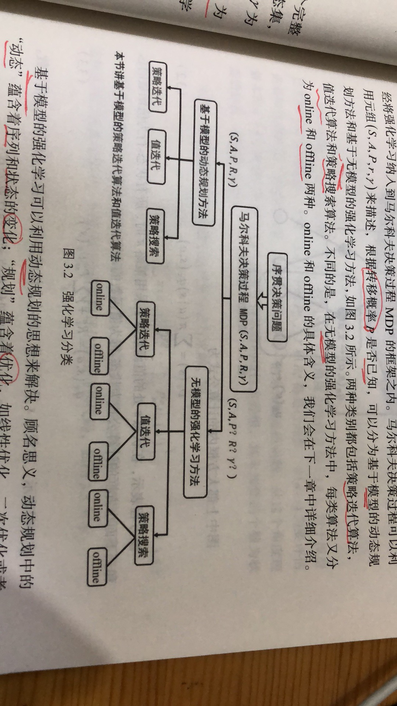

目录

<!-- TOC -->

- [1. 基于模型的动态方法理论](#1-基于模型的动态方法理论)
    - [1.1 动态规划](#11-动态规划)
    - [1.2 策略迭代算法](#12-策略迭代算法)
        - [1.2.1 策略评估算法](#121-策略评估算法)
        - [1.2.2 贪婪策略](#122-贪婪策略)
        - [1.2.3 策略迭代算法](#123-策略迭代算法)
    - [1.3 值函数迭代算法](#13-值函数迭代算法)
    - [1.4 解决最估控制问题的三种算法](#14-解决最估控制问题的三种算法)
        - [1.4.1 变分法原理](#141-变分法原理)
        - [1.4.2 庞特里亚金最大值原理](#142-庞特里亚金最大值原理)
        - [1.4.3 动态规划方法](#143-动态规划方法)
- [2. 动态规划中的数学基础](#2-动态规划中的数学基础)
    - [2.1 线性方程组的迭代解法](#21-线性方程组的迭代解法)
    - [2.2 压缩映射证明策略评估的收敛性](#22-压缩映射证明策略评估的收敛性)
- [3. 基于gym的编程实例](#3-基于gym的编程实例)
- [4. 最优控制与强化学习比较](#4-最优控制与强化学习比较)

<!-- /TOC -->

参考**《深入浅出强化学习》**

## 1. 基于模型的动态方法理论

一个完整的已知模型的马尔科夫决策过程可以用元组`\(S,A,P,r,\gamma\)`表示。`\(S\)`为状态集，`\(A\)`为动作集，`\(P\)`为**转移概率**【对应环境和智能体的**模型**】，`\(r\)`为回报函数，`\(\gamma\)`为折扣因子，用于计算累积回报`\(R=\sum_{t=0}^T\gamma ^tr_t\)`。若`\(T\)`为有限值，强化学习过程称为有限范围强化学习。若`\(T=\infty\)`，称为无限范围强化学习。下面以有限范围强化学习为例。

强化学习的目标是找到最优策略`\(\pi\)`，使得累积回报的期望最大。策略是状态到动作的映射`\(\pi:s\rightarrow a\)`，`\(\tau \)`表示从状态`\(s_t\)`到最终状态`\(s_T\)`的一个序列`\(\tau:s_t,s_{t+1},...,s_T\)`，目标函数是累积回报函数的期望`\(\int R(\tau)p_{\pi}(\tau)d\tau\)`。

所以强化学习的目标是：`\(\underset{\pi}{max}\int R(\tau)p_{\pi}(\tau)d\tau\)`，最终目标是找到最优策略`\(\pi ^*:s\rightarrow u^*\)`。这里的`\(u\)`指的是决策序列`\(u_0^*\rightarrow u_1^*\rightarrow ...u_T^*\)`，所以，广义上来讲，强化学习就是**找到一个决策序列**，使得**目标函数最优**。

强化学习的分类如下图所示：

<html>
 

 
</html>

根据转移概率`\(P\)`是否已知，可以分为**基于模型**的动态规划方法，和**基于无模型**的强化学习方法。

这两种方法都包括**策略迭代**算法、**值迭代**算法和**策略搜索**算法。而基于**无模型**的强化学习方法中，每类方法又分为**online**和**offline**。

### 1.1 动态规划

基于模型的强化学习可以用动态规划的思想来解决。“动态”，指序列和状态的变化;“规划”，指优化，如线性优化、二次优化或非线性优化。

利用动态规划可解决的问题需要满足两个条件：

+ 整个优化问题可以**分解**为**多个子优化**问题。
+ 子优化问题的**解**可以**被存储**和**重复利用**。

第二章说到，强化学习可以利用马尔科夫决策过程来描述，利用贝尔曼最优性原理得到贝尔曼最优化方程：

`\[
\\\upsilon ^*(s)=\underset{a}{max}R^a_{ss'}+\gamma \sum _{s'\in S}P^a_{ss'}\upsilon ^*(s')
\\q^*(s,a)=R^a_{ss'}+\gamma \sum _{s'\in S}P^a_{ss'}\underset{a}{max}q^*(s',a')
\]`

可见马尔科夫决策问题符合使用动态规划的两个条件，所以可以用动态规划来解决。

动态规划的核心是**找到最优值函数。**

由上一章可以得到如下状态值函数的计算方法：

`\[
\upsilon_{\pi}(s)=\sum_{a\in A}\pi(a|s)(R^a_{ss'}+\gamma \sum_{s'\in S}P^a_{ss'}\upsilon_{\pi}(s'))
\]`

从上式中可见，**状态s处的值函数`\(\upsilon_{\pi}(s)\)`**可以用**后继状态的值函数`\(\upsilon_{\pi}(s')\)`**来表示，而**后继状态的值函数**是**未知**的，所以这就是**bootstrap算法**。

上式中，对于**模型已知**的强化学习算法，`\(P^a_{ss'}\)`、`\(\gamma\)`和`\(R^a_{ss'}\)`都是已知的，`\(\pi(a|s)\)`是要评估的策略，是指定的，也是已知的。所以**未知数**就是**值函数**，未知数的个数为状态的总数，用`\(|S|\)`表示。

下面介绍如何求解上述公式(其实就是**关于值函数**的**线性方程组**)

### 1.2 策略迭代算法

#### 1.2.1 策略评估算法

使用高斯-赛德尔迭代算法：

`\[
\upsilon_{k+1}(s)=\sum_{a\in A}\pi(a|s)(R^a_{ss'}+\gamma \sum_{s'\in S}P^a_{ss'}\upsilon _{k}(s'))
\]`

算法步骤如下：

+ 输入：需要评估的策略`\(\pi\)`状态转移概率`\(P^a_{ss'}\)`回报函数`\(R^a_s\)`，折扣因子`\(\gamma\)`
+ 初始化值函数：`\(\upsilon(s)=0\)`
+ repeat k=0,1,...
    + for s in S:
        + `\(\upsilon_{k+1}(s)=\sum _{a\in A}\pi(a|s)(R^a_{ss'}+\gamma \sum_{s'\in S}P^a_{ss'}\upsilon_k(s'))\)`
+ until `\(\upsilon_{k+1}=\upsilon_k\)`
+ 输出：`\(\upsilon(s)\)`

注意：**每次迭代**都需要**对状态集进行一次遍历**，以评估每个状态的值函数。

#### 1.2.2 贪婪策略

#### 1.2.3 策略迭代算法

### 1.3 值函数迭代算法

### 1.4 解决最估控制问题的三种算法

#### 1.4.1 变分法原理

#### 1.4.2 庞特里亚金最大值原理

#### 1.4.3 动态规划方法

## 2. 动态规划中的数学基础

### 2.1 线性方程组的迭代解法

### 2.2 压缩映射证明策略评估的收敛性

## 3. 基于gym的编程实例

## 4. 最优控制与强化学习比较

