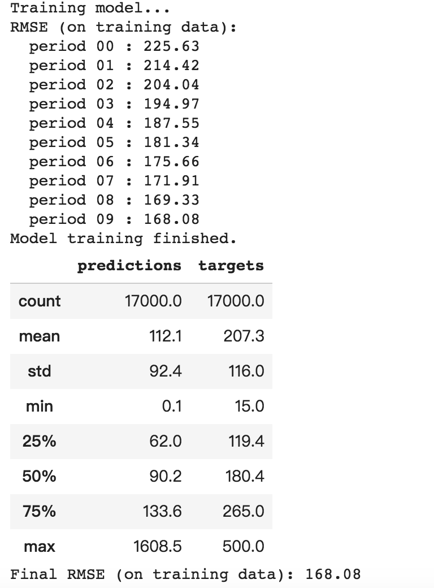
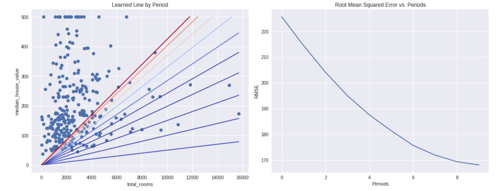

目录

<!-- TOC -->

- [创建和操作张量](#创建和操作张量)
    - [矢量加法](#矢量加法)
    - [张量形状](#张量形状)
    - [广播](#广播)
    - [矩阵乘法](#矩阵乘法)
    - [张量变形](#张量变形)
    - [变量、初始化和赋值](#变量初始化和赋值)
- [pandas](#pandas)
    - [基本概念](#基本概念)
    - [访问数据](#访问数据)
    - [操控数据](#操控数据)
    - [索引](#索引)
- [线性回归](#线性回归)
    - [定义特征并配置特征列](#定义特征并配置特征列)
    - [定义目标:](#定义目标)
    - [配置 LinearRegressor](#配置-linearregressor)
    - [定义输入函数](#定义输入函数)
    - [训练模型](#训练模型)
    - [评估模型](#评估模型)
- [重新训练](#重新训练)

<!-- /TOC -->

参考 [https://developers.google.cn/machine-learning/crash-course/exercises](https://developers.google.cn/machine-learning/crash-course/exercises)

## 创建和操作张量

### 矢量加法

```python
import tensorflow as tf
with tf.Graph().as_default():
  # Create a six-element vector (1-D tensor).
  primes = tf.constant([2, 3, 5, 7, 11, 13], dtype=tf.int32)

  # Create another six-element vector. Each element in the vector will be
  # initialized to 1. The first argument is the shape of the tensor (more
  # on shapes below).
  ones = tf.ones([6], dtype=tf.int32)

  # Add the two vectors. The resulting tensor is a six-element vector.
  just_beyond_primes = tf.add(primes, ones)

  # Create a session to run the default graph.
  with tf.Session() as sess:
    print just_beyond_primes.eval()
    #[ 3  4  6  8 12 14]
```

### 张量形状

```python
with tf.Graph().as_default():
  # A scalar (0-D tensor).
  scalar = tf.zeros([])

  # A vector with 3 elements.
  vector = tf.zeros([3])

  # A matrix with 2 rows and 3 columns.
  matrix = tf.zeros([2, 3])

  with tf.Session() as sess:
    print 'scalar has shape', scalar.get_shape(), 'and value:\n', scalar.eval()
    # 0.0
    print 'vector has shape', vector.get_shape(), 'and value:\n', vector.eval()
    # [0. 0. 0.]
    print 'matrix has shape', matrix.get_shape(), 'and value:\n', matrix.eval()
    #[[0. 0. 0.]
    # [0. 0. 0.]]
```

### 广播

利用广播，元素级运算中的较小数组会增大到与较大数组具有相同的形状。

* 如果指令需要大小为 `[6]` 的张量，则大小为 `[1]` 或 `[]` 的张量可以作为运算数。
* 如果指令需要大小为 `[4, 6]` 的张量，则以下任何大小的张量都可以作为运算数。
  * `[1, 6]`
  * `[6]`
  * `[]`
* 如果指令需要大小为 `[3, 5, 6]` 的张量，则以下任何大小的张量都可以作为运算数。
  * `[1, 5, 6]`
  * `[3, 1, 6]`
  * `[3, 5, 1]`
  * `[1, 1, 1]`
  * `[5, 6]`
  * `[1, 6]`
  * `[6]`
  * `[1]`
  * `[]`

当张量被广播时，从概念上来说，系统会复制其条目（出于性能考虑，**实际并不复制**。广播专为实现性能优化而设计）。

```python
with tf.Graph().as_default():
  # Create a six-element vector (1-D tensor).
  primes = tf.constant([2, 3, 5, 7, 11, 13], dtype=tf.int32)

  # Create a constant scalar with value 1.
  ones = tf.constant(1, dtype=tf.int32)

  # Add the two tensors. The resulting tensor is a six-element vector.
  just_beyond_primes = tf.add(primes, ones)

  with tf.Session() as sess:
    print just_beyond_primes.eval()
```

### 矩阵乘法

```python
with tf.Graph().as_default():
  # Create a matrix (2-d tensor) with 3 rows and 4 columns.
  x = tf.constant([[5, 2, 4, 3], [5, 1, 6, -2], [-1, 3, -1, -2]],
                  dtype=tf.int32)

  # Create a matrix with 4 rows and 2 columns.
  y = tf.constant([[2, 2], [3, 5], [4, 5], [1, 6]], dtype=tf.int32)

  # Multiply `x` by `y`. 
  # The resulting matrix will have 3 rows and 2 columns.
  matrix_multiply_result = tf.matmul(x, y)

  with tf.Session() as sess:
    print matrix_multiply_result.eval()
    # [[35 58]
    #  [35 33]
    #  [ 1 -4]]
```

### 张量变形

```python
with tf.Graph().as_default():
  # Create an 8x2 matrix (2-D tensor).
  matrix = tf.constant([[1,2], [3,4], [5,6], [7,8],
                        [9,10], [11,12], [13, 14], [15,16]], dtype=tf.int32)

  # Reshape the 8x2 matrix into a 2x8 matrix.
  reshaped_2x8_matrix = tf.reshape(matrix, (16,1))
  
  # Reshape the 8x2 matrix into a 4x4 matrix
  reshaped_4x4_matrix = tf.reshape(matrix, [4,4])

  with tf.Session() as sess:
    print "Original matrix (8x2):"
    print matrix.eval()
    print "Reshaped matrix (2x8):"
    print reshaped_2x8_matrix.eval()
    print "Reshaped matrix (4x4):"
    print reshaped_4x4_matrix.eval()
```

```python
with tf.Graph().as_default():
  # Create an 8x2 matrix (2-D tensor).
  matrix = tf.constant([[1,2], [3,4], [5,6], [7,8],
                        [9,10], [11,12], [13, 14], [15,16]], dtype=tf.int32)

  # Reshape the 8x2 matrix into a 3-D 2x2x4 tensor.
  reshaped_2x2x4_tensor = tf.reshape(matrix, [2,2,4])
  
  # Reshape the 8x2 matrix into a 1-D 16-element tensor.
  one_dimensional_vector = tf.reshape(matrix, [16])

  with tf.Session() as sess:
    print "Original matrix (8x2):"
    print matrix.eval()
    print "Reshaped 3-D tensor (2x2x4):"
    print reshaped_2x2x4_tensor.eval()
    print "1-D vector:"
    print one_dimensional_vector.eval()
```

### 变量、初始化和赋值

创建变量时，可以明确设置一个初始值，也可以使用初始化程序（例如分布）:

```python
g = tf.Graph()
with g.as_default():
  # Create a variable with the initial value 3.
  v = tf.Variable([3])

  # Create a variable of shape [1], with a random initial value,
  # sampled from a normal distribution with mean 1 and standard deviation 0.35.
  w = tf.Variable(tf.random_normal([1], mean=1.0, stddev=0.35))
```

TensorFlow 的一个特性是变量初始化不是自动进行的。例如，以下代码块会导致错误：

```python
with g.as_default():
  with tf.Session() as sess:
    try:
      v.eval()
    except tf.errors.FailedPreconditionError as e:
      print "Caught expected error: ", e
      # Caught expected error:  Attempting to use uninitialized value Variable
	    #[[Node: _retval_Variable_0_0 = _Retval[T=DT_INT32, index=0, _device="/job:localhost/replica:0/task:0/device:CPU:0"](Variable)]]
```

最简单的方法，是调用```global_variables_initializer```，初始化后，变量的值保留在**同一会话中**（不过，当**启动新会话时，需要重新初始化**）

```python
with g.as_default():
  with tf.Session() as sess:
    initialization = tf.global_variables_initializer()
    sess.run(initialization)
    # Now, variables can be accessed normally, and have values assigned to them.
    print v.eval()
    print w.eval()
```

要更改变量的值，使用**assign**指令。请注意，仅创建 assign 指令不会起到任何作用。和初始化一样，**必须运行赋值指令**才能更新变量值：

```python
with g.as_default():
  with tf.Session() as sess:
    sess.run(tf.global_variables_initializer())
    # This should print the variable's initial value.
    print v.eval()

    assignment = tf.assign(v, [7])
    # The variable has not been changed yet!
    print v.eval()

    # Execute the assignment op.
    sess.run(assignment)
    # Now the variable is updated.
    print v.eval()
```

练习：

创建一个骰子模拟，在模拟中生成一个 `10x3` 二维张量，其中：
  * 列 `1` 和 `2` 均存储一个骰子的一次投掷值。
  * 列 `3` 存储同一行中列 `1` 和 `2` 的值的总和。

例如，第一行中可能会包含以下值：
  * 列 `1` 存储 `4`
  * 列 `2` 存储 `3`
  * 列 `3` 存储 `7`

```python
with tf.Graph().as_default(), tf.Session() as sess:
  # Task 2: Simulate 10 throws of two dice. Store the results
  # in a 10x3 matrix.

  # We're going to place dice throws inside two separate
  # 10x1 matrices. We could have placed dice throws inside
  # a single 10x2 matrix, but adding different columns of
  # the same matrix is tricky. We also could have placed
  # dice throws inside two 1-D tensors (vectors); doing so
  # would require transposing the result.
  dice1 = tf.Variable(tf.random_uniform([10, 1],
                                        minval=1, maxval=7,
                                        dtype=tf.int32))
  dice2 = tf.Variable(tf.random_uniform([10, 1],
                                        minval=1, maxval=7,
                                        dtype=tf.int32))

  # We may add dice1 and dice2 since they share the same shape
  # and size.
  dice_sum = tf.add(dice1, dice2)

  # We've got three separate 10x1 matrices. To produce a single
  # 10x3 matrix, we'll concatenate them along dimension 1.
  resulting_matrix = tf.concat(
      values=[dice1, dice2, dice_sum], axis=1)

  # The variables haven't been initialized within the graph yet,
  # so let's remedy that.
  sess.run(tf.global_variables_initializer())

  print(resulting_matrix.eval())
```

## pandas

pandas官网：[http://pandas.pydata.org/pandas-docs/stable/index.html](http://pandas.pydata.org/pandas-docs/stable/index.html)

### 基本概念
 *pandas* 中的主要数据结构被实现为以下两类：
  * **`DataFrame`**，您可以将它想象成一个关系型数据**表格**，其中包含多个行和已命名的列。
  * **`Series`**，它是单**一列**。`DataFrame` 中包含一个或多个 `Series`，每个 `Series` 均有一个名称。

```python
import pandas as pd
```

例如：

```python
city_names = pd.Series(['San Francisco', 'San Jose', 'Sacramento'])
population = pd.Series([852469, 1015785, 485199])

pd.DataFrame({ 'City name': city_names, 'Population': population })
```

加载整个文件，并显示一些统计信息（如：count/mean/std/min/25%/50%/75%/max）：

```python
california_housing_dataframe = pd.read_csv("https://storage.googleapis.com/mledu-datasets/california_housing_train.csv", sep=",")
california_housing_dataframe.describe()
```

显示前几条记录：

```python
california_housing_dataframe.head()
```

绘制图表（某一列的值的分布）：

```python
california_housing_dataframe.hist('housing_median_age')
```

### 访问数据

```python
cities = pd.DataFrame({ 'City name': city_names, 'Population': population })
cities['City name'] # 直接访问某一列
cities['City name'][1] # 访问某一列的某一行
cities[0:2] # 整个表格的第0-1行的所有列的数据
```

pandas的[索引和选择官方文档](http://pandas.pydata.org/pandas-docs/stable/indexing.html)

### 操控数据

可以直接进行算术运算：

```python
population / 1000.
```

也可以通过numpy的函数进行操作

```python
import numpy as np
np.log(population)
```

也可以通过apply以及lambda进行操作：

```python
population.apply(lambda val: val > 1000000)
```

dataframe的修改，可以直接操作：

```python
cities['Area square miles'] = pd.Series([46.87, 176.53, 97.92])
cities['Population density'] = cities['Population'] / cities['Area square miles']

cities['Is wide and has saint name'] = (cities['Area square miles'] > 50) & cities['City name'].apply(lambda name: name.startswith('San'))

```

### 索引

Series 和 DataFrame 对象也定义了 index 属性，该属性会向每个 Series 项或 DataFrame 行赋一个标识符值。

默认情况下，在构造时，pandas 会赋可反映源数据顺序的索引值。**索引值在创建后是稳定的**；也就是说，它们不会因为数据重新排序而发生改变。

```python
city_names.index # RangeIndex(start=0, stop=3, step=1)，city_names这一列有0,1,2总共3行
cities.index # RangeIndex(start=0, stop=3, step=1)，整个dataframe有0,1,2总共3行
```

调用 DataFrame.reindex 以手动重新排列各行的顺序。

```python
cities.reindex([2, 0, 1])
#City name	Population	Area square miles	Population density	Is wide and has saint name
#2	Sacramento	485199	97.92	4955.055147	False
#0	San Francisco	852469	46.87	18187.945381	False
#1	San Jose	1015785	176.53	5754.177760	True
```

重建索引是一种随机排列 DataFrame 的绝佳方式。(参考[https://blog.csdn.net/you_are_my_dream/article/details/70165384](https://blog.csdn.net/you_are_my_dream/article/details/70165384)，np.random.permutation与np.random.shuffle有两处不同：
如果传给permutation一个矩阵，它会返回一个洗牌后的矩阵副本；而shuffle只是对一个矩阵进行洗牌，无返回值。 如果传入一个整数，它会返回一个洗牌后的arange。)

```python
cities.reindex(np.random.permutation(cities.index))
```

注意：
如果您的 reindex 输入数组包含原始 DataFrame 索引值中没有的值，reindex 会为此类“丢失的”索引添加新行，并在所有对应列中填充 NaN 值：

```python
cities.reindex([0, 4, 5, 2])
#	City name	Population	Area square miles	Population density	Is wide and has saint name
#0	San Francisco	852469.0	46.87	18187.945381	False
#4	NaN	NaN	NaN	NaN	NaN
#5	NaN	NaN	NaN	NaN	NaN
#2	Sacramento	485199.0	97.92	4955.055147	False
```

## 线性回归


### 定义特征并配置特征列

在 TensorFlow 中，我们使用一种称为**“特征列”**的结构来表示特征的**数据类型**。特征列仅存储对特征数据的描述；**不包含特征数据**本身。

主要有两类数据：

* **分类数据**：一种文字数据。
* **数值数据**：一种数字（整数或浮点数）数据以及您希望视为数字的数据。有时您可能会希望将数值数据（例如邮政编码）视为分类数据。

```python
# Define the input feature: total_rooms.
my_feature = california_housing_dataframe[["total_rooms"]]
​
# Configure a numeric feature column for total_rooms.
feature_columns = [tf.feature_column.numeric_column("total_rooms")]
```

### 定义目标:

```python
targets = california_housing_dataframe["median_house_value"]
```

### 配置 LinearRegressor

使用```clip_gradients_by_norm``将梯度裁剪应用到我们的优化器。梯度裁剪可确保梯度大小在训练期间不会变得过大，梯度过大会导致梯度下降法失败。

```python
# Use gradient descent as the optimizer for training the model.
my_optimizer = tf.train.GradientDescentOptimizer(learning_rate=0.0000001)
my_optimizer = tf.contrib.estimator.clip_gradients_by_norm(my_optimizer, 5.0)

# Configure the linear regression model with our feature columns and optimizer.
# Set a learning rate of 0.0000001 for Gradient Descent.
linear_regressor = tf.estimator.LinearRegressor(
    feature_columns=feature_columns,
    optimizer=my_optimizer
)
```

### 定义输入函数

将 Pandas 特征数据转换成 NumPy 数组字典，例如，本例中就是把pandas的一列"total_rooms":[3.,20.,...,42.]变成一个字典{"total_rooms":array([3.,20.,...42.])}

使用 TensorFlow Dataset API 根据我们的数据构建 Dataset 对象，并**将数据拆分成大小为 batch_size 的多批数据**，以**按照指定周期数 (num_epochs) 进行重复**。

如果 shuffle 设置为 True，则我们会对数据进行随机处理，以便数据在训练期间以随机方式传递到模型。buffer_size 参数会指定 shuffle 将**从中随机抽样的数据集的大小**(representing the number of elements from this dataset from which the new dataset will sample)。

```python
def my_input_fn(features, targets, batch_size=1, shuffle=True, num_epochs=None):
    """Trains a linear regression model of one feature.
  
    Args:
      features: pandas DataFrame of features
      targets: pandas DataFrame of targets
      batch_size: Size of batches to be passed to the model
      shuffle: True or False. Whether to shuffle the data.
      num_epochs: Number of epochs for which data should be repeated. None = repeat indefinitely
    Returns:
      Tuple of (features, labels) for next data batch
    """
  
    # Convert pandas data into a dict of np arrays.
    features = {key:np.array(value) for key,value in dict(features).items()}                                           
 
    # Construct a dataset, and configure batching/repeating
    ds = Dataset.from_tensor_slices((features,targets)) # warning: 2GB limit
    ds = ds.batch(batch_size).repeat(num_epochs)
    
    # Shuffle the data, if specified
    if shuffle:
      ds = ds.shuffle(buffer_size=10000)
    
    # Return the next batch of data
    features, labels = ds.make_one_shot_iterator().get_next()
    return features, labels
```

### 训练模型

```python
_ = linear_regressor.train(
    input_fn = lambda:my_input_fn(my_feature, targets),
    steps=100
)
```

### 评估模型

```python
# Create an input function for predictions.
# Note: Since we're making just one prediction for each example, we don't 
# need to repeat or shuffle the data here.
prediction_input_fn =lambda: my_input_fn(my_feature, targets, num_epochs=1, shuffle=False)

# Call predict() on the linear_regressor to make predictions.
predictions = linear_regressor.predict(input_fn=prediction_input_fn)

# Format predictions as a NumPy array, so we can calculate error metrics.
predictions = np.array([item['predictions'][0] for item in predictions])

# Print Mean Squared Error and Root Mean Squared Error.
mean_squared_error = metrics.mean_squared_error(predictions, targets)
root_mean_squared_error = math.sqrt(mean_squared_error)
print "Mean Squared Error (on training data): %0.3f" % mean_squared_error
print "Root Mean Squared Error (on training data): %0.3f" % root_mean_squared_error
```

RMSE 的一个很好的特性是，它可以在与原目标相同的规模下解读。

```python
min_house_value = california_housing_dataframe["median_house_value"].min()
max_house_value = california_housing_dataframe["median_house_value"].max()
min_max_difference = max_house_value - min_house_value

print "Min. Median House Value: %0.3f" % min_house_value
print "Max. Median House Value: %0.3f" % max_house_value
print "Difference between Min. and Max.: %0.3f" % min_max_difference
print "Root Mean Squared Error: %0.3f" % root_mean_squared_error
```

可以通过以下方法获得均匀分布的随机数据样本：

```python
sample = california_housing_dataframe.sample(n=300)
```

## 重新训练

在 10 个等分的时间段内使用此函数，以便观察模型在每个时间段的改善情况。

对于每个时间段，我们都会计算训练损失并绘制相应图表。这可以帮助您判断模型收敛的时间，或者模型是否需要更多迭代。

此外，我们还会绘制模型随着时间的推移学习的特征权重和偏差项值的曲线图。您还可以通过这种方式查看模型的收敛效果。

```python
def train_model(learning_rate, steps, batch_size, input_feature="total_rooms"):
  """Trains a linear regression model of one feature.
  
  Args:
    learning_rate: A `float`, the learning rate.
    steps: A non-zero `int`, the total number of training steps. A training step
      consists of a forward and backward pass using a single batch.
    batch_size: A non-zero `int`, the batch size.
    input_feature: A `string` specifying a column from `california_housing_dataframe`
      to use as input feature.
  """
  
  periods = 10
  steps_per_period = steps / periods

  my_feature = input_feature
  my_feature_data = california_housing_dataframe[[my_feature]]
  my_label = "median_house_value"
  targets = california_housing_dataframe[my_label]

  # Create feature columns
  feature_columns = [tf.feature_column.numeric_column(my_feature)]
  
  # Create input functions
  training_input_fn = lambda:my_input_fn(my_feature_data, targets, batch_size=batch_size)
  prediction_input_fn = lambda: my_input_fn(my_feature_data, targets, num_epochs=1, shuffle=False)
  
  # Create a linear regressor object.
  my_optimizer = tf.train.GradientDescentOptimizer(learning_rate=learning_rate)
  my_optimizer = tf.contrib.estimator.clip_gradients_by_norm(my_optimizer, 5.0)
  linear_regressor = tf.estimator.LinearRegressor(
      feature_columns=feature_columns,
      optimizer=my_optimizer
  )

  # Set up to plot the state of our model's line each period.
  plt.figure(figsize=(15, 6))
  plt.subplot(1, 2, 1)
  plt.title("Learned Line by Period")
  plt.ylabel(my_label)
  plt.xlabel(my_feature)
  sample = california_housing_dataframe.sample(n=300)
  plt.scatter(sample[my_feature], sample[my_label])
  colors = [cm.coolwarm(x) for x in np.linspace(-1, 1, periods)]

  # Train the model, but do so inside a loop so that we can periodically assess
  # loss metrics.
  print "Training model..."
  print "RMSE (on training data):"
  root_mean_squared_errors = []
  for period in range (0, periods):
    # Train the model, starting from the prior state.
    linear_regressor.train(
        input_fn=training_input_fn,
        steps=steps_per_period
    )
    # Take a break and compute predictions.
    predictions = linear_regressor.predict(input_fn=prediction_input_fn)
    predictions = np.array([item['predictions'][0] for item in predictions])
    
    # Compute loss.
    root_mean_squared_error = math.sqrt(
        metrics.mean_squared_error(predictions, targets))
    # Occasionally print the current loss.
    print "  period %02d : %0.2f" % (period, root_mean_squared_error)
    # Add the loss metrics from this period to our list.
    root_mean_squared_errors.append(root_mean_squared_error)
    # Finally, track the weights and biases over time.
    # Apply some math to ensure that the data and line are plotted neatly.
    y_extents = np.array([0, sample[my_label].max()])
    
    weight = linear_regressor.get_variable_value('linear/linear_model/%s/weights' % input_feature)[0]
    bias = linear_regressor.get_variable_value('linear/linear_model/bias_weights')

    x_extents = (y_extents - bias) / weight
    x_extents = np.maximum(np.minimum(x_extents,
                                      sample[my_feature].max()),
                           sample[my_feature].min())
    y_extents = weight * x_extents + bias
    plt.plot(x_extents, y_extents, color=colors[period]) 
  print "Model training finished."

  # Output a graph of loss metrics over periods.
  plt.subplot(1, 2, 2)
  plt.ylabel('RMSE')
  plt.xlabel('Periods')
  plt.title("Root Mean Squared Error vs. Periods")
  plt.tight_layout()
  plt.plot(root_mean_squared_errors)

  # Output a table with calibration data.
  calibration_data = pd.DataFrame()
  calibration_data["predictions"] = pd.Series(predictions)
  calibration_data["targets"] = pd.Series(targets)
  display.display(calibration_data.describe())

  print "Final RMSE (on training data): %0.2f" % root_mean_squared_error
```

```python
train_model(
    learning_rate=0.00002,
    steps=500,
    batch_size=5
)
```

<html>
<br/>

<br/>
</html>

<html>
<br/>

<br/>
</html>
